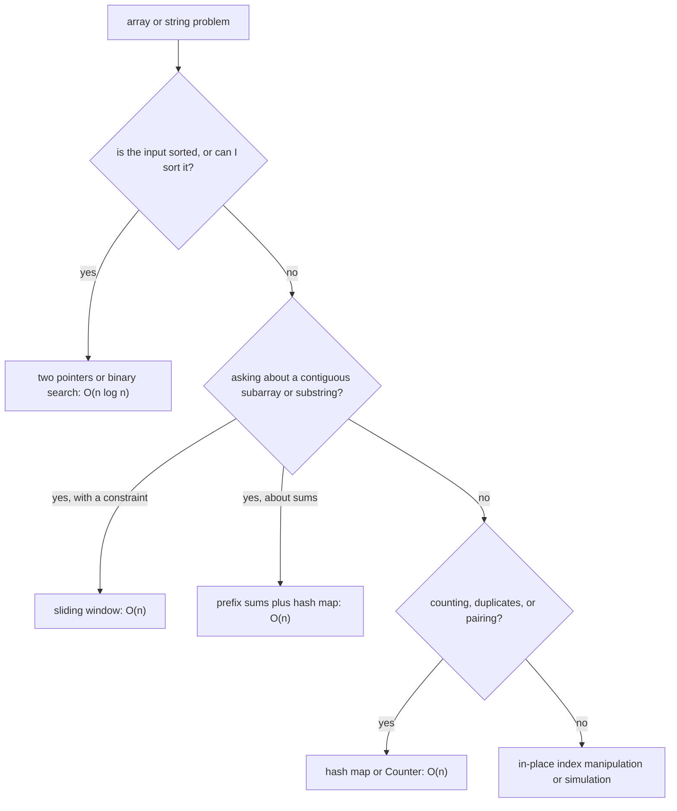

# Arrays and Strings Patterns

## TL;DR
Almost every array/string question in a DS/MLE interview is one of six patterns: **two pointers**,
**sliding window**, **prefix sums**, **hash map counting**, **sort-then-scan**, and **in-place index
manipulation**. Learn to recognise the pattern from the phrasing, write the template from memory,
then adapt. Each template below comes with its complexity, because stating complexity is half the
marks.

## Intuition
Brute force over an array is "check every pair or every subarray" — $O(n^2)$. Every pattern here is
a different way to avoid re-doing work you already did:

- **Two pointers** exploits *sortedness*: moving a pointer eliminates a whole region of candidates.
- **Sliding window** exploits *contiguity*: extending the window reuses the previous window's answer.
- **Prefix sums** exploits *additivity*: precompute once, answer any range in $O(1)$.
- **Hash map** exploits *lookup*: replace "search the earlier part of the array" with a dict hit.

## The maths
**Why two pointers is linear.** Each step advances at least one of $l, r$ and neither ever moves
backwards, so the total number of steps is bounded by $2n$ — the loop is $\Theta(n)$ even though it
looks nested.

**Prefix sums.** Define $P_0 = 0$ and $P_i = \sum_{j<i} a_j$. Then any range sum is

$$
\sum_{j=l}^{r-1} a_j = P_r - P_l
$$

Build is $\Theta(n)$; each query is $\Theta(1)$. The subarray-sum-equals-$k$ trick follows
immediately: the number of subarrays ending at $r$ with sum $k$ is the number of earlier prefixes
with value $P_r - k$, so one hash map of prefix counts solves it in one pass.

**Kadane's recurrence** for maximum subarray: let $B_i$ be the best sum of a subarray ending at $i$.

$$
B_i = \max(a_i,\; B_{i-1} + a_i), \qquad \text{answer} = \max_i B_i
$$

which is dynamic programming with $O(1)$ state — worth naming as DP in the interview.

## Diagram



## Code

**Pattern 1 — two pointers on a sorted array.** Time $O(n)$ after an $O(n\log n)$ sort, space $O(1)$.

```python
def two_sum_sorted(a, target):
    l, r = 0, len(a) - 1
    while l < r:
        s = a[l] + a[r]
        if s == target:
            return (l, r)
        if s < target:          # only increasing the left can help
            l += 1
        else:
            r -= 1
    return None

def three_sum(nums):            # O(n^2) time, O(1) extra space
    nums.sort()
    out, n = [], len(nums)
    for i in range(n - 2):
        if i and nums[i] == nums[i - 1]:
            continue                      # skip duplicate anchors
        l, r = i + 1, n - 1
        while l < r:
            s = nums[i] + nums[l] + nums[r]
            if s < 0: l += 1
            elif s > 0: r -= 1
            else:
                out.append([nums[i], nums[l], nums[r]])
                l += 1
                while l < r and nums[l] == nums[l - 1]:
                    l += 1                # skip duplicate seconds
                r -= 1
    return out
```

**Pattern 2 — sliding window, variable size.** Time $O(n)$ (each index enters and leaves once),
space $O(k)$ for the window state.

```python
def longest_substring_no_repeat(s: str) -> int:
    last = {}                    # char -> last index seen
    best = start = 0
    for i, ch in enumerate(s):
        if ch in last and last[ch] >= start:
            start = last[ch] + 1        # shrink: jump past the previous occurrence
        last[ch] = i
        best = max(best, i - start + 1)
    return best

def min_window_sum_at_least(nums, target):   # positive numbers only
    """Shortest subarray with sum >= target. O(n) time, O(1) space."""
    l = 0
    cur = 0
    best = float("inf")
    for r, x in enumerate(nums):
        cur += x
        while cur >= target:              # shrink while still valid
            best = min(best, r - l + 1)
            cur -= nums[l]
            l += 1
    return 0 if best == float("inf") else best
```

**Pattern 3 — fixed-size window.** Time $O(n)$, space $O(1)$.

```python
def max_avg_window(nums, k):
    cur = sum(nums[:k])
    best = cur
    for i in range(k, len(nums)):
        cur += nums[i] - nums[i - k]      # add entering, remove leaving
        best = max(best, cur)
    return best / k
```

**Pattern 4 — prefix sums plus hash map.** Time $O(n)$, space $O(n)$.

```python
from collections import defaultdict

def subarrays_sum_k(nums, k):
    """Count subarrays summing to k. Works with negatives (a window would not)."""
    counts = defaultdict(int)
    counts[0] = 1                         # empty prefix
    total = running = 0
    for x in nums:
        running += x
        total += counts[running - k]
        counts[running] += 1
    return total
```

**Pattern 5 — hash map counting / anagram family.** Time $O(n)$, space $O(\Sigma)$.

```python
from collections import Counter, defaultdict

def group_anagrams(words):
    groups = defaultdict(list)
    for w in words:
        key = tuple(sorted(w))            # O(L log L); or a 26-length count tuple: O(L)
        groups[key].append(w)
    return list(groups.values())

def is_anagram(a, b):
    return Counter(a) == Counter(b)       # O(len(a) + len(b))
```

**Pattern 6 — in-place index manipulation.** Time $O(n)$, space $O(1)$.

```python
def move_zeros(nums):
    """Stable partition: non-zeros keep order, zeros go to the end."""
    w = 0                                  # write pointer
    for r in range(len(nums)):
        if nums[r] != 0:
            nums[w], nums[r] = nums[r], nums[w]
            w += 1
    return nums

def reverse_words_in_place(chars: list[str]) -> list[str]:
    """Reverse whole, then reverse each word. O(n) time, O(1) space."""
    def rev(i, j):
        while i < j:
            chars[i], chars[j] = chars[j], chars[i]
            i, j = i + 1, j - 1
    rev(0, len(chars) - 1)
    start = 0
    for i in range(len(chars) + 1):
        if i == len(chars) or chars[i] == " ":
            rev(start, i - 1)
            start = i + 1
    return chars
```

**Binary search on the answer** — the pattern people miss. Time $O(n \log R)$ where $R$ is the value
range.

```python
def min_capacity_to_ship(weights, days):
    """Smallest daily capacity that ships all packages within `days`."""
    def feasible(cap):
        d, cur = 1, 0
        for w in weights:
            if cur + w > cap:
                d += 1
                cur = 0
            cur += w
        return d <= days

    lo, hi = max(weights), sum(weights)
    while lo < hi:
        mid = (lo + hi) // 2
        if feasible(mid):
            hi = mid
        else:
            lo = mid + 1
    return lo
```

## In practice
- **Use it when:** any coding round. In India, DS/MLE coding rounds are typically one or two
  LeetCode easy-to-medium questions in 45 minutes, often on HackerRank/CoderPad, frequently
  array/string or hash-map flavoured. Competitive-programming topics (segment trees, flows) are out
  of scope; correctness, clarity and complexity commentary are in.
- **Defaults that work:** if the input is sorted or sorting is affordable, try two pointers; if the
  question says "contiguous subarray/substring" plus a constraint, try sliding window; if it says
  "sum equals k" with negatives possible, prefix sums plus hash map; if it says "count" or
  "duplicate" or "pair", reach for `Counter`/`dict`; if it asks for a minimum feasible value, try
  binary search on the answer.
- **Breaks when:** the window invariant is not monotone — a sliding window for "subarray sum $\ge k$"
  is only valid with non-negative numbers, because a negative element means shrinking can *increase*
  the sum. That single caveat is a very common follow-up.
- **Cost / latency:** these are interview-scale concerns, but the same patterns show up in real code:
  sliding-window aggregates in feature engineering, prefix sums for cumulative metrics, hash joins
  as the array version of a SQL join.

## Interview angle

**Q. Given an array, find two numbers summing to a target.**
Two answers, and I'd give both. Unsorted: one pass with a dict from value to index, $O(n)$ time and
$O(n)$ space. Sorted (or if sorting is allowed and indices do not matter): two pointers from both
ends, $O(n\log n)$ time from the sort but $O(1)$ extra space. The choice is a time–space trade; I'd
state it explicitly and ask whether the input is sorted before writing anything.

**Follow-up.** *What if the array has duplicates and you must return all unique pairs?* → Sort, then
two pointers, skipping equal values after recording a hit — the same duplicate-skipping logic as in
three-sum.

**Q. Longest substring without repeating characters.**
Sliding window with a dict of last-seen index. When I see a repeat inside the window, I jump `start`
to one past the previous occurrence rather than shrinking one step at a time — that keeps it a
single pass, $O(n)$ time and $O(\min(n,\Sigma))$ space where $\Sigma$ is the alphabet size. The
guard `last[ch] >= start` matters: a repeat that occurred *before* the window start is not a
conflict.

**Q. Count subarrays with sum exactly k. Why not a sliding window?**
Because the array can contain negatives, so the running sum is not monotone in the window's right
edge and shrinking can increase it — the window invariant fails. The correct tool is prefix sums:
a subarray $(l, r]$ has sum $k$ iff $P_r - P_l = k$, so I keep a hash map of prefix-sum counts and
at each $r$ add `counts[P_r - k]`. One pass, $O(n)$ time, $O(n)$ space. Initialise `counts[0] = 1`
for the empty prefix or you miss subarrays starting at index 0.

**Q. Maximum subarray sum.**
Kadane's algorithm: $B_i = \max(a_i, B_{i-1} + a_i)$, track the running max. $O(n)$ time, $O(1)$
space. I'd name it as DP with constant state, and mention that to also return the indices you track
where the current run started.

**Q. How do you handle the edge cases?**
I say them out loud before coding: empty input, single element, all negatives, all duplicates, $k$
larger than the array, and for strings — case, whitespace, and non-ASCII. Then I write two or three
of them as my own test calls at the end. Interviewers in India almost always reserve the last five
minutes for "does it work on this input", and volunteering the cases first is worth more than
finding them under pressure.

## Traps
- **Sliding window with negative numbers.** Only valid when extending the window monotonically
  changes the quantity. With negatives, use prefix sums.
- **Off-by-one in window length.** It is `r - l + 1` for inclusive bounds. Write one concrete example
  in a comment before you trust it.
- **Forgetting `counts[0] = 1`** in the prefix-sum map — silently drops every subarray that starts at
  index 0.
- **Slicing inside a loop.** `s[i:j]` is $O(j-i)$, so a "single pass" with a slice per iteration is
  quadratic. Use indices, or `str.startswith(sub, i)`.
- **Building strings with `+=` in a loop.** $O(n^2)$. Append to a list and `''.join`.
- **Mutating the list you are iterating.** Iterate over a copy or build a new list.
- **Sorting when the question forbids extra order changes.** If indices must be preserved, sort
  `(value, index)` pairs or use a hash map instead.
- **Claiming $O(1)$ space while using a dict.** A hash map over the alphabet is $O(\Sigma)$; say so
  and note it is bounded for ASCII.

## Flashcards
Why is the two-pointer loop $\Theta(n)$ despite looking nested?::Each iteration advances at least one pointer and neither moves backwards, so at most $2n$ steps occur.
Range sum from a prefix array?::$\sum_{j=l}^{r-1} a_j = P_r - P_l$ with $P_0=0$; $\Theta(n)$ build, $\Theta(1)$ query.
When does a sliding window stop being valid?::When the array can contain negatives (or the constraint is not monotone in the window) — extending or shrinking no longer moves the quantity in one direction.
Kadane's recurrence?::$B_i = \max(a_i,\ B_{i-1}+a_i)$; answer is $\max_i B_i$. $O(n)$ time, $O(1)$ space.
Initialisation needed for the subarray-sum-equals-k hash map?::`counts[0] = 1`, representing the empty prefix.
Complexity of `group_anagrams` with a sorted-string key?::$O(N \cdot L\log L)$ for $N$ words of length $L$; using a 26-length count tuple as the key gives $O(N\cdot L)$.
Which pattern solves "minimum X such that a feasibility check passes"?::Binary search on the answer, $O(n\log R)$ over the value range $R$.
Why is `s[i:j]` inside a loop dangerous?::Slicing copies, costing $O(j-i)$, turning an apparent single pass into $O(n^2)$.

## Related
- [[big-o-and-complexity]]
- [[hashing-and-dictionaries]]
- [[dynamic-programming-patterns]]
- [[trees-and-graphs-basics]]
- [[coding-interview-strategy]]
- [[drill-python-coding]]
- [[moc-programming]]
