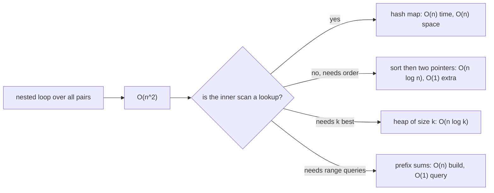

# Big-O and Complexity

## TL;DR
Big-O is the growth rate of work as input grows, ignoring constants. In a DS/MLE interview you need
three things: state time **and** space for every solution you write, know the cost of the Python
containers you use, and be able to say *why* your solution is $O(n)$ rather than just asserting it.
Most interview optimisations are "replace a nested scan with a hash lookup" — $O(n^2) \to O(n)$.

## Intuition
Big-O answers "if the input gets 10× bigger, what happens?" Linear: 10× the time. Quadratic: 100×.
Logarithmic: barely changes. The constants you dropped matter in production and not in the
interview, which is why the correct sentence is "this is $O(n \log n)$; in practice the constant is
small because sorting is cache-friendly" — you show you know the model and its limits.

## The maths
**Definitions.** $f(n) = O(g(n))$ if there exist $c>0, n_0$ such that $f(n) \le c\,g(n)$ for all
$n \ge n_0$ — an asymptotic upper bound. $\Omega$ is the lower bound, $\Theta$ is both. Interviews say
"Big-O" but almost always mean $\Theta$ of the worst case.

**Amortised analysis.** A dynamic array that doubles when full: inserting $n$ elements triggers
resizes at sizes $1, 2, 4, \dots, 2^{\lfloor \log_2 n\rfloor}$, copying

$$
\sum_{i=0}^{\lfloor \log_2 n \rfloor} 2^i < 2n
$$

elements in total. So $n$ appends cost $O(n)$ and each append is $O(1)$ *amortised*, even though one
individual append is $O(n)$. Same argument for hash table rehashing.

**Master theorem** for divide-and-conquer $T(n) = a\,T(n/b) + f(n)$ with $f(n) = \Theta(n^d)$:

$$
T(n) =
\begin{cases}
\Theta(n^d) & \text{if } d > \log_b a \\
\Theta(n^d \log n) & \text{if } d = \log_b a \\
\Theta(n^{\log_b a}) & \text{if } d < \log_b a
\end{cases}
$$

Merge sort is $a=2, b=2, d=1$, so $d = \log_2 2 = 1$ and $T(n) = \Theta(n\log n)$. Binary search is
$a=1, b=2, d=0$, so $\Theta(\log n)$.

**The comparison-sort lower bound.** A comparison sort's decision tree must have $n!$ leaves, so its
height is at least $\log_2 (n!) = \Theta(n \log n)$ by Stirling. That is why counting sort's $O(n+k)$
does not contradict anything — it is not a comparison sort.

**Recursion space.** Recursion depth $d$ costs $O(d)$ stack. DFS on a path-shaped graph of $n$ nodes
is $O(n)$ space; Python's default recursion limit is 1000, which is a real constraint in interviews
on large inputs.

## Diagram



## Code

```python
# The single most common interview transformation: O(n^2) -> O(n)
def two_sum_quadratic(nums, target):        # O(n^2) time, O(1) space
    for i in range(len(nums)):
        for j in range(i + 1, len(nums)):
            if nums[i] + nums[j] == target:
                return [i, j]
    return []

def two_sum_linear(nums, target):           # O(n) time, O(n) space
    seen = {}                               # value -> index
    for i, x in enumerate(nums):
        if target - x in seen:              # dict lookup is O(1) average
            return [seen[target - x], i]
        seen[x] = i
    return []
```

Costs of the containers you will actually use:

```python
# list      : index O(1) | append O(1) amortised | insert/pop(0) O(n) | `in` O(n) | sort O(n log n)
# dict/set  : get/set/`in` O(1) average, O(n) worst | ordered by insertion since 3.7
# deque     : appendleft/popleft O(1)  -> use for BFS queues and sliding windows
# heapq     : heappush/heappop O(log n) | heapify O(n) | peek min O(1)
# bisect    : O(log n) search on a sorted list, but insort is O(n) due to the shift
# str       : concatenation builds a new string -> join a list instead

from collections import deque
import heapq, bisect

def top_k(nums, k):                         # O(n log k) time, O(k) space
    h = []
    for x in nums:
        heapq.heappush(h, x)
        if len(h) > k:
            heapq.heappop(h)                # drop the smallest, keep k largest
    return sorted(h, reverse=True)
```

Measuring the growth rather than asserting it — a good thing to mention:

```python
import time

def growth(fn, sizes=(1000, 2000, 4000, 8000)):
    prev = None
    for n in sizes:
        data = list(range(n))
        t0 = time.perf_counter(); fn(data); dt = time.perf_counter() - t0
        ratio = "" if prev is None else f"  x{dt/prev:.1f}"
        print(f"n={n:6d}  {dt*1e3:8.2f} ms{ratio}")
        prev = dt
# ratio ≈ 2 → linear; ≈ 4 → quadratic; slightly over 2 → n log n
```

## In practice
- **Use it when:** every coding round, and in system design to justify an architecture ("brute-force
  similarity is $O(nd)$ per query over 50M vectors, so we need an ANN index with sublinear search").
- **Defaults that work:** state time and space unprompted, for the worst case, with $n$ and any other
  parameters defined ("$O(n\cdot m)$ where $n$ is rows and $m$ is distinct keys"). If your solution
  uses a dict, say "average $O(1)$, worst $O(n)$ under adversarial hashing" — the caveat reads as
  seniority.
- **Breaks when:** constants dominate at real sizes (an $O(n\log n)$ sort beats a hash-based $O(n)$
  solution for small $n$ because of cache behaviour); the asymptotically better structure has awful
  memory locality; the real bottleneck is I/O or a shuffle, not CPU.
- **Cost / latency:** translate to reality once in every design answer. At roughly $10^8$ simple
  operations per second for interpreted Python, $n = 10^5$ with an $O(n^2)$ algorithm is $10^{10}$
  operations — minutes, not milliseconds. That arithmetic is what tells you the brute force will not
  pass, before you write it.

## Interview angle

**Q. What is the complexity of your solution?**
Always answer in the same shape: "Time $\Theta(n \log n)$ because I sort once and then do a single
linear pass; space $\Theta(n)$ for the hash map, or $\Theta(1)$ extra if the sort is in place.
$n$ is the number of elements." Naming both, defining $n$, and attributing the cost to a specific
step is the full-credit answer.

**Follow-up.** *Can you do better?* → Decide whether a lower bound applies. If the problem requires
seeing every element, $\Omega(n)$ is a floor and you say so. If it is a comparison sort,
$\Omega(n \log n)$ is a floor. If neither, the usual next move is trading space for time with a hash
map, or exploiting structure (sortedness, bounded value range, monotonicity) to binary search.

**Q. Amortised vs average vs worst case?**
Worst case is the maximum over inputs. Average case is the expectation over an input distribution.
Amortised is the worst-case *total* over a sequence of operations divided by the count — it is a
worst-case guarantee, not a probabilistic one. `list.append` is $O(1)$ amortised (guaranteed over any
sequence); dict lookup is $O(1)$ average (probabilistic, degrades with collisions).

**Q. Why is `x in some_list` a problem inside a loop?**
It is $O(n)$ per check, so the loop is $O(n^2)$. Converting the list to a set once makes each check
$O(1)$ average and the loop $O(n)$, at $O(n)$ extra memory. This exact swap is the fix in a large
share of "my script is slow" situations, and it is the same idea as replacing a nested-loop join with
a hash join in SQL or a broadcast join in Spark.

**Q. What is the complexity of training a decision tree / doing a k-NN query?**
Tree training is roughly $O(n \cdot d \cdot \log n)$ for $n$ samples and $d$ features with sorted
splits at each level. Exact k-NN query is $O(nd)$ per query — linear in the corpus — which is why
vector search uses HNSW or IVF to get approximate sublinear query time at the cost of recall.
Connecting Big-O to ML systems like this is what the question is usually probing.

**Q. Space complexity of recursion?**
The call stack costs $O(\text{depth})$. A balanced binary tree recursion is $O(\log n)$; a degenerate
(linked-list-shaped) tree is $O(n)$ and can hit Python's recursion limit. Converting to an explicit
stack makes the space cost visible and removes the limit.

## Traps
- **Saying $O(n)$ when a `.index()`, `in list`, or slice is inside the loop.** Slicing a list of
  length $n$ is $O(n)$, so "one pass with a slice each iteration" is quadratic.
- **Forgetting space.** A hash-map solution that is $O(n)$ time is also $O(n)$ space; candidates who
  only report time get pushed on it.
- **"Sorting is $O(n)$ because Python does it in C."** Constants, not complexity. Timsort is
  $\Theta(n\log n)$ worst case, $\Theta(n)$ on already-sorted input.
- **Treating dict lookup as worst-case $O(1)$.** It is average; worst case is $O(n)$.
- **Dropping the wrong term.** $O(n + m)$ is not $O(n)$ when $m$ can exceed $n$ — for graphs, always
  write $O(V + E)$.
- **Ignoring the cost of building the structure.** `heapify` is $O(n)$, but pushing $n$ items one at
  a time is $O(n \log n)$; `bisect.insort` is $O(\log n)$ to find and $O(n)$ to shift.
- **Quoting complexity for the average case of quicksort as if it were guaranteed.** Worst case is
  $O(n^2)$; randomised pivots make it unlikely, not impossible.

## Flashcards
Define $f(n)=O(g(n))$.::There exist $c>0$ and $n_0$ with $f(n)\le c\,g(n)$ for all $n\ge n_0$ — an asymptotic upper bound.
Why is `list.append` $O(1)$ amortised?::Geometric over-allocation means total copying across $n$ appends is under $2n$ elements.
Master theorem result for $T(n)=2T(n/2)+\Theta(n)$?::$d = \log_b a = 1$, so $\Theta(n\log n)$ — merge sort.
Lower bound for comparison sorting and why?::$\Omega(n\log n)$ — the decision tree needs $n!$ leaves, so height $\ge \log_2(n!)=\Theta(n\log n)$.
Cost of `list.pop(0)` vs `deque.popleft()`?::$O(n)$ vs $O(1)$ — use `deque` for BFS queues and sliding windows.
`heapify` vs pushing n items?::`heapify` is $O(n)$; $n$ pushes cost $O(n\log n)$.
Complexity of exact k-NN over n vectors of dimension d?::$O(nd)$ per query; ANN indexes trade recall for sublinear query time.
Amortised vs average case?::Amortised is a worst-case guarantee over a sequence of operations; average is an expectation over an input distribution.

## Related
- [[arrays-and-strings-patterns]]
- [[hashing-and-dictionaries]]
- [[trees-and-graphs-basics]]
- [[dynamic-programming-patterns]]
- [[coding-interview-strategy]]
- [[python-performance-and-memory]]
- [[ann-algorithms-hnsw-ivf]]
- [[moc-programming]]
