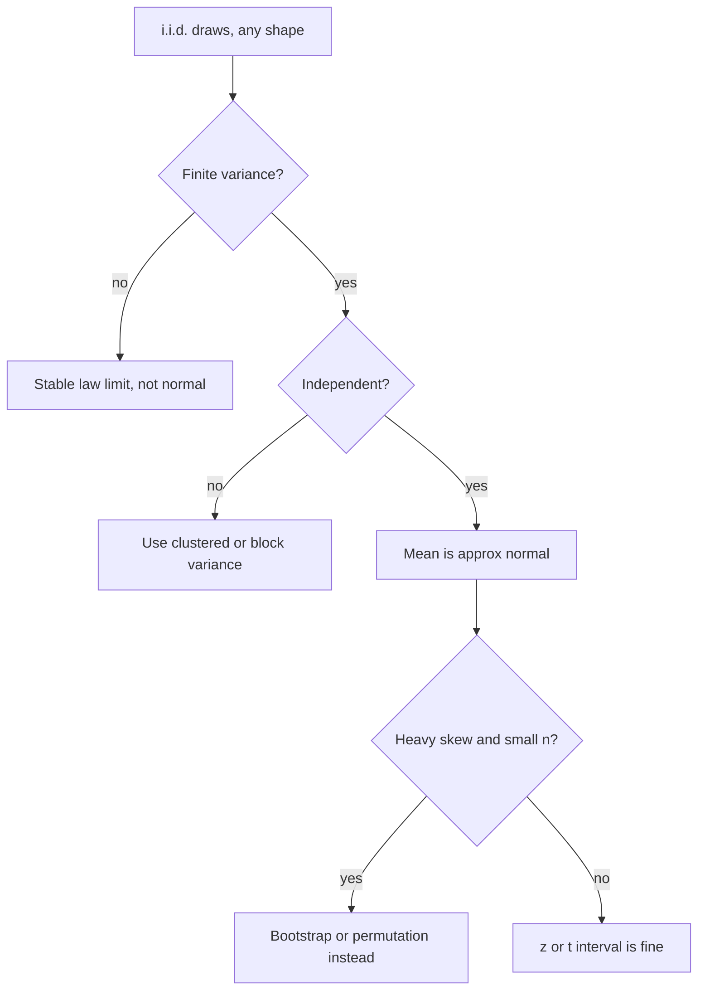

# Central Limit Theorem

## TL;DR
The CLT says the *sampling distribution of the mean* tends to a normal distribution as $n$ grows,
whatever the shape of the underlying data — not that the data become normal. It is why z- and
t-based intervals work on skewed business metrics. It fails or converges painfully slowly for
heavy tails, tiny $n$ with extreme skew, dependent observations, and statistics that are not
smooth functions of means (maxima, quantiles at the extreme tail).

## Intuition
Averaging cancels idiosyncrasy. Each observation pushes the mean up or down by a little; the sum
of many independent little pushes has its shape dictated by the pushes' *variance*, not their
individual shapes, because no single push dominates. When one push *can* dominate — infinite or
near-infinite variance — the argument collapses and the limit is not normal.

## The maths

**Lindeberg–Lévy CLT.** If $X_1,X_2,\dots$ are i.i.d. with $\mathbb{E}[X]=\mu$ and finite
$\operatorname{Var}(X)=\sigma^2 < \infty$, then

$$
Z_n = \frac{\bar{X}_n - \mu}{\sigma/\sqrt{n}} \;\xrightarrow{d}\; \mathcal{N}(0,1)
$$

Convergence is *in distribution*: $P(Z_n \le z) \to \Phi(z)$ pointwise. Finite variance is the
load-bearing assumption.

**Why normal?** Sketch via the characteristic function. Let $Y_i=(X_i-\mu)/\sigma$, so
$\mathbb{E}[Y]=0$, $\operatorname{Var}(Y)=1$, and $\varphi_Y(t)=1-\tfrac{t^2}{2}+o(t^2)$ by Taylor
expansion around 0 (this expansion needs the second moment to exist — the entire theorem lives
here). Then for $Z_n = \frac{1}{\sqrt{n}}\sum Y_i$:

$$
\varphi_{Z_n}(t) = \left[\varphi_Y\!\left(\tfrac{t}{\sqrt{n}}\right)\right]^{n}
= \left[1 - \frac{t^2}{2n} + o\!\left(\tfrac{1}{n}\right)\right]^{n}
\longrightarrow e^{-t^2/2}
$$

and $e^{-t^2/2}$ is the characteristic function of $\mathcal{N}(0,1)$; Lévy's continuity theorem
converts convergence of characteristic functions into convergence in distribution.

**Rate.** The Berry–Esseen theorem bounds the error when the third absolute moment
$\rho=\mathbb{E}\lvert X-\mu\rvert^3$ is finite:

$$
\sup_z \left| P(Z_n \le z) - \Phi(z) \right| \;\le\; \frac{C\rho}{\sigma^3\sqrt{n}},
\qquad C < 0.5
$$

Two consequences to say out loud in an interview: convergence is $O(n^{-1/2})$, and the constant
is driven by skewness $\rho/\sigma^3$. "$n>30$" is a rule of thumb for mildly skewed data, not a
theorem — for a lognormal with $\sigma=1.5$ or a 1%-conversion Bernoulli, $n$ in the thousands can
still leave the tails wrong.

**Delta method** (the CLT's most useful corollary). If $\sqrt{n}(\hat\theta-\theta)\xrightarrow{d}\mathcal{N}(0,\sigma^2)$
and $g$ is differentiable with $g'(\theta)\ne 0$:

$$
\sqrt{n}\left(g(\hat\theta)-g(\theta)\right) \xrightarrow{d} \mathcal{N}\!\left(0,\; \sigma^2 g'(\theta)^2\right)
$$

This is how you get a standard error for a ratio, an odds ratio or a log-transformed metric —
see [[ab-testing-pitfalls]].

**When it fails.** Infinite variance (Cauchy: the mean of $n$ Cauchy variables is Cauchy, no matter
how large $n$ is); Pareto with tail index $\alpha \le 2$ (limit is an $\alpha$-stable law, not
normal); strong dependence (a CLT still exists under mixing conditions but with a different,
larger variance); and statistics that are not asymptotically linear in the data.

## Diagram



## Code

```python
import numpy as np
from scipy import stats

rng = np.random.default_rng(0)

def sampling_dist(sampler, n, reps=20_000):
    return sampler((reps, n)).mean(axis=1)

# 1. CLT works even for a hard skew, but needs n
for n in (5, 30, 200, 2000):
    m = sampling_dist(lambda s: rng.lognormal(0, 1.5, s), n)
    z = (m - m.mean()) / m.std(ddof=1)
    # Kolmogorov-Smirnov against the standard normal: small stat = close to normal
    print(f"lognormal n={n:5d}  KS={stats.kstest(z, 'norm').statistic:.4f}"
          f"  skew={stats.skew(m):+.3f}")

# 2. rare-event Bernoulli: the binomial mean is slow to look normal
for p, n in ((0.5, 30), (0.01, 30), (0.01, 500), (0.01, 5000)):
    m = sampling_dist(lambda s: rng.binomial(1, p, s).astype(float), n)
    print(f"bernoulli p={p} n={n:5d} skew={stats.skew(m):+.3f}")
# rule of thumb: need n*p and n*(1-p) both >= ~10 before normal approximations behave

# 3. no CLT at all: Cauchy has no finite variance
for n in (10, 1_000, 10_000):
    m = sampling_dist(lambda s: rng.standard_cauchy(s), n, reps=2_000)
    print(f"cauchy n={n:6d}  IQR of the mean = {np.subtract(*np.percentile(m, [75, 25])):.3f}")
# the spread does NOT shrink with n: it stays ~2.0, the IQR of a single Cauchy draw
```

Running it: the lognormal KS statistic falls roughly with $1/\sqrt{n}$ exactly as Berry–Esseen
predicts, the Bernoulli $p=0.01$ case is still visibly skewed at $n=30$ ($np=0.3$), and the Cauchy
means never concentrate.

## In practice
- **Use it when:** justifying a t-test, a z-interval or a normal-approximation A/B test on
  non-normal metrics — which covers most product analytics.
- **Defaults that work:** for proportions require $np \ge 10$ and $n(1-p)\ge 10$; for continuous
  skewed metrics, if $n$ per arm is in the thousands the mean is fine. When in doubt and $n$ is
  small, bootstrap — it makes no normality assumption about the statistic's distribution.
- **Breaks when:** revenue-per-user with a few whales (effective $n$ is the number of whales, not
  the number of users), clustered observations, and *extreme* quantiles like p99.9 where the
  relevant statistic is driven by a handful of points.
- **Cost / latency:** free — it is the reason closed-form SEs exist and you do not have to
  bootstrap every dashboard number.

> [!tip]
> The single most useful sanity check: winsorise the metric at p99 and rerun. If the conclusion
> flips, your inference was resting on a handful of points and the CLT approximation is not there yet.

## Interview angle

**Q. State the CLT precisely.**
For i.i.d. draws with finite mean $\mu$ and finite variance $\sigma^2$, the standardised sample mean
$(\bar{X}_n-\mu)/(\sigma/\sqrt{n})$ converges *in distribution* to $\mathcal{N}(0,1)$. It is a
statement about the sampling distribution of the mean, not about the data, and it requires finite
variance and independence.

**Follow-up.** Where does finite variance enter the proof? → In the Taylor expansion of the
characteristic function: $\varphi(t)=1-t^2/2+o(t^2)$ needs the second moment to exist. Without it
you get an $\alpha$-stable limit instead.

**Q. Is n > 30 enough?**
It is a rule of thumb calibrated for mild skew. Berry–Esseen says the error is
$O(\rho/(\sigma^3\sqrt{n}))$, so the required $n$ scales with the cube of skewness. A 1% conversion
rate at $n=30$ has $np=0.3$ and is nowhere near normal; heavy-tailed revenue can need tens of
thousands. Check with a bootstrap rather than quoting 30.

**Q. Your metric is revenue per user, extremely heavy-tailed. How do you test a difference?**
Options, in the order I would try them: (1) use a very large $n$ and still bootstrap the CI by user;
(2) winsorise or cap at p99 and pre-register the cap — this changes the estimand slightly but
massively stabilises variance; (3) decompose into conversion rate × average order value and test
each, which is often what the business wants anyway; (4) use a rank-based test if the question is
"did the distribution shift" rather than "did the total change".

**Q. Why is the t-distribution used instead of the normal?**
Because $\sigma$ is unknown and replaced by $s$, which is itself random. That extra variability
fattens the tails: $t_{n-1}$ rather than $\mathcal{N}(0,1)$. The distinction is material only below
roughly $n=30$; above that they are nearly identical, and at $n$ in the thousands it is irrelevant.
Note the t-distribution is exactly correct only for normal data — for skewed data both are
approximations and the CLT is what rescues them.

**Q. Does the CLT apply to the sample median?**
Yes, but through a different result. The sample median is asymptotically normal with variance
$1/(4nf(m)^2)$ where $f$ is the density at the median — so it depends on the density, not on
$\sigma^2$, and it is *not* the CLT for means. For extreme quantiles the relevant theory is
extreme-value theory, not the CLT.

## Traps
- **"The CLT says my data become normal."** It says nothing about the data. A histogram of raw
  values stays lognormal forever.
- **Applying it to dependent data.** Repeated events per user violate independence; the naive SE is
  too small. Aggregate to the randomisation unit.
- **Using it for rare-event proportions at small $n$.** $np < 10$ makes the normal approximation's
  tails wrong precisely where the p-value is computed. Use an exact binomial test or Wilson
  intervals.
- **Believing the mean of a Cauchy/Pareto($\alpha \le 2$) stabilises.** It does not; there is no
  finite variance to shrink.
- **Confusing "asymptotically normal" with "unbiased".** The CLT centres on $\mu$; a biased
  estimator converges to a normal centred on the wrong value, with a happily narrow CI.
- **Using the CLT to justify assuming *residuals* are normal.** Residual normality in OLS is an
  assumption about the errors; the CLT helps the *coefficient estimates*, which is why OLS
  inference is robust in large samples even with non-normal errors.

## Flashcards
What exactly converges in the CLT::The standardised sample mean converges in distribution to N(0,1); the raw data distribution is unchanged.
Two assumptions the CLT needs::i.i.d. (or weak dependence) observations and finite variance.
Berry–Esseen rate::Max CDF error ≤ Cρ/(σ³√n), so O(n^−1/2) and proportional to skewness.
Rule of thumb for proportions::Normal approximation needs np ≥ 10 and n(1−p) ≥ 10.
Distribution with no CLT for the mean::Cauchy — infinite variance; the mean of n Cauchy draws is again Cauchy.
Delta method statement::If √n(θ̂−θ)→N(0,σ²) then √n(g(θ̂)−g(θ))→N(0, σ²g'(θ)²).
Why t instead of z::σ is estimated by s, adding variability; t_{n−1} has fatter tails, converging to z as n grows.
Asymptotic variance of the sample median::1/(4n f(m)²), where f is the density at the median.

## Related
- [[sampling-and-sampling-distributions]]
- [[confidence-intervals]]
- [[hypothesis-testing]]
- [[resampling-bootstrap-and-permutation]]
- [[common-probability-distributions]]
- [[moc-stats]]
