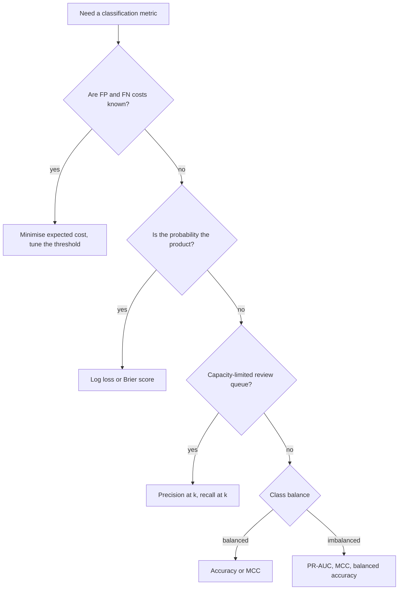

# Classification Metrics

## TL;DR
Everything is built from the confusion matrix. Precision answers "of the ones I flagged, how many
were right"; recall answers "of the ones that mattered, how many did I catch"; F1 is their harmonic
mean and has no business meaning on its own. Accuracy is misleading under imbalance. **Macro**
averaging treats classes equally, **micro** treats rows equally (and equals accuracy in
single-label multiclass), **weighted** treats classes in proportion to support. The metric you
optimise should be the one whose movement changes a rupee number.

## Intuition
Every classifier decision is one of four outcomes. Two are correct, two are mistakes — and the two
mistakes usually cost wildly different amounts. A metric is a specific opinion about that exchange
rate. Accuracy says a false positive and a false negative cost the same; F1 says something subtler
and unnamed; a cost matrix says what your business actually believes. The interview question is
almost always "do you know which opinion you are asserting".

## The maths

The confusion matrix, with positive = the class you care about:

| | Predicted positive | Predicted negative |
|---|---|---|
| **Actual positive** | TP | FN (type II) |
| **Actual negative** | FP (type I) | TN |

$$
\begin{aligned}
\text{Accuracy} &= \frac{TP + TN}{TP + TN + FP + FN} \\[4pt]
\text{Precision} &= \frac{TP}{TP + FP} \quad \text{(PPV)}\\[4pt]
\text{Recall} &= \frac{TP}{TP + FN} \quad \text{(TPR, sensitivity)}\\[4pt]
\text{Specificity} &= \frac{TN}{TN + FP} = 1 - \text{FPR}\\[4pt]
F_1 &= \frac{2\,PR}{P + R} = \frac{2TP}{2TP + FP + FN}
\end{aligned}
$$

**Why harmonic mean.** $F_1 = \left(\tfrac{1}{2}(P^{-1} + R^{-1})\right)^{-1}$. The harmonic mean is
dominated by the smaller term: $P = 1.0, R = 0.02$ gives arithmetic mean $0.51$ but
$F_1 = 0.039$. A classifier that predicts positive once and is right scores an arithmetic 0.51 and
would look acceptable; $F_1$ correctly calls it useless. Note also that $F_1$ ignores TN entirely —
which is a feature under imbalance and a bug if true negatives matter.

**$F_\beta$** when you want an explicit exchange rate:

$$
F_\beta = (1 + \beta^2)\,\frac{P \cdot R}{\beta^2 P + R}
$$

$\beta > 1$ weights recall ($F_2$ for disease screening), $\beta < 1$ weights precision ($F_{0.5}$
for spam quarantine). $\beta$ is interpretable: recall is considered $\beta$ times as important as
precision.

**Matthews Correlation Coefficient** — the one metric that uses all four cells and stays honest
under imbalance:

$$
\text{MCC} = \frac{TP \cdot TN - FP \cdot FN}{\sqrt{(TP+FP)(TP+FN)(TN+FP)(TN+FN)}}
$$

It is the Pearson correlation between the binary prediction and the binary truth, ranging $[-1, 1]$
with $0$ = chance. A model that scores high MCC is good on both classes; you cannot game it by
predicting the majority.

**Balanced accuracy** $= \frac{1}{2}(\text{TPR} + \text{TNR})$ — the macro-average of recall, and
chance level is 0.5 regardless of the imbalance ratio.

**Cohen's kappa** corrects accuracy for agreement expected by chance:
$\kappa = (p_o - p_e)/(1 - p_e)$.

### Macro vs micro vs weighted

For $K$ classes with per-class counts $TP_k, FP_k, FN_k$ and support $n_k$:

$$
\begin{aligned}
\text{macro-}P &= \frac{1}{K}\sum_{k=1}^{K} \frac{TP_k}{TP_k + FP_k} \\[6pt]
\text{micro-}P &= \frac{\sum_k TP_k}{\sum_k (TP_k + FP_k)} \\[6pt]
\text{weighted-}P &= \sum_{k=1}^{K} \frac{n_k}{N}\cdot \frac{TP_k}{TP_k + FP_k}
\end{aligned}
$$

- **Macro** — average the per-class scores, unweighted. Every class counts equally, so a rare class
  you handle badly drags the score down hard. Use when the rare classes are the point.
- **Micro** — pool the counts first, then compute. Every *row* counts equally, so large classes
  dominate. In single-label multiclass every error is simultaneously one FP and one FN, so
  micro-P = micro-R = micro-F1 = **accuracy**. Knowing that identity is a common interview probe.
- **Weighted** — macro, but weighted by support. Halfway house; it hides poor rare-class performance
  almost as effectively as micro, so people who choose it "to be fair" usually have not thought it
  through.

Micro *is* meaningful and different from accuracy in **multi-label** settings, where a row can
contribute several TPs and FPs.

### Which metric do I optimise — the decision logic

Write the cost matrix. Let $c_{FP}$ and $c_{FN}$ be the costs of each error type and $b_{TP}$ the
benefit of a caught positive. Expected cost per scored item at threshold $t$:

$$
\mathbb{E}[\text{cost}(t)] = c_{FP}\cdot \text{FP}(t) + c_{FN}\cdot \text{FN}(t) - b_{TP}\cdot \text{TP}(t)
$$

Then the logic is:

1. **Do you have real costs?** Optimise expected cost directly and pick the threshold that minimises
   it. Report precision/recall as diagnostics, not as the objective. See [[threshold-selection]].
2. **Is the output a ranked list consumed by a capacity-limited team?** Precision@k or recall@k where
   $k$ = review capacity. "Our analysts handle 500 alerts a day" makes $k$ = 500 and every other
   metric secondary.
3. **Is the score itself the product** (pricing, expected-loss, a downstream expected-value
   calculation)? Then you need a **proper scoring rule** — log loss or Brier — not a threshold
   metric, because you need calibrated probabilities. See [[probability-calibration]].
4. **Missing a positive is catastrophic and a false alarm is cheap** (cancer screening, safety
   shutdown, fraud on a high-value account)? Recall-led: $F_2$, or "maximise recall subject to
   precision ≥ floor".
5. **A false alarm is expensive or erodes trust** (auto-blocking a customer's card, quarantining
   email)? Precision-led: $F_{0.5}$, or "maximise precision subject to recall ≥ floor".
6. **Genuinely no cost information and balanced classes?** Accuracy or MCC. Under imbalance with no
   cost information, MCC or balanced accuracy, never raw accuracy.
7. **Multiclass with classes that matter equally?** Macro-F1. **With classes that matter in
   proportion to volume?** Micro/accuracy. Say which and why.

## Diagram



## Code

```python
import numpy as np
from sklearn.metrics import (
    confusion_matrix, classification_report, precision_recall_fscore_support,
    matthews_corrcoef, balanced_accuracy_score, fbeta_score, accuracy_score,
)

# 1000 rows, 3% positive — a realistic fraud-ish base rate.
rng = np.random.default_rng(0)
y = (rng.random(1000) < 0.03).astype(int)
# A "model" that catches half the positives and fires 20 false alarms.
yhat = np.zeros_like(y)
pos = np.flatnonzero(y)
yhat[pos[: len(pos) // 2]] = 1
yhat[rng.choice(np.flatnonzero(y == 0), 20, replace=False)] = 1

tn, fp, fn, tp = confusion_matrix(y, yhat).ravel()
print(f"TN={tn} FP={fp} FN={fn} TP={tp}")
print("accuracy      :", round(accuracy_score(y, yhat), 4))          # looks great
print("precision     :", round(tp / (tp + fp), 4))
print("recall        :", round(tp / (tp + fn), 4))
print("f1            :", round(2 * tp / (2 * tp + fp + fn), 4))
print("f2 (recall-led):", round(fbeta_score(y, yhat, beta=2), 4))
print("balanced acc  :", round(balanced_accuracy_score(y, yhat), 4))
print("MCC           :", round(matthews_corrcoef(y, yhat), 4))

# The all-negative baseline: this is the number every metric must beat.
print("accuracy of predicting all-negative:", round((y == 0).mean(), 4))
```

Macro vs micro vs weighted, made concrete:

```python
from sklearn.metrics import f1_score

# 3 classes, badly imbalanced: 900 / 90 / 10
y_true = np.array([0] * 900 + [1] * 90 + [2] * 10)
y_pred = y_true.copy()
y_pred[y_true == 2] = 0        # class 2 is completely missed
y_pred[np.flatnonzero(y_true == 1)[:20]] = 0

for avg in ("micro", "macro", "weighted"):
    print(f"{avg:>9} F1:", round(f1_score(y_true, y_pred, average=avg), 4))
print(classification_report(y_true, y_pred, digits=3, zero_division=0))
```

Micro F1 stays high because class 0 dominates; macro F1 collapses because class 2 scores zero.
If class 2 is the one that matters, macro is the only one of the three that tells you the truth.

Expected-cost evaluation, which is what you should actually show a stakeholder:

```python
def expected_cost(y_true, y_score, threshold, c_fp, c_fn):
    yhat = (y_score >= threshold).astype(int)
    tn, fp, fn, tp = confusion_matrix(y_true, yhat, labels=[0, 1]).ravel()
    return c_fp * fp + c_fn * fn

# c_fn = 5000 (a missed fraud), c_fp = 200 (an analyst reviews a clean case).
# Sweep the threshold and report the minimiser, not 0.5.
```

## In practice
- **Use it when:** any classifier. The report you hand over should contain the confusion matrix at
  the chosen operating point, not just a single scalar.
- **Defaults that work:** always print the confusion matrix and the majority-class baseline. Pick
  one headline metric tied to cost and two diagnostics. For imbalanced binary: PR-AUC for ranking
  quality plus precision/recall at the operating threshold. For multiclass: macro-F1 plus the
  per-class report.
- **Breaks when:** a single scalar hides the class you care about; when the metric is computed at the
  default 0.5 threshold on a model whose probabilities are miscalibrated; when the evaluation set is
  resampled (SMOTE'd or downsampled) so the reported precision does not correspond to any real
  population. Evaluate on the **natural** distribution, always.
- **Cost / latency:** free. The expensive part is getting labels, which is why in production you
  often measure a proxy and reconcile monthly.

> [!warning]
> Never compute precision on a rebalanced test set. Precision depends on the base rate; downsample
> the negatives and you inflate it by exactly the downsampling factor. Recall, TPR and FPR are
> base-rate invariant; precision, PPV and PR-AUC are not.

## Interview angle

**Q. Your fraud model has 99.5% accuracy. Is it good?**
I cannot tell, and the number is a warning sign. If fraud is 0.5% of transactions, predicting "never
fraud" scores 99.5% and catches nothing. I would ask for the confusion matrix. The relevant
questions are: of the transactions we blocked, what fraction were actually fraud (precision, which
drives customer friction) and of the fraud that occurred, what fraction did we block (recall, which
drives loss). Then I would ask what a blocked-good-customer costs versus an unblocked fraud, and
report expected cost at the chosen threshold.

**Follow-up.** Which would you optimise here? → Depends on value tier. On a ₹500 transaction the
false-positive cost (a declined customer) likely exceeds the fraud loss, so precision-led. On a ₹5
lakh transfer the fraud loss dominates, so recall-led. In practice you build one ranking model and
set **different thresholds per value band** rather than training separate models.

**Q. Precision and recall — define them and tell me the tradeoff.**
Precision = TP/(TP+FP), the purity of the positive predictions. Recall = TP/(TP+FN), the coverage of
the actual positives. For a fixed ranking model they trade off through the threshold: lower it and
you predict positive more often, so recall rises weakly and precision falls weakly. The only way to
improve both simultaneously is a better model, not a different threshold. That distinction —
threshold moves you along the curve, modelling moves the curve — is the answer they are looking for.

**Q. What is F1 and when is it the wrong choice?**
Harmonic mean of precision and recall, so it punishes imbalance between them. It is wrong when the
costs of FP and FN differ, because F1 hard-codes them as equal and gives you no way to say
otherwise — use $F_\beta$ then. It is also wrong when true negatives matter, since F1 ignores TN
entirely, and wrong when you need a calibrated probability rather than a label.

**Q. Explain macro vs micro vs weighted averaging.**
Macro computes the metric per class and averages unweighted, so a class with 10 examples counts as
much as one with 10,000 — use it when rare classes matter. Micro pools TP/FP/FN across classes
before computing, so it is dominated by large classes; in single-label multiclass, micro precision,
recall and F1 all collapse to accuracy, because each misclassification is one FP for the predicted
class and one FN for the true class. Weighted is per-class averaged by support — it reports close to
micro and hides rare-class failures, which is usually not what people intend when they pick it.

**Follow-up.** When is micro genuinely useful? → Multi-label classification, where a row can produce
several TPs and FPs, so pooling is not equivalent to accuracy and micro-F1 answers "across all
label-instance decisions, how did we do".

**Q. What is MCC and why might you prefer it?**
The correlation coefficient between predicted and true binary labels, computed from all four
confusion-matrix cells. Unlike F1 it accounts for true negatives and unlike accuracy it cannot be
inflated by predicting the majority class — an all-negative predictor gets MCC = 0. When I have no
cost information but the classes are imbalanced, MCC is the most honest single scalar available.

## Traps
- **Reporting accuracy on imbalanced data.** Always state the majority-class baseline next to it.
- **"F1 is the metric for imbalanced data."** F1 is a metric *for* asserting equal cost of FP and
  FN. It is commonly used under imbalance because it ignores TN, but it is not automatically right;
  it is just not automatically wrong like accuracy.
- **Computing metrics at threshold 0.5 without checking.** 0.5 is optimal only for a calibrated
  model under equal costs and equal priors. It is almost never all three.
- **Confusing recall with precision under pressure.** Recall has FN in the denominator (actual
  positives); precision has FP (predicted positives). Anchor: *precision → prediction*.
- **Evaluating on SMOTE'd or downsampled data.** Precision, PPV and PR-AUC are base-rate dependent
  and become meaningless. Resample the training set only.
- **Using weighted average by default in `classification_report`.** It masks exactly the rare-class
  failure you are usually being asked about.
- **Optimising a metric nobody asked for.** If an interviewer says "the ops team can review 300 cases
  a day", the metric is precision@300, and answering "I'd use F1" misses the question.
- **Reporting one scalar with no confusion matrix.** A senior candidate shows the matrix.

## Flashcards
Precision vs recall formulas::Precision = TP/(TP+FP), recall = TP/(TP+FN). Precision's denominator is what you predicted positive; recall's is what actually was positive.
Why F1 uses the harmonic mean::It is dominated by the smaller of P and R, so a model with precision 1.0 and recall 0.02 scores 0.039, not 0.51.
F-beta interpretation of beta::Recall is considered beta times as important as precision; beta=2 is recall-led, beta=0.5 precision-led.
Which metric ignores true negatives::F1 (and precision/recall individually). MCC and accuracy use all four cells.
Macro vs micro vs weighted::Macro = unweighted mean of per-class scores (rare classes count fully); micro = pool counts first (large classes dominate); weighted = macro weighted by support.
Micro-F1 in single-label multiclass equals what::Accuracy — every error is one FP and one FN, so the pooled counts collapse.
MCC definition::Pearson correlation between the binary prediction and the binary truth, using all four confusion cells; 0 = chance, immune to majority-class gaming.
Which metrics are base-rate dependent::Precision, PPV and PR-AUC. Recall, TPR, FPR and ROC-AUC are invariant to the positive rate.
Threshold vs model improvement::Changing the threshold moves you along the precision-recall curve; only a better model moves the curve.

## Related
- [[roc-auc-and-pr-curves]]
- [[threshold-selection]]
- [[imbalanced-classification]]
- [[probability-calibration]]
- [[regression-metrics]]
- [[type-i-and-type-ii-errors]]
- [[requirements-and-metrics-definition]]
- [[case-fraud-detection]]
