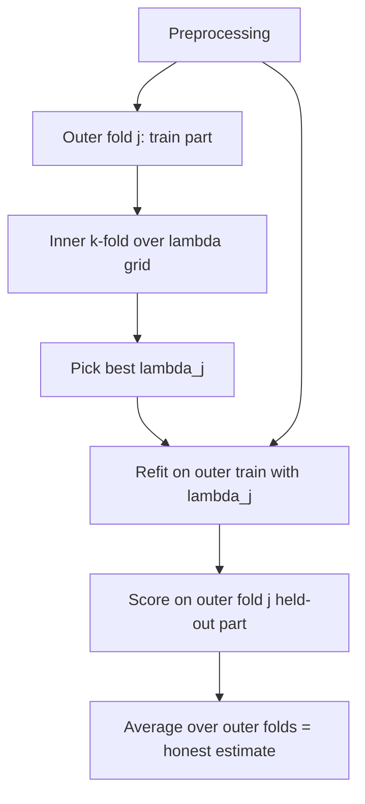

# Cross-Validation

## TL;DR
K-fold CV reuses every row as both training and validation data, giving a lower-variance performance
estimate than a single holdout at $k\times$ the compute. The variants exist because rows are rarely
i.i.d.: stratify for class imbalance, group when rows share an entity, expand forward in time for
temporal data. If you tune hyperparameters on the same CV you report, the number is optimistic —
nested CV is the honest version. And any preprocessing fitted outside the fold leaks.

## Intuition
A single holdout gives one noisy exam result. K-fold gives $k$ exams over different questions and
averages them: same total data, a far more stable estimate of the model's true level. The catch is
that the $k$ scores are not independent — the training sets overlap in $(k-2)/(k-1)$ of their
rows — so the naive standard error across folds understates the real uncertainty.

## The maths

Partition the $n$ rows into folds $F_1,\dots,F_k$. For each $j$, fit $\hat{f}^{(-j)}$ on everything
but $F_j$ and score on $F_j$:

$$
\hat{R}_{\text{CV}} = \frac{1}{n}\sum_{j=1}^{k}\sum_{i \in F_j} L\big(y_i, \hat{f}^{(-j)}(x_i)\big)
$$

This estimates the risk of a model trained on $n(k-1)/k$ rows, not on $n$ — so for small $n$, CV is
**pessimistically biased** for the model you finally ship on all the data.

**Bias–variance in the choice of $k$.**
- Small $k$ (e.g. 2): each training set is much smaller than $n$ → large pessimistic bias, but folds
  overlap less → lower variance of the estimate.
- Large $k$ (LOOCV, $k=n$): training sets are nearly $n$ → almost no bias, but the $n$ fitted models
  are nearly identical and their errors are highly correlated → high variance of the estimate, and
  $n$ fits of cost.
- $k = 5$ or $10$ is the standard compromise. Repeat with different random partitions
  (repeated k-fold) to average out partition noise when you can afford it.

**LOOCV has a closed form for linear smoothers.** If $\hat{y} = Hy$ with hat matrix $H$ (for OLS,
$H = X(X^\top X)^{-1}X^\top$), then

$$
\hat{R}_{\text{LOOCV}} = \frac{1}{n}\sum_{i=1}^{n}\left(\frac{y_i - \hat{y}_i}{1 - h_{ii}}\right)^{2}
$$

so leave-one-out costs one fit, not $n$. $h_{ii}$ is the leverage of point $i$. This is why
`RidgeCV` can scan many $\alpha$ values almost for free.

**Nested CV.** Model selection is itself part of the fitting procedure, so it must sit inside the
loop being evaluated:

$$
\hat{R}_{\text{nested}}
= \frac{1}{k_{\text{out}}}\sum_{j=1}^{k_{\text{out}}}
L\Big(y_{F_j}, \; \hat{f}_{\hat{\lambda}_j}^{(-j)}(x_{F_j})\Big),
\qquad
\hat{\lambda}_j = \arg\min_{\lambda} \hat{R}_{\text{CV}}^{\text{inner}(-j)}(\lambda)
$$

Each outer fold gets its own $\hat{\lambda}_j$ chosen using only that fold's training data. The
$\hat{\lambda}_j$ may differ across folds — that is fine and informative; nested CV estimates the
performance of *the whole procedure*, not of one fixed hyperparameter set. Cost is
$k_{\text{out}} \times k_{\text{in}} \times |\Lambda|$ fits.

**Why preprocessing outside the fold leaks.** Suppose you standardise with
$\mu, \sigma$ computed on all $n$ rows. Then $x_i$ for a validation row was normalised using a mean
that contains $x_i$ itself and every other validation row. The effect is small for a scaler and
enormous for target encoding, SMOTE, feature selection by correlation with $y$, or imputation of a
target-correlated column. Formally, the fold-$j$ estimate is no longer a function of
$\hat{f}^{(-j)}$ alone — it depends on $F_j$ — so it is not an out-of-sample estimate at all. The
fix is mechanical: every fit-bearing step goes inside a `Pipeline`, and the pipeline is what gets
cross-validated. See [[data-leakage]].

## Diagram



## Code

```python
import numpy as np
from sklearn.datasets import make_classification
from sklearn.pipeline import Pipeline
from sklearn.preprocessing import StandardScaler
from sklearn.linear_model import LogisticRegression
from sklearn.model_selection import (
    StratifiedKFold, GroupKFold, TimeSeriesSplit,
    GridSearchCV, cross_val_score,
)

X, y = make_classification(n_samples=1200, n_features=25, n_informative=6,
                           weights=[0.9, 0.1], random_state=0)

# Everything that FITS goes inside the pipeline -> refit per fold, no leakage.
pipe = Pipeline([
    ("scale", StandardScaler()),
    ("clf", LogisticRegression(max_iter=2000, solver="liblinear")),
])

grid = {"clf__C": [0.01, 0.1, 1, 10], "clf__penalty": ["l1", "l2"]}

inner = StratifiedKFold(n_splits=5, shuffle=True, random_state=1)
outer = StratifiedKFold(n_splits=5, shuffle=True, random_state=2)

search = GridSearchCV(pipe, grid, scoring="average_precision", cv=inner, n_jobs=-1)

# Nested CV: the search is the estimator being cross-validated.
nested = cross_val_score(search, X, y, cv=outer, scoring="average_precision")
print("nested AP: %.3f +/- %.3f" % (nested.mean(), nested.std()))

# Non-nested (optimistic) number, for contrast:
search.fit(X, y)
print("best inner AP (optimistic):", round(search.best_score_, 3))

# Grouped: no entity spans folds.
groups = np.random.RandomState(0).randint(0, 150, len(y))
print("grouped:", cross_val_score(pipe, X, y, cv=GroupKFold(5), groups=groups,
                                  scoring="average_precision").mean().round(3))

# Time series: expanding window, always train on the past.
tscv = TimeSeriesSplit(n_splits=5)
for tr, te in tscv.split(X):
    pass  # tr indices always precede te indices
```

For a Databricks/PySpark workflow, the same rule holds — fit the `StringIndexer`/`Imputer`/scaler
inside the Spark ML `Pipeline` and pass the pipeline to `CrossValidator`, never transform the full
DataFrame first. Log each fold's score to MLflow as a nested run so the spread is visible later
([[experiment-tracking-mlflow]]).

## In practice
- **Use it when:** $n$ is small enough that a single validation split is noisy (roughly under
  100k rows), or whenever you are comparing models whose difference is smaller than a holdout's
  standard error.
- **Defaults that work:** `StratifiedKFold(5, shuffle=True, random_state=…)` for classification;
  `KFold(5, shuffle=True)` for regression; `GroupKFold` whenever an entity repeats;
  `TimeSeriesSplit` for anything temporal. Report mean ± std across folds and treat differences
  smaller than one std as noise.
- **Breaks when:** rows are dependent and you forgot to group; the data is temporal and you
  shuffled; classes are so rare that some folds contain zero positives (use
  `StratifiedKFold` and check); the model is expensive enough that $k$ fits are unaffordable — then
  use a single large holdout and be honest about its error bars.
- **Cost / latency:** $k\times$ training cost, $k_{\text{out}} \times k_{\text{in}} \times |\Lambda|$
  for nested. With XGBoost on a few million rows, nested CV over a 200-point grid is not a thing you
  do casually — use a single holdout for the inner search and CV only for the final estimate, or
  switch to a Bayesian/successive-halving search ([[hyperparameter-tuning]]).

## Interview angle

**Q. Explain k-fold cross-validation and why we use it over a single split.**
Partition into $k$ folds, train on $k-1$ and validate on the held-out fold, rotate, average. Every
row contributes to both training and validation across the rotation, so the estimate has lower
variance than one holdout at the same data size. The cost is $k$ fits, and the estimate technically
describes a model trained on $(k-1)/k$ of the data, so it is slightly pessimistic.

**Follow-up.** *Why not always use leave-one-out?* → Nearly unbiased but high variance, because the
$n$ training sets are almost identical so the fold errors are strongly correlated and the average
does not average much away. Plus $n$ fits. Exception: for linear smoothers, LOOCV has the closed
form with $(1-h_{ii})$ in the denominator, so it is cheap and worth using.

**Q. You ran GridSearchCV with 5-fold CV, picked the best, and reported that CV score. What is
wrong?**
It is selection on the validation folds, so it is optimistically biased — the winner's curse over
however many grid points were tried. The correct report is either nested CV, or the score of the
chosen model on a test set that took no part in the search.

**Follow-up.** *How much optimism?* → Grows with the number of configurations and shrinks with fold
size; with a large grid and few thousand rows it can easily be one to several points of AUC. The
cheap diagnostic is to compare the best inner CV score against a locked holdout — if they diverge
noticeably, you over-searched.

**Q. Where exactly does CV leak, and how do you prevent it structurally?**
Anywhere a step *learns something from the data* and is applied before splitting: scaling,
imputation, target/mean encoding, SMOTE, feature selection by univariate correlation with $y$, PCA,
even outlier removal keyed on the target. Prevent it structurally by putting every such step in a
`Pipeline` and cross-validating the pipeline. Target encoding needs extra care — use out-of-fold
encoding inside each training fold ([[categorical-encoding]]).

**Q. Time-series CV — what do you do differently?**
Never shuffle. Use expanding (or rolling) windows where every training index precedes every
validation index, insert a gap (embargo) equal to the label horizon so that the label of the last
training row cannot overlap the validation period, and evaluate on multiple successive windows to
see whether performance degrades over time. Details in [[time-series-features-and-validation]].

**Q. Your 5 folds give AUCs of 0.81, 0.83, 0.62, 0.84, 0.82. What do you investigate?**
Fold 3 is not noise at that gap. Check whether the folds respect a hidden grouping (a period, a
region, a product line), whether fold 3 has far fewer positives, and whether a data quality change
happened in the rows it drew. Most often it is an unmodelled grouping or a regime change, which
means the deployment estimate should be the pessimistic fold, not the mean.

## Traps
- **Scaling or encoding before `cross_val_score`.** The single most common CV bug. Use a pipeline.
- **Reporting the best CV score from a search as the expected production score.** Optimistic.
  Nested CV or a locked test set.
- **Shuffling temporal data.** Guarantees a good CV score and a bad model.
- **Using `KFold` when the same customer appears in many rows.** The model memorises the customer;
  the CV score measures memorisation.
- **Assuming the std across folds is a real standard error.** Fold estimates are correlated because
  training sets overlap, so the naive $\text{std}/\sqrt{k}$ understates uncertainty. Use it as a
  rough spread indicator, not a confidence interval.
- **Refitting with early stopping using the CV folds and also reporting those folds.** The stopping
  round is a hyperparameter chosen on the fold being scored.
- **Stratifying on the target for a regression problem by binning, then forgetting the bins are
  target-derived.** Stratifying folds is fine; using the bins as a feature is leakage.

## Flashcards
K-fold CV estimate::Average of the k held-out fold losses; estimates the risk of a model trained on (k-1)/k of the data, so mildly pessimistic.
Why not LOOCV by default::Near-zero bias but high variance (training sets nearly identical, errors correlated) and n model fits — unless a closed form exists.
LOOCV closed form for linear smoothers::mean over i of ((y_i - ŷ_i)/(1 - h_ii))², where h_ii is the leverage from the hat matrix.
What nested CV estimates::The performance of the entire model-selection procedure, not of one fixed hyperparameter setting.
Cost of nested CV::k_outer × k_inner × number of hyperparameter configurations model fits.
Why does preprocessing outside the fold leak::The validation fold influenced the transform, so the fold score is no longer out-of-sample; fix by putting every fitted step in a Pipeline.
CV variant for repeated entities::GroupKFold — no entity may appear in both train and validation.
CV variant for temporal data::TimeSeriesSplit / expanding window with an embargo gap equal to the label horizon.
Typical default k::5 or 10; repeat with different partitions to reduce partition noise.

## Related
- [[train-test-validation-split]]
- [[data-leakage]]
- [[hyperparameter-tuning]]
- [[bias-variance-tradeoff]]
- [[time-series-features-and-validation]]
- [[categorical-encoding]]
- [[moc-classical-ml]]
