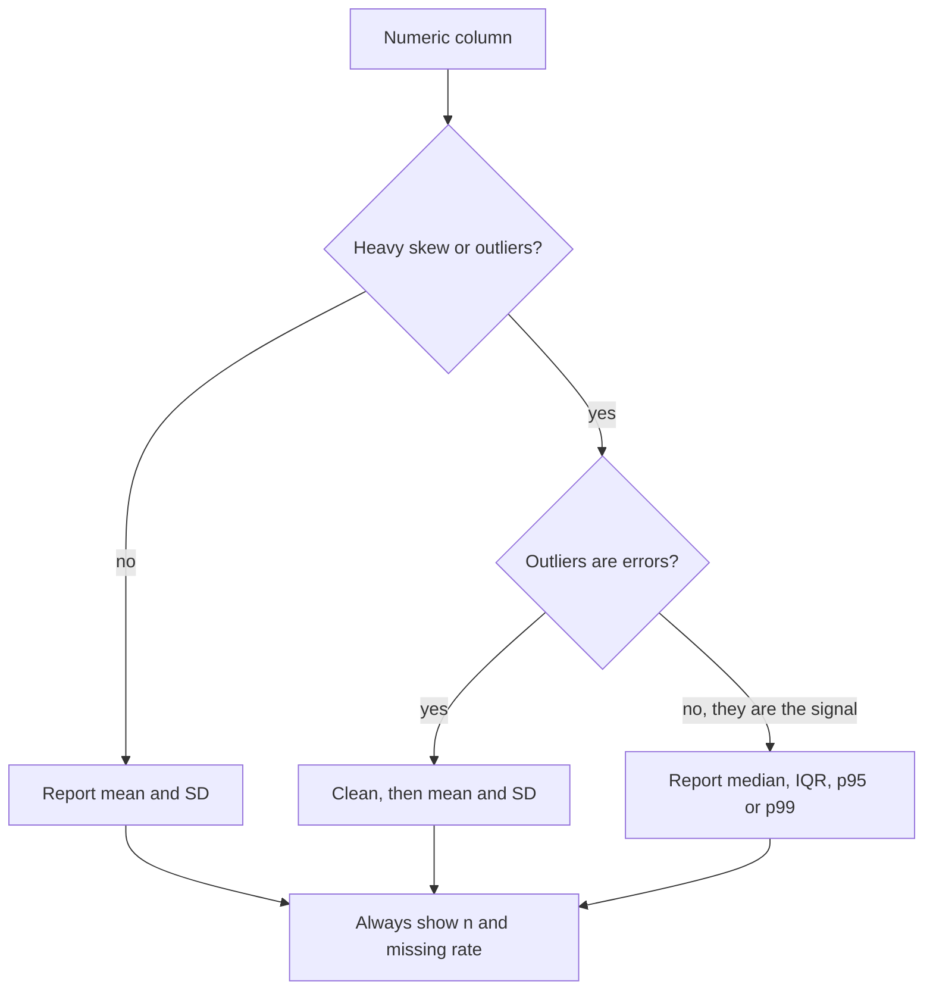

# Descriptive Statistics

## TL;DR
Summarise a distribution with a centre, a spread, a shape and a tail. Mean/SD are efficient
but non-robust; median/IQR survive outliers. In interviews the real question is never "what is
the median" — it is "which summary would you report to the business and why", and the answer
is almost always driven by skew and by whether outliers are errors or the signal.

## Intuition
A summary statistic is a lossy compression of a distribution. Every choice throws away something.
The mean keeps total mass (sum ÷ n), so it answers "if I redistributed equally, what would each
get?" — perfect for revenue, terrible for "a typical user". The median keeps rank order, so it
answers "what does the middle person see" — perfect for latency and salary, useless for budgeting
because medians do not add up to totals.

## The maths

For a sample $x_1,\dots,x_n$:

$$
\bar{x} = \frac{1}{n}\sum_{i=1}^{n} x_i,
\qquad
s^2 = \frac{1}{n-1}\sum_{i=1}^{n}(x_i-\bar{x})^2
$$

The $n-1$ (Bessel's correction) makes $s^2$ unbiased for the population variance $\sigma^2$.
Dividing by $n$ underestimates, because the deviations are taken about $\bar{x}$ — which is
itself fitted to the data and is by construction the value that *minimises* $\sum(x_i-c)^2$.
One degree of freedom is consumed estimating the centre.

$$
\mathbb{E}\left[\sum_i (x_i-\bar{x})^2\right] = (n-1)\sigma^2
$$

**Shape.** Standardised third and fourth central moments:

$$
g_1 = \frac{\frac{1}{n}\sum(x_i-\bar{x})^3}{s^3},
\qquad
g_2 = \frac{\frac{1}{n}\sum(x_i-\bar{x})^4}{s^4} - 3
$$

$g_1>0$ means a right tail (mean $>$ median, typical of revenue, session length, claim size).
$g_2$ is *excess* kurtosis: 0 for a Gaussian, positive means fat tails — which is really a
statement that variance-based methods will be unstable.

**Robustness.** The *breakdown point* is the fraction of arbitrarily corrupted points a statistic
tolerates before it can be pushed anywhere: mean $= 0$ (one point suffices), median $= 0.5$,
10% trimmed mean $= 0.10$. Median absolute deviation, scaled to be consistent with $\sigma$
under normality:

$$
\mathrm{MAD} = 1.4826 \cdot \mathrm{median}_i\,\lvert x_i - \mathrm{median}(x) \rvert
$$

**Correlation.** Pearson measures *linear* association only:

$$
r = \frac{\sum (x_i-\bar{x})(y_i-\bar{y})}{\sqrt{\sum(x_i-\bar{x})^2}\sqrt{\sum(y_i-\bar{y})^2}}
$$

Spearman is Pearson on ranks, so it captures any monotone relationship and is outlier-resistant.

## Diagram



## Code

```python
import numpy as np
import pandas as pd
from scipy import stats

rng = np.random.default_rng(0)
# right-skewed, like order value in rupees
x = rng.lognormal(mean=7.0, sigma=1.1, size=10_000)

s = pd.Series(x)
summary = {
    "n": s.size,
    "missing": s.isna().sum(),
    "mean": s.mean(),
    "median": s.median(),
    "std": s.std(ddof=1),
    "iqr": s.quantile(0.75) - s.quantile(0.25),
    "mad": stats.median_abs_deviation(s, scale="normal"),
    "skew": stats.skew(s),
    "excess_kurtosis": stats.kurtosis(s),      # Fisher: 0 for normal
    "p95": s.quantile(0.95),
    "p99": s.quantile(0.99),
}
print({k: round(float(v), 3) for k, v in summary.items()})
# mean sits well above the median; p99 is many multiples of the median

# robustness demo: one corrupted row
y = x.copy()
y[0] = 1e9
print("mean shift  :", y.mean() / x.mean())      # blows up
print("median shift:", np.median(y) / np.median(x))  # ~1.0
```

PySpark equivalent for a medallion silver table — `approxQuantile` uses the Greenwald–Khanna
algorithm, so ask for the relative error you can live with:

```python
df.select("order_value").summary("count", "mean", "stddev", "25%", "50%", "75%").show()
q = df.approxQuantile("order_value", [0.5, 0.95, 0.99], relativeError=0.001)
```

## In practice
- **Use it when:** every single time, before modelling. A bronze→silver profiling step that logs
  n, null rate, min, p50, p95, max per column catches more production incidents than any monitor.
- **Defaults that work:** report `n`, null %, median, IQR, p95, p99 and min/max for skewed
  business metrics; mean and SD only when the histogram is roughly symmetric. Always segment
  before summarising — a single "average" across Android and iOS or across tier-1 and tier-2
  cities often describes nobody.
- **Breaks when:** the distribution is multimodal (mean and median both land in the valley
  between the modes), or when the metric is a ratio of two random quantities — see the delta
  method in [[ab-testing-pitfalls]].
- **Cost / latency:** exact quantiles need a sort ($O(n\log n)$) and a full shuffle in Spark;
  approximate quantile sketches are single-pass and mergeable, which is why streaming monitors
  use them.

## Interview angle

**Q. Mean or median for reporting page latency?**
Neither alone. Latency is right-skewed and the tail is the user experience that matters, so
report p50 *and* p95/p99. The mean is dominated by a few slow requests and masks whether the
typical request got worse. If you must pick one number for an SLO, pick a high percentile.

**Follow-up.** Your p99 jumped but p50 is flat — what happened? → A subpopulation degraded, not
the whole system: one shard, one region, one client version, or a cold-cache path. Segment p99
by those dimensions rather than trying to explain an aggregate.

**Q. Why divide by $n-1$?**
Because the deviations are measured from $\bar{x}$, which is fitted to the same data and minimises
the sum of squared deviations. That makes the raw sum systematically too small; its expectation is
$(n-1)\sigma^2$, so dividing by $n-1$ gives an unbiased $\sigma^2$ estimate. Note $s$ itself is
still biased for $\sigma$ — unbiasedness does not survive the square root.

**Q. Pearson $r = 0$. Are the variables independent?**
No. $r$ measures linear association. $Y = X^2$ with $X$ symmetric about 0 has $r \approx 0$ and
total dependence. Check Spearman, mutual information, or just plot it.

**Follow-up.** Same two variables, you delete the top 1% by $X$ and $r$ moves from 0.7 to 0.2 →
the correlation was leverage-driven by a few extreme points. Report Spearman, and decide whether
those points are real customers or data errors before doing anything else.

**Q. When does Simpson's paradox bite you?**
When you aggregate over a confounder whose mix differs between groups. Model B beats model A
overall but loses in every traffic segment because it was served mostly on easy traffic.
Always check whether the segment mix is balanced before believing an aggregate —
see [[causal-inference-basics]].

## Traps
- **"The mean is the typical value."** Wrong for any skewed metric. For a lognormal, the mean sits
  above the median by a factor of $e^{\sigma^2/2}$; with $\sigma=1.1$ that is about 1.8×.
- **Reporting SD for a skewed variable.** $\bar{x}\pm 2s$ implies a symmetric interval and will go
  negative for revenue. Quote quantiles instead.
- **Confusing standard deviation with standard error.** SD describes the spread of individuals;
  SE $= s/\sqrt{n}$ describes the spread of the *estimate*. Error bars on a mean are SE-based.
  See [[sampling-and-sampling-distributions]].
- **Dropping outliers by default.** In fraud, churn and claims, the outliers *are* the label.
  Winsorise or model the tail; never silently delete.
- **Correlation reported without $n$.** $r=0.6$ on 10 points is noise; on 10,000 it is a finding.
- **Aggregating a ratio by averaging per-user ratios** when the business definition is the ratio
  of sums. They are different estimands and can move in opposite directions.

## Flashcards
Why n-1 in the sample variance::Deviations are taken about the fitted mean, so the raw sum has expectation (n-1)σ²; dividing by n-1 makes it unbiased for σ².
Breakdown point of the mean vs the median::Mean 0 (one bad point moves it anywhere), median 0.5.
Scaled MAD formula::1.4826 × median(|x − median(x)|), consistent with σ under normality.
Excess kurtosis of a Gaussian::0, by definition of the Fisher convention (raw kurtosis 3).
Pearson vs Spearman::Pearson = linear association on values; Spearman = Pearson on ranks, so any monotone relation and outlier-resistant.
SD vs SE::SD = spread of individual observations; SE = SD/√n = spread of the sample mean.
Sign of skewness when mean > median::Positive (right-skewed, long right tail).
Simpson's paradox in one line::An aggregate reverses direction because the segment mix differs between groups.

## Related
- [[sampling-and-sampling-distributions]]
- [[expectation-variance-covariance]]
- [[confidence-intervals]]
- [[common-probability-distributions]]
- [[outlier-detection]]
- [[moc-stats]]
