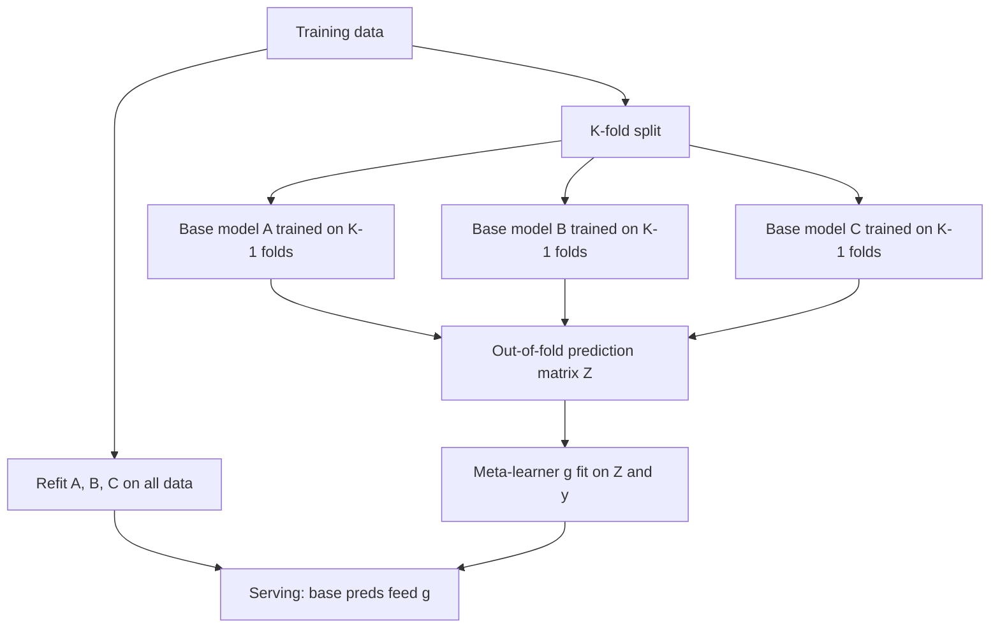

# Ensemble Stacking and Blending

## TL;DR
Stacking trains a **meta-learner** on the out-of-fold predictions of several base models, letting it learn
*where each model is trustworthy*. Blending is the cheap version: hold out one split, train base models on
the rest, fit the meta-learner on that single holdout. The entire correctness of stacking rests on the base
predictions being **out-of-fold** — get that wrong and you have built a leakage machine that wins offline
and loses in production.

## Intuition
A simple average says "all three models are equally right everywhere". They aren't: the linear model is
better in the sparse tail, the boosted trees are better in the dense middle, the k-NN is good on the small
cluster nobody else fits. A meta-learner that sees each model's prediction *and* can key off features
learns those regions and weights accordingly.

The catch: if you train the meta-learner on predictions that base models made on their own training rows,
those predictions are unrealistically good, and the meta-learner learns to trust the most *overfit* base
model rather than the most *accurate* one.

## The maths

Base models $f_1, \dots, f_M$; meta-learner $g$. The stacked prediction is
$$
\hat{y}(x) = g\big(f_1(x), f_2(x), \dots, f_M(x)\big)
$$
optionally with original features appended: $g(f_1(x), \dots, f_M(x), x)$ (*restacking*).

### Out-of-fold construction
Partition the training set into $K$ folds $\mathcal{F}_1, \dots, \mathcal{F}_K$. For base model $m$ and
fold $k$, train $f_m^{(-k)}$ on everything except $\mathcal{F}_k$ and predict on $\mathcal{F}_k$:
$$
z_{im} = f_m^{(-k(i))}(x_i), \qquad i \in \mathcal{F}_{k(i)}
$$
This gives a full matrix $Z \in \mathbb{R}^{n \times M}$ where every entry was produced by a model that
never saw that row. Fit $g$ on $(Z, y)$.

For inference you need a single $f_m$ per base model. Two conventions, both used:
- refit $f_m$ on the **full** training set (scikit-learn's `StackingClassifier` does this), or
- average the $K$ fold models' predictions at inference.

The first is simpler and is what scikit-learn does; the second keeps the train/serve distribution of $z$
closer to what the meta-learner saw, at $K\times$ the inference cost.

### Why simple averaging already works
For $M$ unbiased models with variance $\sigma^2$ and pairwise correlation $\rho$:
$$
\operatorname{Var}\!\left(\frac{1}{M}\sum_m f_m\right) = \rho\sigma^2 + \frac{1-\rho}{M}\sigma^2
$$
— the same formula as [[random-forest]]. So the gain from ensembling is governed by **diversity**, not by
the number of models. Three near-identical GBDTs with different seeds buy almost nothing; a GBDT, a
regularised linear model and a neural net buy a lot because their errors are structurally different.

Stacking generalises the uniform weights $1/M$ to learned, possibly input-dependent weights. With a linear
meta-learner constrained to non-negative weights summing to 1, stacking is exactly *optimal weighted
averaging*; anything richer lets the weights vary with $x$.

### Why the meta-learner should be simple
$Z$ has $M$ highly correlated columns and $n$ rows that are already "used up" by the base fits. A flexible
meta-learner on a correlated low-dimensional input overfits quickly. Standard choices: ridge or non-negative
least squares for regression, logistic regression for classification. If you want a GBDT meta-learner, you
need genuinely more data and restacked features to justify it.

## Diagram



## Code

```python
import numpy as np
from sklearn.datasets import make_classification
from sklearn.model_selection import StratifiedKFold, cross_val_predict, train_test_split
from sklearn.linear_model import LogisticRegression
from sklearn.ensemble import RandomForestClassifier, HistGradientBoostingClassifier, StackingClassifier
from sklearn.pipeline import make_pipeline
from sklearn.preprocessing import StandardScaler
from sklearn.metrics import roc_auc_score

X, y = make_classification(n_samples=12000, n_features=25, n_informative=10,
                           class_sep=0.8, random_state=0)
Xtr, Xte, ytr, yte = train_test_split(X, y, test_size=0.25, random_state=0, stratify=y)

base = [
    ("lr",  make_pipeline(StandardScaler(), LogisticRegression(max_iter=2000, C=1.0))),
    ("rf",  RandomForestClassifier(n_estimators=400, min_samples_leaf=2, n_jobs=-1, random_state=0)),
    ("gb",  HistGradientBoostingClassifier(learning_rate=0.06, max_iter=500, random_state=0)),
]

cv = StratifiedKFold(5, shuffle=True, random_state=0)

# 1) Individual models
for name, m in base:
    m.fit(Xtr, ytr)
    print(f"{name:<4} auc {roc_auc_score(yte, m.predict_proba(Xte)[:, 1]):.4f}")

# 2) Manual stacking, so the OOF construction is explicit
Z_tr = np.column_stack([
    cross_val_predict(m, Xtr, ytr, cv=cv, method="predict_proba", n_jobs=-1)[:, 1]
    for _, m in base
])
meta = LogisticRegression(max_iter=2000).fit(Z_tr, ytr)

Z_te = np.column_stack([m.predict_proba(Xte)[:, 1] for _, m in base])  # base models refit on full Xtr above
print("stack auc", roc_auc_score(yte, meta.predict_proba(Z_te)[:, 1]))
print("learned meta weights:", dict(zip([n for n, _ in base], meta.coef_.ravel().round(3))))

# 3) The library version of the same thing
stack = StackingClassifier(
    estimators=base,
    final_estimator=LogisticRegression(max_iter=2000),
    cv=cv,
    passthrough=False,      # True = restacking (append raw features to Z)
    n_jobs=-1,
).fit(Xtr, ytr)
print("sklearn stack auc", roc_auc_score(yte, stack.predict_proba(Xte)[:, 1]))

# 4) Baseline you must always beat: the simple average
print("mean-of-probs auc", roc_auc_score(yte, Z_te.mean(axis=1)))
```

The leakage version, for contrast — never ship this:

```python
Z_leaky = np.column_stack([m.predict_proba(Xtr)[:, 1] for _, m in base])  # IN-FOLD predictions
meta_leaky = LogisticRegression(max_iter=2000).fit(Z_leaky, ytr)
print("weights learned from in-fold preds:", meta_leaky.coef_.round(3))
```

The random forest's in-fold probabilities are near-perfect, so the meta-learner assigns it nearly all the
weight regardless of how it actually generalises. That is the whole failure mode in three lines.

## In practice
- **Use it when:** you have several genuinely different model families with comparable but non-identical
  accuracy, and the last 0.5–2% of metric is worth real complexity — Kaggle-style competitions, credit
  scoring where a small AUC gain is large money, forecast ensembles where a statistical model and a GBDT
  have complementary failure modes.
- **Defaults that work:** 3–6 diverse base models; 5-fold OOF with the *same* folds for every base model;
  a ridge / logistic meta-learner; `passthrough=False` first, try `True` second. For classification, stack
  on predicted *probabilities* (or log-odds), never hard labels — you throw away most of the signal.
- **Breaks when:** base models are near-duplicates (stacking then just picks one); the data is small
  (the meta-learner has $n$ rows and correlated columns, and $K$ base fits shrink each base model's
  training set); folds are wrong for the data structure — random folds on a time series or on repeated
  customers leak into $Z$ and the learned weights are fiction.
- **Cost / latency:** training is roughly $(K+1) \times$ the cost of fitting every base model. Serving
  requires *all* base models loaded and executed per request, so p99 latency is the max, not the mean, of
  their latencies. This is why stacking is far more common in batch scoring than in low-latency serving.

> [!warning]
> For time-ordered data, generate $Z$ with rolling-origin splits, not `KFold`. A base model trained on
> future folds and predicting the past produces optimistic OOF predictions, the meta-learner over-weights
> it, and the ensemble is worse than any single model in production. See
> [[time-series-features-and-validation]].

## Interview angle

**Q. What is stacking and why must the base predictions be out-of-fold?**
Stacking fits a meta-model on base models' predictions so it can learn where each base model is reliable.
If the base predictions on a row came from a model trained on that row, they are unrealistically accurate
and the accuracy differs by model family — a fully-grown random forest is near-perfect in-fold, a
regularised logistic regression is not. The meta-learner then learns to weight by degree of overfitting
rather than by generalisation. Out-of-fold predictions make every column an honest out-of-sample estimate,
so the learned weights mean something.

**Follow-up.** What do you deploy as the base models, since each was trained on $K-1$ folds? → Either refit
each base model on the full training set (scikit-learn's default; simple, and the standard answer) or keep
the $K$ fold models and average their predictions at serve time. The second keeps the serving distribution
of $Z$ closer to the training distribution but costs $K\times$ inference.

**Q. Stacking vs blending.**
Blending holds out a single split (say 20%), trains base models on the other 80%, and fits the meta-learner
on that holdout's predictions. It is simpler, has zero risk of fold-leakage bugs, and is much cheaper. Its
costs are that the meta-learner sees only 20% of the data, so weights are high-variance, and the base
models never train on the holdout. Stacking uses all the data for both and is generally better, at $K\times$
the fitting cost and considerably more room to make a leakage mistake.

**Q. When does stacking not help?**
When the base models are correlated. The ensemble variance floor is $\rho\sigma^2$, so five GBDTs with
different seeds give you almost nothing. Diversity has to come from somewhere real: different model
families, different feature subsets, different loss functions, different data granularity. Also when the
gain doesn't clear the operational bar — three models to load, monitor, retrain and explain for +0.3% AUC
is usually a bad trade outside a competition.

**Q. What meta-learner do you use and why not something powerful?**
Ridge or logistic regression, often with non-negative coefficients so the result is an interpretable
weighted average. $Z$ has few, highly-correlated columns and the rows have already been "spent" fitting the
base models, so a flexible meta-learner overfits fast. A non-negative constraint also prevents the strange
"subtract model B" solutions that collinearity produces and that generalise badly.

**Q. How would you ensemble in a production Databricks pipeline?**
Base models trained as separate MLflow runs against the same Delta feature table and the same fold
definition, with the fold assignment stored as a column so every model provably uses identical folds. The
OOF matrix is itself a Delta table keyed by row id, which makes the meta-learner's training data
reproducible and auditable. Serving is a single registered pyfunc model wrapping all base models plus the
meta-learner, so versioning is atomic. See [[model-registry-and-versioning]] and [[reproducibility]].

## Traps
- **In-fold base predictions.** The cardinal sin. It produces a meta-learner that ranks models by
  overfitting, and an offline score that will not survive contact with production. See [[data-leakage]].
- **Different folds for different base models.** Row $i$'s prediction from model A then comes from a model
  that saw data model B's prediction did not, so the columns of $Z$ aren't comparable. Fix the fold
  assignment once and reuse it.
- **Not comparing to the simple average.** Stacking that fails to beat `np.mean(preds, axis=1)` is not
  worth deploying, and interviewers ask for this baseline specifically.
- **Stacking hard labels.** A 0/1 column discards the confidence that makes stacking work. Stack
  probabilities, or log-odds if the meta-learner is linear.
- **Random K-fold on temporal or grouped data.** Use rolling-origin or `GroupKFold`; otherwise the OOF
  predictions are leaked and so is everything downstream ([[cross-validation]]).
- **Assuming ensembling fixes calibration.** Averaging changes the probability distribution; the ensemble
  usually needs its own calibration step ([[probability-calibration]]).
- **Forgetting the serving cost.** Your latency is the sum (or max, if parallel) across all base models,
  plus the meta-learner. Budget it before you promise the ensemble.

## Flashcards
What does the meta-learner in stacking train on?::The out-of-fold predictions of the base models — a matrix $Z$ where each entry came from a model that did not see that row.
Why must predictions be out-of-fold?::In-fold predictions are unrealistically good and the degree of optimism differs by model family, so the meta-learner would weight by overfitting rather than generalisation.
Stacking vs blending?::Blending fits the meta-learner on one held-out split (simple, cheap, high-variance weights); stacking uses K-fold OOF predictions (uses all data, $K\times$ cost, more leakage risk).
What limits the gain from any ensemble?::Base-model correlation — the variance floor is $\rho\sigma^2$, so diversity matters far more than model count.
Which meta-learner is standard, and why not a strong one?::Ridge / logistic regression, often non-negative — $Z$ is low-dimensional and collinear, so flexible meta-learners overfit.
Should you stack hard labels or probabilities?::Probabilities (or log-odds) — hard labels discard the confidence information that makes stacking useful.
What is restacking / `passthrough=True`?::Appending the original features to $Z$ so the meta-learner can make model weights depend on the input region, not just on the predictions.

## Related
- [[random-forest]] — where the $\rho\sigma^2$ variance formula comes from
- [[bagging-vs-boosting]] — the other two ways to combine models
- [[cross-validation]] — the machinery OOF construction depends on
- [[data-leakage]] — the failure mode this page is mostly about avoiding
- [[probability-calibration]] — what the ensemble output still needs
- [[hyperparameter-tuning]] — budgeting search across several base models
