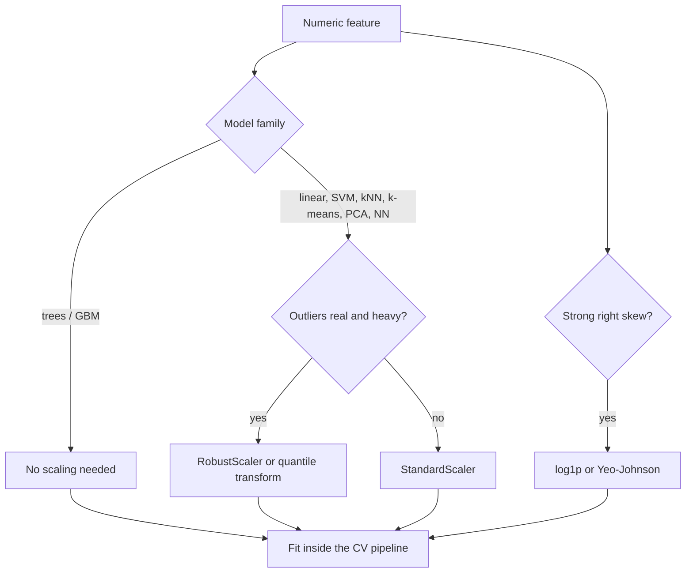

# Feature Scaling and Transforms

## TL;DR
Scaling matters for anything that uses distances, dot products or gradient steps —
kNN, SVM, k-means, PCA, neural nets, and any penalised linear model. It is irrelevant for trees and
tree ensembles, which are invariant to monotone per-feature transforms. Non-linear transforms (log,
Box–Cox, Yeo–Johnson, quantile) are a different tool: they fix skew and heteroscedasticity, which
*does* sometimes help trees indirectly by making the target loss better behaved.

## Intuition
Gradient descent on an objective whose contours are long thin ellipses zig-zags: the step size is
limited by the steepest direction while progress is needed in the flattest. Standardising the
columns makes the ellipses rounder, so the same learning rate goes further. For distance methods the
argument is cruder still — a feature measured in rupees will dominate Euclidean distance over one
measured in years, purely because of units.

## The maths

**Standardisation** ($z$-score): $x' = (x - \mu)/\sigma$ → mean 0, variance 1. Preserves outliers'
relative position, unbounded range.

**Min–max**: $x' = (x - x_{\min})/(x_{\max} - x_{\min})$ → range $[0,1]$. Sensitive to a single
extreme value.

**Robust**: $x' = (x - \text{median})/\text{IQR}$. Use when [[outlier-detection|outliers]] are real
and you want to keep them without letting them set the scale.

**Why conditioning matters.** For ridge / least squares the convergence rate of gradient descent
depends on the condition number $\kappa = \lambda_{\max}/\lambda_{\min}$ of the Hessian
$H = \frac{1}{n} X^\top X$. After $t$ steps,

$$
\|\theta_t - \theta^\star\| \le \Big(\frac{\kappa - 1}{\kappa + 1}\Big)^{t}\,\|\theta_0 - \theta^\star\|
$$

so the number of iterations to a fixed accuracy scales like $O(\kappa \log(1/\epsilon))$ for badly
scaled problems. Standardising columns equalises their variances and typically shrinks $\kappa$ by
orders of magnitude. This is *the* derivation to give when asked "why scale?".

**Why regularisation forces scaling.** The ridge penalty $\lambda\|\beta\|_2^2$ is not
scale-invariant: rescale $x_j \to c\,x_j$ and the fitted $\beta_j \to \beta_j/c$, so the penalty paid
by that feature changes by $c^{-2}$. Unscaled features therefore get arbitrarily different effective
penalties. Same argument for L1. See [[regularization-l1-l2]].

**Box–Cox** (requires $x > 0$):

$$
x^{(\lambda)} =
\begin{cases}
\dfrac{x^{\lambda} - 1}{\lambda}, & \lambda \neq 0\\[6pt]
\ln x, & \lambda = 0
\end{cases}
$$

$\lambda$ is chosen by maximum likelihood under a Gaussian model of the transformed variable.
**Yeo–Johnson** extends it to $x \le 0$ and is the safer default.

**Log1p** on a right-skewed count: $x' = \ln(1+x)$. Turns multiplicative structure into additive and
turns a heavy right tail into something a squared-error loss can live with.

## Diagram



## Code

```python
import numpy as np
from sklearn.datasets import fetch_california_housing
from sklearn.pipeline import Pipeline
from sklearn.preprocessing import StandardScaler, RobustScaler, PowerTransformer
from sklearn.linear_model import Ridge
from sklearn.svm import SVR
from sklearn.model_selection import cross_val_score, KFold
from sklearn.compose import TransformedTargetRegressor

X, y = fetch_california_housing(return_X_y=True)
cv = KFold(5, shuffle=True, random_state=0)

def score(est):
    return cross_val_score(est, X, y, cv=cv,
                           scoring="neg_root_mean_squared_error").mean()

# Scaling is mandatory for SVR: the RBF kernel is a distance in the raw units.
print("SVR raw   :", round(score(SVR()), 3))
print("SVR scaled:", round(score(Pipeline([("s", StandardScaler()), ("m", SVR())])), 3))

# Robust scaling when the column has heavy tails.
print("ridge robust:", round(score(Pipeline([("s", RobustScaler()), ("m", Ridge())])), 3))

# Transform the TARGET, not just the features, when the target is right-skewed.
# TransformedTargetRegressor inverts the transform before scoring, so the RMSE
# stays in the original units — this is the part people get wrong.
tt = TransformedTargetRegressor(
    regressor=Pipeline([("s", StandardScaler()), ("m", Ridge())]),
    func=np.log1p, inverse_func=np.expm1,
)
print("ridge log-target:", round(score(tt), 3))

# Yeo-Johnson on skewed features (handles zeros and negatives, unlike Box-Cox).
yj = Pipeline([("pt", PowerTransformer(method="yeo-johnson")), ("m", Ridge())])
print("ridge yeo-johnson:", round(score(yj), 3))
```

The pipeline wrapper is not stylistic. `StandardScaler().fit(X)` before splitting computes $\mu$ and
$\sigma$ from the validation rows — a mild but real [[data-leakage|leak]] that inflates CV scores,
badly so on small datasets.

## In practice
- **Use it when:** the estimator is distance-, dot-product-, or gradient-based; or the estimator is
  penalised. Skip it for [[decision-trees]], [[random-forest]], [[gradient-boosting]],
  [[xgboost-deep-dive|XGBoost]].
- **Defaults that work:** `StandardScaler` as the default; `RobustScaler` when the column has a fat
  tail you want to keep; `QuantileTransformer(output_distribution="normal")` when the distribution is
  pathological and you do not care about preserving shape; `log1p` for counts and money;
  `PowerTransformer(yeo-johnson)` when you want the transform chosen by likelihood rather than by
  eye.
- **Breaks when:** applied to sparse data with `with_mean=True` — centring destroys sparsity and can
  blow up memory (use `MaxAbsScaler` or `StandardScaler(with_mean=False)`). Also when the serving
  distribution shifts: a scaler fitted in January is wrong in June if the feature drifted, and this
  is silent.
- **Cost / latency:** negligible compute; the operational cost is that $\mu, \sigma$ are model
  parameters that must be versioned and shipped with the artifact.

> [!warning]
> Log-transforming the **target** changes what you are optimising: minimising squared error on
> $\ln y$ minimises relative error on $y$, and back-transforming $\exp(\hat{\mu})$ gives the
> conditional *median*, not the mean. If the business wants an unbiased total, that gap matters —
> a Gaussian-error correction is $\mathbb{E}[y] = \exp(\hat\mu + \hat\sigma^2/2)$.

## Interview angle

**Q. Does scaling help XGBoost?**
No. Trees split on thresholds within a single feature, and any strictly monotone transform of that
feature produces the same ordering, hence the same candidate splits and the same tree. Scaling is a
no-op for accuracy. Two caveats worth mentioning: it can change the histogram binning marginally on
approximate split-finding, and if you are comparing an XGBoost model against a linear baseline in
the same pipeline you still scale for the baseline's sake.

**Q. Why does scaling speed up gradient descent? Give the actual reason.**
The convergence rate depends on the condition number of the Hessian. For least squares that Hessian
is $X^\top X / n$; if one column has variance $10^6$ and another $10^{-2}$, the eigenvalue spread is
enormous, the largest usable step size is set by the largest eigenvalue while progress along the
smallest direction is proportional to it, and you get the classic zig-zag. Standardising equalises
the diagonal and typically cuts $\kappa$ dramatically, so you need $O(\kappa \log 1/\epsilon)$ fewer
iterations.

**Follow-up.** Does Adam make this unnecessary? → It reduces the sensitivity because it adapts a
per-parameter step from the second-moment estimate, so it handles diagonal scale differences well.
It does not fix correlation-induced ill-conditioning, and it does not fix the fact that an L2
penalty on unscaled weights is unequal across features.

**Q. When do you use RobustScaler over StandardScaler?**
When the column has genuine heavy tails that I want to keep as signal — transaction amounts, claim
sizes. The mean and standard deviation are both dragged by the tail, so a z-score puts almost all
the mass in a narrow band and the outliers at ±40. Median and IQR are unaffected by the tail, so the
bulk of the data gets a sensible spread.

**Q. Should you scale one-hot columns?**
Usually no — they are already on a comparable 0/1 scale, and standardising them makes the zeros
non-zero, which destroys sparsity and hurts interpretability of coefficients. The exception is
regularised models where you want the penalty to be comparable across a mix of binary and
continuous features; even there I prefer scaling only the continuous block via `ColumnTransformer`.

## Traps
- **"Scaling improved my random forest."** It did not; you changed something else (a seed, a
  hyperparameter) or you are reading noise.
- **Fitting the scaler on train + test.** Leak. Fit on train, `transform` the rest, always inside a
  `Pipeline`.
- **Min–max scaling on data with outliers.** One extreme value compresses everything else into a
  sliver near zero.
- **Centring sparse matrices.** Turns a 0.1%-dense matrix dense. Use `with_mean=False`.
- **Log-transforming a target and reporting RMSE in log space to the business.** Those units mean
  nothing to them, and back-transformed predictions are medians, not means.
- **Box–Cox on data containing zeros or negatives.** It requires strictly positive input; use
  Yeo–Johnson.
- **Assuming scaling makes a feature Gaussian.** Standardising changes location and scale only.
  Skew and kurtosis are untouched. If you need Gaussianity, that is a power or quantile transform.

## Flashcards
Which model families need feature scaling::Distance-based (kNN, k-means, SVM), dot-product-based (PCA, linear), gradient-trained (NN, linear), and anything penalised. Not trees.
Why scaling accelerates gradient descent::It shrinks the Hessian's condition number kappa; iterations to a fixed accuracy scale like O(kappa log 1/eps).
Why regularised models must be scaled::The L1/L2 penalty is not scale-invariant — rescaling a feature by c changes the penalty it pays by c^-2, so unscaled features get arbitrary effective penalties.
StandardScaler vs RobustScaler::Mean/std vs median/IQR — use robust when heavy tails are genuine signal you want to keep without letting them set the scale.
Box-Cox vs Yeo-Johnson::Box-Cox needs strictly positive input; Yeo-Johnson handles zeros and negatives, so it is the safer default.
What does standardisation NOT do::Make a feature Gaussian — it changes only location and scale, leaving skew and kurtosis intact.
Back-transforming a log-target prediction::exp(mu_hat) is the conditional median; the mean under Gaussian errors is exp(mu_hat + sigma^2/2).

## Related
- [[feature-engineering]]
- [[regularization-l1-l2]]
- [[gradient-descent-variants]]
- [[support-vector-machines]]
- [[k-nearest-neighbours]]
- [[dimensionality-reduction-pca]]
- [[outlier-detection]]
- [[data-leakage]]
