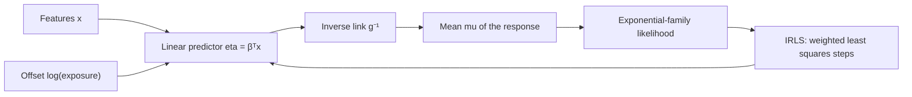

# Generalized Linear Models

## TL;DR
A GLM has three parts: a response distribution from the exponential family, a linear predictor
$\eta = \beta^\top x$, and a link function $g$ with $g(\mathbb{E}[y]) = \eta$. Linear regression is
the identity link with a Gaussian response; logistic is the logit link with Bernoulli; Poisson
regression is the log link for counts. All of them are fitted by the same IRLS algorithm because the
exponential-family structure gives the same score and Hessian shape.

## Intuition
Ordinary least squares assumes the response is unbounded and its noise has constant variance. Counts
are non-negative integers whose variance grows with the mean; proportions live in $[0,1]$; waiting
times are positive and skewed. A GLM keeps the linear predictor — the part you can interpret and
regularise — and changes two things to fit the data type: the scale on which linearity holds (the
link), and how variance relates to the mean (the family).

## The maths

**Exponential family.** A distribution is in the family if its density can be written

$$
p(y \mid \theta, \phi) = \exp\!\left(\frac{y\theta - b(\theta)}{a(\phi)} + c(y,\phi)\right)
$$

with $\theta$ the natural parameter, $\phi$ the dispersion. Two standard identities follow from
differentiating the normalisation:

$$
\mathbb{E}[y] = b'(\theta) = \mu, \qquad \operatorname{Var}(y) = a(\phi)\, b''(\theta) = a(\phi) V(\mu)
$$

so the **variance function** $V(\mu)$ is determined by the family. That is the crux: choosing a
family is choosing a mean–variance relationship.

**Three components of a GLM.**
1. Random: $y_i$ from an exponential-family distribution with mean $\mu_i$.
2. Systematic: $\eta_i = \beta^\top x_i$.
3. Link: $g(\mu_i) = \eta_i$, so $\mu_i = g^{-1}(\eta_i)$.

**Canonical link** is $g$ such that $\eta = \theta$, i.e. $g = (b')^{-1}$. It makes the observed and
expected information coincide, which simplifies the algebra and guarantees a concave log-likelihood.

| Family | Support | Canonical link | $V(\mu)$ | Typical use |
|---|---|---|---|---|
| Gaussian | $\mathbb{R}$ | identity | $1$ | continuous, symmetric errors |
| Bernoulli / Binomial | $\{0,1\}$, counts/$n$ | logit | $\mu(1-\mu)$ | classification |
| Poisson | $\{0,1,2,\dots\}$ | log | $\mu$ | event counts, rates |
| Gamma | $(0,\infty)$ | inverse (log in practice) | $\mu^2$ | positive skewed, claim size |
| Inverse Gaussian | $(0,\infty)$ | $1/\mu^2$ | $\mu^3$ | heavy right tail |
| Tweedie $1<p<2$ | $\{0\}\cup(0,\infty)$ | log | $\mu^{p}$ | zero-inflated positive, pure premium |

**Score and IRLS.** For canonical links the log-likelihood gradient is

$$
\nabla_\beta \ell = \frac{1}{a(\phi)} X^\top (y - \mu)
$$

— the same $X^\top(y-\mu)$ shape as OLS and logistic regression. The Fisher information is
$X^\top W X$ with $W = \operatorname{diag}\big(V(\mu_i)\,(\partial\mu_i/\partial\eta_i)^2\big)$, so
Newton–Raphson is again iteratively reweighted least squares: at each step solve a weighted least
squares problem with working response $z = \eta + (y-\mu)\,\partial\eta/\partial\mu$. One algorithm
fits the whole family, which is the elegant point worth making in an interview.

**Poisson regression in detail.** $y_i \sim \text{Poisson}(\mu_i)$, $\log\mu_i = \beta^\top x_i$.
Log-likelihood (dropping $\log y_i!$):

$$
\ell(\beta) = \sum_i \big(y_i \beta^\top x_i - e^{\beta^\top x_i}\big)
$$

$\nabla\ell = X^\top(y - \mu)$, and the Hessian $-X^\top \operatorname{diag}(\mu) X$ is negative
semidefinite, so the problem is concave — global optimum guaranteed. Coefficients exponentiate to
**rate ratios**: $e^{\beta_j}$ is the multiplicative change in the expected count per unit of $x_j$.

**Offsets.** To model a rate rather than a count — claims per policy-year, clicks per impression —
put the exposure in as a fixed-coefficient term:

$$
\log \mu_i = \log(\text{exposure}_i) + \beta^\top x_i
\quad\Longleftrightarrow\quad
\log\frac{\mu_i}{\text{exposure}_i} = \beta^\top x_i
$$

This is an **offset**, not a feature: its coefficient is pinned to 1. Forgetting it is the classic
count-modelling mistake.

**Overdispersion.** Poisson forces $\operatorname{Var}(y) = \mu$. Real count data almost always has
$\operatorname{Var}(y) > \mu$. Diagnose with the Pearson dispersion statistic

$$
\hat\phi = \frac{1}{n-p}\sum_i \frac{(y_i - \hat\mu_i)^2}{\hat\mu_i}
$$

$\hat\phi \gg 1$ means overdispersion. The point estimates $\hat\beta$ stay consistent but the
standard errors are too small — so p-values are wrong. Fixes: quasi-Poisson (scale the SEs by
$\sqrt{\hat\phi}$), or negative binomial, which adds a dispersion parameter giving
$\operatorname{Var}(y) = \mu + \mu^2/k$.

## Diagram



## Code

```python
import numpy as np
import statsmodels.api as sm

rng = np.random.RandomState(0)
n = 3000
exposure = rng.gamma(shape=2.0, scale=1.0, size=n)        # policy-years
x1 = rng.normal(size=n)
x2 = rng.binomial(1, 0.4, size=n)
rate = np.exp(-1.0 + 0.6 * x1 - 0.4 * x2)                  # claims per unit exposure
y = rng.poisson(rate * exposure)

X = sm.add_constant(np.column_stack([x1, x2]))

# Poisson GLM with a log link and an exposure offset (coefficient pinned to 1).
pois = sm.GLM(y, X, family=sm.families.Poisson(),
              offset=np.log(exposure)).fit()
print(pois.summary().tables[1])
print("rate ratios:", np.round(np.exp(pois.params), 3))

# Overdispersion check: Pearson chi2 / residual df should be near 1.
phi = pois.pearson_chi2 / pois.df_resid
print("dispersion:", round(phi, 3))

# If phi >> 1, use negative binomial instead.
nb = sm.GLM(y, X, family=sm.families.NegativeBinomial(alpha=1.0),
            offset=np.log(exposure)).fit()
print("NB loglike:", round(nb.llf, 1), " Poisson loglike:", round(pois.llf, 1))
```

`statsmodels` is the right tool when you want inference (standard errors, dispersion, deviance);
scikit-learn's `PoissonRegressor`, `GammaRegressor` and `TweedieRegressor` are the right tools when
you want a regularised predictor inside a pipeline.

## In practice
- **Use it when:** the response is a count, a rate, a strictly positive skewed amount, a proportion,
  or a binary outcome — i.e. almost every insurance, marketing-response, demand and reliability
  problem. Also when someone wants interpretable multiplicative effects.
- **Defaults that work:** counts → Poisson with a log link and an exposure offset, then check
  dispersion and escalate to negative binomial. Positive skewed amounts (claim severity, order
  value) → Gamma with log link, or log-transform plus OLS if you only need prediction and can live
  with the retransformation bias. Zero-inflated continuous (pure premium, revenue per user) →
  Tweedie with $p$ between 1 and 2.
- **Breaks when:** the mean–variance relation is wrong for your data (check residual-vs-fitted
  spread); there is excess structural zero inflation that a Tweedie cannot absorb (use a hurdle or
  zero-inflated model); relationships are strongly nonlinear without splines; you need interactions
  you have not specified.
- **Cost / latency:** IRLS converges in a handful of iterations; fits are fast and prediction is a
  dot product plus one exponential. Gradient-boosted trees with a Poisson or Tweedie objective
  (`objective="count:poisson"` or `"reg:tweedie"` in XGBoost) give you the same likelihood with
  learned nonlinearity — a very common production compromise.

## Interview angle

**Q. What are the three components of a GLM?**
Random component (exponential-family response distribution), systematic component (linear predictor
$\beta^\top x$), and the link function connecting $g(\mathbb{E}[y]) = \eta$. Naming all three, and
saying that the family fixes the mean–variance relationship, is the answer that lands.

**Follow-up.** *So what is the canonical link and why care?* → The link making $\eta$ equal the
natural parameter $\theta$. It makes observed and expected Fisher information coincide and
guarantees a concave log-likelihood, so IRLS is well behaved. You are not obliged to use it — a log
link on a Gamma is standard practice even though the canonical link is the inverse.

**Q. You are modelling number of support tickets per account per month. Which model?**
Poisson regression with a log link and $\log(\text{account-months})$ as an offset, so you are
modelling a rate. Then check the Pearson dispersion; real ticket data is nearly always overdispersed
because accounts differ in ways you have not measured, so expect to move to negative binomial. Report
coefficients as rate ratios.

**Follow-up.** *What if 60% of accounts have zero tickets?* → Check whether Poisson/NB already
predicts that many zeros; NB often does. If not — if there is a structural "never files a ticket"
subpopulation — use a zero-inflated or hurdle model, which is a mixture of a zero process and a
count process, and say which of the two the business cares about.

**Q. Why not just log-transform $y$ and run OLS on counts?**
Zeros break $\log y$ (and $\log(y+1)$ is an arbitrary distortion), the errors will not be
homoscedastic on the log scale, and back-transforming $\mathbb{E}[\log y]$ gives you the geometric
mean, not $\mathbb{E}[y]$ — a systematic underestimate. A log-link Poisson or Gamma models
$\log \mathbb{E}[y]$ directly, which is the quantity you want.

**Q. How is logistic regression a GLM?**
Bernoulli family, logit canonical link, $V(\mu) = \mu(1-\mu)$. The IRLS weights $p(1-p)$ are exactly
the $W$ matrix from the Newton step in [[logistic-regression]] — the same machinery, instantiated.

**Q. When would you use a Tweedie loss in practice?**
Pure premium or revenue-per-customer: an outcome that is exactly zero for most rows and
continuous-positive otherwise. Tweedie with $1<p<2$ is a compound Poisson–Gamma, which is literally
"a Poisson number of Gamma-sized events" — the generative story matches the business. XGBoost and
LightGBM both support it, which is the usual production route.

## Traps
- **Omitting the exposure offset.** Modelling raw counts when exposures differ makes the model learn
  "big accounts have more tickets", which you already knew.
- **Putting exposure in as a regular feature.** Then its coefficient is estimated rather than pinned
  at 1, which changes the interpretation from a rate model to something with no clean meaning. Use
  it as an offset unless you specifically want to test whether the coefficient is 1.
- **Ignoring overdispersion.** $\hat\beta$ is still consistent but the standard errors are too small,
  so every significance claim is inflated.
- **Confusing the link with a transform of $y$.** A log link models $\log \mathbb{E}[y]$; taking
  $\log y$ first models $\mathbb{E}[\log y]$. They differ by Jensen's inequality.
- **Assuming a GLM handles nonlinearity.** It is linear in $\eta$; you still need splines,
  interactions or buckets.
- **Using $R^2$ to judge a GLM.** Use deviance, AIC, or the appropriate held-out likelihood.
- **Reaching for Poisson on a bounded proportion.** For proportions, use binomial with weights or a
  beta regression, not Poisson.

## Flashcards
Three components of a GLM::Exponential-family random component, linear predictor βᵀx, and a link function with g(E[y]) = η.
What does the family choice determine::The mean–variance relationship V(μ): Gaussian 1, Bernoulli μ(1−μ), Poisson μ, Gamma μ², Tweedie μ^p.
Canonical link definition::The link making η equal the natural parameter θ, i.e. g = (b')⁻¹; it makes the log-likelihood concave and IRLS clean.
Poisson regression coefficient interpretation::exp(β_j) is a rate ratio — the multiplicative change in the expected count per unit of x_j.
What is an offset::A term with coefficient fixed at 1, e.g. log(exposure), turning a count model into a rate model.
How to detect overdispersion::Pearson chi-squared divided by residual degrees of freedom well above 1.
Consequence of overdispersion::Coefficients stay consistent but standard errors are understated, so p-values are too optimistic.
Negative binomial variance::μ + μ²/k — Poisson plus a quadratic term absorbing extra dispersion.
Log link vs log transform::A log link models log E[y]; log-transforming y models E[log y], which back-transforms to a geometric mean.
When to use Tweedie::A response that is exactly zero for many rows and continuous-positive otherwise — compound Poisson–Gamma, e.g. pure premium.

## Related
- [[linear-regression]]
- [[logistic-regression]]
- [[maximum-likelihood-estimation]]
- [[common-probability-distributions]]
- [[regression-metrics]]
- [[gradient-boosting]]
- [[moc-classical-ml]]
