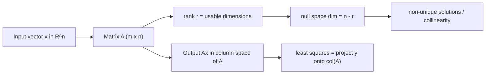

# Linear Algebra Essentials

## TL;DR
A matrix is a linear map, not a grid of numbers. Almost every ML object is one: a dense layer is $Wx+b$, a batch is a matrix, an embedding table is a lookup into a matrix, and least squares is a projection onto a column space. Rank tells you how much information a matrix can actually carry; everything about collinearity, PCA, and LoRA falls out of that.

## Intuition
Think of $A \in \mathbb{R}^{m \times n}$ as a machine that eats an $n$-vector and spits out an $m$-vector, and it can only do two things: stretch and rotate (no bending, no shifting). The **columns of $A$** are where the standard basis vectors land. So $Ax$ is just "mix the columns of $A$ using the weights in $x$". Every reachable output lives in the span of those columns — the **column space**. If two columns are copies of each other, one of them buys you nothing, and that is exactly what "collinear features" means.

## The maths

**Matrix–vector product as a column combination.** For $A = [\,a_1 \; a_2 \; \dots \; a_n\,]$ with $a_j \in \mathbb{R}^m$,

$$
Ax = \sum_{j=1}^{n} x_j a_j .
$$

**Shapes.** $A \in \mathbb{R}^{m\times n}$, $B \in \mathbb{R}^{n\times p}$ gives $AB \in \mathbb{R}^{m\times p}$; the inner dimensions must match. Cost is $O(mnp)$ flops. Matrix multiplication is associative but **not** commutative, and $(AB)^\top = B^\top A^\top$.

**Rank.** $\operatorname{rank}(A)$ is the dimension of the column space, equal to the dimension of the row space. For $A \in \mathbb{R}^{m\times n}$, $\operatorname{rank}(A) \le \min(m,n)$. Rank-deficiency ($\operatorname{rank}(A) < \min(m,n)$) is the formal statement of "my features are redundant".

**Rank–nullity.** With $\mathcal{N}(A) = \{x : Ax = 0\}$,

$$
\operatorname{rank}(A) + \dim \mathcal{N}(A) = n .
$$

If the null space is non-trivial, the solution to $Ax=b$ is not unique — add any null-space vector and you get another solution. That is why an unregularised linear model on perfectly collinear features has infinitely many equally-good weight vectors.

**Inverse and determinant.** A square $A$ is invertible iff $\det(A)\neq 0$ iff $\operatorname{rank}(A)=n$ iff no eigenvalue is zero. $\det$ is the signed volume scaling factor of the map.

**Special matrices worth naming.**

| Name | Definition | Where it shows up |
| --- | --- | --- |
| Symmetric | $A = A^\top$ | Covariance, Gram matrix $X^\top X$, Hessian |
| Orthogonal | $Q^\top Q = I$ | Rotations, SVD factors, orthogonal init |
| Positive semi-definite | $x^\top A x \ge 0 \; \forall x$ | Covariance, kernels, convexity test |
| Diagonal | zero off-diagonal | Scaling, feature-wise ops, $\Sigma$ in SVD |

**Least squares — the derivation that gets asked.** Minimise $L(w) = \lVert Xw - y\rVert_2^2$ with $X\in\mathbb{R}^{n\times d}$, $y\in\mathbb{R}^n$:

$$
\begin{aligned}
L(w) &= (Xw-y)^\top (Xw-y) = w^\top X^\top X w - 2 y^\top X w + y^\top y,\\
\nabla_w L &= 2X^\top X w - 2X^\top y \overset{!}{=} 0,\\
\Rightarrow \quad & X^\top X\, \hat w = X^\top y \quad\text{(normal equations)},\\
\hat w &= (X^\top X)^{-1} X^\top y \quad\text{if } X^\top X \text{ is invertible.}
\end{aligned}
$$

Geometrically $X\hat w = P y$ where $P = X(X^\top X)^{-1}X^\top$ is the **orthogonal projection** onto the column space of $X$. The residual $y - X\hat w$ is orthogonal to every feature column — that is literally what $X^\top(y - X\hat w)=0$ says.

$X^\top X$ is singular exactly when features are linearly dependent ($\operatorname{rank}(X) < d$), which includes the $n < d$ case. Ridge fixes it: $(X^\top X + \lambda I)$ is invertible for any $\lambda > 0$ because it shifts every eigenvalue up by $\lambda$. See [[regularization-l1-l2]].

**Worked numeric example you can check by hand.** Fit an intercept and slope to $(1,1),(2,2),(3,2)$.

$$
X = \begin{bmatrix}1&1\\1&2\\1&3\end{bmatrix},\quad
y=\begin{bmatrix}1\\2\\2\end{bmatrix},\quad
X^\top X = \begin{bmatrix}3&6\\6&14\end{bmatrix},\quad
X^\top y = \begin{bmatrix}5\\11\end{bmatrix}.
$$

Solving $3a+6b=5$, $6a+14b=11$ gives $b = 0.5$, $a = 2/3$. So $\hat y = 0.667 + 0.5x$, residuals $(-0.167, 0.333, -0.167)$ which sum to $0$ — the orthogonality condition against the intercept column.

## Diagram



## Code

```python
import numpy as np

rng = np.random.default_rng(0)

# 1. Normal equations vs lstsq on the hand-worked example
X = np.array([[1., 1.], [1., 2.], [1., 3.]])
y = np.array([1., 2., 2.])

w_normal = np.linalg.solve(X.T @ X, X.T @ y)
w_lstsq, *_ = np.linalg.lstsq(X, y, rcond=None)
print(w_normal, w_lstsq)          # [0.6667 0.5] twice

# 2. Residual is orthogonal to every column of X
resid = y - X @ w_normal
print(np.allclose(X.T @ resid, 0))          # True

# 3. Projection matrix idempotency: P @ P == P
P = X @ np.linalg.inv(X.T @ X) @ X.T
print(np.allclose(P @ P, P), np.allclose(P, P.T))   # True True
print(np.trace(P))                                  # 2.0 == rank(X)

# 4. Collinearity kills invertibility, ridge rescues it
Xc = np.c_[X, 2 * X[:, 1]]                 # third column = 2 * second
print(np.linalg.matrix_rank(Xc))           # 2, not 3
lam = 1e-2
w_ridge = np.linalg.solve(Xc.T @ Xc + lam * np.eye(3), Xc.T @ y)
print(np.allclose(Xc @ w_ridge, X @ w_normal, atol=1e-2))   # fits the same

# 5. (AB)^T == B^T A^T  and  cost of ordering matters
A = rng.normal(size=(200, 3)); B = rng.normal(size=(3, 500))
print(np.allclose((A @ B).T, B.T @ A.T))   # True
```

## In practice
- **Use it when:** any time you are debugging shapes, reasoning about why a linear model is unstable, sizing a layer's parameter count ($d_{in}\times d_{out} + d_{out}$), or estimating FLOPs. A batched dense layer is one `matmul`; a transformer block is about six of them.
- **Defaults that work:** never invert a matrix to solve a system — use `np.linalg.solve` or `lstsq` (QR/SVD-based), which are more numerically stable and cheaper. Prefer `A @ b` over forming `inv(A) @ b`.
- **Breaks when:** the Gram matrix $X^\top X$ is ill-conditioned. Condition number $\kappa = \sigma_{\max}/\sigma_{\min}$ roughly multiplies your input error; $\kappa \sim 10^8$ in float32 means you have lost all your significant digits. Standardise features first (see [[feature-scaling-and-transforms]]).
- **Cost / latency:** dense $m\times n$ by $n\times p$ is $2mnp$ FLOPs. A 7B transformer forward pass is roughly $2 \times 7\text{B} = 14$ GFLOPs per token — that estimate comes straight from counting matmuls.

## Interview angle

**Q. What does it mean for a matrix to be rank-deficient, and why should a data scientist care?**
It means the columns are linearly dependent — some feature is an exact linear combination of others. Practically: $X^\top X$ is singular, the normal equations have infinitely many solutions, coefficient estimates become arbitrary and unstable, and any interpretation of individual coefficients is meaningless. One-hot encoding all $k$ levels of a categorical plus an intercept is the classic accidental cause (the dummy-variable trap).

**Follow-up.** *How do you fix it without dropping features?* → Add L2 regularisation. $X^\top X + \lambda I$ has eigenvalues $\sigma_i^2 + \lambda > 0$, so it is always invertible, and the solution becomes the unique minimum-norm-penalised one. Alternatively use the pseudo-inverse, which picks the minimum-$\ell_2$-norm solution among the infinite set.

**Q. Why do we never compute `inv(A) @ b` in production?**
It is both slower ($O(n^3)$ with a bigger constant, and you then still do a matvec) and numerically worse — forming the inverse amplifies rounding error. LU/QR-based `solve` gets the same answer with better backward stability. For non-square or rank-deficient systems, `lstsq` uses SVD and degrades gracefully instead of exploding.

**Q. A dense layer maps 1024 → 4096. How many parameters, and how many FLOPs for a batch of 32?**
Parameters: $1024\times 4096 + 4096 = 4{,}198{,}400$. FLOPs: roughly $2 \times 32 \times 1024 \times 4096 \approx 2.7\times10^8$ (multiply–accumulate counted as two ops). That arithmetic is the entire basis of transformer cost estimates in [[llm-scaling-laws]].

**Follow-up.** *Where does the memory actually go during training?* → Weights + gradients + optimiser state + activations. Adam holds two extra moments, so fp32 training is roughly 16 bytes per parameter before activations. See [[mixed-precision-and-memory]].

**Q. Explain least squares geometrically in one sentence.**
$\hat y$ is the orthogonal projection of $y$ onto the subspace spanned by your feature columns; the residual is the part of $y$ your features cannot reach, and it is perpendicular to all of them.

## Traps
- **"Rank is the number of non-zero rows."** Wrong as stated — it is the number of linearly independent rows (equivalently columns), which you read off from row echelon form or from the count of non-negligible singular values. Use `np.linalg.matrix_rank`, which thresholds singular values, not a literal zero test.
- **"$AB = BA$."** Almost never. Even when both products are defined they usually differ, and this breaks people's derivations of backprop.
- **"A tall matrix has no inverse so I cannot solve $Ax=b$."** You cannot solve it exactly, but least squares gives the best approximation, and that is what regression is.
- **"$X^\top X$ being invertible means my model is fine."** It can be technically invertible and numerically garbage. Check the condition number, not just `det != 0`.
- **Confusing element-wise with matrix product.** In NumPy `A * B` is Hadamard, `A @ B` is matrix multiply. In backprop derivations the chain rule for element-wise activations produces Hadamard products — mixing them up silently produces wrong shapes or, worse, right shapes and wrong values when everything is square.
- **Forgetting that broadcasting hides bugs.** `(n,1)` versus `(n,)` in NumPy changes the result of `a - b` from a vector to an $n\times n$ matrix without an error.

## Flashcards
What does $Ax$ mean in terms of the columns of $A$?::A linear combination of $A$'s columns weighted by the entries of $x$.
State the rank–nullity theorem for $A \in \mathbb{R}^{m\times n}$.::$\operatorname{rank}(A) + \dim \mathcal{N}(A) = n$.
Write the normal equations for least squares.::$X^\top X \hat w = X^\top y$, so $\hat w = (X^\top X)^{-1}X^\top y$ when the Gram matrix is invertible.
Why is the least-squares residual orthogonal to the feature columns?::Because the first-order condition is $X^\top(y - X\hat w) = 0$, which is exactly orthogonality to every column.
When is $X^\top X$ singular?::When $\operatorname{rank}(X) < d$ — collinear features, or fewer rows than columns.
How does ridge make $X^\top X$ invertible?::It adds $\lambda I$, shifting every eigenvalue to $\sigma_i^2 + \lambda > 0$.
What is $(AB)^\top$?::$B^\top A^\top$ — the order reverses.
Parameter count of a dense layer $d_{in}\to d_{out}$ with bias?::$d_{in}d_{out} + d_{out}$.
Definition of a positive semi-definite matrix?::Symmetric with $x^\top A x \ge 0$ for all $x$; equivalently all eigenvalues $\ge 0$.

## Related
[[eigen-decomposition-and-svd]] · [[vector-norms-and-distances]] · [[matrix-calculus-and-gradients]] · [[linear-regression]] · [[regularization-l1-l2]] · [[dimensionality-reduction-pca]] · [[numpy-essentials]] · [[moc-maths]] · [[qbank-maths]]
