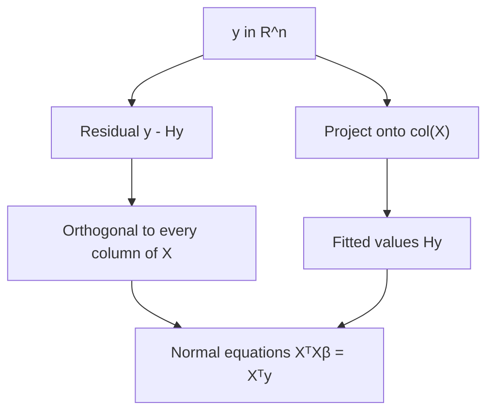

# Linear Regression

## TL;DR
OLS minimises the sum of squared errors and has the closed-form solution
$\hat\beta = (X^\top X)^{-1}X^\top y$, which is the orthogonal projection of $y$ onto the column
space of $X$. Under the Gauss–Markov conditions it is the best linear unbiased estimator. It fails
when $X^\top X$ is near-singular — collinearity — and ridge fixes that by adding $\lambda I$, which
is both a numerical and a statistical fix.

## Intuition
You have a cloud of points and a subspace spanned by your features. The fitted values are the
shadow of $y$ cast perpendicularly onto that subspace; the residual is the part of $y$ that no
combination of features can reach. "Perpendicular" is the entire content of the normal equations:
the residual must be orthogonal to every feature, otherwise you could reduce the error by moving
along that feature.

## The maths

**Setup.** $X \in \mathbb{R}^{n \times p}$ (first column of ones for the intercept),
$y \in \mathbb{R}^n$, $\beta \in \mathbb{R}^p$. Minimise

$$
S(\beta) = \lVert y - X\beta \rVert_2^2 = (y - X\beta)^\top (y - X\beta)
$$

**Derivation of the normal equation.** Expand:

$$
S(\beta) = y^\top y - 2\beta^\top X^\top y + \beta^\top X^\top X \beta
$$

Differentiate with respect to $\beta$ (see [[matrix-calculus-and-gradients]]; the middle term gives
$-2X^\top y$, the quadratic gives $2X^\top X\beta$ since $X^\top X$ is symmetric):

$$
\nabla_\beta S = -2X^\top y + 2X^\top X \beta \;\stackrel{!}{=}\; 0
\quad\Longrightarrow\quad
\boxed{X^\top X \hat\beta = X^\top y}
$$

and if $X^\top X$ is invertible, $\hat\beta = (X^\top X)^{-1}X^\top y$. The Hessian is
$\nabla^2 S = 2X^\top X \succeq 0$, so $S$ is convex and this stationary point is a global minimum —
no local optima, ever ([[convexity-and-optimization-basics]]).

**Geometric reading.** $X^\top(y - X\hat\beta) = 0$ says the residual is orthogonal to every column
of $X$. The fitted values are $\hat{y} = H y$ with hat matrix $H = X(X^\top X)^{-1}X^\top$, which is
symmetric, idempotent ($H^2 = H$) and projects onto $\operatorname{col}(X)$. Its diagonal entries
$h_{ii}$ are leverages, and $\operatorname{tr}(H) = p$.

**Gauss–Markov.** Assume:
1. **Linearity in parameters:** $y = X\beta + \varepsilon$.
2. **Strict exogeneity:** $\mathbb{E}[\varepsilon \mid X] = 0$.
3. **Homoscedasticity and no autocorrelation:** $\operatorname{Var}(\varepsilon \mid X) = \sigma^2 I$.
4. **Full column rank:** $\operatorname{rank}(X) = p$.

Then $\hat\beta$ is unbiased, $\mathbb{E}[\hat\beta] = \beta$, with

$$
\operatorname{Var}(\hat\beta \mid X) = \sigma^2 (X^\top X)^{-1}
$$

and it is **BLUE** — minimum variance among all *linear unbiased* estimators. Note what is not
assumed: normality of $\varepsilon$. Normality is needed only for exact t and F inference in small
samples; for large $n$ the CLT covers it ([[central-limit-theorem]]). Note also the two words that
carry all the weight: **linear** and **unbiased**. Ridge is biased and beats OLS on MSE — no
contradiction.

**Why collinearity kills OLS.** With SVD $X = UDV^\top$,

$$
\operatorname{Var}(\hat\beta) = \sigma^2 (X^\top X)^{-1} = \sigma^2 V D^{-2} V^\top
= \sigma^2 \sum_{j=1}^{p} \frac{v_j v_j^\top}{d_j^{2}}
$$

A near-collinear direction has $d_j \approx 0$, so its variance term $\sigma^2/d_j^2$ explodes.
Symptoms: huge coefficients of opposite sign on correlated features, coefficients that swing wildly
when a row is added or removed, high $R^2$ with no individually significant coefficient. The
diagnostic is the variance inflation factor

$$
\mathrm{VIF}_j = \frac{1}{1 - R_j^2}
$$

where $R_j^2$ is from regressing $x_j$ on all the other predictors. VIF above ~5–10 is the usual
flag. Crucially, collinearity does **not** hurt prediction much — it wrecks *interpretation of
individual coefficients* and makes the fit unstable.

**Ridge as the fix.**

$$
\hat\beta_{\text{ridge}} = (X^\top X + \lambda I)^{-1} X^\top y
$$

$X^\top X$ is positive semidefinite, so $X^\top X + \lambda I$ has eigenvalues
$d_j^2 + \lambda > 0$ for $\lambda > 0$ — always invertible, even when $p > n$. Statistically the
variance term becomes $\sigma^2 \sum_j d_j^2/(d_j^2+\lambda)^2 \cdot v_jv_j^\top$, bounded even as
$d_j \to 0$, at the cost of bias $-\lambda(X^\top X + \lambda I)^{-1}\beta$. There provably exists
$\lambda > 0$ with lower total MSE than OLS. Full treatment in [[regularization-l1-l2]].

**Maximum likelihood equivalence.** If $\varepsilon \sim \mathcal{N}(0, \sigma^2 I)$ then

$$
\log L(\beta) = -\frac{n}{2}\log(2\pi\sigma^2) - \frac{1}{2\sigma^2}\lVert y - X\beta\rVert_2^2
$$

so maximising likelihood is minimising SSE — OLS *is* MLE under Gaussian noise
([[maximum-likelihood-estimation]]). That is the honest answer to "why squared error?": it is the
log-likelihood of Gaussian noise, which also explains why squared error is the wrong loss when
errors are heavy-tailed.

**How it is actually computed.** Never by inverting $X^\top X$ — that squares the condition number.
Libraries use QR decomposition or, for rank-deficient problems, the SVD-based pseudoinverse
(`numpy.linalg.lstsq`, scikit-learn's `LinearRegression`). For $n$ in the hundreds of millions,
switch to SGD or a distributed solver ([[gradient-descent-variants]], [[pyspark-essentials]]).

## Diagram



## Code

```python
import numpy as np
from sklearn.linear_model import LinearRegression, Ridge

rng = np.random.RandomState(0)
n = 200
x1 = rng.normal(size=n)
x2 = x1 + rng.normal(0, 0.01, n)          # near-duplicate -> severe collinearity
x3 = rng.normal(size=n)
X = np.column_stack([x1, x2, x3])
y = 2 * x1 + 0 * x2 + 1.5 * x3 + rng.normal(0, 0.5, n)

# 1. Normal equation by hand, with an intercept column.
Xd = np.column_stack([np.ones(n), X])
beta = np.linalg.solve(Xd.T @ Xd, Xd.T @ y)         # solve, never inv()
print("normal eq :", np.round(beta, 3))
print("lstsq     :", np.round(np.linalg.lstsq(Xd, y, rcond=None)[0], 3))

# 2. Collinearity: condition number and VIF.
print("cond(XtX) :", f"{np.linalg.cond(Xd.T @ Xd):.3e}")
def vif(X, j):
    from sklearn.linear_model import LinearRegression as LR
    others = np.delete(X, j, axis=1)
    r2 = LR().fit(others, X[:, j]).score(others, X[:, j])
    return 1.0 / max(1e-12, 1 - r2)
print("VIFs      :", [round(vif(X, j), 1) for j in range(X.shape[1])])

# 3. Instability: refit on a bootstrap resample and watch x1/x2 swap.
idx = rng.choice(n, n, replace=True)
print("OLS  full :", np.round(LinearRegression().fit(X, y).coef_, 2))
print("OLS  boot :", np.round(LinearRegression().fit(X[idx], y[idx]).coef_, 2))
print("Ridge full:", np.round(Ridge(alpha=1.0).fit(X, y).coef_, 2))
print("Ridge boot:", np.round(Ridge(alpha=1.0).fit(X[idx], y[idx]).coef_, 2))
```

OLS splits the $x_1$ effect arbitrarily between the two twins and the split flips between resamples;
ridge shares it stably. That contrast is the demo to reach for when an interviewer asks what
collinearity does.

## In practice
- **Use it when:** you need an interpretable baseline, coefficients with confidence intervals, or a
  model that extrapolates linearly. On tabular problems it is also the honest baseline that stops a
  team claiming a boosted model "works" when it beats nothing.
- **Defaults that work:** standardise features, use ridge with $\lambda$ tuned by CV rather than raw
  OLS whenever $p$ is more than a handful, and check residual plots before trusting any p-value.
  For heteroscedastic errors use robust (HC3/sandwich) standard errors rather than abandoning OLS.
- **Breaks when:** the relationship is nonlinear (add splines or interactions, or switch to
  [[gradient-boosting]]); errors are heavy-tailed or contain outliers (squared error is not robust —
  consider Huber loss); errors are correlated across rows (time series, clustered data) so the
  standard errors are wrong even though $\hat\beta$ may be fine; $p > n$ without regularisation.
- **Cost / latency:** $O(np^2 + p^3)$ to fit, $O(p)$ per prediction. It is the cheapest thing you
  will ever serve, which is why it is still everywhere in real-time systems.

## Interview angle

**Q. Derive the normal equation.**
Write $S(\beta) = (y-X\beta)^\top(y-X\beta) = y^\top y - 2\beta^\top X^\top y + \beta^\top X^\top X
\beta$; set $\nabla_\beta S = -2X^\top y + 2X^\top X\beta = 0$ to get $X^\top X\hat\beta = X^\top y$.
Add that the Hessian $2X^\top X$ is PSD so the problem is convex and this is the global minimum, and
that geometrically the condition says the residual is orthogonal to the column space.

**Follow-up.** *What if $X^\top X$ is singular?* → The solution set is an affine subspace rather than
a point — infinitely many $\hat\beta$ give the same fitted values. Libraries return the minimum-norm
solution via the pseudoinverse. If you need a unique, stable answer, add $\lambda I$ (ridge) or drop
redundant columns.

**Q. State the Gauss–Markov assumptions and what they buy you.**
Linearity in parameters, $\mathbb{E}[\varepsilon\mid X]=0$, constant variance with no autocorrelation,
full column rank. They buy: OLS is unbiased and has minimum variance among linear unbiased
estimators. Normality is *not* among them — it is only needed for exact small-sample t/F inference.

**Follow-up.** *Then how can ridge beat OLS?* → Gauss–Markov restricts to *unbiased* estimators.
Ridge is biased, so it is outside the competition, and trading a little bias for a large variance
reduction lowers total MSE. There always exists a $\lambda>0$ doing so.

**Q. What does multicollinearity do, and how do you detect and handle it?**
It inflates coefficient variance as $\sigma^2/d_j^2$ along near-degenerate directions, producing
large unstable coefficients — often with nonsensical signs — while leaving predictive accuracy
largely intact. Detect with VIF ($1/(1-R_j^2)$), the condition number of $X^\top X$, or coefficient
instability across bootstrap resamples. Handle by dropping or combining redundant features, PCA on
the correlated block, or ridge. If you only care about prediction, you may reasonably do nothing.

**Q. Why squared error rather than absolute error?**
Squared error is the negative log-likelihood of Gaussian noise, it is differentiable everywhere, and
it yields a closed form. Absolute error estimates the conditional median, is robust to outliers, and
has no closed form. Pick by what you want: mean vs median, and how heavy the tails are. See
[[regression-metrics]].

**Q. How do you interpret a coefficient?**
The expected change in $y$ for a one-unit change in $x_j$ *holding the other predictors fixed* — a
clause that is meaningless when predictors are collinear, and which is not a causal claim unless the
design justifies it ([[causal-inference-basics]]). With a log-transformed target, a coefficient
$\beta$ means roughly a $100\beta\%$ change in $y$ for small $\beta$.

## Traps
- **Computing $(X^\top X)^{-1}$ explicitly.** Numerically poor — it squares the condition number.
  Use `solve`, QR or `lstsq`.
- **Claiming normality is a Gauss–Markov assumption.** It is not; only mean-zero, homoscedastic,
  uncorrelated errors with full rank.
- **Reading p-values without checking residuals.** Heteroscedasticity or autocorrelation leaves
  $\hat\beta$ roughly fine but makes the standard errors wrong, so every significance claim is void.
- **Treating high $R^2$ as model quality.** $R^2$ never decreases when you add a feature; use
  adjusted $R^2$, or better, held-out error.
- **Interpreting coefficients causally.** Observational coefficients are associations under an
  assumed adjustment set.
- **Forgetting that adding a collinear column does not break prediction.** People delete features
  in a panic; if the goal is prediction, collinearity is mostly a non-issue.
- **Extrapolating far outside the training range.** Linear models extrapolate confidently and
  wrongly; trees, by contrast, refuse to extrapolate at all.
- **Fitting OLS on a target with a long right tail without a transform.** A log or Box–Cox transform
  often fixes both heteroscedasticity and the influence of a few huge values —
  [[feature-scaling-and-transforms]].

## Flashcards
Normal equation::XᵀXβ̂ = Xᵀy, so β̂ = (XᵀX)⁻¹Xᵀy when XᵀX is invertible.
Why is the OLS objective guaranteed to have a global minimum::Its Hessian 2XᵀX is positive semidefinite, so SSE is convex.
Geometric meaning of the normal equations::The residual is orthogonal to the column space of X; ŷ = Hy is the orthogonal projection.
Gauss–Markov assumptions::Linear in parameters, E[ε|X]=0, Var(ε|X)=σ²I (homoscedastic, uncorrelated), X full column rank.
What Gauss–Markov concludes::OLS is BLUE — minimum variance among linear unbiased estimators. Normality is not assumed.
Variance of the OLS estimator::σ²(XᵀX)⁻¹ = σ² Σ_j v_j v_jᵀ / d_j² — blows up along near-collinear directions.
VIF definition and flag::VIF_j = 1/(1 − R_j²) from regressing x_j on the others; above roughly 5–10 signals collinearity.
Ridge closed form and why it always exists::β̂ = (XᵀX + λI)⁻¹Xᵀy; eigenvalues become d_j²+λ > 0, so the matrix is invertible even when p > n.
Why squared error::It is the negative log-likelihood of Gaussian noise, so OLS equals MLE under that model.
Effect of collinearity on prediction::Little — it damages coefficient stability and interpretation, not predictive accuracy.

## Related
- [[regularization-l1-l2]]
- [[logistic-regression]]
- [[generalized-linear-models]]
- [[maximum-likelihood-estimation]]
- [[eigen-decomposition-and-svd]]
- [[matrix-calculus-and-gradients]]
- [[regression-metrics]]
- [[moc-classical-ml]]
