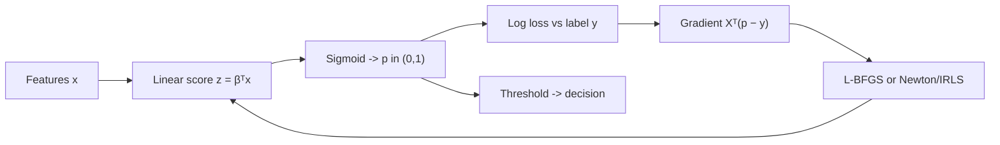

# Logistic Regression

## TL;DR
Logistic regression models the **log-odds** as a linear function of the features, which is what makes
it a linear model despite the sigmoid. Fitting maximises the Bernoulli likelihood, equivalently
minimises log loss; there is no closed form because the score equations are nonlinear in $\beta$, but
the loss is convex with a positive semidefinite Hessian so Newton/IRLS or L-BFGS converges to the
global optimum. Coefficients exponentiate to odds ratios — the reason it survives in credit,
healthcare and regulated fintech.

## Intuition
You want a probability, so you need something bounded in $(0,1)$; a linear function is not. Rather
than squashing the output arbitrarily, transform the *target scale*: odds $p/(1-p)$ live in
$(0,\infty)$, and log-odds live in $(-\infty,\infty)$ — exactly the range a linear predictor
produces. Model the log-odds linearly and invert to get the sigmoid. The sigmoid is a consequence,
not an assumption.

## The maths

**Model.** With $z = \beta^\top x$ (intercept folded into $x$):

$$
\log\frac{p}{1-p} = \beta^\top x
\qquad\Longleftrightarrow\qquad
p = \sigma(z) = \frac{1}{1 + e^{-z}}
$$

Invert the first to get the second: $p/(1-p) = e^{z} \Rightarrow p = e^z/(1+e^z) = 1/(1+e^{-z})$.

**Where the log-odds form comes from.** It is not arbitrary. If the two class-conditional densities
are exponential-family with a shared dispersion — Gaussians with a common covariance, for instance —
then by Bayes' theorem

$$
\log\frac{P(y=1\mid x)}{P(y=0\mid x)}
= \log\frac{p(x\mid y=1)}{p(x\mid y=0)} + \log\frac{\pi_1}{\pi_0}
$$

and for shared-covariance Gaussians the quadratic terms cancel, leaving a linear function of $x$.
So logistic regression is the discriminative counterpart of LDA and of Gaussian
[[naive-bayes]]: same functional form, different fitting criterion.

**Likelihood and log loss.** With $y_i \in \{0,1\}$ and $p_i = \sigma(\beta^\top x_i)$, each
observation is Bernoulli:

$$
P(y_i \mid x_i) = p_i^{\,y_i}(1-p_i)^{1-y_i}
$$

$$
\log L(\beta) = \sum_{i=1}^{n}\Big[y_i \log p_i + (1-y_i)\log(1-p_i)\Big]
$$

Minimising the negative of this, normalised by $n$, is exactly **log loss** / binary cross-entropy.
So log loss is not a heuristic — it is the Bernoulli negative log-likelihood.

**Gradient.** Using $\sigma'(z) = \sigma(z)(1-\sigma(z))$ and the chain rule, the algebra collapses
beautifully:

$$
\begin{aligned}
\frac{\partial}{\partial \beta}\Big[-y\log \sigma(z) - (1-y)\log(1-\sigma(z))\Big]
&= \left[-\frac{y}{\sigma} + \frac{1-y}{1-\sigma}\right]\sigma(1-\sigma)\, x \\[4pt]
&= \big[-y(1-\sigma) + (1-y)\sigma\big] x \\[4pt]
&= (\sigma(z) - y)\, x
\end{aligned}
$$

so over the dataset

$$
\nabla_\beta \, \mathcal{L} = X^\top(\sigma(X\beta) - y) = X^\top(p - y)
$$

The $\sigma(1-\sigma)$ factor cancels — which is precisely why log loss and the sigmoid are paired,
and why squared error with a sigmoid is a bad idea: there the factor survives and gradients vanish
for confidently wrong predictions.

**No closed form.** Setting $X^\top(\sigma(X\beta) - y) = 0$ gives $p$ equations that are nonlinear
in $\beta$ (the unknown sits inside $\sigma$), unlike OLS where $X^\top(y - X\beta)=0$ is linear.
There is no algebraic rearrangement, so the solution is iterative.

**Convexity.** The Hessian is

$$
H = X^\top W X, \qquad W = \operatorname{diag}\big(p_i(1-p_i)\big)
$$

Since $p_i(1-p_i) > 0$, for any $v$, $v^\top H v = \sum_i p_i(1-p_i)(x_i^\top v)^2 \ge 0$. So $H
\succeq 0$ everywhere, the negative log-likelihood is convex, and any stationary point is a global
minimum — no local optima, unlike a neural net. Newton's method with this Hessian is exactly
**IRLS** (iteratively reweighted least squares): each step solves a weighted least-squares problem
with weights $W$ and working response $z + W^{-1}(y-p)$.

**Coefficients as odds ratios.** Increase $x_j$ by one unit:

$$
\frac{\text{odds}(x_j + 1)}{\text{odds}(x_j)} = \frac{e^{\beta_0 + \beta_j(x_j+1)+\cdots}}{e^{\beta_0+\beta_j x_j + \cdots}} = e^{\beta_j}
$$

So $e^{\beta_j}$ is the **multiplicative** effect on the odds, holding other features fixed.
$\beta_j = 0.7 \Rightarrow e^{0.7} \approx 2.0$: the odds double. A useful mental shortcut: for small
$\beta$, $e^\beta \approx 1 + \beta$, so $\beta = 0.05$ is about a 5% odds increase. The effect on
*probability* is not constant — it is largest near $p = 0.5$, where the sigmoid's slope
$p(1-p)$ peaks at $0.25$.

**Separation.** If a hyperplane perfectly separates the classes, the likelihood is maximised by
pushing $\lVert\beta\rVert \to \infty$ — the MLE does not exist. Symptoms are enormous coefficients
and non-convergence warnings. Any nonzero L2 penalty makes the penalised objective strictly convex
and coercive, so the solution exists and is unique. This is why scikit-learn regularises by default.

**Multiclass.** Softmax (multinomial) generalises it:
$P(y=k\mid x) = e^{\beta_k^\top x} / \sum_{j} e^{\beta_j^\top x}$, fitted with categorical
cross-entropy. One-vs-rest is the alternative and gives probabilities that need renormalising.

## Diagram



## Code

```python
import numpy as np
from sklearn.datasets import make_classification
from sklearn.linear_model import LogisticRegression
from sklearn.preprocessing import StandardScaler
from sklearn.pipeline import make_pipeline
from sklearn.metrics import log_loss

X, y = make_classification(n_samples=2000, n_features=8, n_informative=4, random_state=0)

# --- from scratch: gradient descent on the log loss ---
def fit_logreg(X, y, lr=0.2, iters=3000, l2=0.0):
    Xd = np.column_stack([np.ones(len(X)), X])
    b = np.zeros(Xd.shape[1])
    for _ in range(iters):
        p = 1.0 / (1.0 + np.exp(-Xd @ b))
        grad = Xd.T @ (p - y) / len(y)
        grad[1:] += l2 * b[1:]               # never penalise the intercept
        b -= lr * grad
    return b

b = fit_logreg(X, y)
p_scratch = 1.0 / (1.0 + np.exp(-(np.column_stack([np.ones(len(X)), X]) @ b)))
print("scratch log loss:", round(log_loss(y, p_scratch), 4))

# --- sklearn, unregularised for comparison (C large = weak penalty) ---
sk = make_pipeline(StandardScaler(with_mean=False),
                   LogisticRegression(C=1e6, max_iter=5000)).fit(X, y)
print("sklearn log loss:", round(log_loss(y, sk.predict_proba(X)[:, 1]), 4))

# --- odds ratios ---
clf = LogisticRegression(max_iter=2000).fit(X, y)
for j, c in enumerate(clf.coef_[0][:4]):
    print(f"x{j}: beta={c: .3f}  odds ratio={np.exp(c):.3f}")
```

For a numerically safe implementation, compute the loss with `scipy.special.log_expit` or the
log-sum-exp trick rather than `log(sigmoid(z))` — at $z = -40$, `exp(-z)` overflows.

## In practice
- **Use it when:** you need calibrated probabilities out of the box, coefficient-level explanations
  for a regulator or a credit committee, a fast and tiny serving artifact, or a strong baseline
  before reaching for [[gradient-boosting]]. In Indian fintech and BFSI interviews, the
  interpretability argument is asked about constantly — regulatory model documentation is a real
  constraint.
- **Defaults that work:** standardise features, L2 penalty with `C` tuned by CV on a log grid,
  `class_weight="balanced"` as a starting point for skew, `solver="lbfgs"` for dense L2 and
  `"saga"` for L1/elastic net or very large sparse data. Add explicit interaction and spline terms —
  logistic regression cannot discover them.
- **Breaks when:** the true boundary is strongly nonlinear (no interactions specified); classes are
  separable (need regularisation); features are collinear (coefficients become uninterpretable —
  see [[linear-regression]]); an important feature is a high-cardinality categorical needing careful
  encoding ([[categorical-encoding]]).
- **Cost / latency:** training $O(npk)$ for $k$ iterations, prediction is one dot product and one
  exponential. Microseconds. It is still the model of choice for high-QPS ranking layers and for the
  final calibration stage on top of a heavier model.

> [!tip]
> Probabilities from logistic regression are usually well calibrated *because* the loss is a proper
> scoring rule, but that breaks under class re-weighting or resampling — reweighting shifts the
> intercept. Recalibrate afterwards ([[probability-calibration]]).

## Interview angle

**Q. Why is it called linear regression's cousin when the output is a sigmoid?**
Because the linearity is in the log-odds, not in the probability: $\log\frac{p}{1-p} = \beta^\top x$.
The decision boundary $p = 0.5$ is $\beta^\top x = 0$ — a hyperplane. The sigmoid is just the inverse
link mapping the linear predictor back to a probability.

**Follow-up.** *So what is the link function and which family?* → Logit link, Bernoulli family; it is
a [[generalized-linear-models|GLM]]. Probit and complementary log-log are alternative links for the
same family.

**Q. Derive the gradient of the log loss.**
Start from $-y\log\sigma(z) - (1-y)\log(1-\sigma(z))$, use $\sigma' = \sigma(1-\sigma)$, and watch
the $\sigma(1-\sigma)$ cancel against the denominators, leaving $(\sigma(z)-y)x$. Over the dataset
$\nabla = X^\top(p-y)$. Then make the point: that cancellation is why cross-entropy is the right
partner for a sigmoid, and why squared error on a sigmoid gives vanishing gradients exactly where the
model is confidently wrong.

**Q. Why is there no closed form, and is the optimisation safe?**
No closed form because the score equations $X^\top(\sigma(X\beta)-y)=0$ are nonlinear in $\beta$ —
the unknown is inside the sigmoid, so you cannot rearrange. It is safe because the Hessian
$X^\top W X$ with $W = \operatorname{diag}(p_i(1-p_i))$ is PSD for every $\beta$, so the loss is
convex and any local minimum is global. Newton's method on this Hessian is IRLS.

**Follow-up.** *When is the Hessian singular and what happens?* → When the data are separable, or
features are collinear, or all $p_i$ are driven to 0/1. Coefficients diverge and convergence fails.
Adding L2 makes the objective strictly convex and the solution unique.

**Q. How do you interpret a coefficient of 0.7 on "number of prior defaults"?**
$e^{0.7} \approx 2$, so each additional prior default doubles the *odds* of the positive class,
holding other predictors fixed. Not the probability — the effect on probability depends on where you
start, and is largest around $p=0.5$. Always state that it is an odds ratio and that the "holding
others fixed" clause is only meaningful without severe collinearity.

**Q. Your dataset is 1% positive. What changes?**
The intercept moves to reflect the base rate; the slopes are largely unaffected, which is a genuinely
useful property (logistic regression coefficients are consistent even under case-control sampling —
only the intercept needs correcting). Practically: use `class_weight="balanced"` or a threshold set
from costs rather than 0.5, evaluate with PR-AUC not ROC-AUC ([[roc-auc-and-pr-curves]]), and
recalibrate if you reweighted. Do not reach for SMOTE first — see
[[imbalanced-classification]].

**Q. Logistic regression vs XGBoost on tabular data — when would you still choose the linear model?**
When probabilities must be calibrated and explainable to a regulator; when the feature set is small
and mostly linear in log-odds; when the serving budget is tight; when the data are wide and short
($p \gg n$), where a regularised linear model often beats trees; and when you need stable
coefficients to monitor for drift. Otherwise boosting usually wins on raw accuracy —
[[vs-xgboost-vs-neural-networks]] covers the adjacent comparison.

## Traps
- **"Logistic regression is a regression algorithm."** It is a classifier by output type; the name
  refers to regression on the logit scale.
- **Interpreting $\beta_j$ as a change in probability.** It is a change in log-odds; $e^{\beta_j}$ is
  a multiplicative change in odds.
- **Using accuracy on imbalanced data.** Predict-all-negative wins. Use PR-AUC, recall at a fixed
  precision, or expected cost.
- **Forgetting that scikit-learn regularises by default.** `LogisticRegression` applies L2 with
  `C=1.0` unless told otherwise, so "unregularised" coefficients require `C` very large (or
  `penalty=None` in recent versions). This silently confuses comparisons with statsmodels.
- **Not scaling when using a penalty.** The L2 penalty is scale-dependent — [[regularization-l1-l2]].
- **Ignoring perfect separation warnings.** Huge coefficients and a perfect training fit are not a
  triumph; they mean the MLE does not exist.
- **Expecting it to learn interactions.** It cannot. If churn depends on tenure *and* plan type
  jointly, you must create the term.
- **Reading coefficients after heavy resampling and calling them effect sizes.** Resampling changes
  the intercept and, once combined with regularisation, distorts the slopes too.

## Flashcards
What is linear in logistic regression::The log-odds — log(p/(1−p)) = βᵀx; the sigmoid is the inverse link, not an assumption.
Sigmoid derivative::σ'(z) = σ(z)(1 − σ(z)).
Gradient of the log loss::Xᵀ(σ(Xβ) − y) = Xᵀ(p − y); the σ(1−σ) factor cancels, which is why cross-entropy pairs with the sigmoid.
Why no closed form::The score equations Xᵀ(σ(Xβ) − y) = 0 are nonlinear in β because β sits inside the sigmoid.
Why is the log loss convex::Hessian XᵀWX with W = diag(p_i(1−p_i)) is positive semidefinite for all β, so every stationary point is global.
What is IRLS::Newton's method on the logistic log-likelihood, which reduces to repeated weighted least squares with weights p(1−p).
Interpretation of exp(beta_j)::The multiplicative change in the odds of the positive class per unit increase in x_j, other features fixed.
What is perfect separation::A hyperplane separates the classes, so the MLE diverges to infinite coefficients; any L2 penalty restores a unique solution.
Effect of class imbalance on the coefficients::Mainly shifts the intercept; slopes stay roughly consistent, which is why case-control sampling only needs an intercept correction.
Why not squared error with a sigmoid::The σ(1−σ) factor no longer cancels, so gradients vanish for confidently wrong predictions and the loss is non-convex in β.

## Related
- [[linear-regression]]
- [[generalized-linear-models]]
- [[regularization-l1-l2]]
- [[maximum-likelihood-estimation]]
- [[classification-metrics]]
- [[probability-calibration]]
- [[imbalanced-classification]]
- [[moc-classical-ml]]
