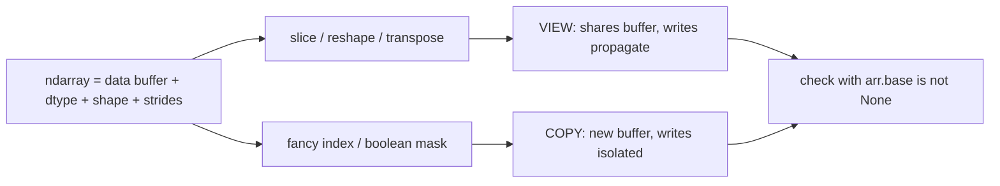

# NumPy Essentials

## TL;DR
A NumPy array is a typed, contiguous memory block plus a shape and a stride tuple. Almost every
NumPy skill worth having follows from that: vectorisation avoids the Python interpreter loop,
broadcasting avoids materialising copies, views avoid copying at all, and `dtype` decides both
memory and numerical correctness. Interviews test broadcasting rules, view-vs-copy, and "rewrite
this loop without a loop".

## Intuition
Think of an array as a **one-dimensional tape of bytes** with a set of instructions for how to walk
it. `shape` says how many steps in each dimension; `strides` says how many bytes to jump per step.
Reshaping, transposing and slicing usually just rewrite those instructions — the tape is untouched,
which is why they are free. Anything that cannot be expressed as a new walk over the same tape
(fancy indexing, `np.concatenate`, a non-contiguous `reshape`) must copy.

## The maths
**Broadcasting rule.** Two shapes are compatible if, aligned from the right, each pair of dimensions
is equal or one of them is 1. The result dimension is the maximum. Formally, for arrays of shapes
$(a_1,\dots,a_m)$ and $(b_1,\dots,b_n)$, right-align and pad the shorter with 1s to length
$k=\max(m,n)$; the result shape is $(c_1,\dots,c_k)$ with

$$
c_i = \max(a_i, b_i) \quad \text{provided} \quad a_i = b_i \ \text{ or } \ \min(a_i,b_i)=1 .
$$

A size-1 dimension is broadcast by setting its stride to 0 — no memory is allocated for the
repetition.

**Strides.** For a C-contiguous array of shape $(d_0,\dots,d_{k-1})$ with itemsize $s$ bytes, the
stride of axis $i$ is

$$
\text{stride}_i = s \prod_{j>i} d_j
$$

and the flat offset of element $(i_0,\dots,i_{k-1})$ is $\sum_i i_j \cdot \text{stride}_j$.
Transposing permutes the strides; this is why `A.T` is free but `A.T.reshape(-1)` copies.

**Precision.** `float32` has a 24-bit significand, so $\varepsilon \approx 1.19\times10^{-7}$;
`float64` has 53 bits, $\varepsilon \approx 2.22\times10^{-16}$. Summing $n$ `float32` values
naively accumulates error growing like $O(n\varepsilon)$ — the reason `np.mean` of a large float32
array can disagree with the float64 answer in the 4th decimal, and the reason NumPy uses pairwise
summation for `np.sum`.

## Diagram



## Code

```python
import numpy as np

rng = np.random.default_rng(42)          # modern API; avoid np.random.seed
X = rng.normal(size=(1000, 20)).astype(np.float32)
y = (X[:, 0] + 0.5 * X[:, 1] > 0).astype(np.int8)

# --- vectorised standardisation: broadcasting (1000,20) with (20,)
mu  = X.mean(axis=0)                     # shape (20,)
sd  = X.std(axis=0) + 1e-8
Xs  = (X - mu) / sd                      # no Python loop, no explicit tiling

# --- pairwise squared distances without a loop: (n,1,d) vs (1,m,d) -> (n,m,d)
def pairwise_sq(A, B):
    # memory-cheap identity: ||a-b||^2 = ||a||^2 - 2 a.b + ||b||^2
    a2 = (A * A).sum(1)[:, None]
    b2 = (B * B).sum(1)[None, :]
    return np.maximum(a2 - 2 * A @ B.T + b2, 0.0)

D = pairwise_sq(Xs[:200], Xs[:200])      # (200,200), O(n*m) memory not O(n*m*d)

# --- view vs copy
v = Xs[:10, :5]                          # view
c = Xs[[0, 1, 2]]                        # fancy index -> copy
assert v.base is not None and c.base is None

# --- boolean masking and np.where instead of if/else in a loop
scores = rng.random(1000)
labels = np.where(scores > 0.8, 2, np.where(scores > 0.5, 1, 0))

# --- argsort for top-k; argpartition when you only need the set, not the order
k = 5
top_k_unordered = np.argpartition(-scores, k)[:k]        # O(n)
top_k = top_k_unordered[np.argsort(-scores[top_k_unordered])]  # O(n + k log k)

# --- stable softmax (the classic "write this from scratch" question)
def softmax(z, axis=-1):
    z = z - z.max(axis=axis, keepdims=True)   # subtract max: prevents overflow
    e = np.exp(z)
    return e / e.sum(axis=axis, keepdims=True)

print(softmax(np.array([1000.0, 1001.0, 1002.0])))   # no inf/nan
```

Memory and dtype discipline:

```python
big = np.zeros((10_000, 512), dtype=np.float64)   # 10_000*512*8 bytes ≈ 41 MB
small = big.astype(np.float32)                    # ≈ 20 MB; halves embedding storage

# in-place ops avoid a temporary the size of the array
Xs -= Xs.mean(axis=0)          # no new (1000,20) allocation
np.clip(Xs, -3, 3, out=Xs)     # out= reuses the buffer
```

## In practice
- **Use it when:** the computation is dense numeric work over uniform types — feature matrices,
  embeddings, distance/similarity, metric implementations, image tensors. For heterogeneous columns
  use pandas; for out-of-core use Spark or Arrow.
- **Defaults that work:** `np.random.default_rng(seed)` for reproducibility; `float32` for
  embeddings and neural nets, `float64` for statistical computations and anything involving
  accumulation or matrix inversion; `axis=` explicitly on every reduction; `keepdims=True` when the
  result is going to be broadcast back.
- **Breaks when:** an implicit broadcast silently produces a huge intermediate (`(n,1) - (1,n)` on
  $n=10^5$ is $10^{10}$ elements = 80 GB); `int8`/`int32` overflow wraps around silently;
  `np.float32` accumulation loses precision in long sums; you rely on a view and a later `reshape`
  quietly copies, so the in-place write goes nowhere.
- **Cost / latency:** memory is `prod(shape) * itemsize`, so a $10^6 \times 768$ float32 embedding
  matrix is about 2.9 GB — state it that way in a system-design round. Vectorised code is typically
  one to two orders of magnitude faster than an equivalent Python loop because the loop runs in C
  and can use SIMD; the exact factor depends on the operation, so quote the mechanism, not a number.

## Interview angle

**Q. Explain broadcasting, and give a case where it hurts you.**
Right-align the shapes; dimensions must be equal or 1; a 1 is stretched by giving it stride 0, so no
data is duplicated. It hurts when the broadcast result itself is huge: computing all pairwise
distances as `((A[:,None,:] - B[None,:,:])**2).sum(-1)` materialises an $(n,m,d)$ array. For
$n=m=10^4$, $d=128$ that is $1.28\times10^{10}$ floats. The `a2 - 2AB^T + b2` identity gets the same
answer in $(n,m)$ memory.

**Follow-up.** *Any numerical downside to that identity?* → Yes — catastrophic cancellation for very
close points can give tiny negative values, so clip at 0 before `sqrt`. That is exactly why
scikit-learn's `euclidean_distances` has a `squared` flag and a clip.

**Q. View or copy — how do you know, and why does it matter?**
Basic slicing, `reshape` on contiguous data, `transpose` and `ravel` on contiguous data give views;
fancy (integer-array) indexing and boolean masking give copies. Check `arr.base`. It matters both
for memory (a view of a 40 GB array is free) and for correctness — writing into a view mutates the
parent, which is a classic source of "my training set changed after I scaled the validation set".

**Q. Rewrite this without a loop.**

```python
# before: O(n) Python iterations
out = []
for i in range(len(a)):
    out.append(a[i] * 2 if a[i] > 0 else 0)
# after
out = np.where(a > 0, a * 2, 0)
```
The point is not just speed; it is that the vectorised form is the one that survives being moved to
GPU, to Spark, or into a UDF.

**Q. `np.argsort` vs `np.argpartition` for top-k?**
`argsort` is $O(n \log n)$ and gives full order. `argpartition` is $O(n)$ average via
introselect and gives you the k best as an unordered set. For top-k retrieval over a million
candidates, partition first then sort only the k. This is exactly what an ANN reranking stage does.

**Q. Why subtract the max inside softmax?**
`exp` overflows `float64` above about 709. Subtracting the row max makes the largest exponent 0, so
all terms are in $(0,1]$, and since
$\operatorname{softmax}(z - c)_i = \frac{e^{z_i-c}}{\sum_j e^{z_j-c}} = \operatorname{softmax}(z)_i$
the answer is unchanged. Same idea gives the log-sum-exp trick.

## Traps
- **"`reshape` never copies."** It copies when the requested shape is incompatible with the current
  strides — most commonly after a transpose. Use `ravel()` (may view) vs `flatten()` (always copies)
  deliberately.
- **"`np.array == np.array` gives a bool."** It gives an element-wise array; using it in an `if`
  raises "truth value of an array is ambiguous". Use `.all()` / `.any()`, or `np.allclose` for floats.
- **"float32 is fine everywhere."** Not for covariance matrices, matrix inversion, or long
  accumulations. Cast up for the linear algebra, cast down for storage.
- **`np.random.seed` in library code.** It mutates global state and collides with other components.
  Pass a `Generator` explicitly.
- **Integer dtype overflow.** `np.int32` sums over large count columns wrap silently; NumPy does not
  raise. Promote to `int64` before summing.
- **Assuming NaN comparisons work.** `np.nan == np.nan` is False and `np.nan` poisons every
  reduction; use `np.nanmean`, `np.isnan`, or fix upstream.

## Flashcards
State the broadcasting rule.::Right-align shapes; each dimension pair must be equal or one of them 1; size-1 dimensions are stretched with stride 0; result dimension is the max.
Which indexing operations return a copy rather than a view?::Fancy (integer-array) indexing and boolean masking; basic slicing/reshape/transpose on contiguous data give views.
Memory of a float32 array of shape (1e6, 768)?::$10^6 \times 768 \times 4$ bytes ≈ 2.9 GB.
Why subtract the max before exponentiating in softmax?::`exp` overflows above ~709 in float64; subtracting a constant leaves softmax unchanged but bounds every exponent by 1.
`argsort` vs `argpartition` complexity for top-k?::`argsort` $O(n\log n)$ fully ordered; `argpartition` $O(n)$ average, unordered k-set — then sort just the k.
How do you compute pairwise squared distances in O(n·m) memory?::Use $\lVert a-b\rVert^2 = \lVert a\rVert^2 - 2a\cdot b + \lVert b\rVert^2$ with a matmul, then clip negatives to 0.
What does `arr.base` tell you?::It is `None` for an array that owns its data (a copy) and the parent array for a view.
float32 vs float64 machine epsilon?::≈ $1.2\times10^{-7}$ vs ≈ $2.2\times10^{-16}$.

## Related
- [[pandas-essentials]]
- [[python-performance-and-memory]]
- [[linear-algebra-essentials]]
- [[vector-norms-and-distances]]
- [[python-data-model-and-idioms]]
- [[moc-programming]]
- [[qbank-programming]]
