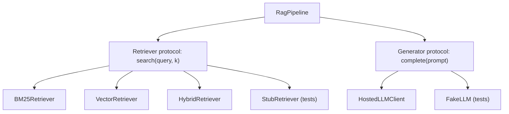

# OOP and Design Patterns for ML

## TL;DR
ML code needs fewer patterns than enterprise Java and more than a notebook. The five that actually
earn their keep: **strategy** (swap models/retrievers behind one interface), **factory** (build a
component from config), **adapter** (wrap a third-party client so you can replace it), **pipeline /
composite** (chain stateful transforms), and **dependency injection** (pass collaborators in, so
tests can substitute them). The scikit-learn `fit`/`transform`/`predict` contract is the reference
implementation of most of these.

## Intuition
The question every design decision answers is: **what is likely to change?** In an ML system the
churn is predictable — the model, the feature set, the embedding provider, the vector store, the
prompt. Put an interface exactly at those seams and nowhere else. Abstractions at stable points
(your data schema, your business logic) are pure cost; abstractions at volatile points are what let
you swap OpenAI for a local model in one config line.

## The maths
Not mathematical, but one quantitative idea is worth stating: the cost of an abstraction is roughly
constant and paid once, while the cost of *not* having it grows with the number of call sites $m$
that must change when the underlying component changes. If a swap costs $c$ per call site,
un-abstracted change costs $mc$ and abstracted change costs $c + a$ where $a$ is the one-off
abstraction cost. Abstract when you expect $m > 1 + a/c$ — i.e. when more than one or two places
would have to change. That is why "wrap it the second time you need it", not the first.

## Diagram



## Code

Strategy + dependency injection, the pattern that matters most in agent/RAG code:

```python
from typing import Protocol, Sequence
from dataclasses import dataclass

class Retriever(Protocol):
    """Structural interface — implementers need not inherit from it."""
    def search(self, query: str, k: int = 5) -> Sequence[str]: ...

class BM25Retriever:
    def __init__(self, index): self.index = index
    def search(self, query: str, k: int = 5) -> Sequence[str]:
        return self.index.top_k(query, k)

class VectorRetriever:
    def __init__(self, store, embedder): self.store, self.embedder = store, embedder
    def search(self, query: str, k: int = 5) -> Sequence[str]:
        return self.store.knn(self.embedder(query), k)

@dataclass
class RagPipeline:
    retriever: Retriever          # injected, not constructed here
    generate: callable

    def answer(self, question: str, k: int = 5) -> str:
        ctx = self.retriever.search(question, k)
        return self.generate(question, ctx)

# tests substitute a stub with zero mocking machinery
class StubRetriever:
    def search(self, query, k=5): return ["doc-a", "doc-b"]

assert RagPipeline(StubRetriever(), lambda q, c: f"{q}|{len(c)}").answer("x") == "x|2"
```

A custom scikit-learn transformer — the single most-asked "write OOP for ML" question:

```python
import numpy as np
import pandas as pd
from sklearn.base import BaseEstimator, TransformerMixin
from sklearn.pipeline import Pipeline
from sklearn.compose import ColumnTransformer
from sklearn.preprocessing import StandardScaler, OneHotEncoder
from sklearn.impute import SimpleImputer

class RareCategoryGrouper(BaseEstimator, TransformerMixin):
    """Collapse categories below a frequency threshold into '__other__'.
    State is learnt in fit, so train/serve see the same vocabulary."""

    def __init__(self, min_freq: float = 0.01, other: str = "__other__"):
        self.min_freq = min_freq          # no validation or work in __init__:
        self.other = other                # sklearn's get_params/clone requires this

    def fit(self, X: pd.DataFrame, y=None):
        self.keep_ = {
            col: set(X[col].value_counts(normalize=True)
                      .loc[lambda s: s >= self.min_freq].index)
            for col in X.columns
        }
        self.feature_names_in_ = np.asarray(X.columns)
        return self                       # must return self

    def transform(self, X: pd.DataFrame) -> pd.DataFrame:
        X = X.copy()
        for col, keep in self.keep_.items():
            X[col] = np.where(X[col].isin(keep), X[col], self.other)
        return X

num = ["amount", "tenure"]
cat = ["channel", "city"]

pre = ColumnTransformer([
    ("num", Pipeline([("imp", SimpleImputer(strategy="median")),
                      ("sc",  StandardScaler())]), num),
    ("cat", Pipeline([("rare", RareCategoryGrouper(0.01)),
                      ("imp",  SimpleImputer(strategy="constant", fill_value="missing")),
                      ("ohe",  OneHotEncoder(handle_unknown="ignore"))]), cat),
])
```

Factory from config — how a training job stays declarative:

```python
from typing import Any

_MODELS: dict[str, Any] = {}

def register(name):
    def deco(cls):
        _MODELS[name] = cls
        return cls
    return deco

def build_model(cfg: dict):
    name = cfg["type"]
    if name not in _MODELS:
        raise KeyError(f"unknown model {name!r}; known: {sorted(_MODELS)}")
    return _MODELS[name](**cfg.get("params", {}))
```

## In practice
- **Use it when:** more than one implementation of a thing exists or is likely (two retrievers, two
  LLM providers, two feature backends); when a component needs to be stubbed in tests; when config
  should choose behaviour. Not when there is one implementation and no test pressure.
- **Defaults that work:** `Protocol` over ABC for interfaces (no inheritance required, plays well
  with third-party classes); `@dataclass` for config and value objects; composition over
  inheritance; `BaseEstimator, TransformerMixin` for anything that must live in an sklearn pipeline
  or be logged by MLflow; constructor injection so the object graph is assembled in one place
  (`main`, or a small `build_app(cfg)`).
- **Breaks when:** you build a `BaseModel` inheritance tree three levels deep and every new model
  fights the hierarchy; you abstract a provider you will never change; you put logic in `__init__`
  of an sklearn estimator, which breaks `clone`, `GridSearchCV` and `get_params`.
- **Cost / latency:** negligible at runtime; the cost is comprehension. A junior reading the repo
  should be able to find where a prediction is actually made in under a minute.

## Interview angle

**Q. Write a custom scikit-learn transformer and explain the contract.**
Inherit `BaseEstimator` and `TransformerMixin`; store hyperparameters unchanged in `__init__` with
no validation or computation; learn state in `fit`, storing it on attributes with a trailing
underscore, and return `self`; apply state in `transform` without mutating the input. The trailing
underscore is the convention that says "learnt", and `check_is_fitted` relies on it. Honouring this
contract is what lets the transformer be cloned by cross-validation, tuned by `GridSearchCV`, and
serialised with the rest of the pipeline into an MLflow model — which is what guarantees the same
preprocessing at serve time and prevents training–serving skew.

**Follow-up.** *Why must `__init__` not validate?* → `get_params`/`set_params` and `clone` reconstruct
the estimator from its constructor arguments; work or coercion in `__init__` means the clone is not
equivalent, and errors surface inside a CV fold rather than at call time. Validate in `fit`.

**Q. Composition or inheritance, and why?**
Composition, by default. Inheritance couples you to a base class's internals and forces a single
axis of variation; composition lets you vary retriever, reranker and generator independently. I use
inheritance only for genuine is-a relationships with a stable base — e.g. subclassing an sklearn
mixin to get the well-defined `fit`/`transform` protocol. The smell is a base class with `if
self.kind == ...` branches: that is strategy wearing an inheritance costume.

**Q. How do you make an LLM-backed component testable?**
Define a narrow `Protocol` for the call — `def complete(prompt: str, **kw) -> str` — inject an
implementation, and in tests inject a deterministic fake that returns canned responses (including
malformed ones, so you test the parser and the retry path). The real client is constructed once at
the edge. This also gives you the seam for caching, rate limiting and cost accounting as decorators
around the same interface, rather than sprinkled through business logic.

**Q. Explain SOLID in the context of an ML repo, briefly.**
Single responsibility: the featuriser does not also log to MLflow. Open/closed: adding a new model
means registering a class, not editing a dispatch `if`. Liskov: a new `Retriever` must not require
callers to know which one it is. Interface segregation: don't force a batch scorer to implement
`stream()`. Dependency inversion: the pipeline depends on the `Retriever` protocol, not on
`FaissRetriever`. In an interview, give one concrete ML example per letter rather than reciting
definitions — that is what distinguishes 5-years from 2-years.

**Q. When is OOP the wrong answer in data science code?**
For a one-off analysis, for a pure transformation with no state (make it a function), and for
anything where a dataclass plus three functions would be clearer. A class with only `__init__` and
one method is a function with extra ceremony.

## Traps
- **Deep inheritance hierarchies for models.** They encode yesterday's taxonomy. Flat classes behind
  one protocol age far better.
- **Doing work in `__init__` of an sklearn estimator.** Breaks `clone`, hyperparameter search and
  pickling; symptoms appear only inside cross-validation.
- **Fitting a transformer on the full dataset before splitting.** Not an OOP error but it is the one
  the pipeline pattern exists to prevent — fit inside the pipeline, inside the CV fold. See
  [[data-leakage]].
- **Abstracting a single implementation.** A `BaseEmbedder` with one subclass is speculative
  generality; it adds a file and removes nothing.
- **Mutable class attributes.** `class C: cache = {}` shares one dict across all instances — the
  class-level version of the mutable-default bug.
- **Singletons for model loading.** Convenient until two model versions must coexist for a canary.
  Prefer an explicit registry keyed by version.

## Flashcards
Three rules of the scikit-learn estimator contract?::Store hyperparameters untouched in `__init__`; learn state in `fit` into trailing-underscore attributes and return `self`; apply state in `transform`/`predict` without mutating input.
Why `Protocol` rather than `ABC` for interfaces?::Structural typing — implementers need not inherit, so third-party and test doubles satisfy the interface without a dependency on your base class.
Which pattern lets you swap BM25 for a vector store in one config line?::Strategy, with the concrete retriever injected into the pipeline.
When is abstraction not worth it?::When exactly one implementation exists and no test needs a substitute — abstract on the second implementation, not the first.
Why does composition age better than inheritance in ML code?::It allows independent variation along several axes and avoids coupling to a base class's internals.
What does a trailing underscore on an attribute signal in sklearn?::It was learnt during `fit`; `check_is_fitted` looks for these.
Dependency injection in one sentence?::Pass collaborators into an object rather than constructing them inside it, so behaviour and tests can substitute them.
Smell that indicates strategy is missing?::A base class or function with a growing `if kind == ...` dispatch over behaviour variants.

## Related
- [[testing-python-code]]
- [[python-data-model-and-idioms]]
- [[training-pipelines]]
- [[data-leakage]]
- [[model-packaging-and-containers]]
- [[scikit-learn]]
- [[moc-programming]]
