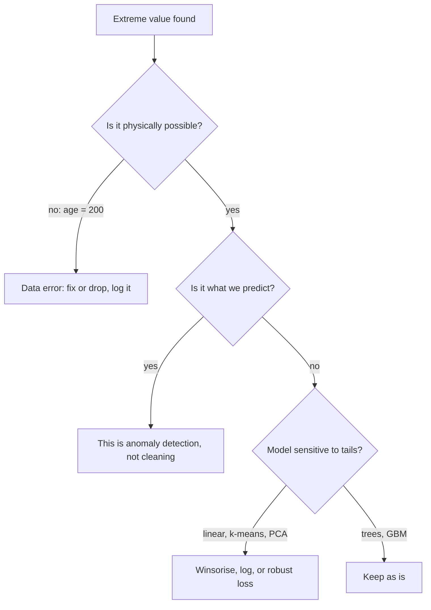

# Outlier Detection

## TL;DR
Separate three questions that interviewers deliberately blur: is this point a **data error**, a
**rare-but-real event**, or the **thing you are trying to predict**? Errors get fixed or removed;
rare-but-real gets kept with a robust model or a robust transform; the target case is
[[anomaly-detection]], a different problem entirely. Standard tools: $z$-score and IQR for
univariate, Mahalanobis distance for correlated multivariate, Isolation Forest and LOF for
non-parametric multivariate.

## Intuition
An outlier is a point that is unlikely under the model you assume. Change the assumed model and the
outlier set changes. A ₹40 lakh transaction is an outlier under a Gaussian fitted to retail
purchases and completely ordinary under a log-normal fitted to B2B settlements. So "is this an
outlier" is never answerable without "relative to what".

## The maths

**Z-score.** $z_i = (x_i - \mu)/\sigma$, flag $|z| > 3$. Two problems: it assumes approximate
normality, and $\mu$ and $\sigma$ are themselves computed from the contaminated data — a single
extreme point inflates $\sigma$ and *masks* itself. The robust replacement uses the median and MAD:

$$
z^{\text{rob}}_i = \frac{0.6745\,(x_i - \operatorname{med}(x))}{\operatorname{MAD}(x)},
\qquad \operatorname{MAD}(x) = \operatorname{med}\big(|x_i - \operatorname{med}(x)|\big)
$$

The $0.6745$ makes MAD a consistent estimator of $\sigma$ under normality
($\Phi^{-1}(0.75) \approx 0.6745$).

**Tukey's IQR rule.** Flag outside $[Q_1 - 1.5\,\text{IQR},\; Q_3 + 1.5\,\text{IQR}]$. Under a
normal distribution this covers about 99.3% of the mass, so roughly 0.7% of clean Gaussian data is
flagged by construction — worth saying out loud, because it means "the rule found outliers" is not
evidence of a problem. The $3.0$ multiplier marks "far out" points.

**Mahalanobis distance** — the multivariate generalisation that respects correlation:

$$
d_M(x) = \sqrt{(x - \mu)^\top \Sigma^{-1} (x - \mu)}
$$

Under multivariate normality $d_M^2 \sim \chi^2_p$, so a threshold is
$\chi^2_{p,\,1-\alpha}$. It catches the point that is unremarkable on every axis individually but
violates the joint correlation structure — 25 years old with 40 years of work experience. Use a
robust covariance estimate (`MinCovDet`) because $\Sigma$ suffers the same masking problem as
$\sigma$.

**Isolation Forest.** Build random trees by picking a random feature and a random split value.
Anomalies are isolated in few splits because they sit in sparse regions. With $h(x)$ the average
path length over the ensemble and $c(n)$ the expected path length of an unsuccessful BST search on
$n$ points,

$$
s(x, n) = 2^{-\frac{\mathbb{E}[h(x)]}{c(n)}}, \qquad
c(n) = 2H(n-1) - \frac{2(n-1)}{n}, \quad H(k) \approx \ln k + \gamma
$$

$s \to 1$ means anomalous, $s \to 0.5$ means normal. Linear time, no distance metric, no density
estimate — which is why it is the default at scale.

**Local Outlier Factor.** Compares a point's local density to its neighbours':
$\text{LOF}(x) \approx \frac{\text{avg density of }x\text{'s neighbours}}{\text{density of }x}$.
LOF > 1 means locally sparse. This is the one that handles clusters of differing density, which
global methods cannot.

## Diagram



## Code

```python
import numpy as np
import pandas as pd
from sklearn.ensemble import IsolationForest
from sklearn.neighbors import LocalOutlierFactor
from sklearn.covariance import MinCovDet

rng = np.random.default_rng(0)
X = rng.multivariate_normal([0, 0], [[1, 0.9], [0.9, 1]], size=1000)
X = np.vstack([X, [[2.5, -2.5], [-2.5, 2.5]]])   # fine on each axis, impossible jointly

def robust_z(x):
    med = np.median(x)
    mad = np.median(np.abs(x - med))
    return 0.6745 * (x - med) / (mad if mad > 0 else 1e-12)

# Univariate misses the correlation-violating points entirely.
print("univariate flags:", np.sum(np.abs(robust_z(X[:, 0])) > 3.5))

# Mahalanobis with a ROBUST covariance catches them.
mcd = MinCovDet(random_state=0).fit(X)
d2 = mcd.mahalanobis(X)
from scipy.stats import chi2
thresh = chi2.ppf(0.999, df=2)
print("mahalanobis flags:", np.sum(d2 > thresh), "-> last two:", (d2[-2:] > thresh))

# Isolation Forest: contamination is a decision, not an estimate. Set it from
# what the business can review, or use 'auto' and inspect the score distribution.
iso = IsolationForest(contamination=0.01, random_state=0).fit(X)
print("iforest flags:", (iso.predict(X) == -1).sum())

# LOF is transductive by default: fit_predict on the data you are screening.
lof = LocalOutlierFactor(n_neighbors=20, contamination=0.01)
print("lof flags:", (lof.fit_predict(X) == -1).sum())
```

Winsorising, which is usually better than deleting:

```python
def winsorize(s: pd.Series, lo=0.01, hi=0.99) -> pd.Series:
    """Clip to quantiles computed on TRAINING data only; return the bounds to reuse at serving."""
    a, b = s.quantile(lo), s.quantile(hi)
    return s.clip(a, b), (a, b)
```

The returned bounds are model parameters. Recomputing them at serving from the live batch is a
[[data-leakage|leak]] and makes scores non-reproducible.

## In practice
- **Use it when:** you are fitting a model with an unbounded quadratic loss or a distance metric —
  OLS, ridge, k-means, PCA, kNN. Also as a data-quality gate in a
  [[medallion-architecture|bronze→silver]] step.
- **Defaults that work:** robust z (MAD) or IQR per column for a first pass, Isolation Forest at
  `contamination` set by review capacity for a multivariate screen, and **winsorising at the 1st/99th
  percentile** rather than deletion. For GBMs, do nothing — they are already robust to $x$-outliers
  because splits depend on ordering, not magnitude.
- **Breaks when:** the data is multimodal (a global threshold splits a legitimate second mode), when
  dimensionality is high (all distances concentrate — see [[curse-of-dimensionality]]), and whenever
  the "outliers" are the positive class. Removing them then removes your signal.
- **Cost / latency:** Isolation Forest is $O(n \log n)$ to fit and $O(\log n)$ per score — the only
  one of these that is comfortable in a streaming path. LOF is $O(n^2)$ naively and needs an index.
  Mahalanobis needs a $p \times p$ inverse, fine for small $p$, unstable when $p$ approaches $n$.

## Interview angle

**Q. You find 2% of rows are outliers. Do you remove them?**
Not by default. I would first split them into three buckets. Impossible values — negative age, a
timestamp in 2087 — are data errors; I fix them if the correct value is recoverable and drop or
null them otherwise, and I raise it upstream because it is a pipeline bug. Extreme but real values
— a genuinely huge order — I keep, because deleting them teaches the model that the tail does not
exist and the tail is often where the money is. And if the extremes are the target class, removal
destroys the problem. If the model is sensitive I would winsorise or log-transform rather than
delete, and I would always report results with and without.

**Follow-up.** How do you decide the threshold? → Not statistically. I set it from what the business
can act on: if the fraud team can review 200 cases a day, the threshold is the one that produces 200
cases a day. That is a [[threshold-selection]] argument, not a $3\sigma$ argument.

**Q. Why can the z-score fail to find outliers?**
Masking. $\mu$ and $\sigma$ are computed from the contaminated sample, so a large outlier inflates
$\sigma$ and pulls $\mu$ toward itself, shrinking its own z-score below the threshold. With several
outliers it gets worse. The fix is a robust estimator — median and MAD, scaled by 0.6745 — which has
a breakdown point of 50% versus 0% for the mean.

**Q. Univariate checks pass on every column but you suspect bad rows. What next?**
Mahalanobis distance with a robust covariance estimate, or Isolation Forest. The case you are
missing is a point that respects each marginal but violates the joint structure — 25 years old with
40 years of experience is inside the range of both columns. Mahalanobis whitens by $\Sigma^{-1}$ so
correlation violations show up; Isolation Forest finds them without assuming a distribution.

**Q. Isolation Forest vs LOF vs one-class SVM — when do you pick which?**
Isolation Forest for scale and mixed feature types: linear time, no metric, few knobs, works well on
tabular. LOF when densities vary across the space — it is the only one of the three that compares a
point to its *local* neighbourhood, so it finds a point that is sparse relative to its cluster even
though globally dense. One-class SVM when the data is low-dimensional, roughly unimodal, and you
want a smooth boundary; it scales badly ($O(n^2)$–$O(n^3)$) and is sensitive to $\nu$ and $\gamma$.

**Q. Does XGBoost need outlier removal?**
Not for the features — a split is a threshold on rank order, so an $x$-value of 10 or $10^9$ on the
same side of every split produces the same tree. It *is* sensitive to outliers in the **target**
under squared error, because the gradient is the residual and one huge residual dominates a leaf's
value. There I would switch to a robust objective (Huber / pseudo-Huber, or quantile regression) or
transform the target.

## Traps
- **Deleting outliers to "improve" the metric.** You improved the metric on a dataset that no longer
  matches production. Always report both.
- **Using $3\sigma$ on a skewed distribution.** Income, claim size, session length are lognormal-ish;
  the rule flags a huge fraction of the right tail as "outliers" that are perfectly ordinary.
- **Treating `contamination` in Isolation Forest as an estimate of the true anomaly rate.** It is a
  quantile of the score distribution — a knob you set, which mechanically produces that many flags
  regardless of whether anomalies exist.
- **Removing outliers before splitting.** The test set should look like production, tail and all.
  Clean the training set if you must; do not clean the evaluation set.
- **Confusing outlier removal with anomaly detection.** If the rare points are the label, this is a
  supervised or semi-supervised [[anomaly-detection]] problem, not preprocessing.
- **Recomputing clip bounds at serving.** Bounds are parameters. Fit on train, persist, reuse.
- **Trusting distance-based methods in 200 dimensions.** Distance concentration makes nearest and
  farthest neighbours nearly equidistant, so LOF and kNN-distance degrade badly.

## Flashcards
Three questions to ask about an extreme value::Is it a data error, a rare-but-real event, or the thing being predicted (anomaly detection)?
Why does the z-score mask outliers::mu and sigma are estimated from the contaminated data, so an extreme point inflates sigma and shrinks its own score; MAD-based robust z has a 50% breakdown point.
Robust z-score formula::0.6745 * (x - median) / MAD, where 0.6745 makes MAD consistent for sigma under normality.
What Mahalanobis distance catches that per-column checks miss::Points that are ordinary on every marginal but violate the joint correlation structure.
Isolation Forest's principle::Anomalies are isolated by fewer random splits; score is 2^(-E[h(x)]/c(n)), linear time and metric-free.
When to use LOF instead of Isolation Forest::When density varies across the space — LOF compares a point to its local neighbourhood rather than globally.
Is XGBoost robust to outliers::To feature outliers yes (splits use rank order); to target outliers no under squared error — use Huber or quantile loss.
Better default than deletion::Winsorise at train-set percentiles and persist the bounds as model parameters.

## Related
- [[anomaly-detection]]
- [[feature-scaling-and-transforms]]
- [[missing-data-handling]]
- [[data-quality-and-validation]]
- [[curse-of-dimensionality]]
- [[threshold-selection]]
- [[case-fraud-detection]]
