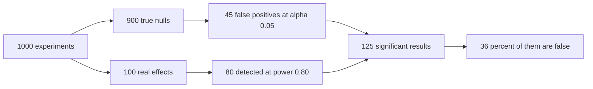

# P-values and Significance

## TL;DR
A p-value is $P(\text{data at least this extreme} \mid H_0 \text{ true})$. It is **not** the
probability that the null is true, not the probability the result was a fluke, and not a measure of
effect size. Getting this definition wrong — or fumbling it — is the most common single reason
candidates fail a Data Scientist stats round in India. Learn the sentence, and learn the three
things it is not.

## Intuition
The p-value answers one narrow question: *if the world were boring, how surprising is what I saw?*
Surprise is not the same as truth. A surprising result from a hypothesis that was implausible to
begin with is still probably wrong — which is why the base rate of real effects, not the p-value,
determines how often a "significant" finding replicates.

## The maths

For an observed statistic $t_{\mathrm{obs}}$ and a two-sided alternative:

$$
p = P\big(\lvert T \rvert \ge \lvert t_{\mathrm{obs}} \rvert \;\big|\; H_0\big)
$$

Every symbol matters: $T$ is the random test statistic under the null, $t_{\mathrm{obs}}$ is your
one realisation, and the conditioning bar has $H_0$ on the right. Swap the sides of that bar and you
have the misinterpretation.

**Calibration.** If $T$ is continuous and $H_0$ is exactly true, then $p \sim \mathrm{Uniform}(0,1)$.
Hence $P(p \le \alpha \mid H_0) = \alpha$: rejecting at 0.05 gives a 5% false-positive rate *among
true nulls*. Under $H_1$, the p-value distribution is pushed toward 0, and how hard it is pushed
*is* the power.

**What you actually want: the false discovery rate.** By Bayes,

$$
P(H_0 \mid \text{reject})
= \frac{\alpha\,\pi_0}{\alpha\,\pi_0 + (1-\beta)(1-\pi_0)}
$$

where $\pi_0 = P(H_0)$ is the prior probability the null holds, $\alpha$ the significance level and
$1-\beta$ the power. Plug in the numbers a real experimentation programme sees — $\pi_0 = 0.9$
(most ideas do nothing), $\alpha = 0.05$, power $0.8$:

$$
P(H_0 \mid \text{reject}) = \frac{0.05 \times 0.9}{0.05\times0.9 + 0.8\times0.1}
= \frac{0.045}{0.125} = 0.36
$$

**36% of your "significant at 5%" wins are false.** This one calculation, done out loud, is the
strongest possible answer to "what does p < 0.05 mean". It also shows why low power is not only a
missed-detection problem — it *increases the share of your discoveries that are wrong*.

**Bayes factor bound.** For a p-value near 0.05, the maximum possible likelihood ratio in favour of
$H_1$ over a point null is only about 2.5:1 — weak evidence by any standard. $p = 0.05$ is a much
flimsier result than its cultural status suggests.

**Effect size is separate.** For a two-sample z on proportions,
$z = \Delta / \mathrm{SE}$ and $\mathrm{SE}\propto 1/\sqrt{n}$, so $p$ shrinks with $n$ for *any*
non-zero $\Delta$. At $n = 10^8$, everything is significant. Always report $\Delta$ and its CI.

## Diagram



## Code

```python
import numpy as np
from scipy import stats

rng = np.random.default_rng(0)

# 1. Under H0 the p-value is uniform; under H1 it piles up near zero.
def p_batch(effect, n=500, reps=20_000):
    a = rng.normal(0, 1, (reps, n))
    b = rng.normal(effect, 1, (reps, n))
    return stats.ttest_ind(b, a, axis=1).pvalue

p0 = p_batch(0.0)
p1 = p_batch(0.2)                       # d = 0.2, a small effect
print("H0 : P(p<0.05) =", round((p0 < 0.05).mean(), 4))          # ~0.05
print("H0 : deciles   =", np.round(np.quantile(p0, np.arange(0.1, 1.0, 0.1)), 3))
print("H1 : P(p<0.05) =", round((p1 < 0.05).mean(), 4))          # this is power

# 2. The number that actually matters: FDR among significant results.
def fdr(prior_null=0.9, alpha=0.05, power=0.8):
    fp = alpha * prior_null
    tp = power * (1 - prior_null)
    return fp / (fp + tp)

for pw in (0.2, 0.5, 0.8):
    print(f"power {pw}: share of 'significant' results that are false = {fdr(power=pw):.2%}")

# 3. Significance is not effect size: same tiny effect, growing n.
d = 0.01
for n in (1_000, 100_000, 5_000_000):
    a, b = rng.normal(0, 1, n), rng.normal(d, 1, n)
    r = stats.ttest_ind(b, a)
    print(f"n={n:>9,}  observed diff={b.mean()-a.mean():+.5f}  p={r.pvalue:.2e}")
```

Running block 2 gives false-discovery shares of about **69%, 47% and 36%** at powers 0.2, 0.5 and
0.8 (with $\pi_0 = 0.9$). Under-powering an experimentation programme does not just lose wins — it
quietly poisons the win list you do produce.

## In practice
- **Use it when:** you have a pre-registered hypothesis, a pre-registered sample size, and a single
  primary metric. Outside those conditions a p-value is decoration.
- **Defaults that work:** report **effect size, CI, n, and p — in that order**. Use
  $\alpha = 0.05$ two-sided as a convention, but tighten it (0.01, or an FDR procedure) when you run
  many tests or when $\pi_0$ is high, as in a high-throughput experimentation platform.
- **Breaks when:** you peek, you test many metrics or segments, you pick the metric afterwards, or
  the null is a straw man nobody believed.
- **Cost / latency:** none computationally. The cost is organisational — a culture that ships on
  p < 0.05 with 40% power will ship mostly noise and then wonder why the annual metric is flat.

> [!warning]
> "Statistically significant" and "significant" in the English sense are different words that happen
> to be spelled the same. Say "detectable" when you mean the first and "material" when you mean the
> second, and half of these arguments disappear.

## Interview angle

**Q. What is a p-value?**
The probability, *assuming the null hypothesis is true*, of observing a test statistic at least as
extreme as the one we observed. It is a property of the data under a hypothetical world, not a
probability attached to the hypothesis. Small p means the data are unusual under $H_0$ — that is
all it means.

**Follow-up.** So is p = 0.03 the probability the result is due to chance? → No. That phrasing is
$P(H_0 \mid \text{data})$, which needs a prior. With 90% of ideas being duds, $\alpha = 0.05$ and
80% power, $P(H_0\mid\text{reject}) \approx 36\%$ — an order of magnitude away from 3%.

**Q. Two experiments, both p = 0.04. Are they equally strong evidence?**
No. One might be a 15% lift on 5,000 users with 80% power; the other a 0.2% lift on 8 million users.
Same p, completely different decisions. And if the second was one of forty metrics examined, its
p = 0.04 is expected by chance. The p-value ignores effect size, precision, prior plausibility and
how many other things you looked at.

**Q. Your model's AUC improved from 0.812 to 0.815, p = 0.001. Ship it?**
Probably not on that basis alone. Significance at that $n$ says the improvement is real, not that it
is worth anything. Ask: does 0.003 AUC move any business decision at the operating threshold?
What does the PR curve look like in the region we actually serve? What is the cost in latency,
complexity and retraining? An honest answer names the confusion-matrix change at the deployed
threshold — see [[threshold-selection]].

**Q. How would you explain p-values to a product manager?**
"If the change did nothing at all, we would see a result this good about 3 times in 100 by pure
luck. That is unlikely enough that we will act as if it worked — but roughly a third of the wins we
declare this way turn out not to replicate, so let us also look at how big the effect is and whether
it is worth the engineering cost."

**Q. When is a p-value genuinely the right tool?**
When there is one pre-specified hypothesis, a fixed sample size, a decision that must be made, and
an organisation that needs the false-positive rate controlled — regulatory submissions, a
company-wide guardrail on revenue, a launch gate. For exploratory analysis, estimation with CIs or
a Bayesian posterior is a better fit.

## Traps
- **"p is the probability the null is true."** Wrong, and it is the single most common reject.
  It is $P(\text{data}\mid H_0)$-style, not $P(H_0\mid\text{data})$.
- **"p = 0.05 means 95% confidence the effect is real."** Conflates two different conditionals and
  ignores the base rate.
- **"p > 0.05 proves there is no effect."** It proves nothing; often it just proves the test was
  small. Report the CI and compare it to your MDE.
- **Treating 0.049 and 0.051 as different worlds.** The threshold is a convention; nothing physical
  changes at 0.05. Report the number, not just the verdict.
- **Reporting a p-value without $n$ or the effect size.** Meaningless — large $n$ makes any
  non-zero effect significant.
- **Ignoring how many tests produced it.** Twenty metrics, one p < 0.05, is exactly what noise looks
  like. See [[multiple-testing-correction]].
- **Computing a p-value after peeking.** The null distribution you used assumed a fixed $n$, and
  you did not have one. See [[ab-testing-pitfalls]].
- **A p-value on the training set.** Any test computed on data used to select the model or feature
  is selective inference; the null distribution is wrong. See [[data-leakage]].

## Flashcards
Define a p-value in one sentence::P(test statistic at least as extreme as observed \| H₀ true) — a probability about the data under the null, not about the hypothesis.
Three things a p-value is not::Not P(H₀ \| data), not the probability the result is a fluke, not a measure of effect size.
Distribution of p under a true null::Uniform(0,1), which is exactly why P(p ≤ α) = α.
Share of significant results that are false, given π₀=0.9, α=0.05, power=0.8::αp₀/(αp₀+(1−β)(1−p₀)) = 0.045/0.125 ≈ 36%.
Effect of low power on false discovery rate::It raises it — fewer true positives share the denominator with the same number of false positives.
Why huge n makes everything significant::z = Δ/SE and SE ∝ 1/√n, so any non-zero Δ eventually clears any threshold.
Evidential strength of p = 0.05::Weak — the best-case likelihood ratio for H₁ over a point null is only about 2.5:1.
What to report alongside p::Effect size, confidence interval and n — ideally before the p-value.

## Related
- [[hypothesis-testing]]
- [[type-i-and-type-ii-errors]]
- [[statistical-power-and-sample-size]]
- [[multiple-testing-correction]]
- [[confidence-intervals]]
- [[bayesian-inference-basics]]
- [[moc-stats]]
