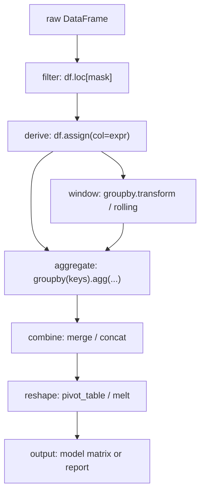

# Pandas Essentials

## TL;DR
Pandas is a columnar table with an index. Four operations cover ~90% of interview and real work:
filter (boolean mask), derive (assign / vectorised ops), aggregate (`groupby().agg`), and combine
(`merge` / `concat`). The failure modes that get discussed are `SettingWithCopyWarning`, silent row
explosion from a many-to-many merge, memory blowup from `object` dtype, and doing in a Python loop
what `groupby` does in C.

## Intuition
A DataFrame is a dict of NumPy arrays (one per column) sharing a row index. That single sentence
explains most behaviour: column operations are fast because they are array operations; row-wise
`apply` is slow because it builds a Series per row; `dtype` is per column, so one stray string turns
a numeric column into `object` and everything gets 10× slower. The index is not decoration — it is
the join key for alignment, and most confusing pandas behaviour is alignment doing its job.

## The maths
Merge cardinality is the only arithmetic here, and it is the arithmetic people get wrong. If key $k$
appears $a_k$ times in the left table and $b_k$ times in the right, an inner join on $k$ produces

$$
N_{\text{out}} = \sum_{k} a_k \, b_k
$$

rows. So a "harmless" join where one key repeats 50 times on each side contributes 2500 rows from
that key alone. Always check `df.duplicated(subset=keys).sum()` on both sides, or pass
`validate="one_to_many"` and let pandas raise.

Memory: a column of $n$ values costs $n \times$ itemsize for numeric dtypes, but an `object` column
of strings costs a pointer array ($8n$ bytes) **plus** a separate Python string object per value
(tens of bytes each, with significant per-object overhead). Converting a low-cardinality string
column with $c$ distinct values to `category` replaces that with an $n$-length integer code array
plus a $c$-length dictionary — a large reduction whenever $c \ll n$.

## Diagram



## Code

```python
import numpy as np
import pandas as pd

rng = np.random.default_rng(0)
n = 10_000
df = pd.DataFrame({
    "user_id":  rng.integers(1, 500, n),
    "ts":       pd.to_datetime("2026-01-01") + pd.to_timedelta(rng.integers(0, 90, n), "D"),
    "channel":  rng.choice(["web", "app", "partner"], n),
    "amount":   rng.gamma(2.0, 50.0, n).round(2),
})

# 1) filter + derive — chainable, no SettingWithCopy risk
clean = (df
         .loc[df["amount"] > 0]
         .assign(month=lambda d: d["ts"].dt.to_period("M").dt.to_timestamp(),
                 log_amount=lambda d: np.log1p(d["amount"])))

# 2) aggregate — named aggregation gives flat, readable column names
monthly = (clean
           .groupby(["month", "channel"], as_index=False, observed=True)
           .agg(revenue=("amount", "sum"),
                orders=("amount", "size"),
                users=("user_id", "nunique"))
           .assign(aov=lambda d: d["revenue"] / d["orders"]))

# 3) transform — group statistic broadcast back to every row (no merge needed)
clean["user_total"] = clean.groupby("user_id")["amount"].transform("sum")
clean["share_of_user"] = clean["amount"] / clean["user_total"]

# 4) per-group ranking without a loop
clean["rank_in_month"] = (clean
                          .groupby("month")["amount"]
                          .rank(method="dense", ascending=False))

# 5) safe merge — validate catches accidental fan-out
dim = pd.DataFrame({"channel": ["web", "app", "partner"],
                    "is_paid": [False, False, True]})
joined = clean.merge(dim, on="channel", how="left", validate="many_to_one")
assert len(joined) == len(clean)

# 6) memory: shrink dtypes
before = df.memory_usage(deep=True).sum()
df["channel"] = df["channel"].astype("category")
df["user_id"] = pd.to_numeric(df["user_id"], downcast="integer")
after = df.memory_usage(deep=True).sum()
print(f"{before/1e6:.2f} MB -> {after/1e6:.2f} MB")
```

Time-series and deduplication idioms that come up constantly:

```python
# last event per user (the pandas answer to ROW_NUMBER() ... QUALIFY rn = 1)
latest = (clean.sort_values("ts")
               .drop_duplicates(subset="user_id", keep="last"))

# rolling 7-day revenue per channel
ts = (clean.set_index("ts")
           .groupby("channel")["amount"]
           .resample("D").sum()
           .reset_index())
ts["rev_7d"] = ts.groupby("channel")["amount"].transform(
    lambda s: s.rolling(7, min_periods=1).sum())

# gap to previous purchase per user
clean = clean.sort_values(["user_id", "ts"])
clean["days_since_prev"] = (clean.groupby("user_id")["ts"]
                                 .diff().dt.days)
```

## In practice
- **Use it when:** data fits comfortably in memory (rule of thumb: raw size under ~1/5 of RAM,
  because intermediates cost too), the work is exploratory, or you are building a single-node
  feature step. Above that, move to PySpark — the `groupby`/`agg`/`join`/`window` vocabulary
  transfers almost one-for-one.
- **Defaults that work:** method chaining with `.assign` and `.loc` instead of in-place mutation;
  `as_index=False` on `groupby` so you get a flat frame; named aggregation
  (`agg(rev=("amount","sum"))`); `category` dtype for low-cardinality strings; explicit `dtype=` on
  `read_csv` plus `parse_dates=`; `copy=False` avoided in favour of just not mutating.
- **Breaks when:** you `apply` a Python function row-wise over a million rows; you merge on a column
  with duplicates on both sides; you `pd.concat` inside a loop (quadratic — collect a list, concat
  once); you rely on chained indexing `df[mask]["col"] = x`, which writes into a temporary.
- **Cost / latency:** `groupby().agg` with built-in reducers runs in Cython and is fast;
  `groupby().apply(lambda g: ...)` runs Python per group and can be orders of magnitude slower.
  `object` dtype columns defeat every fast path. On Databricks, the honest framing is: pandas for
  <1 GB and for the final small aggregate, PySpark for everything upstream, `pandas_udf` /
  `applyInPandas` to get pandas semantics at Spark scale.

## Interview angle

**Q. `apply` vs `transform` vs `agg` on a groupby — when do you use which?**
`agg` reduces each group to one row per group. `transform` returns a result aligned to the original
index — same number of rows — which is how you add "group mean" as a column without a merge.
`apply` is the general escape hatch: it can return a scalar, a Series, or a DataFrame, and it is the
slowest because it calls Python per group. Reach for `agg` or `transform` first; `apply` only when
the per-group logic genuinely cannot be expressed with built-ins.

**Follow-up.** *How would you add each user's mean order value as a column?* →
`df["u_mean"] = df.groupby("user_id")["amount"].transform("mean")`. The merge-based version is
correct but slower and risks changing row count.

**Q. What causes `SettingWithCopyWarning` and how do you make it go away properly?**
It appears when you assign into the result of chained indexing, e.g. `df[df.a > 0]["b"] = 1`. The
first index may return a copy, so the write may hit a temporary and vanish. The fix is a single
`.loc` with both axes: `df.loc[df.a > 0, "b"] = 1`. Silencing the warning with
`pd.options.mode.chained_assignment = None` is the wrong answer and interviewers watch for it.

**Q. Your merge produced more rows than the left table. What happened and how do you debug it?**
The join key is not unique on the right, so rows fanned out: output rows for key $k$ are
$a_k \times b_k$. Debug by checking `right.duplicated(subset=keys).sum()`, then either deduplicate
the right side, aggregate it first, or add the missing key column that makes it unique. Preventively,
pass `validate="many_to_one"` so pandas raises at the merge rather than you noticing a doubled
revenue number three steps later.

**Q. `merge` vs `join` vs `concat`?**
`merge` joins on columns (or index via flags) with SQL semantics. `join` is a thin convenience for
index-on-index. `concat` stacks frames — `axis=0` appends rows aligning columns by name, `axis=1`
glues columns aligning by index. The bug people hit is `concat(axis=1)` on frames with different or
duplicated indexes, which silently produces NaNs or a cross-product-like blowup.

**Q. How do you handle a CSV larger than memory in pandas?**
Three levers, in order: read only needed columns (`usecols`), set narrow dtypes and `category` on
read, and stream in chunks (`chunksize=`) aggregating as you go. If none of those get you there,
stop — move to Parquet plus PySpark or DuckDB. Parquet alone helps a lot because it is columnar and
compressed, so column pruning and predicate pushdown happen at the file level.

**Q. How do you detect and handle missing values?**
`df.isna().mean()` for a per-column rate is the first line of any EDA. Then the decision is about
mechanism, not code: missing-at-random numeric fields can be median-imputed with a missingness
indicator; missing categoricals often deserve an explicit "unknown" level because the missingness
itself is predictive; and anything missing because it is computed after the prediction time is
leakage and must be dropped.

## Traps
- **"`inplace=True` saves memory."** It generally does not — most implementations still build a new
  object internally — and it breaks method chaining. Prefer reassignment.
- **Iterating with `iterrows`.** It yields a new Series per row, dtype-coerced to a common type.
  Almost always replaceable by vectorised ops, `groupby`, or at worst `itertuples` (faster, namedtuple).
- **`df.append` / `pd.concat` in a loop.** Quadratic copying. Build a list, concat once.
- **Trusting `==` for floats or NaN.** Use `np.isclose` and `pd.isna`.
- **Losing the index after `groupby`.** Group keys become the index by default; downstream merges
  then align unexpectedly. Use `as_index=False` or `.reset_index()` deliberately.
- **"`drop_duplicates` keeps the row I want."** Only if you sorted first — `keep="last"` is
  meaningless on unsorted data.
- **`pd.get_dummies` fitted on train and test separately.** Different column sets. Use
  scikit-learn's `OneHotEncoder` inside a pipeline so categories are learnt once.

## Flashcards
How many rows does an inner join produce for key k?::$a_k \times b_k$ where $a_k, b_k$ are the key's counts on each side; total $\sum_k a_k b_k$.
`agg` vs `transform` on a groupby?::`agg` returns one row per group; `transform` returns a result aligned to the original index (same row count).
Correct fix for SettingWithCopyWarning?::Use a single `.loc[row_mask, col] = value` instead of chained indexing.
What does `validate="many_to_one"` do in `merge`?::Raises if the right-hand key is not unique, catching accidental row fan-out at the join site.
Cheapest way to cut memory on a low-cardinality string column?::Cast to `category` — stores integer codes plus a small dictionary instead of Python string objects.
Pandas equivalent of `ROW_NUMBER() OVER (PARTITION BY u ORDER BY ts DESC) = 1`?::`df.sort_values("ts").drop_duplicates("u", keep="last")`, or `groupby("u")["ts"].rank(method="first")`.
Why is `pd.concat` inside a loop slow?::Each concat copies the whole accumulated frame, giving $\Theta(n^2)$ total work; collect into a list and concat once.
When should you stop using pandas and move to Spark?::When the raw data approaches a large fraction of RAM, when intermediates will not fit, or when the step must run on a schedule over growing data.

## Related
- [[numpy-essentials]]
- [[python-performance-and-memory]]
- [[pyspark-essentials]]
- [[vs-spark-vs-pandas]]
- [[feature-engineering]]
- [[aggregations-and-grouping]]
- [[moc-programming]]
- [[qbank-programming]]
