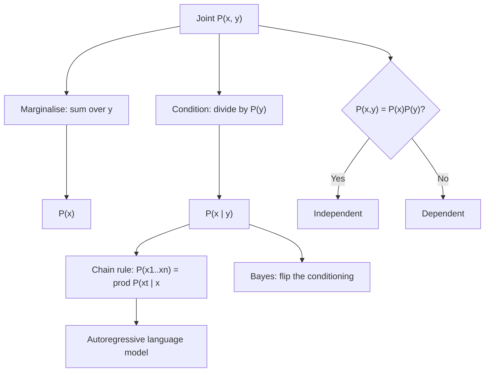

# Probability Fundamentals

## TL;DR
Three axioms and two rules generate everything: the sum rule for unions, the product rule for joints, and marginalisation to remove variables you do not care about. In ML, nearly every model is a claim about $P(y\mid x)$, every loss is a negative log-likelihood, and every deployment bug involving class imbalance or sampled data is a misapplied conditional probability. Independence and conditional independence are not the same thing, and that distinction is the single most-tested idea in this area.

## Intuition
A probability is a proportion of a well-defined set of possible worlds. Conditioning is *shrinking the set of worlds* to those consistent with what you observed, then re-normalising. Almost every counter-intuitive puzzle — Monty Hall, the false-positive paradox, Simpson's paradox — is someone conditioning on the wrong set or forgetting that the observation itself carried information.

## The maths

**Axioms (Kolmogorov).** For a sample space $\Omega$ and events $A\subseteq\Omega$: $P(A)\ge0$; $P(\Omega)=1$; and for disjoint $A_i$, $P(\bigcup_i A_i)=\sum_i P(A_i)$.

**Complement and union.**

$$
P(A^c)=1-P(A), \qquad P(A\cup B)=P(A)+P(B)-P(A\cap B).
$$

Inclusion–exclusion generalises this; for three events you add singles, subtract pairs, add the triple.

**Conditional probability and the chain rule.**

$$
P(A\mid B)=\frac{P(A\cap B)}{P(B)},\quad P(B)>0
\qquad\Longrightarrow\qquad
P(A\cap B)=P(A\mid B)P(B).
$$

Chained over many variables:

$$
P(x_1,\dots,x_n)=\prod_{t=1}^{n}P(x_t\mid x_{<t}).
$$

That factorisation *is* autoregressive language modelling — a decoder-only LLM is a parameterised estimate of each factor, and its training loss is the negative log of this product. See [[language-modeling-objectives]].

**Law of total probability / marginalisation.** For a partition $\{B_i\}$,

$$
P(A)=\sum_i P(A\mid B_i)P(B_i), \qquad P(x)=\sum_y P(x,y) \;\;\text{(or }\int\text{ for continuous)}.
$$

This is the denominator in Bayes' rule and the reason the evidence term is usually the hard part.

**Independence.**

$$
A \perp B \iff P(A\cap B)=P(A)P(B) \iff P(A\mid B)=P(A).
$$

**Conditional independence.** $A\perp B\mid C$ iff $P(A\cap B\mid C)=P(A\mid C)P(B\mid C)$. Neither implies the other:

- *Independent but not conditionally independent.* Two fair coins $X,Y$ are independent; let $Z = X \oplus Y$. Given $Z$, knowing $X$ determines $Y$ exactly — conditioning on a common effect (a **collider**) creates dependence. This is Berkson's paradox, and it is the mechanism behind [[data-leakage]] through a downstream variable.
- *Conditionally independent but not independent.* Ice-cream sales and drowning deaths are correlated; given temperature they are (roughly) independent. Conditioning on a common cause removes dependence. Naive Bayes assumes exactly this: features independent *given* the class.

**Random variables and distributions.** A random variable maps outcomes to numbers. Discrete: PMF $p(x)=P(X=x)$ with $\sum_x p(x)=1$. Continuous: PDF $f(x)\ge0$ with $\int f = 1$, and $P(X=x)=0$ for any single point — a density can exceed 1 (a Uniform(0, 0.5) has $f=2$), only its integral is bounded. CDF $F(x)=P(X\le x)$ is non-decreasing and right-continuous for both.

**Counting, because interviews still ask.** Ordered without replacement: $n!/(n-k)!$. Unordered: $\binom{n}{k}=\frac{n!}{k!(n-k)!}$. With replacement, ordered: $n^k$.

*Birthday problem:* $P(\text{no shared birthday among }k) = \prod_{i=0}^{k-1}\frac{365-i}{365}$. At $k=23$ this is $0.4927$, so $P(\text{shared})\approx 0.507$ — just over half. The generalisation $k\approx1.18\sqrt{N}$ is also the hash-collision estimate you use when sizing an ID space or a MinHash signature.

**Monty Hall, done properly.** Three doors, you pick one, the host — who knows where the car is and always opens a goat door among the two you did not pick — opens a goat. Switching wins with probability $2/3$. The reason: your initial pick is right with probability $1/3$ and that does not change, because the host's action was guaranteed and therefore carries no information about your door; all the remaining $2/3$ concentrates on the single unopened door. Change the setup so the host opens a door *at random* and happens to reveal a goat, and switching drops to $1/2$ — the mechanism, not the observation, determines the update. Interviewers use this to test whether you reason about the data-generating process, which is the same skill as spotting a biased sampling pipeline.

**Simpson's paradox.** An association can reverse when you aggregate over a confounder. If treatment A looks better in every subgroup but worse overall, the subgroup sizes differ and the confounder is unbalanced. The decision rule: aggregate only when the grouping variable is *not* a confounder of the relationship you are measuring. See [[causal-inference-basics]].

## Diagram



## Code

```python
import numpy as np
rng = np.random.default_rng(7)

# 1. Birthday problem: exact vs simulated
def p_shared(k, N=365):
    return 1 - np.prod([(N - i) / N for i in range(k)])
print(round(p_shared(23), 4))                            # 0.5073

trials = 200_000
bd = rng.integers(0, 365, size=(trials, 23))
sim = np.mean([len(np.unique(r)) < 23 for r in bd])
print(round(sim, 3))                                     # ~0.507

# 2. Monty Hall, simulating the actual mechanism
def monty(n=200_000, switch=True, host_knows=True):
    car = rng.integers(0, 3, n)
    pick = rng.integers(0, 3, n)
    wins = 0
    for c, p in zip(car, pick):
        doors = [d for d in range(3) if d != p]
        if host_knows:
            opened = rng.choice([d for d in doors if d != c])
        else:
            opened = rng.choice(doors)
            if opened == c:                # host accidentally revealed the car
                continue                   # condition on "a goat was revealed"
        final = [d for d in range(3) if d not in (p, opened)][0] if switch else p
        wins += (final == c)
    return wins
print(round(monty(switch=True) / 200_000, 3))            # ~0.667
print(round(monty(switch=False) / 200_000, 3))           # ~0.333

# 3. Independence does NOT imply conditional independence (collider / XOR)
X = rng.integers(0, 2, 200_000)
Y = rng.integers(0, 2, 200_000)
Z = X ^ Y
print(round(np.mean((X == 1) & (Y == 1)), 3),
      round(np.mean(X == 1) * np.mean(Y == 1), 3))       # ~0.25 ~0.25 -> independent
m = Z == 1
print(round(np.mean((X[m] == 1) & (Y[m] == 1)), 3))      # 0.0 -> NOT cond. independent

# 4. Conditional independence without marginal independence (common cause)
temp = rng.normal(size=200_000)
ice = temp + 0.5 * rng.normal(size=200_000)
drown = temp + 0.5 * rng.normal(size=200_000)
print(round(np.corrcoef(ice, drown)[0, 1], 3))           # ~0.8: correlated
# residualise on the common cause
r1 = ice - temp
r2 = drown - temp
print(round(np.corrcoef(r1, r2)[0, 1], 3))               # ~0.0: cond. independent

# 5. Law of total probability, checked numerically
p_b = np.array([0.2, 0.5, 0.3])
p_a_given_b = np.array([0.9, 0.4, 0.1])
print(round(p_b @ p_a_given_b, 4))                       # 0.41
```

## In practice
- **Use it when:** reasoning about sampling design, imbalanced data, label noise, evaluation on a filtered population, or whether two features are redundant. Every "my offline metric does not match production" investigation is a conditioning bug.
- **Defaults that work:** write the joint down before arguing. State explicitly what you are conditioning on. When a result feels wrong, simulate it in ten lines — a Monte Carlo check settles most disputes faster than algebra.
- **Breaks when:** you condition on a variable caused by both of the things you are relating (collider bias) or on a post-treatment variable. Both create dependence out of nothing and are the classic cause of leaked features that evaporate in production.
- **Cost / latency:** irrelevant here, but note that a product of many probabilities underflows — always work in log space, $\log P = \sum\log p_i$, which is why every framework computes log-likelihoods.

## Interview angle

**Q. Your model was trained on a 50/50 downsampled fraud dataset but production is 0.5% fraud. What breaks and how do you fix it?**
Ranking and AUC are largely preserved because they depend on the score ordering, but the *calibration* is wrong: the model has learned $P(y\mid x)$ under the resampled prior, so predicted probabilities are far too high. Formally, downsampling changes $P(y)$ but not $P(x\mid y)$, so by Bayes the posterior odds are multiplied by the ratio of priors. Fix it by adjusting the intercept analytically — subtract $\log\frac{\pi_{train}}{1-\pi_{train}} - \log\frac{\pi_{prod}}{1-\pi_{prod}}$ from the logit — or by recalibrating on a held-out set that has the true base rate (Platt scaling or isotonic). Then re-tune the decision threshold on that calibrated, true-prevalence set. See [[probability-calibration]] and [[imbalanced-classification]].

**Q. Monty Hall — and why do I ask it?**
Switching wins $2/3$. Your first pick is correct $1/3$ of the time and the host's guaranteed goat-reveal gives no information about your door, so the other $2/3$ collapses onto the single remaining door. The point of the question is whether you condition on the *mechanism*: if the host opened a door at random and it happened to be a goat, switching is only $1/2$. That is the same reasoning you need to notice that "we only have labels for customers who were approved" changes what your model is estimating.

**Q. Give an example where $A$ and $B$ are independent but not conditionally independent.**
Two fair coin flips $X, Y$ with $Z = X \oplus Y$. Marginally independent, but conditioned on $Z$, knowing $X$ pins down $Y$. This is collider bias. The ML consequence: conditioning on (or including as a feature) something that is caused by both your predictor and your target manufactures a correlation that does not generalise.

**Follow-up.** *And the reverse?* → Ice cream and drowning, conditionally independent given temperature. This is the assumption naive Bayes makes about features given the class — usually false, but the resulting classifier still ranks well even when its probabilities are badly calibrated.

**Q. When is a "correlation" just Simpson's paradox?**
Whenever an unbalanced confounder differs across groups. The test is to stratify on plausible confounders and see if the sign flips. Practically, if a model shows a counter-intuitive direction, slice by segment before believing it. The decision of whether to report the aggregated or stratified number is causal, not statistical — you need to know whether the grouping variable is a confounder or a mediator.

**Q. What is the difference between a PDF and a probability?**
A PDF is a density; only its integral over an interval is a probability. $P(X=x)=0$ for any exact value of a continuous variable, and $f(x)$ can exceed 1. This matters in practice because likelihood values from continuous models are not probabilities and can be positive in log space — a common confusion when reading model outputs for anomaly detection.

## Traps
- **"Independent implies conditionally independent."** False in both directions. Draw the XOR example.
- **"Mutually exclusive means independent."** The opposite: if $A$ and $B$ are disjoint and both have positive probability, observing $A$ tells you $B$ did not happen, so they are maximally dependent.
- **Confusing $P(A\mid B)$ with $P(B\mid A)$.** The prosecutor's fallacy. $P(\text{positive}\mid\text{disease})$ is nothing like $P(\text{disease}\mid\text{positive})$ when the base rate is low — see [[bayes-theorem-and-conditional-probability]].
- **Forgetting that a density can exceed 1.** Only PMFs are bounded by 1.
- **Multiplying probabilities of dependent events.** $P(A\cap B)=P(A)P(B)$ requires independence; otherwise use $P(A\mid B)P(B)$.
- **Conditioning on a post-outcome variable.** "Customers who churned had more support tickets after they churned" is not a feature, it is leakage.
- **Working in probability space with long products.** Underflows to zero in float32 after a few hundred terms. Work in logs.
- **Treating "we sampled 1% of logs" as harmless.** If the sampling probability depends on the outcome, your estimate of $P(y\mid x)$ is biased and needs inverse-propensity weighting.

## Flashcards
State the chain rule for $P(x_1,\dots,x_n)$.::$\prod_{t}P(x_t\mid x_{<t})$ — the factorisation an autoregressive language model parameterises.
Law of total probability?::$P(A)=\sum_i P(A\mid B_i)P(B_i)$ over a partition $\{B_i\}$.
Definition of independence?::$P(A\cap B)=P(A)P(B)$, equivalently $P(A\mid B)=P(A)$.
Give an example of independent but not conditionally independent variables.::Two fair coins $X,Y$ with $Z=X\oplus Y$; conditioning on $Z$ makes $X$ determine $Y$ (collider bias).
Probability of a shared birthday among 23 people?::About 0.507; in general the crossover is near $1.18\sqrt{N}$.
Why does switching win Monty Hall with probability 2/3?::Your first pick stays at 1/3 because the host's goat-reveal was guaranteed; all remaining 2/3 concentrates on the one unopened door.
Can a probability density exceed 1?::Yes — only its integral must equal 1. $P(X=x)=0$ for continuous $X$.
Are mutually exclusive events independent?::No — if both have positive probability they are maximally dependent.
What does downsampling the majority class change?::The prior $P(y)$, hence calibration of $P(y\mid x)$; ranking is largely preserved but probabilities must be corrected.

## Related
[[bayes-theorem-and-conditional-probability]] · [[common-probability-distributions]] · [[expectation-variance-covariance]] · [[naive-bayes]] · [[imbalanced-classification]] · [[probability-calibration]] · [[causal-inference-basics]] · [[data-leakage]] · [[moc-maths]]
