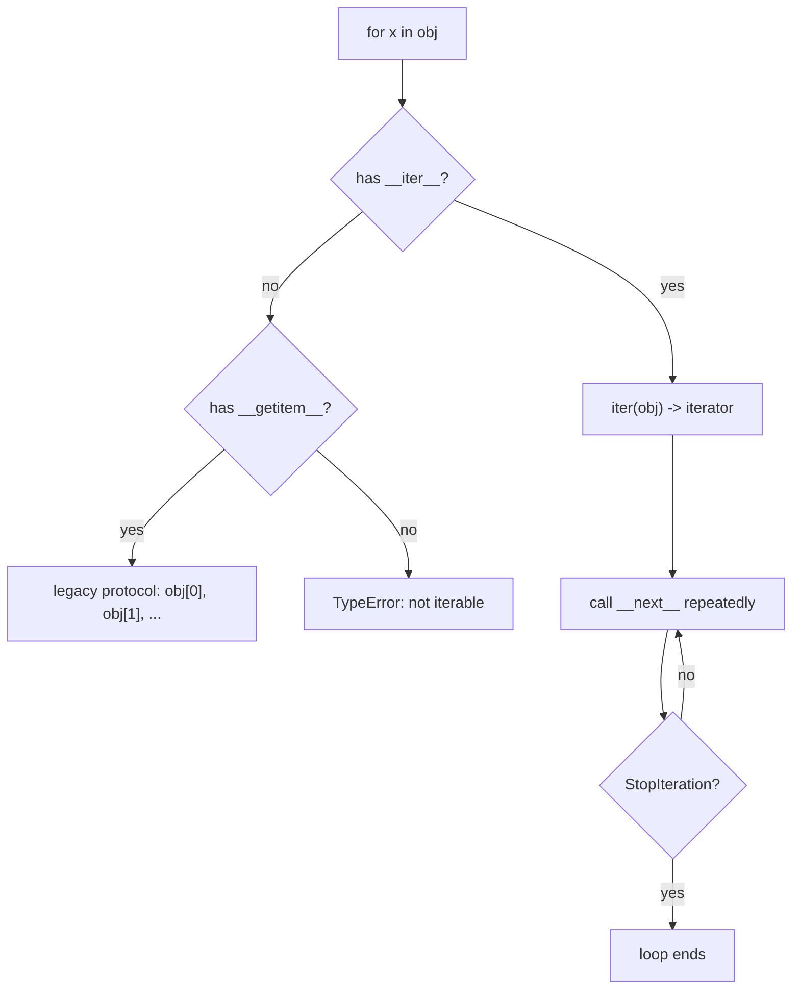

# Python Data Model and Idioms

## TL;DR
Python's "data model" is the protocol layer: you get `len(x)`, `x[i]`, `for y in x`, `with x:` and
`a + b` by implementing dunder methods (`__len__`, `__getitem__`, `__iter__`, `__enter__`, `__add__`).
Everything idiomatic in Python — comprehensions, context managers, generators, duck typing — is
built on this. Interviewers use it to separate "writes Python" from "writes Java in Python".

## Intuition
Python is a language of **protocols, not interfaces**. The interpreter never asks "is this a
Sequence?"; it asks "does this object answer `__getitem__`?". Think of the built-in functions as
polite requests routed to a method on your object: `len(x)` is just a spelling of `type(x).__len__(x)`.
Write the dunder, and the whole language ecosystem — unpacking, slicing, `in`, `sorted`, f-strings —
starts working on your class for free.

## The maths
Not a mathematical topic, but two cost facts are worth stating precisely.

Repeated string or list concatenation in a loop is quadratic. Building a string of $n$ characters by
`s = s + c` copies $1 + 2 + \dots + n$ characters:

$$
\sum_{k=1}^{n} k = \frac{n(n+1)}{2} = \Theta(n^2)
$$

`''.join(parts)` is $\Theta(n)$ because it sizes the buffer once. Same argument applies to
`df = pd.concat([df, row])` inside a loop — the classic slow-pandas bug.

Python's `list.append` is amortised $O(1)$: the list over-allocates geometrically, so $n$ appends
cost $\Theta(n)$ total even though individual appends occasionally reallocate.

## Diagram



## Code

```python
from dataclasses import dataclass, field
from typing import Iterator

@dataclass(frozen=True, slots=True)
class FeatureVector:
    """Immutable, hashable, memory-lean container that behaves like a sequence."""
    name: str
    values: tuple[float, ...] = field(default_factory=tuple)

    def __len__(self) -> int:
        return len(self.values)

    def __getitem__(self, i):
        # slicing returns the same type, not a bare tuple
        if isinstance(i, slice):
            return FeatureVector(self.name, self.values[i])
        return self.values[i]

    def __iter__(self) -> Iterator[float]:
        return iter(self.values)

    def __add__(self, other: "FeatureVector") -> "FeatureVector":
        if len(self) != len(other):
            return NotImplemented          # lets Python try other.__radd__
        return FeatureVector(f"{self.name}+{other.name}",
                             tuple(a + b for a, b in zip(self.values, other.values)))

    def __repr__(self) -> str:
        return f"FeatureVector({self.name!r}, n={len(self)})"

v = FeatureVector("age_scaled", (0.1, 0.7, 0.2))
print(len(v), v[1], v[:2], list(v), v + v)
```

Generators, the idiom that matters most in data work — stream instead of materialise:

```python
def read_jsonl(path):
    """Lazy: memory is O(1) in file size, not O(n)."""
    import json
    with open(path) as fh:                 # __enter__/__exit__ guarantee close
        for line in fh:
            line = line.strip()
            if line:
                yield json.loads(line)

# generator pipeline — nothing is computed until the final consumer pulls
records = read_jsonl("events.jsonl")
paid    = (r for r in records if r.get("plan") == "paid")
amounts = (r["amount"] for r in paid)
total   = sum(amounts)                     # single pass, constant memory
```

A context manager written two ways:

```python
import time
from contextlib import contextmanager

@contextmanager
def timed(label):
    t0 = time.perf_counter()
    try:
        yield
    finally:                               # runs even if the body raises
        print(f"{label}: {time.perf_counter() - t0:.3f}s")

with timed("featurise"):
    xs = [i * i for i in range(10_000)]
```

## In practice
- **Use it when:** you are designing any class more than a bag of attributes — a dataset wrapper, a
  config object, a feature transformer, a retry policy. Implement the two or three dunders that make
  it feel native, not all twenty.
- **Defaults that work:** `@dataclass` for data holders, `frozen=True` when it should be hashable
  and safe as a dict key, `slots=True` when you will create millions of them. `pathlib.Path` over
  string paths. `enumerate`/`zip` over index arithmetic. `collections.defaultdict` and `Counter`
  over manual key checks. f-strings over `%` and `.format`.
- **Breaks when:** you implement `__eq__` without `__hash__` (the class silently becomes unhashable);
  you use a mutable default argument (`def f(x, acc=[])` — the list is created once at definition);
  you iterate a generator twice (the second pass is empty); you mutate a list while looping over it.
- **Cost / latency:** `slots=True` typically cuts per-instance memory substantially by removing the
  instance `__dict__`; generators trade random access for constant memory. Attribute lookup in a hot
  loop is real overhead — hoist `method = obj.method` out of the loop when profiling says so.

## Interview angle

**Q. What is the difference between a list comprehension and a generator expression?**
A list comprehension materialises the whole list eagerly — memory is $O(n)$. A generator expression
produces items lazily on demand — memory is $O(1)$ and the work is interleaved with consumption. Use
the list when you need indexing, `len`, or multiple passes; the generator when you are streaming into
a single consumer such as `sum`, `any`, or a `for` loop. In a Spark/ETL context I default to
generators for file reading so a 20 GB file does not have to fit in the driver's RAM.

**Follow-up.** *So a generator is always better for memory?* → Not always useful: you cannot re-iterate
it, `len()` fails, and if you end up calling `list()` on it anyway you paid the lazy overhead for
nothing. Also, exception tracebacks through deep generator pipelines are harder to read.

**Q. Explain `*args` and `**kwargs`, and when you would use them.**
`*args` collects extra positional arguments into a tuple, `**kwargs` extra keyword arguments into a
dict. They are the right tool when you are writing a wrapper that must forward arguments it does not
own — a decorator, a retry helper, a thin subclass of an sklearn estimator. They are the wrong tool
in a public API you control, because they destroy the signature and the IDE's help. Use keyword-only
arguments (`def f(x, *, threshold=0.5)`) to force callers to be explicit.

**Q. What does `__slots__` do?**
It replaces the per-instance `__dict__` with a fixed array of descriptors, cutting memory per object
and speeding attribute access slightly, at the cost of not being able to add new attributes at runtime
and complicating multiple inheritance. Relevant when you allocate millions of small objects — though
in that situation the better answer is usually a NumPy array or an Arrow table, not a smarter class.

**Q. Why is `a is b` different from `a == b`?**
`is` compares identity (same object in memory), `==` calls `__eq__`. They coincide for small
interned ints and `None` by accident of CPython's caching, which is exactly why `x == None` looks
like it works. Use `is None` / `is not None` for sentinels, `==` for values. In pandas, neither —
use `pd.isna()`, because `np.nan == np.nan` is `False`.

**Q. What is a decorator, in one sentence, and write one.**
A decorator is a callable that takes a function and returns a replacement function, applied with
`@` sugar.

```python
import functools, logging

def retry(times=3, exc=Exception):
    def deco(fn):
        @functools.wraps(fn)            # preserves __name__, __doc__, signature
        def wrapper(*args, **kwargs):
            for attempt in range(1, times + 1):
                try:
                    return fn(*args, **kwargs)
                except exc:
                    if attempt == times:
                        raise
                    logging.warning("retry %s/%s for %s", attempt, times, fn.__name__)
        return wrapper
    return deco
```

**Follow-up.** *Why `functools.wraps`?* → Without it the wrapper masks the original's metadata, which
breaks introspection, `help()`, and anything that dispatches on `__name__` — including some
pickling and MLflow autologging paths.

**Q. What is the GIL and does it matter for your work?**
The Global Interpreter Lock means one thread executes Python bytecode at a time in CPython, so
threads do not speed up pure-Python CPU work. They do help I/O-bound work (API calls, S3 reads)
because the lock is released around blocking I/O. For CPU-bound work use `multiprocessing`, or push
the work into NumPy/BLAS/Spark, which release the GIL in C. Practically: I parallelise embedding API
calls with a thread pool, and parallelise feature computation with Spark, not threads.

## Traps
- **"Tuples are immutable so they are hashable."** Wrong in general — a tuple containing a list is
  unhashable. Hashability is recursive over the contents.
- **"`copy.copy` gives me an independent object."** No — shallow copy shares nested objects. A
  shallow-copied config whose `params` dict is then mutated corrupts the original. Use
  `copy.deepcopy` or, better, immutable structures.
- **Mutable default arguments.** `def add(x, to=[])` shares one list across all calls. Use
  `to=None` then `to = [] if to is None else to`.
- **Late binding in closures.** `[lambda: i for i in range(3)]` gives three functions that all return
  `2`. Bind with a default argument: `lambda i=i: i`.
- **`except:` bare.** It swallows `KeyboardInterrupt` and `SystemExit`. Catch `Exception` at minimum,
  the specific class ideally, and never catch to silently `pass` in a pipeline — that is how a
  training job produces a model from zero rows.
- **"`is` works for string comparison."** It appears to for short literals because of interning, then
  fails in production on strings built at runtime.

## Flashcards
What protocol does `for x in obj` try first, and what is the fallback?::`__iter__`; falls back to the legacy `__getitem__` protocol with integer indices from 0 until `IndexError`.
Why is `s += c` in a loop quadratic?::Strings are immutable, so each concatenation copies the whole prefix: total work is $\sum k = \Theta(n^2)$. Use `''.join(parts)`.
What breaks if you define `__eq__` but not `__hash__`?::Python sets `__hash__ = None`, making instances unhashable — they cannot be dict keys or set members.
When do threads actually help in CPython?::I/O-bound work, because the GIL is released around blocking I/O; not for pure-Python CPU work.
What does `functools.wraps` preserve?::The wrapped function's `__name__`, `__doc__`, `__module__`, `__qualname__` and `__wrapped__` reference.
Difference between `__getattr__` and `__getattribute__`?::`__getattribute__` is called for every attribute access; `__getattr__` only when normal lookup fails.
What is the amortised cost of `list.append` and why?::$O(1)$ — the list over-allocates geometrically, so $n$ appends cost $\Theta(n)$ total.
Safest way to test for a missing value in pandas?::`pd.isna(x)` — `x == np.nan` is always False and `x is None` misses `NaN`/`NaT`.

## Related
- [[python-performance-and-memory]]
- [[oop-and-design-patterns-for-ml]]
- [[testing-python-code]]
- [[numpy-essentials]]
- [[pandas-essentials]]
- [[coding-interview-strategy]]
- [[moc-programming]]
- [[qbank-programming]]
