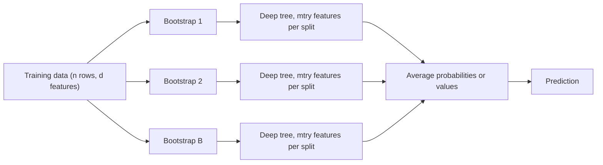

# Random Forest

## TL;DR
Fit many deep decision trees on bootstrap samples, and at every split consider only a random subset of
features. Averaging kills the variance of a single tree; the feature subsampling decorrelates the trees so
the averaging actually works. It is the strongest model you can get with essentially no tuning, and the
honest baseline every gradient-boosting result should be compared against.

## Intuition
Averaging $B$ independent noisy estimates cuts variance by a factor of $B$. Trees fit on bootstrap samples
of the same data are noisy but *not* independent — if one feature dominates, every tree splits on it first
and they all make the same mistakes. Random forest's one real idea beyond bagging is: at each split, hide
most of the features. Now the trees are forced to be different, correlation drops, and the average becomes
much better than any member.

## The maths

### Why averaging helps, and what limits it
Let $B$ trees each have variance $\sigma^2$ and pairwise correlation $\rho$. The variance of their mean is
$$
\operatorname{Var}\!\left(\frac{1}{B}\sum_{b=1}^{B} T_b(x)\right)
= \rho\sigma^2 + \frac{1-\rho}{B}\sigma^2
$$

Read this carefully — it is the entire design of the algorithm:

- The second term $\to 0$ as $B \to \infty$. More trees never hurt, they just stop helping.
- The first term $\rho\sigma^2$ does **not** vanish. The floor on forest variance is set by how correlated
  the trees are.
- Therefore the lever that matters is $\rho$, and `max_features` (`mtry`) is the knob that lowers it.

Bagging alone is the special case `max_features = d`, which leaves $\rho$ high. This is the derivation
interviewers ask for; see also [[bias-variance-tradeoff]].

Averaging leaves bias roughly unchanged (each tree is a nearly-unbiased deep estimator), so the forest
buys variance reduction at essentially no bias cost — which is why the individual trees are grown deep on
purpose.

### Bootstrap and out-of-bag
Each bootstrap sample draws $n$ rows with replacement. The probability a given row is *never* drawn is
$$
\left(1 - \frac{1}{n}\right)^{n} \xrightarrow[n \to \infty]{} e^{-1} \approx 0.368
$$
so about 37% of rows are out-of-bag for each tree. Predicting each row using only the trees that did not
see it gives the **OOB estimate** — a nearly free cross-validated score. With `oob_score=True` you get a
generalisation estimate without a separate holdout, which is genuinely useful on small data.

### Prediction
Regression averages: $\hat{f}(x) = \frac{1}{B}\sum_b T_b(x)$.
Classification averages class probabilities (scikit-learn) rather than taking a hard majority vote —
soft voting is lower-variance and gives usable, if imperfect, probabilities.

### Extremely randomised trees
ExtraTrees pushes decorrelation further: thresholds are drawn at random rather than optimised, and
(by default) no bootstrap is used. Higher bias per tree, lower $\rho$, and much faster to fit since no
threshold search happens. Often a wash in accuracy, sometimes a win on noisy features.

## Diagram



## Code

```python
import numpy as np
from sklearn.datasets import fetch_california_housing
from sklearn.ensemble import RandomForestRegressor
from sklearn.inspection import permutation_importance
from sklearn.model_selection import train_test_split

X, y = fetch_california_housing(return_X_y=True, as_frame=True)
Xtr, Xte, ytr, yte = train_test_split(X, y, test_size=0.2, random_state=0)

rf = RandomForestRegressor(
    n_estimators=500,        # more is never worse, only slower
    max_features=1 / 3,      # regression default heuristic; sqrt(d) for classification
    min_samples_leaf=2,      # the real regularisation knob
    n_jobs=-1,
    oob_score=True,
    random_state=0,
).fit(Xtr, ytr)

print("OOB R^2 :", rf.oob_score_)
print("test R^2:", rf.score(Xte, yte))

# Impurity importance is biased; permutation importance answers "what does the model actually need?"
perm = permutation_importance(rf, Xte, yte, n_repeats=10, random_state=0, n_jobs=-1)
order = np.argsort(perm.importances_mean)[::-1]
for i in order[:5]:
    print(f"{X.columns[i]:<12} {perm.importances_mean[i]:.4f} +/- {perm.importances_std[i]:.4f}")
```

Showing the variance-reduction formula empirically:

```python
preds = np.stack([t.predict(Xte.values) for t in rf.estimators_])   # (B, n_test)
per_tree_var = preds.var(axis=0).mean()
corr = np.corrcoef(preds[:50])[np.triu_indices(50, k=1)].mean()
print(f"mean pairwise tree correlation rho ~ {corr:.3f}")
print(f"single-tree spread {per_tree_var:.3f}; forest variance floor ~ rho * sigma^2")
```

## In practice
- **Use it when:** you want a strong tabular baseline in one line, you have wide-ish noisy data, you need
  OOB scoring because data is scarce, or you need a model that is very hard to misconfigure. In a
  take-home, fitting a random forest first and *then* showing boosting beats it is a strong narrative.
- **Defaults that work:** `n_estimators=300–1000` (stop when OOB flattens), `max_features='sqrt'` for
  classification and $d/3$ for regression, `min_samples_leaf=1` for classification and 2–5 for regression,
  `n_jobs=-1`. Do not tune `max_depth` first — leaf size is the better knob.
- **Breaks when:** you need extrapolation (leaf constants bound predictions to the training target range —
  a forecast of a growing series will flatline, see [[time-series-forecasting]]); classes are heavily
  imbalanced (use `class_weight='balanced_subsample'` and fix the threshold, see
  [[imbalanced-classification]] and [[threshold-selection]]); the signal is a smooth additive function
  where a GLM is both better and simpler.
- **Cost / latency:** memory is the usual surprise — $B$ fully-grown trees on millions of rows can be
  gigabytes. Bound it with `min_samples_leaf` or `max_depth`. Inference is $O(B \cdot D)$ and trivially
  parallel, but 500 trees is 500 traversals, so a boosted model with 200 shallow trees is often faster to
  serve at equal accuracy.

> [!tip]
> In PySpark, `pyspark.ml.classification.RandomForestClassifier` trains by *level*, computing histograms of
> feature values per node in a distributed pass. `maxBins` controls histogram resolution and must be at
> least the cardinality of your largest categorical; that is the error most people hit first.

## Interview angle

**Q. What does a random forest do that bagged trees do not?**
Feature subsampling at each split. Bagging alone reduces the $\frac{1-\rho}{B}\sigma^2$ term but leaves
$\rho\sigma^2$, and with one dominant predictor every bagged tree looks alike so $\rho$ stays near 1.
Restricting each split to `max_features` random columns forces trees to use secondary signal, drops $\rho$,
and lowers the variance floor. That is the whole delta.

**Follow-up.** What if I set `max_features` to the number of features? → You get bagging. And if you set it
to 1 you get near-random trees — high bias, very low correlation. The optimum is data-dependent; $\sqrt{d}$
is a heuristic, not a theorem, and it is the one hyperparameter worth a small grid.

**Q. Can a random forest overfit?**
Not by adding trees — the average converges and test error plateaus rather than rising, which is the
striking difference from boosting. It *can* overfit by having trees that are individually too flexible on
noisy data with large $n$-to-signal ratio, which you control with `min_samples_leaf`. So "random forests
can't overfit" is half-true and saying it flatly is a trap.

**Q. Explain OOB error and when you'd use it instead of cross-validation.**
Each bootstrap leaves out about $e^{-1} \approx 37\%$ of rows; scoring each row on only the trees that
excluded it gives an out-of-sample estimate at no extra fitting cost. Use it on small datasets, or for a
quick check while iterating. Use proper CV when you have preprocessing to include in the fold, grouped or
time-ordered data (OOB assumes exchangeable rows and will leak on a time series), or when you need to
compare against non-forest models on identical folds.

**Q. Random forest vs XGBoost on tabular data — which and why?**
Boosting usually wins on accuracy because it reduces bias by fitting residuals sequentially, while the
forest only reduces variance. But boosting has more knobs and will overfit if you let it run long without
early stopping. I default to a forest for the baseline and a first look at feature importance, then move to
XGBoost with early stopping when the accuracy delta is worth the tuning time. On very noisy targets or tiny
data the forest sometimes wins outright. See [[vs-xgboost-vs-neural-networks]] and [[bagging-vs-boosting]].

**Q. Your forest's top feature is `customer_id`. What happened?**
Two things to check. First, impurity importance is biased toward high-cardinality features, so a
meaningless ID can look important. Second and worse, if the ID correlates with the label — e.g. IDs issued
sequentially and the label drifted over time — that is leakage, and the model will collapse in production.
Drop it and re-measure with permutation importance. See [[data-leakage]].

## Traps
- **"Random forests can't overfit."** They do not overfit in $B$, but individually unconstrained trees on
  noisy data still overfit; only the variance from tree-to-tree randomness is averaged away, not the shared
  bias of a bad feature set.
- **Using `feature_importances_` in a slide deck.** It is mean impurity decrease — biased by cardinality
  and split arbitrarily between correlated features. Permutation importance on a held-out set, or SHAP, is
  what you show.
- **Expecting calibrated probabilities out of the box.** Averaging many overconfident trees pulls
  probabilities toward the middle: forests are typically *under*-confident, sigmoid-shaped on a reliability
  plot. Calibrate if the probability is the product ([[probability-calibration]]).
- **Setting `n_estimators` small to "avoid overfitting."** That only adds variance. Set it as large as your
  budget allows and control complexity with leaf size.
- **Bootstrapping time series or grouped data.** Resampling rows with replacement destroys temporal order
  and duplicates group members across in-bag and OOB, inflating OOB scores. Use blocked/rolling validation
  ([[time-series-features-and-validation]]) or `GroupKFold`.
- **Forgetting the memory cost.** 1000 unconstrained trees on 10M rows will not fit where you think it
  will; this is the most common production-surprise with forests.

## Flashcards
Give the variance of an average of B trees with pairwise correlation rho.::$\rho\sigma^2 + \frac{1-\rho}{B}\sigma^2$ — more trees kill the second term only; `max_features` lowers $\rho$.
What fraction of rows is out-of-bag per tree, and why?::About 37%, since $(1-1/n)^n \to e^{-1}$.
Why are random-forest trees grown deep?::Averaging removes variance but not bias, so each member should be low-bias; depth buys that.
Default `max_features` heuristics?::$\sqrt{d}$ for classification, $d/3$ for regression — heuristics, worth a small grid.
Does adding trees to a random forest cause overfitting?::No — test error plateaus. Contrast boosting, where too many rounds does overfit.
How do ExtraTrees differ?::Split thresholds are drawn at random instead of optimised (and usually no bootstrap), giving lower correlation and faster fits at higher per-tree bias.
Are random-forest probabilities calibrated?::Usually under-confident (pulled toward 0.5) because of averaging; calibrate if you need true probabilities.

## Related
- [[decision-trees]] — the base learner and why it is unstable
- [[bagging-vs-boosting]] — the two ensembling philosophies side by side
- [[gradient-boosting]] — the sequential alternative that reduces bias
- [[bias-variance-tradeoff]] — the decomposition the $\rho\sigma^2$ formula sits inside
- [[ensemble-stacking-and-blending]] — combining a forest with other model families
- [[model-interpretability-shap-lime]] — the right way to read importance
