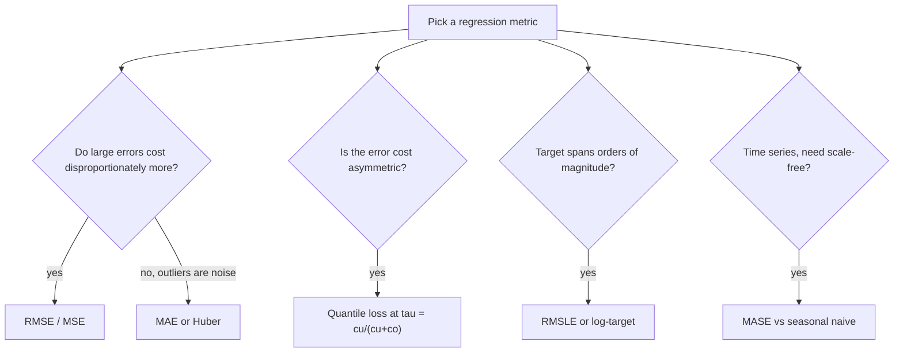

# Regression Metrics

## TL;DR
MSE/RMSE punishes large errors quadratically and its minimiser is the conditional **mean**; MAE
punishes linearly and its minimiser is the conditional **median**. That difference — not "RMSE is in
the same units" — is the real distinction and it decides which one you should use. MAPE is seductive
and broken near zero and asymmetric against over-prediction. $R^2$ is a comparison against the mean
baseline, not a goodness measure, and it can be negative out of sample.

## Intuition
The metric you minimise is a statement about which point of the conditional distribution you want to
predict. If you are forecasting demand and being short costs more than being long, squaring the
error asserts they cost the same. Choosing a loss is choosing a functional of $P(y \mid x)$.

## The maths

With $n$ points, truth $y_i$, prediction $\hat{y}_i$, residual $e_i = y_i - \hat{y}_i$:

$$
\begin{aligned}
\text{MSE} &= \frac{1}{n}\sum_i e_i^2, &\qquad \text{RMSE} &= \sqrt{\text{MSE}} \\[4pt]
\text{MAE} &= \frac{1}{n}\sum_i |e_i|, &\qquad \text{MedAE} &= \operatorname{med}_i |e_i| \\[4pt]
\text{MAPE} &= \frac{100}{n}\sum_i \left|\frac{e_i}{y_i}\right|, &\qquad
\text{sMAPE} &= \frac{100}{n}\sum_i \frac{|e_i|}{(|y_i| + |\hat{y}_i|)/2}
\end{aligned}
$$

**The minimiser argument — derive this, it is the question.** For squared error,

$$
\frac{\partial}{\partial c}\,\mathbb{E}\big[(Y - c)^2\big] = -2\,\mathbb{E}[Y - c] = 0
\;\Longrightarrow\; c^\star = \mathbb{E}[Y]
$$

For absolute error, $\mathbb{E}|Y - c| = \int_{-\infty}^{c}(c-y)f(y)\,dy + \int_c^{\infty}(y-c)f(y)\,dy$,
so

$$
\frac{\partial}{\partial c}\,\mathbb{E}|Y - c| = F(c) - (1 - F(c)) = 2F(c) - 1 = 0
\;\Longrightarrow\; F(c^\star) = \tfrac{1}{2}
$$

i.e. the median. Consequence: on a right-skewed target, an MSE-trained model predicts systematically
higher than an MAE-trained one, and neither is "wrong" — they answer different questions. If the
business sums your predictions (total revenue, total units), you need the **mean**, so MSE. If the
business reads a single typical prediction, the **median** is often what they mean.

**Quantile (pinball) loss** generalises both and lets you state asymmetry directly:

$$
L_\tau(y, \hat{y}) =
\begin{cases}
\tau\,(y - \hat{y}), & y \ge \hat{y}\\
(1-\tau)\,(\hat{y} - y), & y < \hat{y}
\end{cases}
$$

Its minimiser is the $\tau$-quantile; $\tau = 0.5$ recovers MAE (up to a factor of 2). For inventory
where a stock-out costs 4× a holding unit, $\tau = 4/5 = 0.8$ — the classic newsvendor result
$\tau = c_u/(c_u + c_o)$.

**Huber loss** — quadratic near zero, linear in the tails, so it is differentiable everywhere and
robust to outliers:

$$
L_\delta(e) =
\begin{cases}
\tfrac{1}{2}e^2, & |e| \le \delta\\
\delta\left(|e| - \tfrac{1}{2}\delta\right), & |e| > \delta
\end{cases}
$$

**$R^2$ and why it can be negative:**

$$
R^2 = 1 - \frac{\sum_i (y_i - \hat{y}_i)^2}{\sum_i (y_i - \bar{y})^2} = 1 - \frac{SS_{\text{res}}}{SS_{\text{tot}}}
$$

$R^2 = 0$ means "no better than predicting $\bar{y}$". On a test set, $\bar{y}$ is the *training*
mean applied to test data, and a bad model can do worse than that — hence negative $R^2$, which is
perfectly possible and is not a bug. Adjusted $R^2$ penalises added predictors:

$$
R^2_{\text{adj}} = 1 - (1 - R^2)\,\frac{n-1}{n - p - 1}
$$

**RMSLE** for multiplicative / long-tailed targets:

$$
\text{RMSLE} = \sqrt{\frac{1}{n}\sum_i \big(\ln(1+\hat{y}_i) - \ln(1+y_i)\big)^2}
$$

It measures *relative* error and penalises under-prediction more than over-prediction, which is
often what you want for demand.

**MASE** — the scale-free forecasting metric that actually works:

$$
\text{MASE} = \frac{\text{MAE}(\text{model})}{\frac{1}{n-m}\sum_{t=m+1}^{n}|y_t - y_{t-m}|}
$$

denominator = in-sample MAE of the seasonal-naive forecast with period $m$. MASE < 1 beats
seasonal-naive; MASE > 1 means you lost to the trivial baseline. No division by $y_i$, so no
blow-up at zero.

## Diagram



## Code

```python
import numpy as np
from sklearn.metrics import (
    mean_squared_error, mean_absolute_error, r2_score,
    median_absolute_error, mean_absolute_percentage_error,
)

y = np.array([10.0, 12.0, 9.0, 11.0, 400.0])       # one genuine extreme value
pred_mse_like = np.array([10.0, 12.0, 9.0, 11.0, 300.0])
pred_mae_like = np.array([10.5, 11.5, 9.5, 10.5,  12.0])   # ignores the tail

for name, p in [("chases the tail", pred_mse_like), ("ignores the tail", pred_mae_like)]:
    print(f"{name:>16}  RMSE={mean_squared_error(y, p) ** 0.5:8.2f} "
          f"MAE={mean_absolute_error(y, p):7.2f} "
          f"MedAE={median_absolute_error(y, p):5.2f} "
          f"R2={r2_score(y, p):6.3f}")
```

RMSE prefers the model that chases the tail; MAE and MedAE prefer the one that ignores it. Which is
correct depends entirely on whether that 400 is a real event you must forecast or a data error.

MAPE's asymmetry, demonstrated:

```python
y_true = np.array([100.0])
print("under by 50:", mean_absolute_percentage_error(y_true, np.array([50.0])))   # 0.50
print("over  by 50:", mean_absolute_percentage_error(y_true, np.array([150.0])))  # 0.50
# Symmetric here — but the bound is not:
print("predict 0  :", mean_absolute_percentage_error(y_true, np.array([0.0])))    # 1.00, capped
print("predict 300:", mean_absolute_percentage_error(y_true, np.array([300.0])))  # 2.00, unbounded
```

Under-prediction can never exceed 100% error while over-prediction is unbounded, so a
MAPE-optimising model is systematically biased **low**. That is the asymmetry that matters, and it is
why demand-forecasting teams that report MAPE quietly under-forecast.

Quantile regression when the costs are asymmetric:

```python
import lightgbm as lgb

# Stock-out costs 4x the holding cost -> newsvendor tau = 4 / (4 + 1) = 0.8
model = lgb.LGBMRegressor(objective="quantile", alpha=0.8, n_estimators=400)
# model.fit(X_train, y_train)  # predicts the 80th percentile of demand
```

Huber for a target with contaminated labels:

```python
from sklearn.linear_model import HuberRegressor
hub = HuberRegressor(epsilon=1.35)   # 1.35 gives ~95% efficiency under Gaussian noise
```

## In practice
- **Use it when:** any continuous target. State the metric *and* the baseline it beats.
- **Defaults that work:** RMSE as the training objective, with MAE and a residual plot as
  diagnostics; $R^2$ only for stakeholder communication with the caveat attached; MASE for time
  series; quantile loss whenever someone says "being under is worse than being over".
- **Breaks when:** the target is heavy-tailed and RMSE is dominated by three rows; when the target
  crosses or approaches zero and you chose MAPE; when you aggregate RMSE across segments with very
  different scales — a global RMSE on a mix of ₹100 and ₹10,00,000 items tells you about the large
  items and nothing else. Report per-segment.
- **Cost / latency:** free, but choosing a non-standard loss changes the *training* objective and
  therefore the model, so it is not a post-hoc reporting decision.

> [!tip]
> Always report a baseline alongside: mean-prediction for cross-sectional data, seasonal-naive for
> time series. "RMSE 340" means nothing; "RMSE 340 versus 520 for seasonal-naive" is a result.

## Interview angle

**Q. RMSE or MAE — how do you choose?**
By what the business does with the number and by what the errors mean. Squared error's population
minimiser is the conditional mean, absolute error's is the conditional median. If the predictions
are summed — total revenue, total capacity — I need the mean, so RMSE. If the target has heavy tails
from noise rather than signal, MAE (or Huber) refuses to let three rows steer the fit. And
operationally: does an error twice as large hurt twice as much (MAE) or four times as much (RMSE)?
Overbooking an aircraft has quadratic-ish pain; being ₹10 off on a ₹1000 price does not.

**Follow-up.** Give a case where they disagree in ranking. → Any right-skewed target. A model that
nails the bulk and ignores the tail wins on MAE and loses on RMSE. That is not a tiebreak, it is
the two metrics correctly reporting different things.

**Q. Why is $R^2$ sometimes negative on the test set?**
$R^2 = 1 - SS_{res}/SS_{tot}$ where $SS_{tot}$ uses the mean. On held-out data that mean comes from
training, so the denominator is the error of a fixed baseline predictor. A model that is worse than
always predicting the training mean gives $SS_{res} > SS_{tot}$ and $R^2 < 0$. It usually signals
distribution shift or severe overfitting, not a computation error.

**Q. What is wrong with MAPE?**
Three things. It is undefined at $y = 0$ and explodes near it. It is bounded at 100% for
under-prediction but unbounded for over-prediction, so optimising it biases forecasts low — a real
and expensive effect in retail demand. And it weights errors on small-value items far more than on
large-value items, which is usually the opposite of the business priority. If I need a
percentage-flavoured number I would use weighted MAPE (sum of absolute errors over sum of actuals),
and for time series I would use MASE against a seasonal-naive baseline.

**Q. Demand forecasting: stock-outs cost four times as much as excess stock. What do you optimise?**
Not RMSE — it asserts symmetric cost. I would train with quantile (pinball) loss at
$\tau = c_u/(c_u + c_o) = 4/5 = 0.8$, so the model predicts the 80th percentile of demand and
systematically over-forecasts by exactly the amount the cost ratio justifies. That is the newsvendor
solution. I would evaluate with the realised total cost, and report pinball loss at several
quantiles so the planners can see the whole predictive distribution rather than one number.

**Q. Your RMSE improved but the business says nothing changed. What happened?**
Likely the improvement is concentrated where it does not matter — a big drop in error on
low-value SKUs, or on rows outside the decision. I would decompose RMSE by segment and by value
band, and re-express the result in the business's units: rupees of avoided stock-out, hours of
analyst time. If the decision is a threshold (order or don't), squared error on the raw prediction
may not be the right objective at all.

## Traps
- **"RMSE is better because it is in the same units as $y$."** So is MAE. The real difference is the
  minimiser (mean vs median) and the quadratic weighting of large errors.
- **Reporting $R^2$ as a quality grade.** $R^2 = 0.3$ can be excellent for stock returns and
  terrible for a calibrated sensor. It is relative to the variance of the target.
- **Using MAPE on a target that can be zero.** Division by zero or a meaningless 10,000%.
- **Comparing RMSE across different datasets or time periods.** Scale-dependent. Use MASE or a
  normalised metric.
- **Optimising MSE while the loss used at training was something else.** If you trained with a log
  target, evaluate after inverting to the original units — and remember $\exp$ of the log-space
  prediction is a median, not a mean.
- **Ignoring bias.** A model can have good RMSE and a persistent $+8\%$ bias. Always check
  $\frac{1}{n}\sum e_i$ separately; systematic bias compounds when predictions are summed.
- **Reporting only the aggregate.** Residuals vs fitted, and error by segment, catch things no
  scalar does.

## Flashcards
Minimiser of squared error vs absolute error::Squared error is minimised by the conditional mean; absolute error by the conditional median.
Derive why MAE gives the median::d/dc E|Y-c| = F(c) - (1-F(c)) = 2F(c) - 1 = 0, so F(c*) = 0.5.
Why can test-set R2 be negative::SS_tot uses the training mean as a fixed baseline; a model worse than that baseline gives SS_res > SS_tot.
Three problems with MAPE::Undefined at y=0, bounded at 100% below but unbounded above (biases forecasts low), and over-weights small-value items.
Newsvendor quantile::tau = c_underage / (c_underage + c_overage) — train with pinball loss at that tau.
What is MASE and why use it::MAE divided by the in-sample MAE of the seasonal-naive forecast; scale-free, no division by y, and MASE < 1 means you beat the trivial baseline.
Huber loss::Quadratic within delta of zero, linear beyond — differentiable everywhere and robust to target outliers.
RMSLE measures what::Relative (multiplicative) error, penalising under-prediction more than over-prediction.

## Related
- [[classification-metrics]]
- [[linear-regression]]
- [[time-series-forecasting]]
- [[gradient-boosting]]
- [[outlier-detection]]
- [[feature-scaling-and-transforms]]
- [[case-demand-forecasting]]
- [[requirements-and-metrics-definition]]
