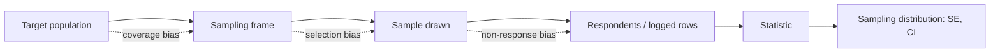

# Sampling and Sampling Distributions

## TL;DR
A sampling distribution is the distribution of a *statistic* across hypothetical repeated samples;
its standard deviation is the standard error. Everything in inference — CIs, p-values, power —
is a statement about that distribution. The practical half of the interview is about *sampling
bias*: a $\sqrt{n}$ reduction in variance is worthless if the frame is wrong, because bias does
not shrink with $n$.

## Intuition
Draw 500 users, compute the mean order value, write it down. Do it again. And again. The histogram
of those written-down numbers is the sampling distribution of the mean. You only ever get one draw
from it in real life, so the whole of frequentist statistics is machinery for reasoning about the
histogram you never see.

## The maths

Let $X_1,\dots,X_n$ be i.i.d. with mean $\mu$ and variance $\sigma^2$. For $\bar{X}_n = \frac1n\sum X_i$:

$$
\mathbb{E}[\bar{X}_n] = \mu,
\qquad
\operatorname{Var}(\bar{X}_n) = \frac{\sigma^2}{n},
\qquad
\mathrm{SE}(\bar{X}_n) = \frac{\sigma}{\sqrt{n}}
$$

The variance result uses independence: $\operatorname{Var}(\sum X_i)=\sum\operatorname{Var}(X_i)$
only when covariances vanish. **This is the assumption that breaks in practice**, and it is the
source of most real-world under-estimated standard errors (clustered users, repeated sessions
from the same person, time-correlated events).

**Clustering.** If observations come in $m$ clusters of size $k$ ($n=mk$) with intra-cluster
correlation $\rho$, the true variance of the mean is inflated by the *design effect*:

$$
\mathrm{DEFF} = 1 + (k-1)\rho,
\qquad
\operatorname{Var}(\bar{X}) = \frac{\sigma^2}{n}\,\mathrm{DEFF}
$$

With 10 events per user and $\rho=0.3$, DEFF $=3.7$: your naive SE is off by a factor of
$\sqrt{3.7}\approx1.9$ and your "significant" result is not.

**Finite population correction**, when sampling $n$ without replacement from a population of $N$:

$$
\mathrm{SE} = \frac{\sigma}{\sqrt{n}}\sqrt{\frac{N-n}{N-1}}
$$

Negligible unless $n/N > 0.05$.

**Sample proportion.** For $\hat{p}$ from $n$ Bernoulli draws, $\mathrm{SE}=\sqrt{p(1-p)/n}$,
maximised at $p=0.5$ — which is why conversion-rate experiments on rare events need far more
traffic (see [[statistical-power-and-sample-size]]).

**Bias vs variance of an estimator.** Mean squared error decomposes as

$$
\mathrm{MSE}(\hat\theta) = \operatorname{Bias}(\hat\theta)^2 + \operatorname{Var}(\hat\theta)
$$

More data drives the second term to zero and leaves the first untouched. A biased frame is a
permanent error.

**Stratified sampling.** Split into $H$ strata with weights $W_h=N_h/N$ and sample $n_h$ from each:

$$
\bar{X}_{\mathrm{str}} = \sum_h W_h \bar{X}_h,
\qquad
\operatorname{Var}(\bar{X}_{\mathrm{str}}) = \sum_h W_h^2 \frac{\sigma_h^2}{n_h}
$$

This is always $\le$ the simple-random-sample variance when strata differ in mean, because the
between-stratum variance is removed from the error term. Neyman allocation
($n_h \propto W_h\sigma_h$) minimises it.

## Diagram



The dotted arrows are bias; only the solid path shrinks with $n$.

## Code

```python
import numpy as np
from scipy import stats

rng = np.random.default_rng(0)
pop = rng.lognormal(mean=7.0, sigma=1.1, size=500_000)   # skewed population

# empirical sampling distribution of the mean
n = 500
means = np.array([rng.choice(pop, n, replace=False).mean() for _ in range(5_000)])
print("theory SE :", pop.std(ddof=1) / np.sqrt(n))
print("empirical :", means.std(ddof=1))       # agrees to ~1%

# clustering: 10 events per user, users differ -> naive SE is far too small
m, k, rho_driver = 500, 10, 3.0
user_effect = rng.normal(0, rho_driver, m).repeat(k)
noise = rng.normal(0, 1.0, m * k)
y = 10 + user_effect + noise

naive_se = y.std(ddof=1) / np.sqrt(m * k)
user_means = y.reshape(m, k).mean(axis=1)
cluster_se = user_means.std(ddof=1) / np.sqrt(m)     # correct unit of analysis = user
print(f"naive SE {naive_se:.4f} vs clustered SE {cluster_se:.4f}")
print("inflation factor:", round(cluster_se / naive_se, 2))

# stratification beats SRS when strata means differ
strata = np.array_split(np.sort(pop), 4)
W = np.array([len(s) for s in strata]) / len(pop)
srs = np.array([rng.choice(pop, 400).mean() for _ in range(2000)])
strat = np.array([
    sum(w * rng.choice(s, 100).mean() for w, s in zip(W, strata))
    for _ in range(2000)
])
print("SRS SE", round(srs.std(ddof=1), 2), "stratified SE", round(strat.std(ddof=1), 2))
```

## In practice
- **Use it when:** any time you compute a metric on a subset and talk about it as if it were the
  population — which is every dashboard, every eval set, every A/B test.
- **Defaults that work:** choose the unit of analysis to match the unit of randomisation (user,
  not event); stratify on the one or two variables you know drive the metric (city tier, platform,
  new vs returning); for model evaluation, stratify the test split by label when classes are
  imbalanced — see [[train-test-validation-split]].
- **Breaks when:** rows are not independent (repeat users, sessions, time series), the frame
  excludes part of the population (logged-in-only telemetry), or the sample is self-selected
  (NPS respondents, support tickets). None of these are fixed by more data.
- **Cost / latency:** halving the SE costs 4× the data. This single fact decides whether an
  experiment is feasible in the traffic you have.

> [!warning]
> For time series, never sample rows at random — you leak the future into the past. Split by time.
> See [[time-series-features-and-validation]].

## Interview angle

**Q. What is a sampling distribution and why should I care?**
It is the distribution of a statistic over repeated samples from the same population. Its spread,
the standard error, is what a confidence interval and a p-value are computed from. Without it, a
sample estimate is just a number with no notion of how much it would have moved had you drawn a
different Tuesday's users.

**Q. You run an experiment on 2 million events from 40,000 users and get p = 0.01. Do you believe it?**
Not as stated. Randomisation was almost certainly at user level, so the unit of analysis must be the
user, not the event. With, say, 50 events per user and intra-user correlation 0.2, the design effect
is $1+49(0.2)\approx 10.8$, so the true SE is about 3.3× larger. Recompute on user-level aggregates,
or use a cluster-robust / bootstrap-by-user standard error.

**Follow-up.** How do you actually fix it in code? → Aggregate to one row per user and test on that,
or resample whole users in a bootstrap. Both preserve the dependence structure.
See [[resampling-bootstrap-and-permutation]].

**Q. Your survey of app users shows 80% satisfaction. What is wrong?**
Non-response and self-selection. Satisfied and furious users respond at different rates than the
silent middle, so the frame ≠ the population. Estimate the response rate by segment, reweight to
known population margins (post-stratification), and report the estimate as an upper bound on
certainty, not a point fact. Increasing the sample size does not touch this bias.

**Q. When would you deliberately oversample a group?**
When a subgroup is rare but decision-relevant — fraud cases, tier-3 cities, a new product surface.
Oversample for estimation precision within that group, then reweight by $W_h$ when reporting the
overall number. In modelling this is the same logic as class rebalancing; the weights must be
carried through to any probability you calibrate. See [[imbalanced-classification]].

**Q. What is the difference between the standard deviation and the standard error?**
SD describes the spread of individual observations and does not shrink with $n$. SE describes the
spread of a statistic and shrinks as $1/\sqrt{n}$. Reporting SD error bars on a mean overstates the
uncertainty; reporting SE bars on a distribution understates the spread.

## Traps
- **Treating rows as independent when they are not.** The most common cause of fake significance in
  industry. Match the unit of analysis to the unit of randomisation.
- **"Big data means I do not need sampling theory."** With $n=10^8$ everything is significant and
  nothing is necessarily important. Big $n$ shrinks variance, not bias; report effect sizes and CIs.
- **Sampling the post-filter population.** Computing conversion on "users who reached checkout"
  after the treatment changed who reaches checkout is conditioning on a post-treatment variable —
  a collider, and a guaranteed bias. See [[causal-inference-basics]].
- **Assuming the sampling distribution of the mean is normal at any $n$.** It is normal only
  asymptotically, and heavy tails slow that down badly. See [[central-limit-theorem]].
- **Forgetting FPC when sampling a large fraction of a small population.** Over-wide intervals,
  which looks conservative but wastes budget.
- **Random row sampling in Spark for a temporal metric.** `df.sample(0.01)` on an events table
  spreads your sample across the whole history and hides recency effects; sample within time
  windows instead.

## Flashcards
Standard error of the sample mean::σ/√n, the standard deviation of the sampling distribution of the mean.
Design effect for clustered data::DEFF = 1 + (k−1)ρ, with k the cluster size and ρ the intra-cluster correlation; multiply the naive variance by it.
Bias vs variance of an estimator under more data::Variance shrinks as 1/n; bias does not shrink at all.
When is the finite population correction needed::When the sampling fraction n/N exceeds roughly 5%.
Why stratified sampling lowers variance::It removes the between-stratum component from the error term; Neyman allocation n_h ∝ W_h σ_h minimises what is left.
SE of a sample proportion::√(p(1−p)/n), largest at p = 0.5, so rare events need much more traffic.
Correct unit of analysis in an A/B test::The unit of randomisation, usually the user, not the event or session.
Cost of halving the standard error::Four times the sample size.

## Related
- [[central-limit-theorem]]
- [[confidence-intervals]]
- [[statistical-power-and-sample-size]]
- [[resampling-bootstrap-and-permutation]]
- [[ab-testing-design]]
- [[descriptive-statistics]]
- [[moc-stats]]
