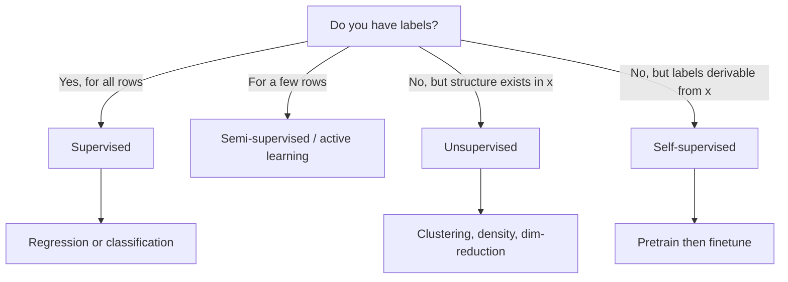

# Supervised vs Unsupervised Learning

## TL;DR
Supervised learning estimates $P(y \mid x)$ from labelled pairs and has an objective measurable on
held-out data. Unsupervised learning estimates structure in $P(x)$ — clusters, density, a
lower-dimensional manifold — and has no ground truth, so its evaluation is either a proxy metric or
a downstream task. Self-supervised learning is the important third box: it manufactures labels from
the data itself, which is how every modern LLM is trained.

## Intuition
Supervised is studying with an answer key; unsupervised is sorting a box of unlabelled photographs
into piles and then arguing about whether the piles are the right ones. The argument is the problem:
with no answer key there is no external referee, so any unsupervised result needs a downstream
consumer to justify it.

## The maths

**Supervised.** Given $\{(x_i, y_i)\}_{i=1}^n \sim \mathcal{D}$, minimise empirical risk

$$
\hat{R}(f) = \frac{1}{n}\sum_{i=1}^{n} L\big(y_i, f(x_i)\big)
$$

as a stand-in for true risk $R(f) = \mathbb{E}_{(x,y)\sim\mathcal{D}}[L(y, f(x))]$. Held-out data
gives an unbiased estimate of $R$, which is the whole reason supervised learning is tractable to
validate.

**Unsupervised.** Given $\{x_i\}$ only, estimate a model of $P(x)$ or a structural summary.
Density estimation maximises likelihood $\sum_i \log p_\theta(x_i)$; clustering minimises an internal
criterion such as within-cluster sum of squares
$\sum_{k}\sum_{i \in C_k}\lVert x_i - \mu_k\rVert_2^2$; [[dimensionality-reduction-pca]] minimises
reconstruction error $\sum_i \lVert x_i - U U^\top x_i \rVert_2^2$ over orthonormal $U$. None of
these is a measure of *correctness* — only of internal consistency.

**Self-supervised.** Split $x$ into $(x_{\text{obs}}, x_{\text{hidden}})$ and do supervised learning
on the pair. Next-token prediction is $L = -\sum_t \log p_\theta(x_t \mid x_{<t})$; masked language
modelling is the same with a random mask. The label is free because it was already in the data.

**Semi-supervised.** $n_\ell$ labelled plus $n_u \gg n_\ell$ unlabelled points; objective
$\hat{R}_\ell(f) + \lambda \Omega(f, \{x_j\}_{u})$ where $\Omega$ is a consistency or smoothness
penalty encoding "similar inputs should get similar outputs".

**Reinforcement learning** sits outside both: no fixed dataset, a policy $\pi$ generates its own
data, and the objective is $\mathbb{E}_\pi[\sum_t \gamma^t r_t]$.

## Diagram



## Code

```python
import numpy as np
from sklearn.datasets import make_blobs
from sklearn.cluster import KMeans
from sklearn.linear_model import LogisticRegression
from sklearn.metrics import silhouette_score, adjusted_rand_score, accuracy_score
from sklearn.model_selection import train_test_split

X, y = make_blobs(n_samples=600, centers=3, cluster_std=1.4, random_state=0)

# Supervised: an honest held-out number exists.
Xtr, Xte, ytr, yte = train_test_split(X, y, test_size=0.3, random_state=0)
clf = LogisticRegression(max_iter=1000).fit(Xtr, ytr)
print("supervised accuracy:", round(accuracy_score(yte, clf.predict(Xte)), 3))

# Unsupervised: only internal metrics, unless you cheat with labels you would not have.
km = KMeans(n_clusters=3, n_init=10, random_state=0).fit(X)
print("silhouette (no labels needed):", round(silhouette_score(X, km.labels_), 3))
print("ARI vs true labels (evaluation only):", round(adjusted_rand_score(y, km.labels_), 3))

# Self-supervised in miniature: predict a held-out coordinate from the others.
Z = np.column_stack([X, X[:, 0] * 0.5 + np.random.RandomState(0).normal(0, 0.1, len(X))])
# feature 2 is predictable from feature 0 -> a free supervised task with no human labels
```

## In practice
- **Use it when:** supervised whenever labels exist or can be bought — it is strictly easier to
  validate. Unsupervised for exploration, segmentation, [[anomaly-detection]] with no labelled
  anomalies, and as a feature-generation step feeding a supervised model.
- **Defaults that work:** if you have 200 labels and 2 million unlabelled rows, do not jump to
  semi-supervised — first try a strong representation (embeddings, PCA) plus a simple supervised
  model, and spend a day labelling 800 more rows. Hand labelling beats clever tricks more often
  than people admit.
- **Breaks when:** you report an unsupervised result as if it were validated. A silhouette of 0.55
  means the clusters are geometrically tidy, not that they are the segments marketing cares about.
  Always land an unsupervised result on a downstream supervised or business metric.
- **Cost / latency:** unsupervised pipelines are cheap to build and expensive to defend; supervised
  pipelines are the reverse. Budget labelling time explicitly.

> [!tip]
> The strongest practical pattern in 2020s classical ML is **self-supervised representation +
> small supervised head**: embed text or entities with a pretrained model ([[embeddings]]), then fit
> logistic regression or [[gradient-boosting]] on a few thousand labels.

## Interview angle

**Q. Is k-means supervised or unsupervised, and how would you pick k?**
Unsupervised. Pick $k$ by a combination of elbow on inertia, silhouette, and — decisively — the
downstream use. If the business can run four campaigns, $k=4$ is the answer regardless of what the
elbow says. Details in [[clustering-kmeans]].

**Follow-up.** *Your silhouette peaks at k=2 but the business wants 6 segments.* → Say so plainly:
the data supports two natural groups; six is an operational partition, not a discovered one. Deliver
six but report stability (how often points swap clusters across bootstrap resamples) so they know
how much to trust the boundaries.

**Q. Where does self-supervised learning sit and why does it matter commercially?**
It is supervised learning on labels manufactured from the input, which makes the effectively
infinite unlabelled corpus usable. Commercially it decouples the expensive part (pretraining, done
once by someone else) from the cheap part (finetuning or prompting on your few thousand labels) —
see [[transfer-learning-and-finetuning]] and [[llm-pretraining]].

**Q. You have 50k rows, 300 labelled. What do you do?**
In order: (1) define the label crisply and check the 300 for label noise; (2) build a strong
representation from all 50k — embeddings or PCA, which is legitimate unsupervised use; (3) fit a
regularised linear model on the 300 with cross-validation, expecting wide error bars; (4) use
uncertainty sampling to choose the next 300 to label — active learning gets more per labelling hour
than random sampling. Report a confidence interval, not a point estimate, at this sample size.

**Q. Can you use the target to build clusters and then use the clusters as a feature?**
Not if the clustering saw the target — that is [[data-leakage]]. Clustering on features only is
fine, but it must be fitted inside the cross-validation fold, same as any other transform.

## Traps
- **"Unsupervised means no evaluation."** It means no *ground truth*. You still evaluate: stability
  under resampling, internal indices, and downstream lift.
- **Calling anomaly detection unsupervised when you have labels.** If you have even a few hundred
  confirmed anomalies, a supervised model with heavy class weighting usually beats an unsupervised
  detector. Check before defaulting.
- **Treating PCA components as interpretable factors.** They are orthogonal directions of variance,
  not latent business concepts, and their signs are arbitrary.
- **Using cluster labels as a target for a classifier and calling the accuracy a result.** You are
  measuring how well a classifier reproduces k-means, which tells you nothing about the world.
- **Semi-supervised by naive self-training without checks.** Pseudo-labelling with a weak model
  amplifies its own errors; gate on a high confidence threshold and re-measure on the real labelled
  holdout each round.

## Flashcards
Supervised objective::Minimise empirical risk (1/n)Σ L(y_i, f(x_i)) as a proxy for true risk, validated on held-out data.
Why is unsupervised learning hard to validate::There is no ground truth, so only internal criteria (inertia, silhouette) or downstream task performance can judge it.
What is self-supervised learning::Supervised learning where the label is derived from the input itself — e.g. next-token prediction — giving free labels at corpus scale.
Semi-supervised objective shape::Labelled loss + λ × a consistency/smoothness penalty over unlabelled points.
Best default when labels are scarce::Pretrained representation + small regularised supervised head, plus active learning to spend labelling effort well.
Common leakage in unsupervised preprocessing::Fitting a clustering or PCA on the full dataset including the test fold — fit it inside the fold.

## Related
- [[ml-problem-framing]]
- [[clustering-kmeans]]
- [[dimensionality-reduction-pca]]
- [[anomaly-detection]]
- [[transfer-learning-and-finetuning]]
- [[data-leakage]]
- [[moc-classical-ml]]
