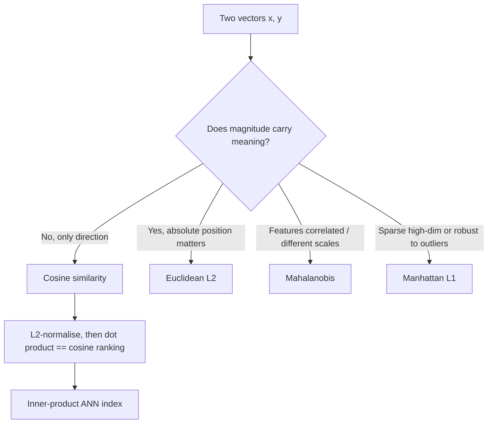

# Vector Norms and Distances

## TL;DR
A norm measures the size of a vector; a distance measures how far apart two of them are. Which one you pick silently decides three things in ML: what your regulariser penalises (L1 → sparsity, L2 → shrinkage), what your retrieval index considers "similar" (cosine vs dot product vs L2), and how outlier-sensitive your loss is (MAE vs MSE). Cosine similarity and Euclidean distance are the same ranking once vectors are L2-normalised — that identity is asked constantly in RAG interviews.

## Intuition
Draw the set of points at distance 1 from the origin. Under L2 it is a circle, under L1 a diamond, under L∞ a square. The corners of the L1 diamond sit *on the axes* — that is the whole geometric reason L1 regularisation drives coefficients to exactly zero and L2 merely shrinks them. Cosine ignores length entirely and measures only the angle: a long document and a short one about the same topic point the same way.

## The maths

**$\ell_p$ norm.** For $x\in\mathbb{R}^d$ and $p \ge 1$,

$$
\lVert x\rVert_p = \Big(\sum_{i=1}^{d}\lvert x_i\rvert^{p}\Big)^{1/p},
\qquad
\lVert x\rVert_\infty = \max_i \lvert x_i\rvert .
$$

A norm must satisfy: $\lVert x\rVert \ge 0$ with equality iff $x=0$; $\lVert \alpha x\rVert = \lvert\alpha\rvert\lVert x\rVert$; and the triangle inequality $\lVert x+y\rVert \le \lVert x\rVert + \lVert y\rVert$. The "$\ell_0$ norm" (count of non-zeros) is not a norm — it fails homogeneity — and optimising it is combinatorial, which is why L1 is used as its convex surrogate.

**Worked example.** $x = [3, -4, 12]$: $\lVert x\rVert_1 = 19$, $\lVert x\rVert_2 = \sqrt{9+16+144}=\sqrt{169}=13$, $\lVert x\rVert_\infty = 12$. Note the ordering $\lVert x\rVert_\infty \le \lVert x\rVert_2 \le \lVert x\rVert_1$, which holds in general, with $\lVert x\rVert_1 \le \sqrt{d}\,\lVert x\rVert_2$.

**Distances.** Minkowski: $d_p(x,y) = \lVert x-y\rVert_p$, giving Manhattan ($p{=}1$), Euclidean ($p{=}2$), Chebyshev ($p{=}\infty$).

**Cosine similarity and its distance.**

$$
\cos(x,y) = \frac{x^\top y}{\lVert x\rVert_2\,\lVert y\rVert_2} \in [-1,1],
\qquad d_{\cos} = 1 - \cos(x,y).
$$

Cosine distance is **not** a metric (it violates the triangle inequality); the angular distance $\arccos(\cos)/\pi$ is.

**The identity RAG interviews ask for.** If $\lVert x\rVert_2 = \lVert y\rVert_2 = 1$, then

$$
\lVert x-y\rVert_2^2 = \lVert x\rVert^2 + \lVert y\rVert^2 - 2x^\top y = 2 - 2\cos(x,y).
$$

So on unit-normalised vectors, **ranking by maximum inner product, maximum cosine, and minimum L2 give the identical ordering**. This is why FAISS users normalise embeddings and then use an inner-product index to get cosine search. Without normalisation they diverge: dot product rewards long vectors, cosine ignores length, L2 penalises length mismatch.

**Mahalanobis distance.** With covariance $\Sigma$,

$$
d_M(x,y) = \sqrt{(x-y)^\top\Sigma^{-1}(x-y)} .
$$

It is Euclidean distance after whitening — it decorrelates and rescales axes, so correlated features stop being double-counted. It underlies Gaussian likelihoods, Hotelling's $T^2$, and classical multivariate [[outlier-detection]].

**Norms as regularisers.** For $\min_w \lVert Xw-y\rVert_2^2 + \lambda\lVert w\rVert_p^p$:

- $p=2$ (ridge): gradient of the penalty is $2\lambda w$, which vanishes as $w\to0$, so shrinkage is proportional and the optimum is almost never exactly zero.
- $p=1$ (lasso): the subgradient is $\lambda\,\mathrm{sign}(w)$, a constant push of size $\lambda$ toward zero regardless of how small $w$ is. A coordinate stays at exactly zero whenever the data's pull $\lvert x_j^\top r\rvert$ is smaller than $\lambda$. The closed-form coordinate update is soft-thresholding, $w_j \leftarrow S_\lambda(z_j) = \mathrm{sign}(z_j)\max(\lvert z_j\rvert-\lambda, 0)$ — note the literal $\max(\cdot,0)$ that produces exact zeros.

**Gradient clipping** uses the global L2 norm: if $\lVert g\rVert_2 > c$, rescale $g \leftarrow g\cdot c/\lVert g\rVert_2$. This preserves direction and only caps magnitude — see [[vanishing-and-exploding-gradients]].

**Other distances worth naming.** Hamming (binary/categorical, and quantised embedding search), Jaccard (set overlap, near-duplicate detection), edit distance (strings), and for distributions, KL and Wasserstein — see [[information-theory-entropy-kl]].

## Diagram



## Code

```python
import numpy as np

x = np.array([3., -4., 12.])
print(np.linalg.norm(x, 1), np.linalg.norm(x), np.linalg.norm(x, np.inf))
# 19.0 13.0 12.0

# Identity: on unit vectors, ||x-y||^2 == 2 - 2*cos(x,y)
rng = np.random.default_rng(0)
A = rng.normal(size=(5, 64))
A = A / np.linalg.norm(A, axis=1, keepdims=True)
cos = A @ A.T
l2sq = ((A[:, None, :] - A[None, :, :]) ** 2).sum(-1)
print(np.allclose(l2sq, 2 - 2 * cos))                    # True

# ...so the rankings agree
q = A[0]
print(np.argsort(-(A @ q)), np.argsort(np.linalg.norm(A - q, axis=1)))  # same order

# Unnormalised: dot product and cosine disagree because length leaks in
B = A * np.array([1., 5., 1., 1., 1.])[:, None]          # blow up row 1
q = B[0]
print(np.argsort(-(B @ q)))                              # row 1 jumps up
print(np.argsort(-(B @ q / np.linalg.norm(B, axis=1) / np.linalg.norm(q))))

# Mahalanobis == Euclidean after whitening
S = np.array([[4., 3.], [3., 9.]])
u, v = np.array([1., 2.]), np.array([2., 0.])
d_maha = np.sqrt((u - v) @ np.linalg.inv(S) @ (u - v))
L = np.linalg.cholesky(S)
d_white = np.linalg.norm(np.linalg.solve(L, u - v))
print(np.isclose(d_maha, d_white))                       # True

# Soft-thresholding: why L1 yields exact zeros and L2 does not
def soft(z, lam): return np.sign(z) * np.maximum(np.abs(z) - lam, 0.0)
z = np.array([-0.9, -0.1, 0.05, 0.4, 2.0])
print(soft(z, 0.3))          # [-0.6 0.  0.  0.1 1.7]  <- exact zeros
print(z / (1 + 0.3))         # ridge-style shrink: never exactly zero

# Gradient clipping by global norm
g = rng.normal(size=1000) * 10
c = 1.0
n = np.linalg.norm(g)
g_clipped = g * min(1.0, c / n)
print(round(np.linalg.norm(g_clipped), 6))               # 1.0
```

## In practice
- **Use it when:** choosing a similarity for a vector index, choosing a regulariser, choosing a regression loss, or scaling features for a distance-based model (KNN, k-means, SVM with RBF).
- **Defaults that work:** L2-normalise text embeddings and use inner product — most embedding models are trained with a cosine objective, so this matches training. Standardise features before KNN or k-means. Use L2 regularisation by default and L1 (or elastic net) only when you actually want feature selection. Clip gradients at global norm 1.0 for transformer training.
- **Breaks when:** dimensionality is very high — see [[curse-of-dimensionality]]. As $d$ grows, the ratio of the farthest to nearest neighbour distance tends to 1 under L2, which is why cosine on a learned, semantically-organised embedding space works where raw-feature L2 does not. Mahalanobis breaks when $\Sigma$ is ill-conditioned or $n < d$ — use a shrinkage estimate of the covariance.
- **Cost / latency:** exact top-$k$ over $N$ vectors of dimension $d$ costs $O(Nd)$ per query — roughly 40 ms for 1M × 768 in fp32 on one CPU core, which is why [[ann-algorithms-hnsw-ivf]] exists. Pre-normalising at ingest turns every cosine query into one matmul.

## Interview angle

**Q. Cosine similarity or Euclidean distance for a vector database — how do you choose?**
If the embeddings are L2-normalised the two produce identical rankings, since $\lVert x-y\rVert^2 = 2-2\cos$. So the real question is whether magnitude carries information. For text embeddings from a cosine-trained encoder, magnitude is mostly an artefact of token count, so normalise and use cosine or inner product. For features where magnitude is meaningful — say a user's raw spend vector — L2 is the honest choice. The operational answer: match whatever objective the embedding model was trained with, and check your index's metric matches your ingest normalisation, because a mismatch silently degrades recall without throwing an error.

**Follow-up.** *Why do people use inner-product indexes instead of a cosine metric?* → Because after normalisation they are equivalent, and inner product is one fused matmul with no per-query division — faster and better supported in ANN libraries like FAISS.

**Q. Why does L1 produce sparse solutions and L2 does not?**
Two equivalent explanations, give both. Geometric: the constraint region $\lVert w\rVert_1 \le t$ is a diamond with corners on the axes; the elliptical contours of the squared loss typically first touch that region at a corner, where some coordinates are exactly zero. The L2 ball is round with no corners, so the touching point generically has all coordinates non-zero. Analytic: the L1 subgradient is $\lambda\,\mathrm{sign}(w)$ — a constant force toward zero that does not vanish as $w\to0$, so any coordinate whose data pull is below $\lambda$ gets pinned at exactly zero (soft-thresholding). The L2 gradient $2\lambda w$ shrinks proportionally and fades out near zero, so it never quite arrives.

**Q. Why is MSE more outlier-sensitive than MAE?**
MSE is an L2 loss: the gradient contribution of a residual $r$ is $2r$, growing linearly with error, so a single $10\sigma$ point dominates the update. MAE is L1: gradient $\mathrm{sign}(r)$, bounded, so every point votes with equal weight. MSE's minimiser is the conditional mean, MAE's is the conditional median. Huber loss interpolates — quadratic inside $\delta$, linear outside — giving MSE's smooth optimisation with MAE's robustness.

**Q. When would you use Mahalanobis distance?**
When features are correlated or on wildly different scales and you cannot or do not want to standardise them away. It whitens by $\Sigma^{-1}$ so a 2-unit move along a high-variance direction counts less than a 2-unit move along a low-variance one, and correlated pairs are not double-counted. Classic uses: multivariate outlier detection, QDA/LDA decision boundaries, and drift detection on a feature vector.

**Follow-up.** *What if the covariance is singular?* → Regularise it, $\Sigma + \epsilon I$, use Ledoit–Wolf shrinkage, or project onto the top principal components first.

**Q. Why do we clip by global gradient norm rather than per-element value?**
Clipping the global L2 norm rescales the whole gradient vector, preserving its direction and hence the descent direction. Per-element clipping changes the direction — it can turn a valid descent step into a worse one — and is mostly a legacy trick. Global-norm clipping at 1.0 is standard for transformer training.

## Traps
- **Feeding unnormalised embeddings to a cosine index, or normalised ones to an L2 index built on unnormalised data.** The retrieval just gets quietly worse; nothing errors. Normalise at ingest *and* at query, consistently.
- **"Cosine distance is a metric."** It is not — it violates the triangle inequality. Some index structures assume metric properties; use angular distance if you need one.
- **Using Euclidean KNN on unscaled features.** A feature measured in rupees will dominate one measured in years. Always scale for distance-based models.
- **Calling $\lVert w\rVert_0$ a norm.** It is not homogeneous. L1 is its convex relaxation, which is why lasso is tractable and best-subset selection is not.
- **Expecting lasso to pick the "right" one from a group of correlated features.** It picks one essentially arbitrarily and zeroes the rest, and the choice flips across bootstrap samples. Use elastic net if you want grouped selection.
- **Forgetting to exclude the intercept from the penalty.** Penalising the intercept makes the fit depend on the arbitrary location of $y$.
- **Assuming higher dimensions means more discriminative distances.** The opposite: distance concentration makes raw-space neighbours meaningless in high $d$.

## Flashcards
Define the $\ell_p$ norm.::$\lVert x\rVert_p = (\sum_i \lvert x_i\rvert^p)^{1/p}$, with $\lVert x\rVert_\infty = \max_i\lvert x_i\rvert$.
For unit vectors, relate squared Euclidean distance to cosine similarity.::$\lVert x-y\rVert_2^2 = 2 - 2\cos(x,y)$, so the rankings are identical.
Why does L1 give exact zeros?::Its subgradient $\lambda\,\mathrm{sign}(w)$ does not vanish near zero, so soft-thresholding pins small coefficients at exactly zero; geometrically the L1 ball has corners on the axes.
What does the lasso soft-threshold operator look like?::$S_\lambda(z) = \mathrm{sign}(z)\max(\lvert z\rvert - \lambda, 0)$.
What is Mahalanobis distance?::$\sqrt{(x-y)^\top\Sigma^{-1}(x-y)}$ — Euclidean distance after whitening by the covariance.
Which loss has the conditional median as its minimiser?::MAE (L1). MSE's minimiser is the conditional mean.
Why is $\lVert\cdot\rVert_0$ not a norm?::It violates absolute homogeneity: $\lVert\alpha x\rVert_0 \ne \lvert\alpha\rvert\lVert x\rVert_0$.
How does global-norm gradient clipping work?::If $\lVert g\rVert_2 > c$, set $g \leftarrow g\,c/\lVert g\rVert_2$, preserving direction and capping magnitude.
Ordering of $\lVert x\rVert_1$, $\lVert x\rVert_2$, $\lVert x\rVert_\infty$?::$\lVert x\rVert_\infty \le \lVert x\rVert_2 \le \lVert x\rVert_1$.

## Related
[[linear-algebra-essentials]] · [[regularization-l1-l2]] · [[embedding-models]] · [[vector-databases]] · [[ann-algorithms-hnsw-ivf]] · [[k-nearest-neighbours]] · [[curse-of-dimensionality]] · [[information-theory-entropy-kl]] · [[moc-maths]]
