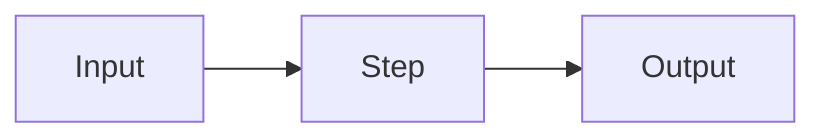

# 

## TL;DR

## Intuition

## The maths

$$
$$

Where:
- 

## Diagram



## Code

```python
```

## In practice

- **Use it when:** 
- **Defaults that work:** 
- **Breaks when:** 
- **Cost / latency:** 

## Interview angle

**Q. **
**A.** 

**Follow-up.** 

## Traps

- 

## Flashcards

Question::Answer

## Related

- [[]]
