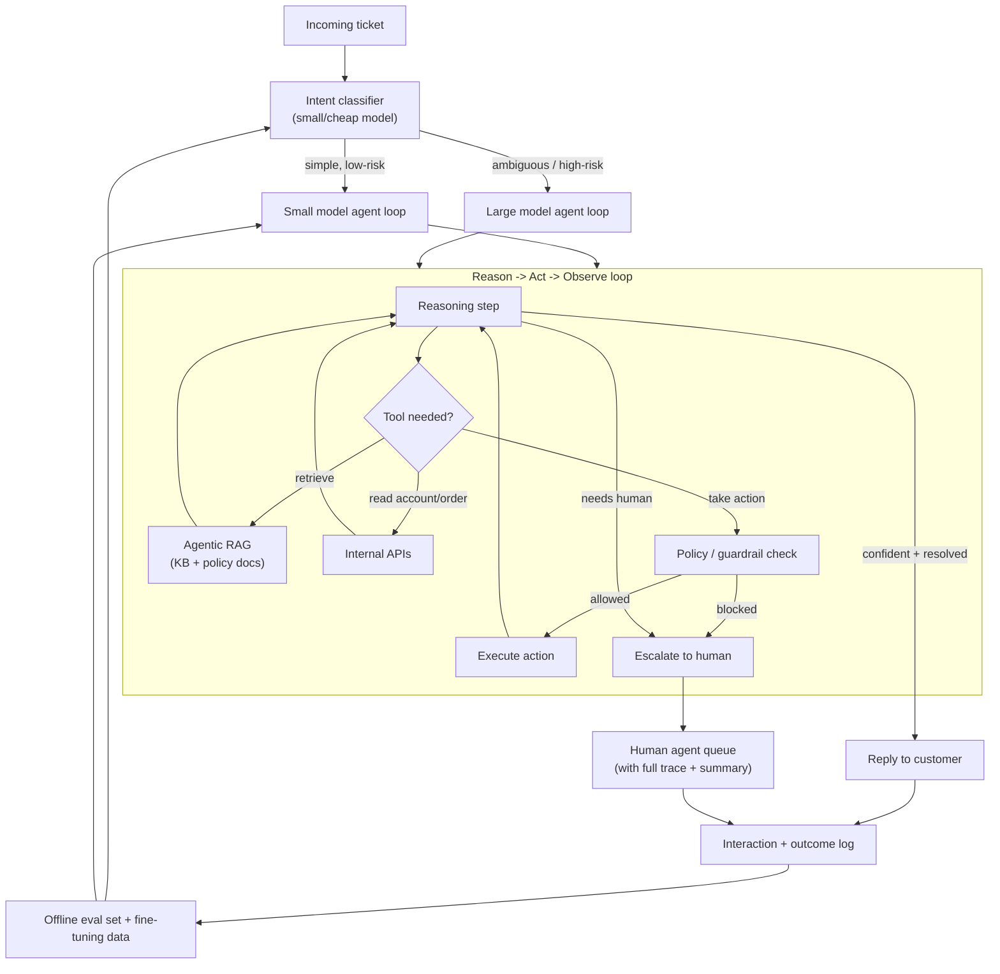

# Case Study: Design an Agentic Customer Support Automation System

## The prompt as asked
"Design a system where an AI agent resolves customer support tickets end to end — reading the ticket, looking things up, taking actions like issuing a refund or updating an account, and only involving a human when it should."

## 1. Clarify — questions to ask before designing
- What fraction of tickets are we trying to fully automate vs just assist a human agent on? "Autonomous resolution" and "copilot for the human agent" are different products with different guardrail requirements.
- What actions can the agent actually take — read-only (look up order status), reversible (send an email, apply a discount), or irreversible/financial (issue a refund, cancel a subscription, delete data)? This single question decides the entire guardrail architecture.
- What's the knowledge source — a structured FAQ/KB, past resolved tickets, product docs, or all three? How stale is it, and who owns keeping it correct?
- What's the acceptable latency — a chat-like back-and-forth (seconds per turn) or an async ticket queue (minutes are fine)?
- Is there a existing rule-based or macro-based system in production today that this replaces or must coexist with?
- What does "success" mean to the business — ticket deflection rate, CSAT, average handle time, or cost per ticket — and do any of these trade off against each other?

## 2. Requirements

| | |
|---|---|
| Functional | Read an incoming ticket, retrieve relevant context, decide whether to answer/act autonomously or escalate, and either resolve the ticket or hand it to a human with a summary |
| Scale | Thousands to tens of thousands of tickets/day; each ticket may require several tool calls and LLM turns, not a single forward pass |
| Latency budget | Seconds per turn for a live chat surface; a minute or two end-to-end is acceptable for an async ticket, since correctness matters more than speed here |
| Freshness | Knowledge base and policy documents must be current — an agent quoting an old refund policy is a compliance and trust problem, not just a quality one |
| Constraints | Actions must be auditable and reversible where possible, the agent must never take an irreversible action without a guardrail check, and every autonomous resolution must be traceable back to the exact context it used |

## 3. Metrics

| Layer | Metric | Why |
|---|---|---|
| Business | Ticket deflection rate (resolved without a human), cost per ticket, CSAT on agent-resolved tickets | The board-level number this project is funded to move |
| Task (offline/eval) | Task success rate on a held-out ticket set (did it take the *correct* action, not just *an* action), tool-call correctness, groundedness of any factual claim against retrieved context | An agent can sound confident and still call the wrong tool or invent a policy — see [[agent-evaluation]] and [[hallucination-and-grounding]] |
| Online | Escalation rate, escalation-after-partial-action rate (worse than escalating up front), re-open rate (ticket the agent "resolved" that the customer reopens) | Offline evals run on a fixed set; production surfaces intents and phrasing the eval set never saw |
| Guardrail | Policy-violation rate (agent attempted a disallowed action), rollback rate on actions taken, latency p99 per turn, cost per resolved ticket (LLM tokens + tool calls) | An agent optimized purely for deflection will happily take risky actions to avoid escalating — see [[agent-cost-and-latency-optimization]] |

## 4. Data
- **Knowledge sources**: product/policy documentation, macros/canned responses the human team already uses, and a curated set of past resolved tickets — these need the same ingestion discipline as any RAG system (see [[document-ingestion-and-parsing]] and [[chunking-strategies]]).
- **Action schemas**: every tool the agent can call (refund, update-address, cancel-subscription, look-up-order) needs a strict, typed schema — see [[tool-calling-and-function-schemas]] and [[structured-output-and-function-calling]] — plus explicit preconditions (e.g., "refund tool requires order age < 30 days") that are checked in code, not just described in the prompt.
- **Ticket history and outcomes**: past ticket → action → outcome (resolved, escalated, reopened, reversed) is the dataset that lets you build offline evals and eventually fine-tune a smaller router model.
- **Label/outcome delay**: whether an autonomous resolution was actually *correct* is sometimes only known after a customer reopens the ticket or disputes a charge days later — similar delayed-feedback problem to fraud labels, and it means online metrics need a trailing correction window.

## 5. Features (context, not hand-engineered features)
Unlike a scoring model, the "features" here are what gets assembled into the agent's context window each turn, since this is a retrieval-and-reasoning system, not a fixed feature vector:
- **Retrieved knowledge**: top-k KB/policy chunks relevant to the ticket, retrieved via [[rag-overview]] / [[hybrid-search-bm25-vector]], reranked with [[reranking]] before being placed in context.
- **Structured account/order state**: pulled live via tool calls (order status, account tier, past refund count) rather than stuffed into a prompt statically — this must be point-in-time correct at the moment of the decision, the same discipline as feature freshness in a scoring pipeline.
- **Conversation state and memory**: the ticket thread so far, plus any relevant long-term memory about this customer (see [[agent-memory]]) — kept short and summarized, since context bloat directly costs latency and money (see [[context-assembly-and-compression]]).
- **Policy/guardrail context**: the specific rules that gate the actions available for this ticket type, injected explicitly rather than assumed the model "knows" them from training.

## 6. Model — agent architecture
The core design decision is **how much autonomy the agent loop gets, and where the guardrails live** — not which base model to use:
- **Orchestration loop**: a ReAct-style reason → act → observe loop ([[react-and-reasoning-loops]]) where the model plans a next step, calls a tool, reads the result, and decides whether to continue, answer, or escalate. Bounded with a hard step limit to prevent runaway loops.
- **Retrieval layer**: [[agentic-rag]] rather than naive single-shot RAG — the agent decides *what* to retrieve and *when*, since a support query often needs several lookups (order status, then refund policy, then past interaction history) rather than one static retrieval.
- **Tool layer**: every action goes through a typed tool call, never a free-text side effect. Irreversible/financial tools are wrapped in an explicit policy-check function (deterministic code, not a second LLM call) that can hard-block a call regardless of what the model decided.
- **Escalation policy**: modeled as a decision the agent makes explicitly (a "escalate" tool call with a required reason), not an implicit fallback — this makes escalation auditable and lets you tune its threshold like a classifier operating point (see [[threshold-selection]]): too low and humans get flooded with easy tickets, too high and customers get bad autonomous actions.
- **Model tiering**: a small/cheap model classifies intent and handles simple, low-risk tickets (refund status lookup, FAQ answers); only ambiguous or higher-stakes tickets escalate to a larger, more expensive model — the same cascade idea used purely for cost in [[case-llm-cost-reduction]], here also motivated by risk, not only cost.
- **Guardrails**: input-side (prompt-injection detection on ticket content and any web/email content the agent reads — see [[agent-guardrails-and-safety]] and [[llm-safety-and-guardrails]]) and output-side (every claim the agent states as fact must cite retrieved context; every action is validated against a policy engine before execution).

## 7. Serving

The policy/guardrail check sits *after* the model decides an action but *before* execution, as deterministic code — this is the one place the design deliberately does not trust the model's own judgment.

## 8. Monitoring
- **Task success and groundedness** sampled continuously against a rotating eval set (see [[llm-evaluation]] and [[agent-evaluation]]), not just at release time — ticket phrasing and policy documents both drift.
- **Escalation rate and re-open rate**, segmented by ticket category — a category with a rising re-open rate is a leading indicator of a stale KB or a policy change the agent hasn't been told about.
- **Guardrail trip rate and rollback rate** on actions — a spike means either an adversarial input (prompt injection via a crafted ticket) or a policy gap the guardrail wasn't written to catch.
- **Cost and latency per resolved ticket**, broken down by model tier and number of tool calls — a loop that silently starts taking 8 steps instead of 3 is a cost regression before it's ever a quality one.
- **KB/document freshness** — the same staleness risk as any RAG system; an agent confidently quoting a superseded refund policy is worse than one that escalates.

## 9. Failure modes
- **Prompt injection via ticket content**: a customer (or an attacker) embeds instructions in the ticket text or an attached document trying to get the agent to ignore its guardrails or reveal internal data — must be treated as untrusted input at every retrieval and tool-call boundary, not just at the top-level prompt.
- **Confident hallucination of policy**: the agent states a refund/return policy that isn't grounded in any retrieved document — the single most damaging failure mode for a support agent, since it directly costs money or trust. Mitigated by requiring citations for factual claims and refusing to answer ungrounded questions.
- **Silent over-automation**: under pressure to hit a deflection-rate target, the escalation threshold creeps up and the agent starts resolving tickets it shouldn't — this is a threshold-tuning failure, structurally identical to a fraud model creeping toward under-blocking, just measured in CSAT instead of dollars.
- **Tool-call drift after an API change**: an upstream API changes its schema or semantics and the agent's tool calls silently start failing or, worse, "succeeding" against the wrong endpoint — needs the same contract testing as any service-to-service integration, not just prompt-level trust.
- **Runaway loops**: the agent gets stuck re-retrieving or re-planning without making progress, burning tokens and latency — needs a hard step budget and a fallback-to-escalation path, not an unbounded loop.

## 10. Tradeoffs to say out loud
- **Autonomy vs blast radius.** Letting the agent take irreversible actions (refunds, cancellations) unlocks the deflection rate that justifies the project, but every autonomous action is a chance to be confidently wrong at scale — production systems usually start read-only/reversible-only and expand the action set slowly, gated by measured accuracy per action type.
- **Large model everywhere vs tiered routing.** Running the best available model on every ticket maximizes quality and simplicity but is the most expensive option by a wide margin; tiering by risk/difficulty (small model for FAQ-shaped tickets, large model for ambiguous ones) cuts cost sharply but adds a classifier that itself can misroute a hard ticket to the cheap path.
- **Deterministic workflow vs free-form agent loop.** A fixed decision tree (if refund request and order < 30 days, then refund) is fully auditable and impossible to prompt-inject, but brittle and expensive to extend to every ticket shape. A free-form reasoning loop generalizes to novel phrasing and edge cases far better, but is harder to guarantee against and requires the guardrail layer to do the safety work the fixed workflow got for free.
- **Escalate-early vs resolve-aggressively.** Escalating liberally protects CSAT and safety but caps the deflection rate the project was funded to deliver; resolving aggressively hits the deflection target but raises the cost of every mistake — this is the same precision/recall-in-dollar-terms tradeoff as fraud thresholding, just with "human escalation" standing in for "block."

## Related
[[tool-calling-and-function-schemas]]
[[agentic-rag]]
[[react-and-reasoning-loops]]
[[agent-guardrails-and-safety]]
[[agent-evaluation]]
[[agent-memory]]
[[hallucination-and-grounding]]
[[human-in-the-loop-patterns]]
[[agent-cost-and-latency-optimization]]
[[case-llm-cost-reduction]]
[[case-document-extraction-pipeline]]
