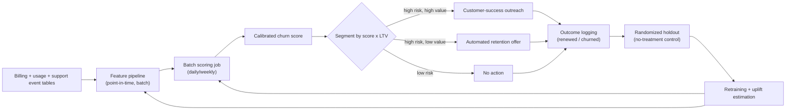

# Case Study: Design a Subscription Churn Prediction System

## The prompt as asked
"Design a system that predicts which subscribers are likely to churn (cancel) so the business can intervene with a retention offer."

## 1. Clarify — questions to ask before designing
- What does "churn" mean precisely — a hard cancellation, a non-renewal at contract end, or a soft signal like usage dropping to near zero? Each implies a different labeling window.
- What's the churn base rate, and over what horizon — monthly churn of 2% is a very different problem from annual churn of 40%?
- What's the intervention — a discount, a proactive call from customer success, a feature-usage nudge email? The cost and reversibility of the intervention drives the whole thresholding decision.
- Is there a contractual notice period (so "churn" is knowable in advance) or does cancellation happen instantly with no lead time to act?
- Do we have to predict "will churn" or "will churn *and* would be retained by the offer" — these are different targets, and conflating them is a common mistake (see uplift framing in §6).
- How is success measured — reduction in churn rate, net revenue retained after the cost of offers given to people who wouldn't have churned anyway?

## 2. Requirements

| | |
|---|---|
| Functional | Score each active subscriber with a churn-risk probability on a recurring cadence (daily/weekly), ahead of a decision window long enough for an intervention to matter |
| Scale | Hundreds of thousands to millions of subscribers scored on a batch cadence; not typically a real-time/synchronous scoring problem |
| Latency budget | Batch, not online — scores are needed hours before a campaign runs, not milliseconds after an event; freshness in days, not seconds |
| Freshness | Behavioral features (usage, support tickets, billing events) should reflect at least the last few days; the model itself is retrained monthly/quarterly since churn drivers shift slowly |
| Constraints | Class imbalance (churners are the minority), the label is only knowable with a delay (did they actually renew or not), and every feature must be computable strictly before the point where an intervention could still work |

## 3. Metrics

| Layer | Metric | Why |
|---|---|---|
| Business | Net revenue retained, incremental retention from offers (offer-driven saves minus cost of offers given to non-churners), overall churn rate trend | The real objective — a model that identifies churners perfectly but whose offers mostly go to people who'd have stayed anyway destroys margin |
| Model (offline) | PR-AUC, recall at a fixed precision (or vice versa), calibration error (Brier score / reliability curve) | Same imbalance argument as fraud — see [[imbalanced-classification]] — but calibration matters *more* here because the score is used to prioritize and size offers, not just threshold a binary decision |
| Online | Realized retention rate among flagged-and-treated subscribers vs a held-out flagged-but-untreated control group | Only a randomized holdout tells you the model plus intervention actually changes behavior, versus just identifying people who were leaving regardless |
| Guardrail | False-positive rate by customer segment/tenure, total offer spend vs budget, model score drift over time | A model that flags mostly high-value long-tenure customers can blow the retention budget disproportionately on customers who were never at real risk |

## 4. Data
- **Subscription/billing events**: signup date, plan tier, payment history, failed payments, plan downgrades.
- **Product usage**: login frequency, feature usage breadth/depth, session length trend — usually the strongest signal, and the one most prone to leakage (see below).
- **Support interactions**: ticket volume, sentiment of recent tickets, NPS/CSAT responses.
- **The defining data problem — the labeling window**: churn must be labeled using a fixed observation window *before* a fixed prediction horizon, e.g. "features from days 1–83 of a 90-day cycle predict cancellation in days 84–90" — get the boundary wrong and you either leak future behavior into features or throw away the signal that would have made the model useful in time to act.
- **The defining leakage trap — post-cancellation signals**: a subscriber who has already initiated cancellation often shows telltale signals *after* the decision (a support ticket asking "how do I cancel," a visit to the cancellation page, usage dropping to zero) — including any of this in "current" features trains a model that looks excellent offline and is useless in production, because by the time those signals exist the customer has already decided. This is the churn-specific version of [[data-leakage]] and the single most common way these projects fail a rebuild.
- **Right-censoring**: subscribers who haven't reached the end of their current cycle yet don't have a resolved label — naively excluding them biases the training set toward subscribers with unusually short tenure.

## 5. Features
- **Usage trend, not usage level**: change in login frequency / feature usage over the last N weeks relative to the subscriber's own baseline is far more predictive than an absolute usage number, and is less prone to simply encoding "which plan tier is this."
- **Billing friction signals**: failed payment attempts, downgrade history, discount/coupon usage — all computed as of a cutoff strictly before the labeling window starts.
- **Support and sentiment signals**: ticket count and recency, but explicitly excluding any ticket whose content is about the cancellation process itself (the leakage trap above).
- **Tenure and lifecycle stage**: churn drivers differ for a subscriber in month 1 (onboarding friction) vs month 24 (price sensitivity, competitor switching) — tenure-bucketed features or a tenure-aware model often outperform a single pooled model.
- All of this needs the same point-in-time feature-store discipline as any other supervised system — see [[feature-engineering]] and [[training-serving-skew]] — but the churn-specific twist is that the *cutoff itself* (last day before the labeling window) is the thing most likely to be implemented wrong.

## 6. Model
- Gradient-boosted trees ([[xgboost-deep-dive]]) are the standard choice: strong on mixed tabular features, fast to score in batch, and interpretable enough to hand a churn-risk explanation to the customer-success team (see [[model-interpretability-shap-lime]]).
- **Calibration is not optional here** — the score is used to decide *who gets an offer and how generous it is*, not just to rank. An uncalibrated score of "0.8" that doesn't correspond to an actual ~80% churn probability leads to systematically over- or under-spending on retention. Calibrate with Platt scaling or isotonic regression post-training — see [[probability-calibration]].
- **Cost-sensitive thresholding, not a fixed 0.5 cutoff**: the threshold should be set where the expected cost of the retention offer equals the expected value of the revenue saved, and this operating point should differ by customer lifetime value — a $200/month enterprise seat and a $9/month individual plan don't warrant the same intervention cost. See [[threshold-selection]].
- **Prediction vs uplift — the trap to name explicitly**: a churn-probability model tells you who is likely to leave, not who would be *saved by the offer*. A customer already committed to leaving for a competitor may churn regardless of any discount (the offer is wasted spend), and a customer who was never going to churn also doesn't need one (also wasted spend). The offer only has positive ROI on the middle group — the "persuadables." A pure churn classifier conflates all three groups; an uplift/causal model, trained on historical A/B offer data, targets the persuadable segment directly. Most real deployments start with a churn classifier (simpler, no experiment required) and graduate to uplift modeling once there's enough randomized offer history to train one — see [[causal-inference-basics]].

## 7. Serving

A randomized holdout group is deliberately carved out of every scoring run (flagged as high-risk but not treated) — without it, there is no way to ever measure whether the intervention itself works versus just the model correctly ranking who was leaving anyway.

## 8. Monitoring
- **Calibration drift**: re-check reliability (predicted vs actual churn rate per score bucket) every retraining cycle — calibration decays faster than raw ranking metrics when the churn base rate shifts seasonally.
- **Feature and score distribution drift** — see [[data-drift-and-concept-drift]] — a pricing change or a new competitor entering the market can shift churn drivers well before the model naturally gets retrained.
- **Offer budget vs realized incremental retention**, tracked against the holdout group continuously, not just at model-launch time.
- **Segment-level false-positive rate** — flag if a particular tenure band or plan tier is being over-targeted relative to its actual churn contribution.
- **Label pipeline health**: a delayed or broken join between billing-renewal events and the training pipeline silently produces stale or wrong labels — the single most common operational break in these systems.

## 9. Failure modes
- **Post-cancellation leakage**: as described in §4 — the model "predicts" churn using signals that only exist because the customer already decided to leave; looks great offline (AUC near 1.0 is itself a red flag) and does nothing useful in production.
- **Conflating prediction with persuadability**: spending the entire retention budget on customers who were either unsavable or never at risk, because the classifier was never designed to isolate the persuadable middle group.
- **Miscalibrated scores after a base-rate shift**: a seasonal or macroeconomic change in overall churn rate silently invalidates a model's calibration well before its ranking (AUC) visibly degrades — teams that only monitor AUC miss this.
- **Right-censoring bias**: training only on subscribers whose cycle has fully resolved skews the training set toward short-tenure subscribers and under-represents long-tenure churn patterns.
- **Static thresholding across segments**: applying one probability cutoff to both a low-LTV and high-LTV subscriber either overspends on the former or underspends on the latter.

## 10. Tradeoffs to say out loud
- **Churn classifier vs uplift model.** A plain classifier is simpler, needs no experimental data, and is easy to explain to stakeholders, but spends budget on customers regardless of whether the offer actually changes their behavior. An uplift model targets spend far more efficiently but requires historical randomized offer data to train and is harder to validate and explain. Most teams start with the former and earn their way to the latter.
- **Aggressive vs conservative labeling window.** A short window between "features" and "label" catches churn signal close to the decision but leaves little time for an intervention to work; a long lead window gives the business time to act but the behavioral signal is weaker and noisier that far out. The right window is set by how long the retention intervention itself takes to have effect, not by whatever is easiest to compute.
- **Single pooled model vs tenure/segment-specific models.** One model is simpler to maintain and monitor; segment-specific models (new vs established subscribers, plan tiers) often perform meaningfully better because churn drivers genuinely differ, at the cost of more models to retrain, monitor, and keep calibrated.
- **Precision vs recall, denominated in retention-offer dollars.** Optimizing for recall (catch every at-risk subscriber) means giving offers to many who would have stayed anyway; optimizing for precision (only flag near-certain churners) misses subscribers who could have been saved cheaply. The right operating point is a $-cost calculation per LTV segment, exactly as in fraud thresholding, just with "offer cost" replacing "false-decline cost."

## Related
[[imbalanced-classification]]
[[data-leakage]]
[[probability-calibration]]
[[threshold-selection]]
[[causal-inference-basics]]
[[xgboost-deep-dive]]
[[data-drift-and-concept-drift]]
[[feature-engineering]]
[[case-fraud-detection]]
