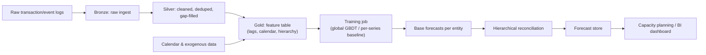

# Case Study: Design a Demand Forecasting System

## The prompt as asked
"Design a system that forecasts demand — e.g., how much capacity/inventory/staffing a service business needs per region per day for the next N weeks."

## 1. Clarify — questions to ask before designing
- What's the forecast granularity and horizon — daily demand per region for the next 7 days, or per SKU per store for the next quarter?
- Is there a natural hierarchy (SKU → category → region → national, or client → territory → national) that forecasts must reconcile against?
- What decision consumes the forecast — staffing/capacity planning, inventory replenishment, pricing? This decides whether over- or under-forecasting is more costly, which changes the loss function.
- How much history is available, and is it clean (no gaps, no unlabeled promotions/outages) or does it need heavy cleaning first?
- What exogenous signals matter — seasonality, holidays, weather, marketing spend, local events?
- Is the pipeline expected to run in a lakehouse (Databricks/PySpark, medallion layers) or is a lighter-weight batch job acceptable?

## 2. Requirements

| | |
|---|---|
| Functional | Produce a forecast (point + uncertainty interval) per entity (region/SKU/territory) for a rolling horizon, reconciled across the hierarchy |
| Scale | Hundreds to thousands of time series (one per region/SKU combination), historical data spanning multiple years at daily/weekly grain |
| Latency budget | Batch — forecasts regenerated daily/weekly, not real time; a run must complete within an operational window (e.g., overnight) |
| Freshness | New actuals ingested daily; forecast horizon typically rolls forward continuously (next 7–90 days) |
| Constraints | Strong seasonality (weekly, and annual for holiday-adjacent demand), intermittent/sparse series for smaller entities, need for hierarchical consistency (regional forecasts should sum sensibly to national) |

## 3. Metrics

| Layer | Metric | Why |
|---|---|---|
| Business | Under/over-provisioning cost, stockout rate or idle-capacity rate | Forecast error translates directly into a $ cost that's usually asymmetric (running short is worse than running long, or vice versa) |
| Model (offline) | MAPE / WAPE / sMAPE per series, pinball loss at target quantiles for interval forecasts | WAPE aggregates well across many series of different scale, unlike MAPE which blows up near zero-demand periods — see [[time-series-forecasting]] |
| Online | Rolling backtest error on the most recent actuals (walk-forward validation), reconciliation error across hierarchy levels | Confirms the model isn't degrading as the world moves past its training window |
| Guardrail | Forecast bias (systematic over/under, not just magnitude of error), coverage of prediction intervals (are 90% intervals actually containing ~90% of actuals) | A model that's unbiased in aggregate but consistently over-forecasts small regions and under-forecasts large ones causes real operational pain even with a good headline MAPE |

## 4. Data
- **Actuals**: historical demand/volume at the finest grain available (e.g., daily per region), ideally already flowing through a **medallion architecture** — raw ingestion (bronze), cleaned and deduplicated (silver), aggregated and feature-ready (gold) — see [[medallion-architecture]]. This is exactly the kind of forecasting pipeline that gets built on Databricks/PySpark in practice: bronze holds raw event/transaction logs, silver has one clean row per (entity, date) after deduplication and gap-filling, gold holds the model-ready feature table per (entity, date, horizon).
- **Calendar/exogenous data**: holidays (India has a dense and regionally-variable holiday calendar — this matters far more here than in a US-centric forecasting example), day-of-week, known promotions/campaigns, and, if relevant, weather.
- **Hierarchy metadata**: which entities roll up into which parent (SKU→category, region→zone→national) so forecasts can be reconciled.
- **Outlier/anomaly handling**: one-off spikes (a system outage that suppressed demand, a flash promotion that inflated it) must be flagged and either excluded or explicitly modeled as a regressor — otherwise the model learns to expect a repeat of a one-time event.
- On Databricks specifically, gold tables here are typically built as PySpark aggregation jobs registered and governed through Unity Catalog, so the same feature table backs both the forecasting job and any downstream capacity-planning dashboard.

## 5. Features
- **Calendar features**: day-of-week, week-of-year, month, holiday flags (and days-to/from-holiday, since demand often ramps before and after), is-weekend.
- **Lag and rolling features**: demand N days/weeks ago, rolling mean/std over trailing windows — the same lag/rolling-window feature-engineering discipline as any tabular time-series problem, detailed in [[time-series-features-and-validation]].
- **Hierarchy features**: parent-level aggregate demand as a regressor for a child series (a region's forecast can lean on the national trend when its own history is short/sparse).
- **Exogenous regressors**: known future promotions, marketing spend, macro indicators if forecasting at a business level.
- Feature computation must respect **time-series-aware validation** (no using a future rolling average to predict the past) — this is the same point at which naive tabular ML pipelines silently leak the future, covered generally in [[data-leakage]].

## 6. Model
- **Classical statistical baselines** (ETS/Holt-Winters, ARIMA/SARIMA) per series are still a reasonable first cut and a mandatory baseline to beat — they're cheap, interpretable, and surprisingly hard to beat for short, clean, strongly-seasonal series.
- **Global gradient-boosted models** (one XGBoost/LightGBM model trained across *all* series with entity ID and hierarchy level as categorical features, plus lag/calendar features) are the more scalable production answer once you have hundreds+ of series: a single model shares statistical strength across similar series (a new region with little history borrows patterns from similar regions) and is far cheaper to maintain than thousands of individual per-series models. This is the natural fit for a Databricks/PySpark shop, since the same XGBoost stack the team already uses for classification/regression applies directly — see [[xgboost-deep-dive]].
- **Deep learning approaches** (DeepAR-style, temporal fusion transformers) can outperform when there are very many series with rich shared structure and enough data to justify the complexity, at the cost of much higher training/serving cost and lower interpretability — usually not the first thing to reach for at 5-years-experience-interview scale unless the prompt explicitly signals huge scale.
- **Hierarchical reconciliation**: whichever model produces the base forecasts, a reconciliation step (bottom-up, top-down, or optimal/MinT reconciliation) is needed so that region-level forecasts sum consistently to the national forecast rather than each level being independently, and inconsistently, "the best forecast for that level alone."
- **Uncertainty**: point forecasts alone are insufficient for a capacity-planning decision — quantile regression or a probabilistic model producing prediction intervals lets the business choose an operating point (e.g., staff to the 80th percentile of forecast demand, not the median) matching its actual asymmetric cost of under vs over provisioning.

## 7. Serving

The whole pipeline runs as a scheduled batch job (e.g., a Databricks workflow), not an online service — the deliverable is a refreshed forecast table, consumed downstream by planning tools rather than served per-request.

## 8. Monitoring
- **Rolling backtest / walk-forward evaluation**: continuously score the model on the most recent actuals as they arrive, not just at initial training time, since seasonality and trend both drift.
- **Bias tracking per entity**: a model can have acceptable aggregate error while being systematically wrong for specific regions/segments — track signed error, not just absolute error, sliced by entity.
- **Data pipeline health**: gaps or duplication in the bronze/silver layers upstream silently corrupt every downstream forecast — data-quality checks belong at each medallion layer, not just at the model boundary.
- **Interval coverage**: are the stated 80%/90% prediction intervals actually being hit empirically, or is the model overconfident (too narrow, causing operational surprises) or underconfident (too wide, causing over-provisioning)?

## 9. Failure modes
- **Unflagged regime changes**: a one-off event (an outage, a policy change, a new market entry) reshapes the demand pattern and the model, trained on history, keeps forecasting the old regime until enough new data accumulates to override it.
- **Cold-start entities**: a brand-new region/SKU has no history to lag from; a per-series-only model has nothing to forecast from, whereas a global model can borrow from similar entities — this is the strongest argument for the global-model approach in production.
- **Holiday/calendar mis-specification**: getting India's regional holiday variation wrong (a holiday in one state isn't one nationally) silently degrades exactly the days that matter most operationally.
- **Hierarchy inconsistency**: independently-optimized forecasts at each level don't sum correctly, which undermines trust with planning stakeholders even when each individual forecast is reasonably accurate.
- **Outlier contamination**: an unflagged demand spike (flash promotion, system outage) gets baked into the model's learned seasonality/trend and recurs as a phantom pattern in future forecasts.

## 10. Tradeoffs to say out loud
- **Global model vs per-series models.** A global model shares statistical strength across series (crucial for cold-start and sparse entities) and is far cheaper to maintain at scale, but can underfit a series with a genuinely idiosyncratic pattern that doesn't resemble its peers. Per-series models fit each series's quirks well but don't generalize, don't help cold-start entities, and become an operational maintenance burden past a few dozen series.
- **Forecast accuracy vs interpretability.** A more complex model (deep learning, or even a well-tuned GBDT with many features) usually wins on error metrics, but a simpler statistical model (ETS/SARIMA) is far easier to explain to a planning stakeholder asking "why did the forecast jump this week" — and in an operational forecasting context, stakeholder trust in the number matters as much as its accuracy.
- **Point forecast vs full predictive distribution.** Producing only a point forecast is simpler to build and communicate, but forces the planning team to guess at a safety margin; producing calibrated prediction intervals directly supports the actual decision (how much buffer capacity to hold) but requires more careful modeling and evaluation (interval coverage, not just point error) to get right.
- **Reconciliation strictness vs base-forecast accuracy.** Forcing hierarchical consistency (bottom-up sums must equal top-level forecasts) gives planners a single trustworthy number at every level, but can pull an individually well-fit base forecast away from its own best estimate to satisfy the constraint — optimal reconciliation methods try to balance this, but it's a real accuracy-for-consistency trade, not free.

## Related
[[time-series-forecasting]]
[[medallion-architecture]]
[[time-series-features-and-validation]]
[[xgboost-deep-dive]]
[[data-leakage]]
[[ml-system-design-framework]]
[[databricks-platform]]
