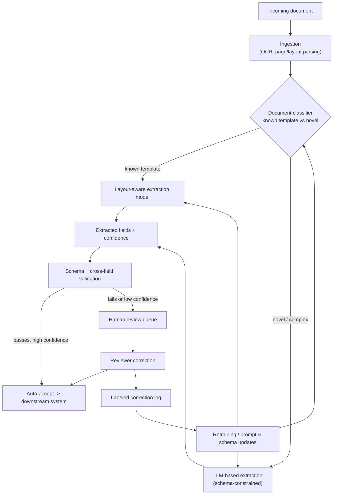

# Case Study: Design a Document Extraction Pipeline at Scale

## The prompt as asked
"Design a system that extracts structured data (line items, totals, parties, dates) from unstructured documents — invoices, contracts, or forms — arriving at high volume, with high accuracy required."

## 1. Clarify — questions to ask before designing
- What document types, and how templated are they — a fixed set of known vendor invoice layouts, or arbitrary free-form contracts with no shared structure?
- What's the required accuracy, and does it vary by field — a wrong invoice total is a financial-reporting incident, a wrong "notes" field is not?
- What's the volume and latency budget — thousands of documents/day processed overnight, or a user waiting on a single upload in real time?
- Is a human review step acceptable/expected, or must this be fully automated? Most real deployments are not fully automated at launch.
- What format do documents arrive in — clean digital PDFs, scanned/faxed images, photos taken on a phone? This alone decides whether OCR quality is the bottleneck.
- What's the downstream consumer of the extracted data — a database needing a strict schema, or a search index that can tolerate some noise?

## 2. Requirements

| | |
|---|---|
| Functional | Given a document (PDF/image), extract a structured record conforming to a defined schema, with a confidence score per field |
| Scale | Thousands to hundreds of thousands of documents/day; batch-oriented ingestion pipeline, not a single synchronous request in most B2B deployments |
| Latency budget | Seconds to low minutes per document is typically acceptable; a live "upload and see results" UI needs the fast path to return in a few seconds even if a slower verification pass runs after |
| Freshness | Not a freshness problem in the usual sense — the challenge is document *diversity* (new vendor layouts, new contract templates) rather than data staleness |
| Constraints | Extracted values must be traceable back to their source location in the document (for audit), schema must be strictly validated before downstream use, and low-confidence extractions must route to a human rather than silently propagate |

## 3. Metrics

| Layer | Metric | Why |
|---|---|---|
| Business | Straight-through processing rate (fraction needing no human touch), cost per document processed, time-to-availability of extracted data | The actual ROI case — extraction that's accurate but still needs a human to check everything hasn't saved much |
| Model (offline) | Field-level exact-match / edit-distance accuracy against a labeled gold set, per document type and per field | Aggregate document-level accuracy hides that a rarely-occurring but financially critical field (e.g., a tax line) is systematically wrong |
| Online | Human-review correction rate (how often a reviewer actually changes a field the model extracted), downstream data-quality incident rate | The gold set goes stale as new document layouts appear; the review queue is the freshest signal on real accuracy |
| Guardrail | Schema-validation failure rate, confidence-routing accuracy (do low-confidence flags actually correlate with errors), latency p99 | A confidence score that doesn't correlate with correctness makes the whole human-in-the-loop routing strategy worthless |

## 4. Data
- **Source documents**: scanned images (varying quality, skew, handwriting), digital-native PDFs (clean text layer), and photos (worst quality, perspective distortion) — each needs different upstream handling; see [[document-ingestion-and-parsing]].
- **Ground truth**: field-level labels from human annotation or from a downstream system of record (e.g., the ERP entry that was manually keyed from the same invoice) — the latter is cheaper to obtain at volume but can itself contain the errors a human keyer made, so it's a noisy label source, not a clean one.
- **Layout diversity**: a fixed vendor set (e.g., 50 known invoice templates) is a fundamentally easier problem than open-ended contracts, since a templated approach can key off known field positions; open-ended documents require the model to understand *semantics*, not just layout.
- **Multimodal input**: for scanned/image documents, both the pixel layout (tables, boxes, font size as a signal of a total vs a line item) and the text content carry information — a text-only pipeline throws away real signal here.

## 5. Features — the extraction approach itself is the design decision
This is not a hand-engineered-feature problem; the central design choice is *which extraction paradigm*, and it varies by field type and document class:
- **Classic OCR + layout model** (e.g., a document-layout transformer that jointly reasons over text and bounding-box position): strong on templated, high-volume document types where consistent layout can be exploited, cheap to run per document, but brittle to a genuinely new layout and needs retraining/relabeling work per new template.
- **LLM-based extraction** (a multimodal or text model prompted/fine-tuned to return a structured record, see [[structured-output-and-function-calling]] and [[multimodal-models]]): generalizes far better to novel layouts and free-form contracts without per-template engineering, but costs more per document, is slower, and can hallucinate a plausible-looking value for a field it didn't actually find — a much more dangerous failure mode for financial documents than a layout model simply failing to find the field at all.
- **Hybrid, in practice**: OCR/layout model handles the high-volume templated majority cheaply; an LLM handles the long tail of unseen layouts and free-form contract clauses, gated by a router that classifies "known template" vs "novel/complex document" up front — the same cascade shape as [[case-llm-cost-reduction]], here motivated by both cost and reliability.
- **Schema-constrained generation**: whichever model extracts, its output should be forced into a strict schema (typed fields, enums, required-vs-optional) at generation time rather than validated only after the fact — this is what [[structured-output-and-function-calling]] is for, and it turns "did the model format this correctly" from a runtime failure into a generation-time constraint.

## 6. Model
- **Router/classifier** first: decide document type and complexity (known template vs novel layout) before choosing an extraction path — a cheap classifier, not the expensive extractor itself, makes this call.
- **Layout-aware OCR model** for the templated majority: extracts field values keyed to known bounding-box regions, with a per-field confidence derived from OCR character-level confidence and layout-match quality.
- **LLM extractor** for the long tail: given the document (as image and/or OCR'd text), prompted or fine-tuned to emit the target schema; a smaller fine-tuned model is often preferable here to a frontier general-purpose model once enough labeled examples exist, purely on cost and latency grounds (see [[knowledge-distillation]] and [[small-language-models-and-cost]]).
- **Confidence scoring is a first-class output, not an afterthought**: per-field confidence must be calibrated well enough that a threshold on it actually separates "needs human review" from "safe to auto-accept" — see [[probability-calibration]] and [[threshold-selection]] for the same discipline applied here as in any other scoring system.
- **Cross-field validation as a second line of defense**: line items summing to the stated total, dates in a sane order, currency consistency — deterministic business-rule checks catch a class of error that a per-field confidence score alone misses (a model can be individually confident about two fields that are jointly inconsistent).

## 7. Serving

The human review queue is not a fallback bolted on at the end — its corrections are the primary source of new labeled data, since ground truth for novel layouts rarely exists any other way.

## 8. Monitoring
- **Straight-through processing rate over time**, per document type — a slow decline usually means new vendor layouts or contract templates are entering the pipeline faster than the model is being updated for them.
- **Field-level accuracy from review-queue corrections**, not just from the static offline gold set — this is the freshest and most representative accuracy signal available.
- **Confidence-calibration check**: periodically verify that documents flagged low-confidence are, in fact, corrected more often than those auto-accepted — if not, the routing threshold is doing nothing.
- **Cross-field validation failure rate** by document type — a rising rate on a specific vendor/template is often the first sign that vendor changed their invoice layout.
- **Cost and latency per document**, split by extraction path (layout model vs LLM) — if the "novel/complex" bucket keeps growing, the router itself may be misclassifying known templates as novel.

## 9. Failure modes
- **Confident hallucination on a financial field**: an LLM extractor returns a plausible but wrong total or date instead of abstaining — far more damaging than an OCR model simply failing to populate a field, because it doesn't visibly look like a failure. Mitigated by schema-constrained generation plus mandatory cross-field validation, never by prompting alone.
- **Router misclassification**: a genuinely novel layout gets classified as "known template" and run through the layout model, which then confidently extracts from the wrong bounding boxes.
- **Confidence score doesn't track real accuracy**: if per-field confidence isn't recalibrated as new document types arrive, the human-review threshold silently stops separating good extractions from bad ones — the entire cost-saving premise of the review-queue design depends on this holding.
- **Schema rigidity vs document reality**: a schema that's too strict rejects legitimate variation (a valid but unusual field format); one that's too loose lets malformed data flow downstream — this needs active tuning as new document variants are seen, not a one-time schema design.
- **Silent OCR degradation on poor scans**: a fax-quality or heavily skewed image degrades character-level OCR confidence in a way that doesn't always surface as an obvious failure until downstream data-quality checks catch it much later.

## 10. Tradeoffs to say out loud
- **Layout/OCR model vs LLM-based extraction.** The layout model is cheap, fast, and highly accurate on the templates it was built for, but brittle to novel layouts and requires engineering effort per new template. The LLM generalizes to new layouts with no per-template work and handles free-form contract language a bounding-box model can't reason about at all, but costs more per document, is slower, and hallucinates instead of failing cleanly. Almost every production system routes between the two rather than picking one.
- **Full automation vs human-in-the-loop.** Fully automated extraction is cheaper per document at the volumes that justify the project, but a wrong financial field that goes undetected is far more costly than the human review it would have taken to catch — so nearly all real deployments keep a confidence-gated review queue rather than removing humans entirely, at least for financially material fields.
- **Strict schema validation vs extraction flexibility.** A tightly typed schema catches malformed output early and keeps downstream systems safe, but any real document corpus has edge cases (a line item with no unit price, a date in an unexpected format) that a rigid schema simply rejects — some fields need a documented "low-confidence but present" escape hatch rather than a hard failure.
- **General frontier model vs a smaller fine-tuned extractor.** A frontier LLM needs no field-specific training and handles the hardest long-tail documents best, but is the most expensive and slowest option to run at high volume. A smaller model fine-tuned on this business's specific document types and schema is far cheaper and often just as accurate on the bulk of traffic once enough labeled corrections exist — the same build-vs-buy tension explored fully in [[case-llm-cost-reduction]].

## Related
[[document-ingestion-and-parsing]]
[[structured-output-and-function-calling]]
[[multimodal-models]]
[[hallucination-and-grounding]]
[[human-in-the-loop-patterns]]
[[probability-calibration]]
[[threshold-selection]]
[[knowledge-distillation]]
[[case-llm-cost-reduction]]
[[case-agentic-support-automation]]
