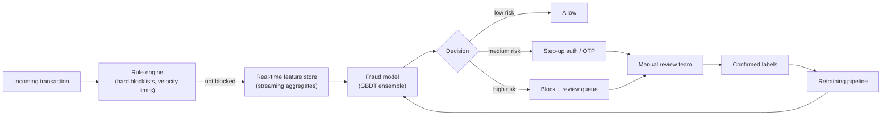

# Case Study: Design a Real-Time Fraud Detection System

## The prompt as asked
"Design a system that scores every transaction (or login, or account signup) for fraud in real time."

## 1. Clarify — questions to ask before designing
- What action is being fraud-scored — a payment transaction, an account login, a new-account signup? The right features and latency budget differ a lot.
- What's the base rate of fraud — 1 in 1,000? 1 in 100,000? This drives every metric and modeling decision downstream.
- What happens on a "fraud" prediction — hard block, step-up authentication (OTP/manual review), or just flag for a later batch review? This decides the cost of false positives.
- What's the latency budget — synchronous in the payment path (tens of milliseconds) or can it run async and act after the fact?
- Is there a labeled ground truth, and how delayed is it (chargebacks can take 60–90 days to resolve)?
- Are fraudsters adaptive — do we expect them to actively probe and evade the current model?

## 2. Requirements

| | |
|---|---|
| Functional | Score each transaction with a fraud probability (or decision) before/at the point of action |
| Scale | Thousands to tens of thousands of transactions/sec at peak (e.g., festive-season sale traffic in India) |
| Latency budget | p99 typically < 100 ms if synchronous and blocking the payment; looser if it's a post-hoc review queue |
| Freshness | Features must reflect the last few seconds/minutes of the user's activity (velocity checks); model itself can be retrained daily/weekly |
| Constraints | Extreme class imbalance (fraud is rare), adversarial and non-stationary environment, delayed and partial labels, strict false-positive cost (blocking legitimate customers) |

## 3. Metrics

| Layer | Metric | Why |
|---|---|---|
| Business | $ fraud loss prevented, false-decline rate (legit customers blocked), chargeback rate | The actual cost function has asymmetric $ costs, not a symmetric error rate |
| Model (offline) | PR-AUC (not ROC-AUC), recall at fixed precision, precision at fixed recall | With <1% positive rate, ROC-AUC is misleadingly high and barely moves; PR curves reflect the imbalance — see [[imbalanced-classification]] |
| Online | Real-time precision/recall on labeled subset, review-queue volume, alert-to-confirmed-fraud ratio | Offline metrics run on stale labels; online tracks what operations actually deals with |
| Guardrail | False-decline rate by customer segment, latency p99, feature-store staleness | A model can hit target recall by blocking a disproportionate share of a particular card type/geography — a fairness and business-cost problem, not just a metric |

## 4. Data
- Transaction logs: amount, merchant, MCC code, device fingerprint, IP/geo, time of day.
- Account history: account age, past transaction velocity, past chargebacks.
- Graph/network signals: shared device/IP/card across accounts (fraud rings rarely act as lone actors).
- **Label latency and quality**: a "confirmed fraud" label can take weeks to months (chargeback dispute resolution); a naive training pipeline that waits for confirmed labels trains on stale, small, and biased data. Common workaround: use a proxy label (early risk signals, manual-review outcome) for fast iteration and reconcile against confirmed chargebacks later.
- **Label bias from the current system**: transactions the current model already blocked never get a chance to reveal whether they were actually fraud — same exposure-bias problem as recommenders, worse here because the cost of being wrong is asymmetric and monetary.

## 5. Features
- **Velocity features**: transaction count/amount over sliding windows (last 1 min / 1 hr / 1 day) per card, device, IP — these require a real-time feature pipeline, not a nightly batch job (see [[case-realtime-feature-pipeline]]).
- **Aggregate/behavioral features**: deviation from the user's own historical spend pattern, time-since-last-transaction, merchant-category novelty for this user.
- **Graph features**: degree of device/IP sharing across accounts, distance-in-graph to a known-fraud node.
- **Point-in-time correctness is non-negotiable here**: a feature like "average transaction amount for this card" must be computed using only data available strictly before the transaction being scored, or you leak the future into training — see [[data-leakage]] and [[training-serving-skew]].

## 6. Model
- Gradient-boosted trees ([[xgboost-deep-dive]] / LightGBM) are the default: handle mixed feature types well, fast to score, and interpretable enough for compliance/audit requirements.
- Handle imbalance via class weighting or targeted resampling (not naive oversampling, which can overfit to duplicated fraud patterns) — full tradeoffs in [[imbalanced-classification]].
- **Ensemble of specialist models** is common in practice: a fast rule/heuristic layer (hard-coded velocity and blocklist rules) catches known patterns cheaply, a supervised model catches statistically learnable patterns, and an unsupervised anomaly detector ([[anomaly-detection]]) catches genuinely novel fraud typologies the supervised model has never seen labels for.
- **Threshold is a business decision, not a modeling one**: pick the operating point via [[threshold-selection]] against the $ cost of a false positive (annoyed/lost customer) vs a false negative (fraud loss), and expect different thresholds per segment (e.g., a stricter threshold on high-value transactions).
- **Concept drift is the central modeling challenge**: fraudsters adapt specifically to evade the current model, so the data-generating process is adversarial and non-stationary in a way most ML problems aren't — see [[data-drift-and-concept-drift]]. This argues for frequent retraining and for keeping some model logic un-exposed to reduce reverse-engineering risk.

## 7. Serving

The rule engine sits in front of the model as a fast, auditable first pass (sub-millisecond) — a compliance requirement in most regulated markets, and a way to catch known fraud patterns without waiting on model inference.

## 8. Monitoring
- Real-time dashboards on precision/recall proxies (using fast-available proxy labels), alert volume, and review-queue backlog.
- **Drift monitoring** on feature distributions and model score distributions — a sudden shift in average risk score is often the first sign of either a new fraud pattern or a broken upstream feature pipeline.
- Segment-level false-decline monitoring (by card network, region, merchant category) to catch disparate impact early.
- Feature pipeline health: freshness/staleness of streaming aggregates, since a stale velocity feature silently defeats the model's main defense.
- Latency p99 per stage — the model is often on the critical path of a customer's checkout, so a regression here is a revenue incident, not just a model-quality one.

## 9. Failure modes
- **Adversarial adaptation**: fraud rings A/B test the current model's blind spots; a model that isn't retrained frequently degrades faster than a typical ML system would.
- **Label leakage**: including any post-transaction information (chargeback flag itself, a manual reviewer's later note) in training features silently inflates offline metrics and fails completely online.
- **Streaming feature staleness**: if the real-time aggregation pipeline lags, velocity features under-count recent activity and miss rapid-fire fraud attempts — the single most common operational failure in these systems.
- **Precision/recall imbalance under distribution shift**: a threshold tuned for last quarter's fraud rate can become miscalibrated when the base rate shifts (e.g., a new fraud campaign), silently changing the false-positive/false-negative tradeoff without any code change.
- **Over-blocking a legitimate segment**: aggressive recall optimization can end up disproportionately blocking a demographic or region, a business and, in some jurisdictions, regulatory risk.

## 10. Tradeoffs to say out loud
- **Precision vs recall, in dollar terms.** Chasing high recall (catch nearly all fraud) means blocking many legitimate transactions, which costs revenue and customer trust; chasing high precision (only flag near-certain fraud) lets more fraud through. The right point is a $-cost calculation, not a fixed F1 target, and it should differ by transaction value.
- **Rules vs ML.** Hard-coded rules are instantly auditable, deterministic, and fast to deploy for a known new fraud pattern, but don't generalize and require constant manual upkeep. ML generalizes and catches novel patterns but is slower to adapt to a brand-new attack (needs retraining) and harder to explain to a compliance auditor. Production systems keep both, deliberately.
- **Retraining frequency vs stability.** Retraining often keeps up with adversarial drift, but a model that changes weekly is harder to audit, explain to regulators, and can introduce its own regressions; retraining rarely is stable and explainable but loses the arms race against fraud rings.
- **Synchronous blocking vs async review.** Blocking synchronously stops fraud before it happens but adds latency to every transaction (including the 99%+ that are legitimate) and risks false declines in the critical path; async review avoids that latency cost but lets fraud complete before it's caught, shifting the cost to after-the-fact recovery.

## Related
[[imbalanced-classification]]
[[data-drift-and-concept-drift]]
[[threshold-selection]]
[[anomaly-detection]]
[[data-leakage]]
[[case-realtime-feature-pipeline]]
[[xgboost-deep-dive]]
