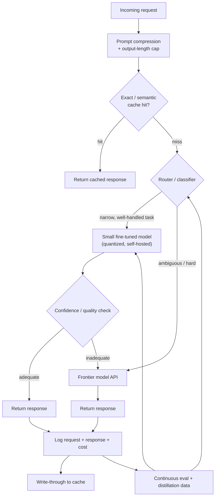

# Case Study: Cut LLM Inference Cost 10x Without Hurting Quality

## The prompt as asked
"Your product calls a frontier LLM on every user request. Cost has become a P&L problem. Cut inference cost by a large factor (e.g., 10x) without a noticeable drop in quality. How do you approach this?"

## 1. Clarify — questions to ask before designing
- What's the actual cost composition — token volume (many requests, short prompts) or token depth (few requests, huge context/output)? These call for different fixes.
- What's the current quality bar, and how is it measured today — is there an eval suite at all, or is "quality" currently just vibes and support tickets?
- What's the traffic shape — is a large fraction of requests near-duplicates or narrow in scope (a classification-shaped task wearing an LLM costume), or is every request genuinely open-ended?
- Is latency also a constraint, or purely cost — some techniques (heavier caching, smaller models) help both; others (batching) trade latency for cost.
- Is there budget/appetite for fine-tuning a smaller model, or does the solution need to ship with prompting and infra changes only?
- What does "quality" regression actually cost the business — a slightly worse but still-acceptable answer, or a wrong answer that damages trust? This sets how aggressive the cost cuts can be.

## 2. Requirements

| | |
|---|---|
| Functional | Serve the same product behavior (same inputs, same expected output quality) at a fraction of current inference spend |
| Scale | Whatever the product's current request volume is — the point of this exercise is that cost scales with volume, so the fix must scale too, not just work in a demo |
| Latency budget | Same as today, or better — a cost fix that regresses latency is usually not acceptable to ship |
| Freshness | N/A in the usual sense — but any caching layer introduces a new freshness/staleness tradeoff that didn't exist before (see §6) |
| Constraints | Quality must be measured, not assumed — "no noticeable drop" needs an eval to actually check, not a launch-and-see-if-anyone-complains process |

## 3. Metrics

| Layer | Metric | Why |
|---|---|---|
| Business | $ inference cost per day/month, cost per resolved request, cost as % of revenue | The metric the project exists to move |
| Quality (offline eval) | Task-specific eval score (accuracy, groundedness, rubric-graded quality) on a fixed eval set, before vs after each change | Every cost-cutting change is a candidate quality regression and must clear the same eval bar as a model upgrade would — see [[llm-evaluation]] |
| Online | User-facing quality proxies (thumbs-up/down, regeneration rate, escalation/complaint rate), latency p50/p99 | Offline evals are necessary but not sufficient — a subtle quality drop in production shows up in behavior before anyone reruns the eval suite |
| Guardrail | Cache staleness rate, fraction of requests routed to the small/cheap model vs the large one, output-truncation rate | These are the levers being pulled — each has its own failure mode if pushed too hard, and must be watched directly, not inferred from the aggregate cost number alone |

## 4. Data
- **Request/response logs**: the actual traffic — prompts, outputs, latencies, token counts — is the primary input to this whole exercise; without it, every proposed optimization is a guess.
- **Duplicate/near-duplicate analysis**: cluster historical requests to find how much traffic is genuinely unique vs a small number of recurring patterns — this number directly caps how much a caching strategy can save.
- **Eval set construction**: a representative, sufficiently large set of (input, expected-quality-output) pairs, ideally stratified by request type/difficulty, built *before* any optimization work starts — without this, "did quality drop" is unanswerable.
- **Cost breakdown by call site**: not all LLM calls in a product cost the same or matter the same — a classification-shaped call (route this ticket to category A/B/C) and a long-form generation call have very different optimization headroom.

## 5. Features
This case isn't a features problem in the usual sense — the equivalent design work is **characterizing each call site** so the right lever gets applied to it:
- **Task shape**: is the call actually open-ended generation, or is it a narrow classification/extraction task an LLM is being used for out of convenience? Narrow tasks are the best candidates for a small fine-tuned model or even a non-LLM classifier.
- **Repetition profile**: how often does this call site see identical or near-identical inputs (the same system prompt + a small set of common user questions)? High repetition is exact-match or semantic-cache territory.
- **Context size**: how much of the cost is input tokens (long context, RAG-heavy) vs output tokens (long-form generation)? These call for different fixes — input cost responds to prompt caching and context compression ([[context-assembly-and-compression]]); output cost responds to output-length control and smaller models.
- **Latency sensitivity and batchability**: can requests for this call site tolerate being queued and batched together, or does each need an immediate response? Batching only helps where queuing is acceptable.

## 6. Model — the routing / cascade architecture
This is the section where, unlike a training-pipeline case, there is no single model to pick — the deliverable is an **architecture for deciding, per request, which model (or shortcut) actually handles it**:
- **Semantic and exact-match caching** first, since it's the cheapest possible win: identical or near-duplicate requests (by embedding similarity) are served from a cache instead of hitting the model at all — see [[caching-strategies]]. This alone can remove a large fraction of cost on high-repetition traffic with zero quality risk, provided the cache has a sane invalidation policy.
- **Model cascade / routing**: a small, cheap, fast model (or even a classifier) attempts every request first; a router (confidence-based, or a lightweight classifier trained on "did the small model's answer look adequate") escalates only the requests it can't handle well to the large/frontier model. See [[small-language-models-and-cost]] and [[agent-cost-and-latency-optimization]] for the same routing idea in an agent context. The cost savings scale with what fraction of traffic the small model can competently handle — usually the majority, if the task distribution is narrow.
- **Task-specific fine-tuned small models**: for a call site that's really a narrow, well-defined task (classify, extract, rewrite in a fixed style), a small model fine-tuned on this task's own logged data ([[parameter-efficient-finetuning-lora]], or full fine-tune of a small base model) frequently matches frontier-model quality on that narrow task at a fraction of the cost — see [[knowledge-distillation]] for using the frontier model's own outputs as training data for the smaller replacement.
- **Quantization and efficient serving** on any self-hosted model in the stack: lower-precision weights ([[quantization]]) and serving-stack efficiency ([[llm-serving-and-throughput]], [[kv-cache-and-inference-optimization]]) cut the cost of running a given model size, independent of which model is chosen — this is a multiplier on top of routing, not an alternative to it.
- **Prompt and output-length control**: shorter, better-compressed prompts (trimmed few-shot examples, compressed retrieved context — see [[context-assembly-and-compression]]) and explicit output-length limits (a summary capped at 200 tokens instead of an unbounded one) cut both cost and latency directly, and are usually the cheapest engineering effort of any lever here.
- **Batching**: for async or tolerant-of-queuing traffic, batching requests together improves GPU utilization and throughput on self-hosted models — a latency-for-cost tradeoff, so it's applied selectively, not globally.

## 7. Serving

The confidence/quality check after the small model is what makes the cascade safe to ship — it's the equivalent of the escalation decision in an agent system, just applied to raw model quality instead of task risk.

## 8. Monitoring
- **Cost per request, segmented by which path served it** (cache hit, small model, large model) — this is the single dashboard that shows whether the architecture is actually working as designed, not just whether total spend went down.
- **Quality eval score, tracked continuously**, not just at rollout — a cascade whose router thresholds drift over time (as traffic mix shifts) can silently start sending harder requests to the small model.
- **Cache hit rate and cache staleness incidents** — a stale cached answer served for a question whose correct answer has since changed is a distinct failure mode from a cache miss, and needs its own alerting.
- **Escalation rate from small to large model** — a rising trend either means traffic mix is genuinely getting harder (fine) or the small model is regressing/router threshold has drifted (needs attention) — these look identical on a raw cost graph and must be told apart via the eval, not cost alone.
- **Latency p50/p99 per path** — batching and routing both change the latency profile, and a cost win that quietly blows the latency budget on a subset of traffic is not a clean win.

## 9. Failure modes — quality regressions from over-aggressive cost cutting
- **Router miscalibration silently downgrades quality**: the small model handles a growing share of traffic as the router's confidence threshold (never revisited after initial tuning) no longer matches reality — total cost looks great, aggregate quality erodes slowly enough that nobody notices until user complaints spike.
- **Stale cache serving wrong answers**: aggressive caching without a real invalidation strategy serves an outdated answer for a question whose ground truth has changed (a policy update, a price change) — the cost win is real but the correctness cost is invisible until it causes a concrete incident.
- **Over-compressed context loses critical information**: trimming retrieved context or few-shot examples too aggressively to save input tokens removes exactly the information needed for a correct answer on harder requests — the failure looks like a model-quality problem when it's actually a context-budget problem.
- **Output-length caps truncate mid-answer**: a hard token cap tuned against average-case output length clips genuinely long-but-correct answers for a subset of requests, and truncation is often worse for user trust than a slower, complete answer would have been.
- **Distillation quality ceiling**: a small model fine-tuned on the frontier model's own outputs inherits the frontier model's blind spots and any of its errors that made it into the training data — it can match average-case quality while quietly having no capability at all on the tail cases the frontier model handled through general reasoning rather than pattern-matching.
- **Optimizing the eval, not the product**: tuning routing thresholds against the offline eval set until it looks perfect, without continuing to watch the online quality proxies, is a classic Goodhart trap — the eval set stops representing live traffic the moment traffic composition shifts.

## 10. Tradeoffs to say out loud
- **Aggressiveness of routing vs quality risk.** Routing more traffic to the small/cheap model saves more money, but every percentage point routed away from the frontier model is a percentage point of traffic now dependent on the router's judgment being right — the safe way to push this is incrementally, watching the eval and online proxies at each step, not by picking an aggressive threshold up front and hoping.
- **Build a fine-tuned small model vs keep prompting a frontier model with better engineering.** A fine-tuned small model can beat prompt engineering on cost and even on narrow-task quality, but it's a maintenance commitment — it needs retraining as the task distribution shifts, its own eval suite, and its own deployment pipeline. Prompt/context engineering on a frontier model needs none of that infrastructure but has a lower cost ceiling.
- **Caching aggressiveness vs freshness.** A longer cache TTL and looser semantic-similarity threshold for cache hits saves more money, but raises the odds of serving a stale or subtly-wrong-for-this-request cached answer — the right settings depend entirely on how often the "correct" answer to a given request actually changes over time.
- **Cost savings vs latency.** Batching, and routing through an extra confidence-check step before falling back to the large model, both add latency in exchange for lower cost — acceptable for a background or tolerant-of-delay surface, much less acceptable for a live chat interface where the added round trip is directly felt by the user.

## Related
[[small-language-models-and-cost]]
[[caching-strategies]]
[[quantization]]
[[knowledge-distillation]]
[[llm-serving-and-throughput]]
[[kv-cache-and-inference-optimization]]
[[context-assembly-and-compression]]
[[llm-evaluation]]
[[agent-cost-and-latency-optimization]]
[[case-agentic-support-automation]]
[[case-document-extraction-pipeline]]
