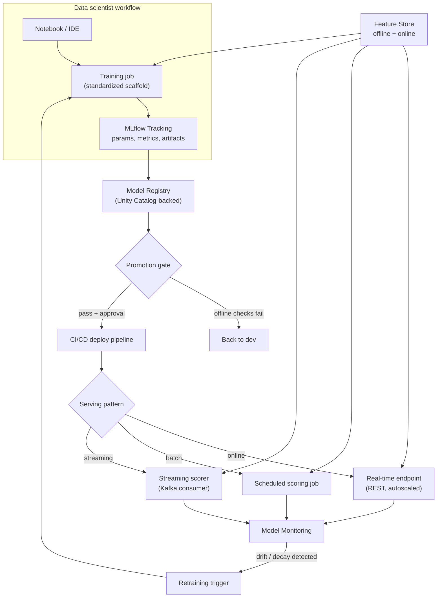

# Case Study: Design an Internal ML Platform

## The prompt as asked
"Design an internal ML platform for a mid-size org's data science team — the shared infrastructure
that lets 10-30 data scientists go from a notebook to a monitored production model without each
team reinventing training, tracking, registry, and serving from scratch."

## 1. Clarify — questions to ask before designing
- How many data scientists/ML engineers, and how many models are already in production or planned?
  Platform investment that's obviously worth it for 30 people building 50 models is overkill for 3
  people building 2.
- What's already in place — a notebook environment, a data warehouse/lakehouse, any ad hoc model
  serving? Greenfield platform design and "retrofit governance onto an existing mess" are different
  problems.
- Is this single-cloud/single-cluster (e.g. one Databricks workspace) or does it need to span
  multiple clouds/regions/business units? This drives the governance layer's shape.
- What's the mix of model types — classical ML (tabular, GBDTs), deep learning, or increasingly
  LLM-based systems? Each has different training/serving infra needs, and a platform built only for
  the first will need rework for the third.
- Who owns platform reliability — is this a dedicated platform team, or is "the platform" really
  three ML engineers' part-time responsibility? This bounds how much operational complexity is
  actually sustainable.
- Regulatory constraints (data residency, model explainability requirements, PII handling)? These
  can force specific answers (e.g. mandatory lineage, mandatory approval gates) rather than leaving
  them as nice-to-haves.

## 2. Requirements

| | |
|---|---|
| Functional | A data scientist can go from raw data to a monitored, served model without hand-building tracking, registry, or serving infra each time |
| Scale | Tens of data scientists, hundreds of experiments/week, tens to low hundreds of production models, mixed batch/online serving |
| Latency budget | Platform-imposed latency should be near-zero for training (an offline concern); online serving SLA is model-specific, but the platform must not add meaningful overhead beyond the model's own inference time |
| Freshness | Feature tables refresh on a schedule the team controls, not the platform's; the platform's job is guaranteeing point-in-time correctness at whatever cadence, not forcing everything to be real-time |
| Constraints | Multi-team reuse of features and models, governance (who can see/train on what data, who approved this model for production), reproducibility (a run from six months ago must be re-creatable), cost visibility per team |

## 3. Metrics

| Layer | Metric | Why |
|---|---|---|
| Business | Time from "idea" to "model in production", % of models still serving 6 months after ship, incident count attributable to platform gaps | The platform's ROI is measured in engineering time saved and incidents prevented, not a model-quality number |
| Platform (adoption) | % of production models registered through the platform (not shadow-deployed via a personal script), % of training runs with complete lineage (code+data+params+model) | A platform nobody uses isn't a platform, it's a wiki page; adoption is the leading indicator that catches this early |
| Platform (reliability) | Feature pipeline freshness/SLA hit rate, model registry/serving uptime, training job failure rate | These are the platform team's own SRE-style metrics — the platform is now a dependency other teams' SLAs depend on |
| Cost | $/experiment, $/served-prediction, idle compute (unused clusters/endpoints) | Multi-tenant infra without cost attribution back to teams reliably drifts toward waste — see [[cost-optimization-for-ml]] |

## 4. Data
- The platform doesn't own business data; it owns the **feature and experiment metadata layer**
  sitting on top of the org's existing lakehouse (medallion Bronze/Silver/Gold — see
  [[medallion-architecture]]).
- Every feature table, training dataset snapshot, and registered model needs a stable identity and
  a version, so "which data trained this model" is a query, not an investigation — this is exactly
  what [[unity-catalog-and-governance]] gives on a Databricks stack (`catalog.schema.object`
  namespace spanning tables, feature tables, and registered models under one governance model), and
  what [[data-versioning]] (e.g. Delta Lake time travel) gives at the table level.
- Access control has to be enforced at the data layer, not by convention — row/column-level
  security for PII-bearing feature tables (see [[security-and-pii-in-ml]]), applied once centrally
  rather than reimplemented per consuming notebook or job.

## 5. Features
The platform's "features" section is really: **what does the platform standardize so individual
teams don't reinvent it?**
- **A feature store** ([[feature-stores]]) as the shared feature layer: one definition per feature,
  computed once, exposed through an offline path (bulk reads for training, point-in-time correct)
  and an online path (low-latency lookups for serving). Without this, N teams recompute
  "days-since-last-purchase" N slightly different ways, and training-serving skew ([[training-serving-skew]])
  becomes a recurring incident rather than a solved problem.
- **Standardized training pipeline scaffolding**: a template (PySpark/Databricks Jobs or an
  orchestrator like Airflow — see [[apache-airflow]]) that any team's training code plugs into,
  handling cluster provisioning, data loading, and MLflow run initialization, so a data scientist
  writes model logic, not infrastructure glue.
- **A shared evaluation harness**: common metric computation (so "AUC" means the same computed
  thing across teams), slice-level evaluation, and a standard held-out/backtest convention — this
  is a platform feature as much as any piece of infra, because inconsistent evaluation across teams
  is a governance problem in disguise.

## 6. Model
This case study is about the platform *around* models, not a specific model architecture — the
platform must be model-and-framework agnostic (a GBDT via [[xgboost-deep-dive]], a PyTorch model,
or an LLM fine-tune all need to fit the same tracking/registry/serving story). The concrete
components:
- **Experiment tracking** ([[experiment-tracking-mlflow]]): every run logs params, metrics,
  artifacts, and the model itself, tied to a code commit and a data version — the four-part tuple
  that makes a run reproducible.
- **Model registry** ([[model-registry-and-versioning]]): a model is registered with lineage back
  to its training run, moves through explicit stages (None → Staging → Production → Archived) gated
  by automated checks (offline metric thresholds, signature/schema validation), not manual trust.
- **CI/CD for ML** ([[ci-cd-for-ml]]): the same rigor applied to code (linting, unit tests) is
  applied to model promotion — a pull request that changes a training pipeline should run a smoke
  training job and compare metrics against the current production model before merge is even
  approved.

## 7. Serving

The registry sits as a hard gate between "trained" and "servable" — no serving path (online, batch,
or streaming, see [[model-serving-patterns]]) pulls a model that hasn't cleared it, which is what
makes "which model version is actually live" an answerable question during an incident rather than
Slack archaeology.

## 8. Monitoring
- **Model monitoring** ([[model-monitoring]]): prediction distribution drift, feature drift
  ([[data-drift-and-concept-drift]]), and business-metric decay per production model, dashboarded
  centrally rather than per-team, so the platform team (not each individual data scientist) is the
  first to notice a systemic issue like a broken upstream feature pipeline affecting five models at
  once.
- **Platform health, separately from any one model**: feature pipeline freshness SLAs, registry/
  serving uptime, training job success rate — the platform itself needs an on-call story once other
  teams depend on it.
- **Cost dashboards per team/model**, since multi-tenant shared infra without visible cost
  attribution reliably drifts toward "nobody notices the idle GPU cluster."
- **Lineage-driven impact analysis**: when an upstream table's schema changes, the platform should
  be able to answer "which production models are affected" from Unity Catalog's lineage graph
  directly, not from tribal knowledge.

## 9. Failure modes
- **Building the platform before there are enough users to justify it** — a beautifully engineered
  feature store and registry for two data scientists and three models is pure overhead; the ROI
  case doesn't exist yet. Platform investment should track team/model count, not precede it.
- **Governance bolted on after adoption, not designed in from the start** — teams that already
  shipped models outside the platform (a personal script, a workspace-local MLflow registry) resist
  migrating, and the org ends up with a permanently bifurcated "platform models" vs "shadow models"
  population, exactly the fragmentation the platform was meant to prevent.
- **One-size-fits-all serving assumptions** — designing only for batch scoring and then discovering
  a use case needs sub-100ms online inference (or vice versa) forces a late, expensive redesign of
  the serving layer; see [[case-realtime-feature-pipeline]] for what the online path actually
  requires.
- **Feature store adoption without point-in-time discipline** — a feature store that isn't actually
  enforcing point-in-time-correct joins is just an expensive shared cache, and training-serving skew
  keeps happening, just now with everyone blaming "the platform" instead of their own pipeline.
- **Platform team becomes an approval bottleneck** — over-gating promotion (too many manual sign-offs)
  slows every team down equally, and data scientists route around it, recreating the shadow-model
  problem the platform was built to solve.

## 10. Tradeoffs to say out loud
- **Standardization vs team autonomy.** A shared feature store, training scaffold, and registry
  eliminate duplicated work and enable cross-team reuse, but they also mean any team wanting to do
  something the platform doesn't yet support (a new framework, an unusual serving pattern) is
  blocked or has to go through the platform team — the same centralization that prevents chaos also
  creates a queue.
- **Build vs buy.** MLflow + Unity Catalog + Databricks Feature Engineering gets most of this out of
  the box on a Databricks stack at comparatively low build cost; a fully custom platform (own
  tracking service, own registry, own feature store) gives more control but is a multi-quarter
  engineering investment that has to be justified against what a managed/open-source stack already
  provides for free.
- **Governance rigor vs iteration speed.** Every additional gate (mandatory review, mandatory
  lineage tag, mandatory offline-metric threshold) reduces the risk of a bad model reaching
  production, but also slows every promotion, including the 95% that would have been fine anyway —
  the right amount of gating is a function of how expensive a bad production model actually is in
  this business, not a fixed best practice.
- **Central platform team vs embedded ownership.** A central team building shared infra amortizes
  cost across all consuming teams, but becomes a single point of contention for prioritization;
  embedding platform capability into each team avoids the bottleneck but reproduces the duplicated-
  effort problem the platform existed to solve. Most orgs land on a hybrid: a small central platform
  team owns the shared primitives (registry, tracking, feature store infra), and consuming teams own
  their own training code and model logic on top of it.

## Related
[[feature-stores]]
[[experiment-tracking-mlflow]]
[[model-registry-and-versioning]]
[[unity-catalog-and-governance]]
[[ci-cd-for-ml]]
[[model-serving-patterns]]
[[model-monitoring]]
[[medallion-architecture]]
[[cost-optimization-for-ml]]
[[case-realtime-feature-pipeline]]
