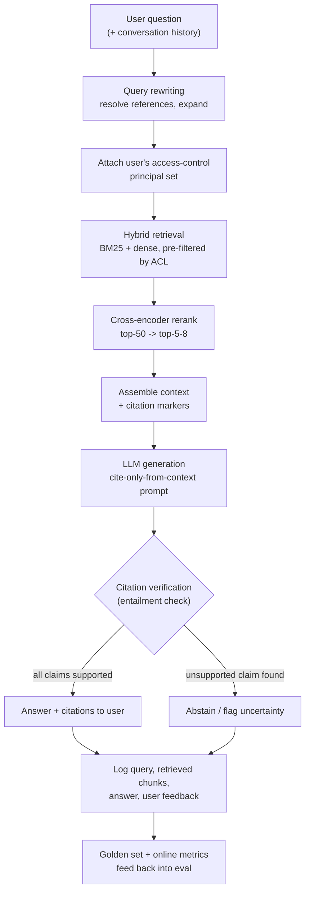

# Case Study: Design a RAG-Based Q&A Assistant

## The prompt as asked
"Design a Q&A assistant that answers questions grounded in a private document corpus — internal
policies, contracts, SOWs, product docs — with citations, and that says 'I don't know' rather than
inventing an answer when the corpus doesn't have it."

This case is about **retrieval and answer grounding**: getting the right passage in front of the
model and getting it to actually use it correctly. It is deliberately scoped away from
tool-calling/multi-step agent behavior — an assistant that also takes actions (files a ticket, calls
an API) is a different design problem layered on top of this one, not a variant of it.

## 1. Clarify — questions to ask before designing
- What's the corpus — size, format (PDF, DOCX, HTML, scanned images), how structured (clean prose
  vs. tables/contracts with clause numbering), and how often does it change?
- Is this single-tenant or does it need per-user/per-client access control over which documents can
  even be retrieved? This changes the retrieval layer from "search everything" to "search within
  this user's visible set," enforced as a hard constraint, not a UI nicety.
- What's the cost of a wrong answer — an internal FAQ bot has a very different bar than a system
  answering questions about contractual obligations. This sets how aggressive abstention should be.
- Is there an existing golden set of question/answer pairs, or does one need to be built from
  scratch? Without one, "is this system actually good" has no answer beyond vibes.
- Latency/cost budget per query — an interactive chat UI wants sub-second-to-a-few-seconds; a
  batch-processed research assistant can tolerate much more.
- Single-turn Q&A, or multi-turn with conversation history that needs to inform retrieval (a
  follow-up question referring to "it")?

## 2. Requirements

| | |
|---|---|
| Functional | Answer a natural-language question grounded in the private corpus, with inline citations, and abstain when the corpus doesn't support an answer |
| Scale | A corpus from thousands to millions of chunks; query volume from tens to thousands of queries/day depending on deployment |
| Latency budget | Interactive use: a few hundred ms for retrieval + rerank, a few seconds total including generation |
| Freshness | New/updated documents should be searchable within minutes to hours of ingestion, not require a full model retrain (this is RAG's core value proposition over fine-tuning — see [[vs-rag-vs-finetuning]]) |
| Constraints | Per-user access control over retrievable documents, citation requirement for every factual claim, measurable and low hallucination rate, must degrade to "I don't know" rather than a fabricated answer |

## 3. Metrics

| Layer | Metric | Why |
|---|---|---|
| Business | Deflection rate (questions answered without escalation to a human), user-reported answer usefulness | The actual ROI is fewer humans answering repetitive questions, not a retrieval score in isolation |
| Retrieval (offline) | recall@k, MRR, NDCG against a golden set of questions with labelled gold chunks | Retrieval sets the ceiling on everything downstream — see [[rag-evaluation]]; reporting only end-to-end accuracy hides which of the two failure classes (retrieval vs generation) is actually broken |
| Generation (offline) | Faithfulness/citation precision (is every claim supported by its cited passage), answer relevance | Distinguishes "found the right passage but the model still made something up" from a retrieval miss — see [[hallucination-and-grounding]] |
| Online | Abstention rate and its precision (did it abstain only on genuinely unanswerable questions), user follow-up/rephrase rate as an implicit dissatisfaction signal | Offline metrics run on a static golden set; online tracks the live query distribution, which drifts as users discover the tool |
| Guardrail | Access-control violation rate (must be exactly zero, tested adversarially), latency p95/p99 | A single leaked document across a client boundary is a worse outcome than any amount of retrieval-quality shortfall |

## 4. Data
- Source documents land through [[document-ingestion-and-parsing]]: PDFs, DOCX, HTML normalized to
  a common structured representation (ideally preserving headings, tables, and clause boundaries,
  not flattened to raw text) — a parsing failure here silently caps every downstream metric.
- Every chunk carries metadata beyond its text: source document ID, client/tenant, document type,
  effective date, and an access-control list — this metadata is what makes filtering (and therefore
  access control and recency handling) possible at retrieval time rather than as an afterthought.
- **The golden evaluation set is itself a data asset, not a one-time artifact**: a labelled set of
  real questions with the gold chunk(s) and an ideal answer, grown over time from real user queries
  and their corrections — see [[rag-evaluation]]. Without this, chunk-size and retrieval-strategy
  decisions are made on vibes.
- Document versioning matters: a 2023 policy and its 2025 replacement can both be in the corpus,
  embedding near-identically; the system needs recency metadata to prefer the current version, not
  just cosine similarity (which is blind to "which one is still in effect").

## 5. Features
In a RAG system, "features" are the artifacts the retrieval pipeline builds and consumes, not
ML-model input columns:
- **Chunks**, produced via [[chunking-strategies]] — structure-aware splitting (never cross a
  clause/table boundary), roughly 300–600 tokens with 10–15% overlap as a starting point, validated
  per corpus by measuring recall@k, not assumed from a library default. Contracts and SOWs in
  particular should chunk by clause, not raw token count.
- **Embeddings**, via [[embeddings]] and [[embedding-models]] — the single highest-leverage choice
  after chunking; a domain-mismatched embedding model silently caps recall regardless of how good
  chunking or reranking is downstream.
- **Hybrid retrieval signals**: dense (semantic) plus lexical (BM25) via
  [[hybrid-search-bm25-vector]], since a private corpus of contracts and SOWs is exactly the kind
  that contains client names, dollar amounts, and clause/section numbers that dense retrieval alone
  systematically misses.
- **Rerank scores** via [[reranking]] — a cross-encoder pass over a wider retrieved candidate set
  (e.g. top 50 fused down to top 5-8), which is what turns raised recall (from hybrid search, or
  from raising k) into precision at the context window actually handed to the generator.

## 6. Model
- The generator is typically an off-the-shelf LLM (no fine-tuning needed for the retrieval-and-
  grounding task itself — see [[vs-rag-vs-finetuning]] for when fine-tuning the generator's *style*
  is separately worth doing). The interesting modeling decisions are all upstream and downstream of
  generation, not the generator's weights.
- **Query understanding**: query rewriting/expansion ([[query-rewriting-and-expansion]]) to handle
  underspecified or conversational (multi-turn, pronoun-referring) questions before they hit
  retrieval — a query like "what about the renewal clause" needs the prior turn's context folded in
  before it's embedded.
- **Prompt design enforces grounding as a hard constraint, not a suggestion**: "answer using ONLY
  the passages below, cite every claim as [n], say you don't know if the passages don't contain the
  answer" — see the concrete pattern in [[hallucination-and-grounding]].
- **Citation verification as a second model pass**: after generation, check each cited claim against
  its cited passage with a lightweight entailment/NLI check (or an LLM-as-judge call) — citation
  *presence* is not citation *correctness*, and only verification catches the difference.
- **Abstention is a tuned decision, not a prompt-and-hope**: the threshold for "insufficient
  information" trades precision (don't fabricate) against recall (don't refuse answerable
  questions), tuned against a labelled set of answerable vs. genuinely-unanswerable queries.

## 7. Serving

Access control is enforced as a pre-filter at the retrieval step, never as a post-filter on
generated output — filtering after the fact both degrades recall for restricted users and risks a
summarization step upstream leaking restricted content before the filter ever runs.

## 8. Monitoring
- **Retrieval health**: recall@k drift on a rolling sample of production queries scored against
  spot-checked gold chunks, embedding index freshness (time since last reindex vs. document update
  rate).
- **Generation health**: citation precision sampled continuously (not just at launch), abstention
  rate and a periodic audit of *why* the system abstained (genuinely unanswerable vs. a retrieval
  miss it couldn't tell apart from one).
- **Corpus drift**: new document types or a shift in query topics that the embedding model or
  chunking strategy wasn't validated against — see [[rag-failure-modes]] for the full symptom-to-
  cause diagnostic tree.
- **Access-control regression testing**: adversarial queries specifically designed to probe whether
  a restricted document can be retrieved by a user who shouldn't see it, run continuously, not just
  at initial rollout.
- **Cost/latency per stage**: retrieval, rerank, and generation each have separate cost/latency
  profiles; a regression in any one stage should be attributable, not lumped into "the assistant got
  slower."

## 9. Failure modes
- **Retrieval miss mistaken for a generation bug**: the most common triage error is assuming a bad
  answer is a prompting/hallucination problem when the gold chunk was never retrieved in the first
  place — always check retrieval first (see [[rag-overview]]'s triage flow).
- **Citation presence without citation correctness**: the model attaches a real, retrieved citation
  marker to a claim that citation doesn't actually support — looks grounded, isn't; only an
  entailment-style verification pass catches this.
- **Post-filter access control**: filtering restricted documents out after retrieval instead of
  before means a restricted chunk was scored, potentially summarized, and could leak before the
  filter runs — a security bug wearing a relevance-ranking costume.
- **Stale document version answered from**: an old policy embeds nearly identically to its
  replacement; without recency metadata actively used at retrieval or rerank time, the system
  confidently cites the wrong version.
- **"We added RAG" mistaken for "we measured hallucination reduction"**: RAG reduces unsupported
  claims when retrieval succeeds, but a plausible-but-irrelevant retrieved chunk can produce
  *confident* wrongness that reads as more trustworthy than an ungrounded guess — grounding without
  measurement is a false sense of safety.

## 10. Tradeoffs to say out loud
- **Recall (raise k) vs precision (keep context tight).** Retrieving more candidates raises the
  chance the gold chunk is somewhere in the set, but stuffs the generator's context with
  distractors and contradictory passages, degrading attention to the one that matters and raising
  cost — reranking is what lets you raise k for recall and still hand the generator a small,
  high-precision context.
- **Abstention aggressiveness.** A system tuned to abstain readily is safer against hallucination
  but frustrates users on genuinely answerable questions it misjudges as out-of-scope; a system
  tuned to always attempt an answer maximizes helpfulness at the cost of occasional confident
  wrongness. The right operating point is a business decision about the cost of each error type, not
  a fixed threshold.
- **Chunk size: retrieval precision vs. generation context.** Small chunks embed precisely and rank
  well but may lack surrounding context to actually answer from; large chunks carry more context but
  dilute the embedding and confuse a reranker. Small-to-big (parent-document) retrieval is the
  common resolution, at the cost of extra bookkeeping (child-to-parent mapping) — see
  [[chunking-strategies]].
- **Build vs. framework.** LangChain/LlamaIndex (see [[langchain-and-langgraph]], [[llamaindex]])
  gets a working retrieval pipeline running in an afternoon, but the framework doesn't give you the
  evaluation harness, access-control discipline, or citation-verification pass that make the
  difference between a demo and a production system — the hard 80% is evaluation and grounding
  rigor, not pipeline wiring.

## Related
[[rag-overview]]
[[chunking-strategies]]
[[hybrid-search-bm25-vector]]
[[reranking]]
[[hallucination-and-grounding]]
[[rag-evaluation]]
[[rag-failure-modes]]
[[vs-rag-vs-finetuning]]
[[vs-vector-db-options]]
[[document-ingestion-and-parsing]]
