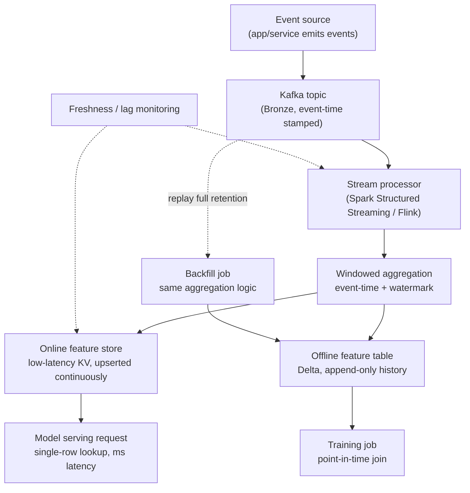

# Case Study: Design a Real-Time Feature Computation Pipeline

## The prompt as asked
"Design a pipeline that computes features in real time for online model serving — e.g. the velocity
features (transaction count/amount over sliding windows) a fraud model needs — and keeps them
consistent with what the same features look like offline for training."

This is a data-engineering-shaped problem, distinct from [[case-fraud-detection]] (which is about
the model and decision system that *consumes* these features). The two are referenced from each
other because a real fraud system needs both, but the hard problems here — streaming aggregation
correctness, online/offline consistency, backfill — are engineering problems, not modeling ones.

## 1. Clarify — questions to ask before designing
- What's the actual freshness requirement — seconds (fraud velocity checks), minutes (a
  recommendation re-ranking signal), or is "real-time" being used loosely for "faster than the
  nightly batch job"? This changes the entire architecture, not just a parameter.
- What features specifically — sliding-window aggregates (count/sum/avg over a trailing window),
  session-based features, or point lookups against slowly-changing dimensions? Aggregates are the
  hard case; point lookups are closer to a plain online store problem.
- Does an offline (batch/training) version of these same features already exist, or is this
  greenfield for both paths at once? Retrofitting online serving onto features that were only ever
  computed in batch is a common and messier version of this problem.
- What's the acceptable staleness if the streaming pipeline falls behind — serve slightly stale
  features, or fail closed (block/fall back to a default)? This is a business decision, not an
  engineering default.
- How many consuming models/teams will read these features? One model justifies a simpler
  point-to-point pipeline; several justifies investing in a proper feature store.
- What does correctness mean operationally — is a rare double-counted event during a Kafka
  rebalance acceptable, or does this feed a use case (billing, compliance) that needs exactly-once
  guarantees?

## 2. Requirements

| | |
|---|---|
| Functional | Compute streaming aggregate features (e.g. transaction count/amount over 1-min/1-hr/1-day windows per entity) and serve them online with low latency, while producing the *same* feature values for offline training |
| Scale | High-throughput event streams (thousands to tens of thousands of events/sec), per-entity state that must stay bounded even as the entity population grows |
| Latency budget | Online read: single-digit to low-double-digit milliseconds (the serving path, e.g. a fraud model, is often itself latency-constrained — see [[latency-and-throughput-budgets]]); write/aggregation freshness: seconds |
| Freshness | Aggregates must reflect events up to a few seconds ago, not the last batch window — this is the entire reason this pipeline exists instead of a nightly job |
| Constraints | Point-in-time correctness between the online and offline paths, exactly-once (or acceptably-idempotent) aggregation under replay/rebalance, bounded backfill cost when features are added or changed after the fact |

## 3. Metrics

| Layer | Metric | Why |
|---|---|---|
| Business | Downstream model performance sensitivity to feature staleness (e.g. fraud recall drop when velocity features lag) | Ties pipeline SLAs to an actual dollar cost, not an abstract latency target |
| Pipeline (freshness) | End-to-end event-to-feature-available latency (p50/p99), consumer lag on the streaming source | The single most common failure mode in these systems is silent staleness — a lagging pipeline doesn't crash, it just quietly serves stale numbers |
| Pipeline (correctness) | Online/offline feature value parity on a sampled audit (compute the same feature both ways for the same entity/timestamp and diff) | This is the direct, measurable check for training-serving skew — see [[training-serving-skew]] |
| Guardrail | Duplicate-event rate after rebalances/retries, backfill job duration and cost | Guards against the two classic streaming failure classes: double-counting and unbounded reprocessing cost |

## 4. Data
- Raw events arrive via a durable, replayable log — Kafka topics ([[kafka-and-event-streaming]]) —
  landing verbatim into the medallion Bronze layer before any transformation, so a bug in
  aggregation logic can always be re-derived from the untouched source ([[medallion-architecture]]).
- **Point-in-time correctness is the organizing constraint for every design decision here**: a
  feature computed for a training example at time $t$ must only use events with timestamp $\le t$;
  the online store, by construction, can never violate this (it only has "now"), but a naive offline
  backfill computed carelessly (e.g. joining on ingestion time instead of event time) absolutely can
  — see [[data-leakage]] and [[feature-stores]].
- **Event time vs. processing time** matters concretely: a mobile client can emit an event with a
  timestamp several seconds or minutes old (network delay, offline buffering) that arrives at the
  stream processor "late." Aggregation windows must be defined on event time with an explicit
  watermark (how long to wait for late data before closing a window), not on wall-clock arrival
  time, or two runs of the same pipeline against the same events can silently disagree.
- **Backfill** is a first-class data concern, not an afterthought: when a new feature is added, or an
  existing one's logic changes, historical values must be recomputable over the event log's
  retention window using the *same* aggregation logic the streaming path uses — this is exactly what
  a Kappa-style architecture ([[vs-batch-vs-streaming-architecture]]) is built to make tractable,
  versus maintaining a second, subtly-diverging batch implementation.

## 5. Features
- **Sliding-window aggregates**: count/sum/avg/max of an entity's events over trailing windows
  (1 min / 1 hr / 1 day) — the canonical example is the fraud velocity feature in
  [[case-fraud-detection]] ("has this card had more than N transactions in the last 5 minutes").
  These require maintaining per-entity state that ages out old events as the window slides, not a
  simple running total.
- **Session/behavioral features**: time-since-last-event, deviation from an entity's own rolling
  baseline — computed the same streaming way but with a longer-memory state store per entity.
- **State store choice is a real design decision**: an in-memory keyed state store within the stream
  processor (e.g. Spark Structured Streaming's stateful operators, or Flink's keyed state) for the
  aggregation itself, backed by a low-latency online store (Redis-like KV store) for the *serving*
  read path — these are two different stores serving two different access patterns (continuous
  update vs. point lookup at inference time), and conflating them is a common design mistake.
- **Feature definitions must be shared, not reimplemented, between the streaming and batch/training
  paths** — this is precisely the guarantee a feature store ([[feature-stores]]) is supposed to
  provide: one definition, exposed through both an online and offline interface, rather than a
  Python UDF in the streaming job and a slightly-different SQL window function in the training
  pipeline quietly drifting apart.

## 6. Model
There's no predictive model in this pipeline itself — "model" here means the computational model of
*how aggregation is expressed and executed*, which is the actual engineering decision:
- **Streaming engine choice**: Spark Structured Streaming (natural fit if the org already runs
  Databricks/PySpark batch jobs — shared code, shared operational tooling) vs. a dedicated stream
  processor like Flink (stronger native support for complex event-time windowing and lower-latency
  stateful processing) — see the general tradeoff in [[vs-batch-vs-streaming-architecture]] and
  [[batch-vs-streaming]].
- **Windowing semantics**: tumbling windows (fixed, non-overlapping) are simpler and cheaper;
  sliding windows (the actual fraud-velocity requirement — "transactions in the last 5 minutes,"
  updated continuously) cost more state and compute since a single event can belong to many
  overlapping windows simultaneously.
- **Watermarking strategy**: how long the pipeline waits for late-arriving events before finalizing
  a window's aggregate is a direct latency-vs-completeness tradeoff — too short and legitimately
  late events are dropped from the aggregate they should count toward; too long and freshness
  suffers for every window, not just the rare late ones.
- **Exactly-once vs. at-least-once**: idempotent aggregation (e.g. keying updates by event ID so a
  replayed event doesn't double-count) is usually the pragmatic middle ground — true exactly-once
  semantics end-to-end (source to sink) is achievable but adds real complexity that should be
  justified by the actual cost of occasional double-counting, not assumed as a default requirement.

## 7. Serving

The backfill path deliberately reuses the exact aggregation logic the live streaming path runs
(rather than a separately maintained batch equivalent) — this is the Kappa-architecture choice, and
it's what prevents the online and offline feature definitions from silently diverging over time.

## 8. Monitoring
- **Freshness/staleness of the online store** is the single most operationally important signal —
  a stale velocity feature silently defeats whatever it feeds (in the fraud case, this is the most
  common real-world failure mode of the entire fraud system, not just the pipeline).
- **Consumer lag** on the Kafka topic(s) feeding the stream processor, as a leading indicator of
  freshness problems before they show up as stale feature values downstream.
- **Online/offline parity audits**: periodically recompute a feature offline for a sampled set of
  (entity, timestamp) pairs and diff against what was actually served online at that time — this is
  the direct, ongoing check against training-serving skew, not a one-time validation at launch.
- **Backfill job duration and cost**, tracked over time — as the event log retention grows, a
  backfill that replays the full history gets more expensive, and this cost curve should be visible
  before it becomes a surprise the next time a feature definition changes.
- **State store size/growth per entity**, since unbounded per-entity state (e.g. never expiring old
  session data) is a classic way a streaming job's memory footprint grows until it falls over.

## 9. Failure modes
- **Streaming feature staleness** — the pipeline lags (a slow stage, a stuck consumer group) and
  online features quietly under-count recent activity; nothing crashes, so this can run undetected
  until a downstream model's performance visibly degrades.
- **Event-time vs. processing-time confusion** — aggregating on arrival time instead of the event's
  own timestamp makes results dependent on network/processing delays rather than actual event
  timing, so reprocessing the same events later produces different aggregates than the original
  live run did.
- **Double-counting after a consumer rebalance or retry** — without idempotent aggregation keyed by
  event ID, a redelivered event silently inflates a count/sum feature, which is especially dangerous
  for exactly the kind of velocity feature meant to catch anomalous activity.
- **Online/offline definition drift** — the streaming job's aggregation logic and the batch/training
  pipeline's equivalent logic are maintained as two separate codebases that quietly diverge (a bug
  fix applied to one, not the other), producing training-serving skew that's invisible until a model
  underperforms in production relative to its offline evaluation.
- **Unbounded backfill cost** — a feature definition change requiring a full replay of a long-
  retention event log can become a multi-hour-to-multi-day job if this cost wasn't designed for
  upfront (e.g. via checkpointing, incremental backfill, or bounding replay to a relevant window).

## 10. Tradeoffs to say out loud
- **Freshness vs. cost and complexity.** Every increment of freshness (seconds instead of minutes,
  minutes instead of hours) costs more in continuously-running infrastructure and correctness
  complexity (watermarking, state management); the right freshness target is set by how much the
  *consuming* model's performance actually degrades with staler features, not by "faster is always
  better."
- **Watermark length: completeness vs. latency.** A longer watermark captures more late-arriving
  events correctly into their window at the cost of delaying when that window's aggregate is
  considered final; a shorter watermark is faster but silently drops legitimately late events from
  the aggregate they should have counted toward.
- **Shared streaming/batch logic (Kappa-style) vs. two maintained pipelines (Lambda-style).**
  Reusing one aggregation definition for both live serving and backfill avoids the classic dual-
  codebase drift problem, but commits the team to a streaming engine capable of efficient full-
  history reprocessing — not every stream processor is designed for that, and it's a real
  constraint on the engine choice, not just an implementation detail.
- **Building a real feature store vs. a point-to-point pipeline.** If only one model consumes these
  features, a direct streaming-job-to-online-store pipeline is simpler and faster to ship than
  standing up a full feature store; the feature store's shared-definition and multi-consumer
  benefits only pay for themselves once a second or third model wants the same aggregates — see
  [[feature-stores]] and [[case-ml-platform-design]] for when that investment is justified.

## Related
[[feature-stores]]
[[kafka-and-event-streaming]]
[[training-serving-skew]]
[[data-leakage]]
[[medallion-architecture]]
[[vs-batch-vs-streaming-architecture]]
[[batch-vs-realtime-inference]]
[[case-fraud-detection]]
[[latency-and-throughput-budgets]]
