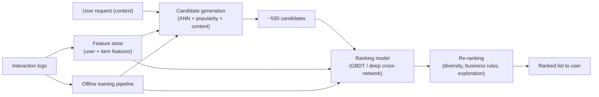

# Case Study: Design a Recommendation System

## The prompt as asked
"Design a recommendation system for [an e-commerce home feed / a video platform's 'up next' / a food delivery app's restaurant list]."

## 1. Clarify — questions to ask before designing
- What's the surface — home feed, "similar items," email, or a checkout up-sell? Each has a different latency and inventory size.
- Implicit or explicit feedback? Do we have ratings, or only clicks/purchases/dwell time?
- How big is the catalogue — thousands of SKUs or tens of millions?
- What does "good" mean to the business — GMV, session time, diversity, or all three fighting each other?
- How fresh must recommendations be — can a user's last five minutes of browsing change what they see next?
- Cold start: how many new users/items appear per day, and is there any onboarding signal (stated preferences, demographics)?

## 2. Requirements

| | |
|---|---|
| Functional | Given a user (and context: device, time, page), return a ranked list of items they are likely to engage with / buy |
| Scale | Catalogue: 10M–500M items; users: tens of millions; QPS: thousands at peak |
| Latency budget | End-to-end p99 under ~100–200 ms for a live page; candidate generation + ranking must fit inside that |
| Freshness | Session-level signals (last few clicks) should affect ranking within seconds; the candidate index refreshes hourly/daily |
| Constraints | Cold-start users/items, popularity bias, diversity/fatigue constraints, no recommending out-of-stock or already-purchased items |

## 3. Metrics

| Layer | Metric | Why |
|---|---|---|
| Business | GMV / revenue per session, session length, D7 retention | What the org actually optimizes for |
| Model (offline) | Recall@K / NDCG@K on held-out interactions, hit rate | Cheap to compute, guides model iteration before an A/B test |
| Online | CTR, add-to-cart rate, conversion rate, watch time | Ground truth for real user behaviour, measured via A/B |
| Guardrail | Catalogue coverage, diversity (intra-list similarity), popularity bias (Gini), latency p99 | A model that only ever recommends the top-10 bestsellers "wins" CTR and kills the long tail |

## 4. Data
- **Interaction data**: clicks, add-to-cart, purchases, dwell time, ratings if available — mostly implicit, positive-only feedback (we rarely observe explicit negatives, only non-interactions, which are a mix of "shown and ignored" and "never shown").
- **Item metadata**: category, price, text description, image embeddings, freshness (publish date), inventory/stock state.
- **User metadata**: stated preferences at signup, demographics if available, device/context features.
- **Negative sampling**: for implicit feedback, negatives are usually sampled from impressions-not-clicked (harder, biased toward what the current system already shows) or randomly from the catalogue (easier, less realistic). This choice materially changes what the model learns.
- Logged data carries **exposure bias** — you only observe feedback on what a previous model chose to show, so naively training on logs entrenches the incumbent's blind spots. Off-policy correction (inverse propensity weighting) or exploration traffic mitigates this.

## 5. Features
- **User side**: recent interaction history (last-N items, categories, embeddings averaged/pooled), long-term preference vector, demographic/context features, session-in-progress signals (what they clicked in the last 5 minutes).
- **Item side**: content embeddings (text/image), category, price bucket, popularity/recency, collaborative-filtering embedding learned from co-interaction.
- **Cross features** (ranking stage only): user–item affinity score from a lightweight model, category match, price fit relative to user's historical spend.
- See [[feature-engineering]] and [[categorical-encoding]] for the mechanics of building these; embeddings are learned jointly with the retrieval model, not hand-engineered.

## 6. Model
Two-stage architecture — this is the standard answer and the one an interviewer expects you to justify, not just name:

**Stage 1 — Candidate generation (recall).** Goal: take the catalogue (millions of items) down to a few hundred candidates, cheaply. Options:
- Collaborative filtering via matrix factorization or a two-tower neural model (user tower + item tower, trained with a contrastive/sampled-softmax loss) — item embeddings are precomputed and indexed in an ANN store ([[ann-algorithms-hnsw-ivf]]); at serve time you embed the user and do a nearest-neighbour lookup.
- Content-based nearest neighbours (for cold-start items with no interaction history yet).
- Popularity / trending as a cheap fallback candidate source, always blended in for exploration and cold start.
- Multiple candidate sources are usually unioned (collaborative + content + popularity + "recently viewed similar") before ranking — see [[recommender-systems-basics]] for the retrieval-vs-ranking split in more depth.

**Stage 2 — Ranking (precision).** A few hundred candidates, scored by a heavier model that can afford cross features: gradient-boosted trees ([[xgboost-deep-dive]]) or a deep cross-network taking user, item, and user×item features. Trained on the actual objective (predicted CTR or predicted purchase probability), often as a multi-task model (predict click and purchase and watch-time jointly, then combine at serving).

**Stage 3 (optional) — Re-ranking.** Business-rule adjustments: diversity injection (don't show 10 items from the same category), deduplication, inventory filtering, exploration (epsilon-greedy or Thompson sampling on a slice of traffic) to keep collecting fresh signal on new/cold items.

**Cold start.**
- New user: fall back to popularity/trending + onboarding preferences + contextual features (device, location, time); shrink toward a cohort-average embedding.
- New item: use content embeddings as the item representation until enough interactions accumulate to also inform (or replace) it with a collaborative embedding; boost exposure deliberately (exploration bonus) so the new item gets a fair chance to accumulate signal.

## 7. Serving

Candidate generation and ranking are separate services so each can scale and be cached independently; the item ANN index is rebuilt on a schedule (hourly/daily) while user embeddings can be computed online from session features.

## 8. Monitoring
- **Online metrics**: CTR/conversion by segment (new vs returning users, cold vs warm items) — aggregate metrics can look fine while a whole cohort is starved.
- **Latency**: p50/p99 per stage (candidate gen vs ranking) so you know where a regression lives.
- **Data/model drift**: shifting catalogue mix, seasonal interaction patterns, feature distribution drift on both towers — see [[data-drift-and-concept-drift]].
- **Diversity/popularity metrics** over time — a common failure mode is a slow drift toward recommending only bestsellers as the model over-fits to what it's shown.
- **Exploration budget spend** and whether it's actually surfacing enough new items to keep the cold-start pipeline fed.

## 9. Failure modes
- **Feedback loop / filter bubble**: the model only sees interactions on what it recommended, reinforces its own biases, and the catalogue's long tail never gets a fair shot — mitigated with exploration traffic and off-policy evaluation.
- **Cold-start collapse**: without deliberate exposure, new items/users get near-zero signal forever and the collaborative model can't learn anything about them.
- **Position bias**: users click what's shown first regardless of relevance; training naively on raw clicks bakes this in — needs position-debiasing (e.g. an inverse-propensity term or a position feature at training time, removed at serving).
- **Staleness**: batch-computed candidate indexes miss a user's last five minutes of intent (they just searched for shoes, but the recommender still thinks they like electronics) — needs a session-aware re-ranking layer.
- **Offline/online metric gap**: a model that improves NDCG offline can lose online CTR because offline evaluation is done on logged (biased) data — the two must be triangulated, never trusted in isolation.

## 10. Tradeoffs to say out loud
- **Two-stage vs single-stage ranking.** Two-stage scales to huge catalogues and lets you use a heavy model on a small candidate set — but adds a stage where a good item can be dropped before ranking ever sees it (candidate-generation recall is a hard ceiling on final quality). A single end-to-end ranker over the whole catalogue is simpler and never loses good items pre-ranking, but is computationally infeasible past ~10⁴–10⁵ items.
- **Collaborative filtering vs content-based.** Collaborative signals capture real taste correlations competitors can't easily replicate, but are useless for cold-start items/users. Content-based generalizes immediately to new items but tends to recommend near-duplicates and misses "people who bought X also bought unrelated Y" patterns. Production systems blend both rather than picking one.
- **Optimizing engagement vs long-term value.** Chasing CTR/watch-time directly rewards clickbait and short-term engagement; optimizing for a longer-horizon proxy (session satisfaction, D7 retention) is more aligned with the business but is noisier and slower to get signal on, making iteration harder.
- **Exploration vs exploitation.** Spending traffic on exploration (showing under-tried items) costs short-term engagement metrics but is the only way to avoid permanent cold-start collapse and to keep offline training data unbiased — the fraction to spend is itself a product decision, not just a modeling one.

## Related
[[recommender-systems-basics]]
[[ann-algorithms-hnsw-ivf]]
[[xgboost-deep-dive]]
[[data-drift-and-concept-drift]]
[[ml-system-design-framework]]
[[feature-engineering]]
[[requirements-and-metrics-definition]]
