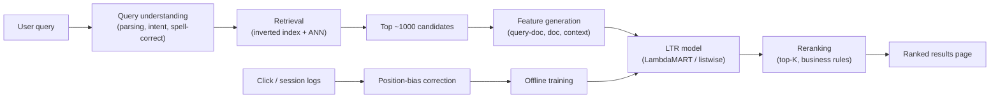

# Case Study: Design a Search Ranking System

## The prompt as asked
"Design the ranking system behind a search box — e.g., an e-commerce product search or a job/listing search."

## 1. Clarify — questions to ask before designing
- Is this the whole search stack (query understanding + retrieval + ranking) or just the ranking layer sitting on an existing retrieval/index?
- What does the query distribution look like — mostly short keyword queries, or long natural-language queries?
- Do we have relevance judgments (human-labeled) or only behavioral logs (clicks)?
- What's the business objective — conversion, ad revenue, engagement — and does it ever conflict with "most relevant"?
- Personalization: does ranking depend on the searching user, or is it query-only?
- Scale and latency: catalogue size, QPS, and the p99 budget for a page of results.

## 2. Requirements

| | |
|---|---|
| Functional | Given a query (+ optional user context), return a ranked list of the most relevant results |
| Scale | Catalogue: millions of documents/products; QPS: hundreds to thousands at peak |
| Latency budget | p99 typically 100–300 ms end to end, including retrieval, feature lookup, and ranking |
| Freshness | New/updated documents should be searchable within minutes; ranking model retrained periodically (weekly) |
| Constraints | Query sparsity (most queries are rare/unique — the "long tail"), position bias in click logs, must rank both exact matches and semantically related results |

## 3. Metrics

| Layer | Metric | Why |
|---|---|---|
| Business | Conversion rate, revenue per search, zero-result-query rate | The real objective search serves |
| Model (offline) | NDCG@K, MRR, MAP — computed against relevance judgments or clicks | Directly measures ranking quality on held-out queries, analogous to how [[roc-auc-and-pr-curves]] measure classifier quality — but rank-aware rather than threshold-based |
| Online | CTR@1/@K, session success rate (did the user stop searching / click something), abandonment rate | Real user behavior, measured via interleaving or A/B |
| Guardrail | Latency p99, result diversity, query coverage (fraction of queries with any results) | A ranker over-optimized for offline NDCG can regress badly on the long tail of rare queries it never saw in training |

## 4. Data
- **Relevance judgments**: either human-labeled (query, document, relevance grade) pairs — expensive but unbiased — or inferred from click logs, which are cheap but biased by position and by what the current ranker already showed.
- **Click logs**: query, shown results (with position), clicked results, dwell time, whether the session ended in a purchase/success.
- **Query logs**: raw query text, parsed intent/entities, query frequency (head vs torso vs tail).
- The core data problem: click logs are not ground-truth relevance — a document clicked at position 1 might just be clicked because it was first (**position bias**), and a great document buried at position 8 rarely gets a chance. This must be corrected before training on clicks (e.g., using a click model that estimates position-conditional examination probability, or randomized result-position experiments to collect unbiased data).

## 5. Features
- **Query-document match features**: BM25/TF-IDF score, exact/partial text match, semantic similarity (dense embedding cosine similarity).
- **Document features**: popularity, freshness, quality/authority signals, price/rating (in e-commerce).
- **Query features**: query length, historical CTR for this query, detected intent/category.
- **User/context features** (if personalizing): past purchase/search history, location, device.
- **Cross features**: category match between query intent and document category, price fit against the user's historical spend.
- This is feature engineering under a different name from a classification problem — same techniques in [[feature-engineering]] apply, but every feature here is computed per (query, document) pair, which is what makes the feature-generation step expensive at scale.

## 6. Model
**Learning-to-rank (LTR)** is the framing an interviewer wants named explicitly, with the three standard approaches:
- **Pointwise**: treat each (query, document) pair as an independent regression/classification target (predict relevance grade or click probability). Simple, reuses standard ML tooling, but doesn't model that ranking is about *relative* order.
- **Pairwise** (e.g., RankNet, LambdaMART): train on pairs of documents for the same query, optimizing to get the order right. LambdaMART (gradient-boosted trees with a pairwise ranking loss) is the long-standing industry default — same GBDT machinery as [[xgboost-deep-dive]], different objective.
- **Listwise** (e.g., ListNet, LambdaRank/LambdaMART with NDCG-aware gradients): directly optimize a list-level metric like NDCG. Usually the best offline metric performance, more complex to implement and reason about.

In practice: LambdaMART-style pairwise/listwise GBDT ranking on hand-engineered + embedding features is still extremely common and hard to beat on cost/latency; a two-stage retrieval-then-rank architecture (fast retrieval — sparse [[hybrid-search-bm25-vector]]-style or ANN — followed by a heavier LTR ranker on the top few hundred candidates) mirrors the pattern in [[case-recommendation-system]] and is worth naming as the same underlying idea. A [[reranking]] pass (potentially a cross-encoder or LLM-based reranker) can sit after the LTR stage for the very top results where quality matters most and only a few dozen candidates need scoring.

## 7. Serving

Retrieval and ranking are split for the same reason as in recommenders: the LTR model is too expensive to run over the full catalogue, so a cheap retrieval stage narrows the field first.

## 8. Monitoring
- **Offline/online metric gap**: track NDCG offline and CTR/conversion online side by side — a persistent, growing gap usually means the offline evaluation set (built from biased clicks) no longer represents real user intent.
- Zero-result-query rate and query coverage by segment (head vs long-tail queries) — aggregate NDCG can look great while the long tail (which is most of unique query volume) is badly served.
- Latency breakdown per stage (retrieval vs feature generation vs ranking) — feature generation over hundreds of candidates is often the actual bottleneck, not the model itself.
- Result diversity/redundancy over time.

## 9. Failure modes
- **Position-bias-poisoned training data**: training directly on raw clicks without debiasing reinforces whatever the current ranker already does, and new/better documents never get a fair chance to be clicked and thus learned from.
- **Offline/online metric divergence**: a ranker that improves NDCG on a stale labeled set can regress live CTR because real query distributions and user intent drift.
- **Long-tail neglect**: a model trained mostly on head-query behavior data generalizes poorly to the torso/tail, which is most of unique traffic even if not most of impressions.
- **Retrieval recall ceiling**: like in recommenders, ranking quality is capped by whether the right document even made it into the candidate set — a ranking bug can hide a retrieval bug.
- **Feature staleness**: popularity/freshness features computed on a stale batch job misrank genuinely new, currently-relevant content.

## 10. Tradeoffs to say out loud
- **Relevance vs business objective.** Ranking purely by predicted relevance and ranking by predicted revenue/conversion are different objectives that often disagree (the most relevant result isn't always the highest-margin one) — most production rankers blend both, and how much weight goes to each is a product decision with real customer-trust consequences.
- **Pointwise vs pairwise/listwise LTR.** Pointwise is simpler to build, debug, and reuse existing classification infra for, but doesn't directly optimize what you actually care about (relative order). Pairwise/listwise optimize the real objective better but are more complex to implement, slower to train, and harder to debug when something goes wrong.
- **Two-stage retrieval+rank vs single-stage.** Two-stage scales to large catalogues and lets a heavy ranker run only on a few hundred candidates, but caps quality at retrieval recall — a great document that never enters the candidate set is invisible to the ranker no matter how good it is. A single-stage model over the whole catalogue avoids that ceiling but is infeasible in latency/cost past a fairly small catalogue.
- **Click-based vs human-labeled relevance data.** Clicks are cheap, plentiful, and reflect real behavior, but are biased (position bias, presentation bias) and noisy. Human relevance judgments are unbiased and higher-quality per example, but expensive, slow to refresh, and don't scale to covering the long tail of queries.

## Related
[[roc-auc-and-pr-curves]]
[[reranking]]
[[xgboost-deep-dive]]
[[hybrid-search-bm25-vector]]
[[recommender-systems-basics]]
[[feature-engineering]]
[[ml-system-design-framework]]
