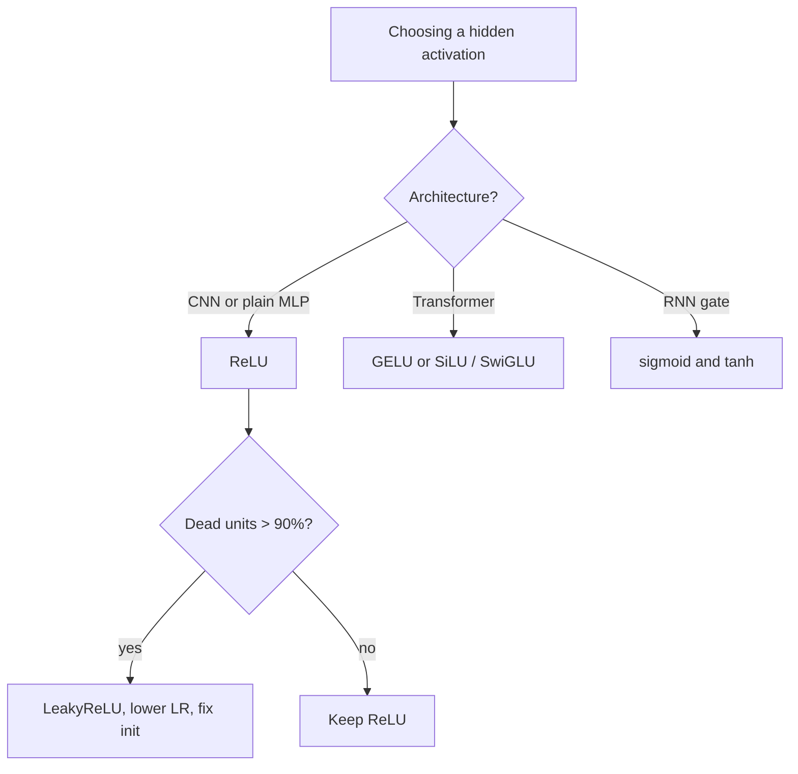

# Activation Functions

## TL;DR
The activation is the only nonlinearity in the network, and its *derivative* decides whether gradients survive depth. Sigmoid and tanh saturate and kill gradients; ReLU does not saturate on the positive side but can die; GELU and SiLU are smooth, non-monotonic ReLU variants that dominate modern transformers. Default to ReLU for convnets and MLPs, GELU or SiLU for transformers.

## Intuition
An activation is a gate on a wire. A saturating gate (sigmoid) is nearly flat at both extremes, so once a unit is pushed hard in either direction, the wire stops carrying information backwards — the unit is stuck. A ReLU gate is a hard switch: on, it passes the gradient through untouched; off, it passes nothing. Smooth gates like GELU blend between the two so no input sits exactly at a kink.

## The maths

**Sigmoid.**

$$
\sigma(z) = \frac{1}{1 + e^{-z}}, \qquad \sigma'(z) = \sigma(z)\bigl(1 - \sigma(z)\bigr)
$$

Range $(0,1)$. Maximum derivative $0.25$ at $z=0$. Stacking $L$ sigmoids multiplies gradients by at most $0.25^L$ — the direct cause of vanishing gradients in pre-2010 deep nets. Also not zero-centred, so all gradients w.r.t. a given weight row share a sign, giving zig-zag updates.

**Tanh.**

$$
\tanh(z) = \frac{e^{z}-e^{-z}}{e^{z}+e^{-z}} = 2\sigma(2z) - 1, \qquad \tanh'(z) = 1 - \tanh^2(z)
$$

Range $(-1,1)$, zero-centred, max derivative $1$ at the origin. Strictly better than sigmoid as a hidden activation; still saturates. Survives inside LSTM/GRU cells because the bounded range is doing real work there — see [[recurrent-networks-and-lstm]].

**ReLU.**

$$
\mathrm{ReLU}(z) = \max(0, z), \qquad
\mathrm{ReLU}'(z) = \begin{cases} 1 & z > 0 \\ 0 & z < 0 \end{cases}
$$

Undefined at $0$; frameworks pick $0$. The positive-side derivative is exactly $1$, so gradients pass through unattenuated — this, plus cheapness, is why it unlocked deep training. It also produces genuine sparsity: roughly half the units are off at initialisation.

**Dying ReLU.** If a large gradient step drives $\mathbf{w}^\top\mathbf{x} + b < 0$ for *every* input in the data distribution, the unit outputs 0 always, its gradient is 0 always, and it never recovers. Caused by too-high learning rate or badly negative bias init. Diagnose by logging the fraction of zero activations per layer; above ~90% and persistent is a dead layer.

**LeakyReLU / PReLU.**

$$
\mathrm{LeakyReLU}(z) = \max(\alpha z, z), \quad \alpha \approx 0.01
$$

The negative slope guarantees a nonzero gradient everywhere, so units cannot die. PReLU learns $\alpha$ per channel. The fix works but the gain over plain ReLU on well-initialised, well-normalised nets is usually small.

**ELU.**

$$
\mathrm{ELU}(z) = \begin{cases} z & z > 0 \\ \alpha\left(e^{z}-1\right) & z \le 0 \end{cases}
$$

Smooth, saturates to $-\alpha$ on the left, pushes mean activation toward zero. Costs an `exp`.

**GELU** — Gaussian Error Linear Unit. Gate the input by the probability that a standard normal is below it:

$$
\mathrm{GELU}(z) = z \cdot \Phi(z), \qquad \Phi(z) = P(Z \le z),\; Z \sim \mathcal{N}(0,1)
$$

A common fast approximation is $0.5z\left(1 + \tanh\!\left[\sqrt{2/\pi}\,(z + 0.044715 z^3)\right]\right)$. Unlike ReLU's hard 0/1 gate, GELU's gate is the smooth CDF, so the "keep or drop" decision is stochastic-in-expectation rather than a step.

**SiLU / Swish.**

$$
\mathrm{SiLU}(z) = z\,\sigma(z), \qquad
\mathrm{SiLU}'(z) = \sigma(z) + z\,\sigma(z)\bigl(1-\sigma(z)\bigr)
$$

Numerically very close to GELU. Both are **non-monotonic**: they dip slightly below zero around $z \approx -1.3$ before returning to 0, which lets small negative pre-activations carry a little signal instead of being hard-zeroed.

**Why transformers use GELU/SiLU.** Three reasons, in order of how much they actually matter: (1) smoothness — no kink means no discontinuous second derivative, which pairs better with adaptive optimisers and very large batch training; (2) no dead units — the gradient is nonzero everywhere, and transformer FFN blocks are extremely wide so losing units is expensive; (3) empirically lower loss at equal compute in the original ablations, and once the big pretraining runs adopted it, it became the default. Modern LLaMA-style models go further and use **SwiGLU**: split the FFN input into two projections, apply SiLU to one and multiply, $\mathrm{SwiGLU}(x) = \mathrm{SiLU}(xW_1)\odot(xW_2)$, with hidden width scaled down to keep parameter count matched. See [[transformer-architecture]].

**Output activations are a separate question.** Softmax for multiclass, sigmoid for binary or multilabel, identity for regression. These are chosen to match the loss, not to add nonlinearity — see [[loss-functions]].

## Diagram



## Code

```python
import torch, torch.nn as nn

z = torch.linspace(-4, 4, 9)
for name, fn in [
    ("sigmoid", torch.sigmoid), ("tanh", torch.tanh),
    ("relu", torch.relu), ("leaky", nn.LeakyReLU(0.01)),
    ("elu", nn.ELU()), ("gelu", nn.GELU()), ("silu", nn.SiLU()),
]:
    print(f"{name:8s}", torch.round(fn(z), decimals=3).tolist())

# derivative of any activation, numerically confirmed by autograd
z = torch.linspace(-3, 3, 7, requires_grad=True)
y = torch.sigmoid(z).sum()
y.backward()
print("sigmoid'  ", torch.round(z.grad, decimals=4).tolist())  # peaks at 0.25

# dead-unit monitor: attach to any ReLU-based model
def dead_fraction(module, inp, out):
    print(module.__class__.__name__, "zeros:", (out == 0).float().mean().item())

m = nn.Sequential(nn.Linear(32, 64), nn.ReLU(), nn.Linear(64, 4))
m[1].register_forward_hook(dead_fraction)
m(torch.randn(128, 32))   # healthy ReLU sits near 0.5 at init
```

## In practice
- **Use it when:** always, on every hidden layer. The only question is which.
- **Defaults that work:** ReLU for CNNs and small MLPs (fastest, well understood, pairs with He init). GELU or SiLU for transformers and anything over ~12 layers. Sigmoid/tanh only inside recurrent gates or as output activations.
- **Breaks when:** ReLU + high LR + no normalisation → dead layers. Sigmoid/tanh in deep stacks → vanishing gradients. GELU in a latency-critical CPU inference path → measurable slowdown versus ReLU; the approximate `tanh` form or fusing into the matmul kernel is the fix.
- **Cost / latency:** ReLU and LeakyReLU are a single compare-and-select and are usually memory-bandwidth bound, effectively free. GELU/SiLU need `erf` or `exp`; on GPU they are fused into the surrounding kernel and cost little, on CPU or edge they are noticeable.

> [!tip]
> The activation choice and the initialisation scheme are coupled: He init assumes ReLU-like activations that zero half the signal, Xavier assumes a roughly linear, symmetric activation. Mismatch them and variance drifts across depth. See [[weight-initialization]].

## Interview angle

**Q. Why did ReLU replace sigmoid as the default hidden activation?**
The derivative. Sigmoid's derivative peaks at 0.25, so gradients shrink by at least 4× per layer and vanish in deep stacks. ReLU's derivative is exactly 1 wherever the unit is active, so gradient magnitude is preserved through depth. Secondary benefits: it is cheaper than an exponential, and it induces sparsity.

**Follow-up.** *ReLU's derivative is 0 for negative inputs — isn't that also vanishing?* → It's a different failure. Sigmoid attenuates *every* path multiplicatively; ReLU either passes a path intact or switches it off. As long as a reasonable fraction of units are active for each example, some path always carries full gradient. The pathological case is dying ReLU, where a unit is off for the entire data distribution.

**Q. What is dying ReLU and how do you detect and fix it?**
A unit whose pre-activation is negative for all inputs has zero output and zero gradient forever. Detect by logging per-layer fraction of zero activations; a layer stuck above ~90% is dead. Fix by lowering the learning rate, using He initialisation, adding normalisation, or switching to LeakyReLU/GELU which have nonzero gradient everywhere.

**Q. Why do transformers use GELU or SiLU rather than ReLU?**
They are smooth and non-monotonic, so there is no kink and no hard-zero region — every unit keeps a gradient. That matters in transformer FFN blocks which are very wide and trained with adaptive optimisers at huge batch size. Empirically it gives slightly lower loss at equal compute. Modern LLMs mostly use SwiGLU, a gated variant, which adds a multiplicative interaction on top.

**Q. Is tanh strictly better than sigmoid?**
As a *hidden* activation, yes: it is zero-centred and has a max derivative of 1 rather than 0.25. Sigmoid keeps its place as an *output* activation for binary/multilabel problems because it maps to $(0,1)$, and inside LSTM gates where a value in $(0,1)$ is exactly the "how much to let through" semantics you want.

**Q. Does the activation choice interact with initialisation?**
Yes, directly. He initialisation uses variance $2/n_{\text{in}}$ precisely because ReLU zeroes half the inputs and halves the variance; the factor 2 compensates. Xavier uses $1/n_{\text{in}}$ (or the fan-average form) assuming a symmetric activation with unit slope near zero. Using Xavier with ReLU in a deep net shrinks activation variance layer by layer.

## Traps
- **"Softmax is an activation function like ReLU."** Softmax is an output transformation over a *vector* that couples all logits; ReLU is elementwise. Never put softmax on a hidden layer.
- **"LeakyReLU always beats ReLU."** It fixes a failure mode that mostly doesn't occur when init, LR and normalisation are right. Reported gains are small and inconsistent; it is a debugging tool, not a free win.
- **"ReLU is nonlinear so it can't cause vanishing gradients."** The vanishing risk shifts from attenuation to disconnection (dead units), and exploding gradients are still fully possible since the positive-side gain is 1 with no bound on the weights.
- **"GELU is always better, use it everywhere."** On CPU-bound or edge inference the extra transcendental cost is real, and on a 4-layer CNN there is nothing to gain.
- **Applying an activation after the final layer when the loss already includes it** — e.g. ReLU or softmax before `CrossEntropyLoss` — silently destroys the logits.

## Flashcards
Maximum value of the sigmoid derivative, and where?::0.25, at z = 0.
Why is tanh preferred over sigmoid for hidden layers?::It is zero-centred and its derivative peaks at 1 instead of 0.25.
What is dying ReLU?::A unit whose pre-activation is negative for every input, so output and gradient are permanently zero and it never recovers.
How do you detect dead ReLU units?::Log the per-layer fraction of zero activations; a layer persistently above ~90% zeros is dead.
Formula for SiLU/Swish?::SiLU(z) = z · sigmoid(z).
Why are GELU and SiLU called non-monotonic?::They dip slightly below zero near z ≈ -1.3 before returning to 0, so they are not increasing everywhere.
Which init pairs with ReLU and why?::He init with variance 2/n_in — the factor 2 compensates for ReLU zeroing half the signal.
What is SwiGLU?::A gated FFN where one projection is passed through SiLU and multiplied elementwise by a second projection.

## Related
- [[neural-network-fundamentals]]
- [[vanishing-and-exploding-gradients]]
- [[weight-initialization]]
- [[transformer-architecture]]
- [[loss-functions]]
- [[moc-deep-learning]]
