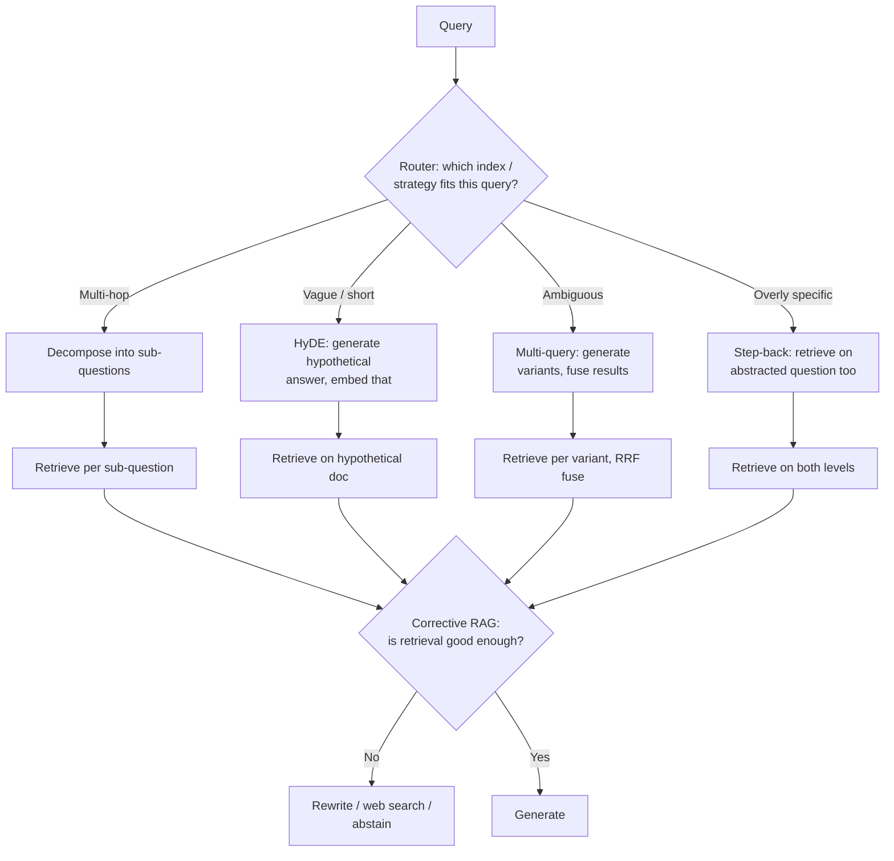

# Advanced RAG Patterns

## TL;DR
Naive RAG (embed query → retrieve top-k → generate) fails on multi-hop questions, vague queries, and
mixed corpora. A family of patterns — decomposition, HyDE, multi-query, step-back prompting,
self-RAG/corrective RAG, routing, and metadata filtering — each fix a specific failure mode at the
cost of extra latency and LLM calls. The interview-relevant skill isn't knowing all of them; it's
knowing which one earns its cost for a given failure.

## Intuition
Each pattern answers a different "why did retrieval fail" question. Decomposition: the question
needs multiple independent facts combined, not one lookup. HyDE: the query and the answer live in
different linguistic registers (a question doesn't look like the passage that answers it). Multi-query:
one phrasing of the query undersells its own ambiguity. Step-back: the question is too specific to
retrieve the general principle needed to answer it. Self-RAG/corrective RAG: sometimes retrieval
itself should be judged and repaired, not blindly trusted. Routing and filtering: not every query
should hit the same index.

## The maths
**HyDE (Hypothetical Document Embeddings).** Instead of embedding the query $q$ directly, generate a
hypothetical answer $\hat{d} = \text{LLM}(q)$ and embed *that*:

$$
\text{sim}(q, d) \approx \cos\big(E(\hat d), E(d)\big)
$$

The intuition: $\hat d$, even if factually wrong, is phrased like a passage that answers the
question — closer in embedding space to real answer-passages than the terse question $q$ ever is,
because bi-encoders are trained on passage-passage or question-passage pairs where style matters.

**Step-back prompting** retrieves using a generalisation of the query. Given specific question $q$,
generate an abstracted question $q' = \text{abstract}(q)$ (e.g. "what was the penalty clause in the
Q3 vendor amendment" → "what are the standard penalty clause terms in vendor contracts"), retrieve on
$q'$ for grounding principles, and optionally retrieve on $q$ too, then reason from both.

**Corrective RAG (CRAG) / Self-RAG** add a judge step: after retrieval, an evaluator (often the LLM
itself, few-shot prompted, or a lightweight trained classifier) scores retrieved-chunk relevance;
low-confidence retrieval triggers a fallback (query rewrite, web search, or explicit
"insufficient context" response) instead of generating from weak grounding.

## Diagram


## Code
```python
def hyde_retrieve(query: str, llm, embedder, vector_store, top_k: int = 20):
    hypothetical = llm.generate(
        f"Write a short passage that would answer this question, "
        f"in the style of a company policy or contract document: {query}"
    )
    hyp_embedding = embedder.encode(hypothetical)
    return vector_store.search(hyp_embedding, top_k=top_k)


def decompose_and_retrieve(query: str, llm, retriever, top_k: int = 5):
    sub_questions = llm.generate(
        f"Break this question into 2-4 independent sub-questions needed to answer it fully. "
        f"One per line, no numbering.\nQuestion: {query}"
    ).splitlines()
    results = {sq: retriever.retrieve(sq, top_k=top_k) for sq in sub_questions if sq.strip()}
    return results  # each sub-question's context assembled separately, then combined for generation


def corrective_rag_gate(query: str, chunks: list[dict], llm, relevance_threshold: float = 0.5):
    """Judge retrieval quality before generating; fall back if it's weak."""
    scores = [
        float(llm.generate(
            f"On a scale 0-1, how relevant is this passage to the question?\n"
            f"Question: {query}\nPassage: {c['text']}\nScore only, no words:"
        ))
        for c in chunks
    ]
    avg = sum(scores) / max(len(scores), 1)
    if avg < relevance_threshold:
        return {"action": "fallback", "reason": "low retrieval confidence"}
    return {"action": "generate", "chunks": chunks}
```

## In practice
- **Use it when:** naive top-k retrieval measurably fails on a documented class of queries in your
  golden set — every pattern here should be adopted because a metric moved, not because it's
  fashionable.
- **Defaults that work for a professional-services corpus:**
  - **Query decomposition** — worth it for genuinely comparative/multi-document questions ("how do
    the termination clauses differ between the 2023 and 2024 MSAs"); not worth it for single-fact
    lookups, where it only adds latency.
  - **HyDE** — worth it when queries are short/vague relative to document register (e.g. one-line
    questions against dense legal prose); skip it when queries are already well-formed and close to
    corpus phrasing, where it adds a call for no gain and risks the hypothetical steering retrieval
    toward a plausible-sounding but wrong answer.
  - **Multi-query** — cheap insurance against query ambiguity; a reasonable default to enable broadly
    if latency allows, since RRF fusion is close to free.
  - **Step-back** — worth it for narrow factual questions that need a general policy/principle as
    context (compliance, standard-terms questions); adds a second retrieval pass.
  - **Self-RAG / corrective RAG** — worth it wherever ungrounded hallucination is unacceptable (client-
    facing legal/financial answers); the added judge-step latency buys a much lower rate of confident
    wrong answers.
  - **Routing across indexes** — mandatory once you have more than one meaningfully distinct
    corpus (e.g. contracts vs internal policy vs product docs) — retrieving from the wrong index
    wholesale outranks any in-index tuning you could do.
  - **Metadata filtering** (date, document type, client, jurisdiction) — nearly always worth it when
    metadata exists; it's a precision lever that costs nothing extra at query time beyond a filter
    predicate.
- **Breaks when:** stacking multiple patterns compounds latency (decomposition + HyDE + corrective
  judge easily triples call count) without a corresponding metric gain — always A/B each addition
  against the golden set in isolation.
- **Cost / latency:** every pattern here adds at least one extra LLM call before generation even
  starts; in a latency-sensitive interactive product, budget for at most one or two of these per
  query, chosen by the router based on query type, rather than running all of them unconditionally.

## Interview angle

**Q. When would you use HyDE over just embedding the raw query?**
When there's a systematic mismatch between how users phrase questions and how the corpus is
written — short, colloquial queries against formal document prose is the classic case. HyDE works
because bi-encoder embedding spaces are shaped by passage-passage similarity in pretraining;
a generated hypothetical passage, even if not fully factually accurate, sits closer in that space to
real answer passages than a terse question does.

**Follow-up.** What's the risk? → The hypothetical can be confidently wrong and steer retrieval
toward documents that match the *wrong* imagined answer rather than the real one — validate with a
golden set before trusting it, and consider retrieving on both the raw query and the hypothetical,
fusing results.

**Q. How do you decide whether query decomposition is worth the latency for your corpus?**
Profile your query logs for genuinely multi-hop/comparative questions (needing facts from more than
one document or section) versus single-fact lookups. If multi-hop questions are a small minority,
build decomposition as a routed path (triggered by classification), not the default for every query —
that keeps the latency cost off the common case.

**Q. What does corrective/self-RAG add that reranking doesn't?**
Reranking reorders candidates assuming *some* useful chunk exists in the pool; corrective RAG
explicitly asks whether the retrieved set is good enough *at all* and has an abstention/fallback path
when it isn't. It's a confidence gate on the whole retrieval outcome, not a re-sorting of it — useful
precisely in cases where the corpus genuinely doesn't contain the answer and the right move is to say
so rather than generate from weak context.

**Q. Metadata filtering versus routing across indexes — aren't they the same idea?**
Related but distinct: routing picks which *index/corpus* to search (contracts vs HR policy vs
product docs — structurally separate stores, often with different chunking/embedding choices);
metadata filtering narrows results *within* a single index by structured fields (date range, client
name, document type, jurisdiction). You often need both — route to the right corpus, then filter
within it.

## Traps
- Adopting every pattern in this page simultaneously "to be thorough" — this is the single most
  common way advanced RAG systems become slow and hard to debug without matching accuracy gains.
- Using HyDE for exact-lookup queries (an invoice number, a defined term) — the hypothetical
  document dilutes what should be a literal match.
- Treating self-RAG/corrective RAG's relevance judge as infallible — it's still an LLM call and
  inherits LLM-as-judge failure modes (see [[rag-evaluation]]); calibrate its threshold against a
  labelled set, don't guess it.
- Building decomposition without a plan for combining sub-answers — decomposing a question into
  parts is only half the job; synthesising a coherent final answer from multiple sub-retrievals needs
  its own prompt design.

## Flashcards
What problem does HyDE solve?::The mismatch between how a query is phrased and how the answer passage is phrased, by embedding a generated hypothetical answer instead of the raw query.
What is step-back prompting used for?::Retrieving on a more general/abstracted version of a specific question to surface the underlying principle needed to answer it.
What does corrective/self-RAG add beyond reranking?::A confidence gate that judges whether retrieved context is good enough at all, with a fallback (rewrite, web search, abstain) when it isn't — reranking only reorders an assumed-good candidate pool.
When is query decomposition worth its added latency?::For genuinely multi-hop or comparative questions needing facts combined from multiple documents — not for single-fact lookups.
Routing vs metadata filtering — what's the difference?::Routing selects which index/corpus to search; metadata filtering narrows results within a chosen index by structured fields.
Why should advanced RAG patterns be adopted individually rather than all at once?::Each adds LLM calls and latency; stacking them compounds cost without a guaranteed compounding accuracy gain — each should be validated against the golden set on its own.

## Related
[[rag-overview]]
[[query-rewriting-and-expansion]]
[[reranking]]
[[graph-rag]]
[[agentic-rag]]
