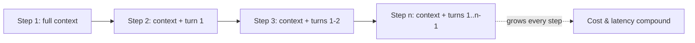

# Agent Cost and Latency Optimization

## TL;DR
An agent loop pays the LLM bill on every turn, and turns multiply — a 10-step task
with a 4K-token context is roughly 10x the cost and latency of a single call, not 1x.
Optimization is about shrinking what you re-send (caching), routing cheap steps to cheap
models, and capping the loop itself so a bug doesn't turn into an invoice.

## Intuition
Think of a single LLM call as a taxi ride: one fare, one distance. An agent is that
same taxi idling at every stop while you re-read the entire trip log out loud before
deciding the next turn. The "re-read the whole trip log" part — the growing context
window re-sent on every step — is where most of the money and most of the latency go,
not the model's raw generation speed.

## The maths
Let $c$ be the token cost per 1K tokens, $n$ be the number of agent steps, and
$T_i$ the context size (input tokens) at step $i$. Without caching, cumulative input
cost is:

$$
\text{Cost}_{\text{input}} = c \sum_{i=1}^{n} T_i
$$

If context grows roughly linearly with step (each step appends the previous tool
call and result, $T_i \approx T_0 + i \cdot \Delta$), then:

$$
\sum_{i=1}^n T_i \approx n T_0 + \Delta \frac{n(n+1)}{2}
$$

The quadratic term is the trap: a naive "keep appending everything" agent scales
cost **quadratically** in the number of steps, not linearly. This is the mathematical
reason context compaction and prompt caching matter more for agents than for
single-turn chat.

Latency composes similarly, but with a twist: because each step's LLM call depends
on the previous tool result, the steps are **sequential**, not parallel. Wall-clock
latency is the sum of (model time-to-first-token + generation time + tool execution
time) across all $n$ steps — there is no way to hide this behind batching unless
sub-steps are genuinely independent (e.g. fan-out searches).

## Diagram


## Code
```python
# Rough back-of-envelope cost estimator for an agent loop.
def agent_loop_cost(base_tokens: int, growth_per_step: int, steps: int,
                     input_cost_per_1k: float, output_tokens_per_step: int,
                     output_cost_per_1k: float) -> float:
    input_cost = 0.0
    for i in range(steps):
        tokens_this_step = base_tokens + i * growth_per_step
        input_cost += tokens_this_step / 1000 * input_cost_per_1k
    output_cost = steps * output_tokens_per_step / 1000 * output_cost_per_1k
    return input_cost + output_cost

# A 15-step research agent, 1K base context, growing 500 tok/step
naive = agent_loop_cost(1000, 500, 15, 0.003, 300, 0.015)

# Same agent, but with prompt caching so only the delta is billed at full price
def agent_loop_cost_cached(base_tokens: int, growth_per_step: int, steps: int,
                            cached_input_cost_per_1k: float,
                            fresh_input_cost_per_1k: float,
                            output_tokens_per_step: int,
                            output_cost_per_1k: float) -> float:
    cost = 0.0
    for i in range(steps):
        cached_tokens = base_tokens + (i - 1) * growth_per_step if i > 0 else 0
        fresh_tokens = growth_per_step if i > 0 else base_tokens
        cost += cached_tokens / 1000 * cached_input_cost_per_1k
        cost += fresh_tokens / 1000 * fresh_input_cost_per_1k
        cost += output_tokens_per_step / 1000 * output_cost_per_1k
    return cost

cached = agent_loop_cost_cached(1000, 500, 15, 0.0003, 0.003, 300, 0.015)
print(f"naive: ${naive:.2f}  cached: ${cached:.2f}")
```

## In practice
- **Use it when:** any production agent with more than 3-4 tool-call steps per task,
  or any agent serving enough traffic that per-call cost multiplies into a real bill.
- **Defaults that work:** enable prompt caching for the static prefix (system prompt,
  tool schemas, few-shot examples) since that part never changes across steps; set a
  hard `max_steps` (typically 8-20 depending on task) and a hard token budget per
  session; route "does this look like step X or step Y" classification-style decisions
  to a small/cheap model and reserve the frontier model for planning and final synthesis.
- **Breaks when:** context compaction is done too aggressively and the agent loses the
  fact it needs three steps later — cost and correctness trade off directly, so this
  needs eval-driven tuning (see [[agent-evaluation]]), not a fixed rule.
- **Cost / latency:** the two are correlated but not identical — a cached, cheap-model
  step can still be slow if the tool call itself is slow (e.g. a database query or a
  browser action); latency budgets need to account for tool time separately from model
  time.

## Interview angle
**Q. Your agent's API bill jumped 5x after adding a new capability. How do you debug it?**
Instrument per-step token counts and per-tool latency first — most blowups are either
(a) a tool now returns a much larger payload that gets stuffed into context unfiltered,
or (b) a new loop path that doesn't terminate cleanly and runs extra steps. Add
per-step logging of input/output tokens and step count before touching prompts.

**Follow-up.** What's the fix if the tool payload itself is the problem? → Summarize or
truncate tool output before it re-enters context — don't return a 50-row SQL result
verbatim when the agent only needs the top 3 rows and a count.

**Q. When would you route to a smaller model mid-agent-loop, and how do you decide
which steps qualify?**
Route steps that are narrow and verifiable — argument extraction, format validation,
"is this tool call syntactically correct" — to a cheap model, and keep planning,
ambiguous disambiguation, and final answer synthesis on the frontier model. Decide by
looking at step-level eval accuracy: if the cheap model matches the frontier model's
accuracy on that step type in offline eval, route it.

**Follow-up.** How do you avoid silently degrading quality when you do this? → Keep a
canary: periodically run the same step on both models and alert if the small model's
agreement rate with the large model drops below a threshold.

**Q. What's the difference between reducing cost via caching versus via context
compaction, and why would you want both?**
Caching reduces the *price* of re-sending unchanged tokens (the provider still sees
them, just bills them cheaper). Compaction reduces the *number* of tokens sent at all
(summarizing old turns). Caching only helps a static or slowly-changing prefix;
compaction is what controls the quadratic growth in the first place. Both because
caching alone still degrades latency (the provider still processes cached tokens, just
faster/cheaper) as context grows unboundedly.

## Traps
- "Just use the biggest model everywhere for reliability" — ignores that most agent
  steps are narrow and don't need frontier reasoning; it also fails the interview
  because it shows no cost-awareness, which is exactly what's being tested.
- Treating `max_steps` as a nuisance to raise until errors go away — an unbounded loop
  is a production incident waiting to happen (an agent stuck retrying a failing tool
  call 40 times), not just a cost issue.
- Assuming caching is "free" reliability — cached context still counts against the
  context window limit, and cache invalidation (a single changed token near the start
  of the prompt) silently reverts you to full-price billing.
- Conflating "fewer tokens" with "faster" — time-to-first-token dominates latency for
  short generations; for agents making many short tool-call decisions, round-trip
  network and tool-execution time can matter more than token count.

## Flashcards
Why does a naive agent loop's cost scale worse than linearly in steps?::Because each step re-sends the growing conversation history, so cumulative input tokens sum a roughly arithmetic sequence — a quadratic total, not linear.
What's the main lever for reducing agent latency versus agent cost?::Latency: fewer sequential steps and faster tool calls. Cost: caching the static prefix and routing simple steps to cheaper models — the two levers overlap but aren't identical.
What does prompt caching actually cache?::The token-processing (KV-cache-equivalent) work for an unchanged prefix of the input, so a subsequent call with the same prefix is billed and processed faster — it doesn't change the model's response.
Why set a hard max_steps budget on an agent?::To bound worst-case cost and latency and to catch non-terminating loops (e.g. a tool call that keeps failing and getting retried) before they become an incident.
Name one thing that should almost never be routed to a small model in an agent loop.::Final planning/synthesis decisions or ambiguous disambiguation where a wrong call is expensive to undo.

## Related
[[agent-frameworks-landscape]]
[[agent-evaluation]]
[[llm-serving-and-throughput]]
[[kv-cache-and-inference-optimization]]
[[small-language-models-and-cost]]
[[cost-optimization-for-ml]]
