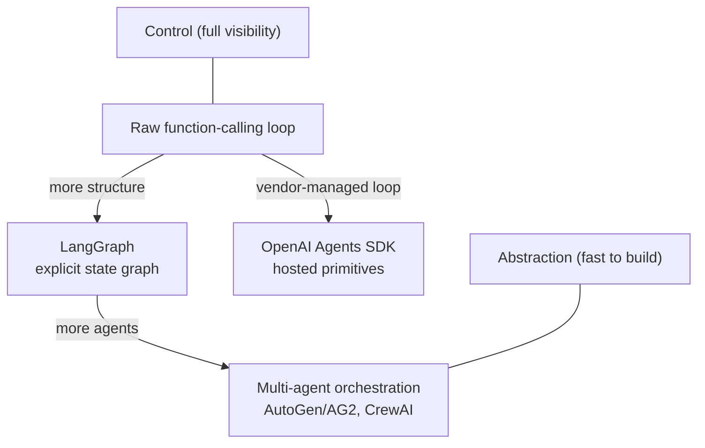

# Agent Frameworks Landscape

## TL;DR
Every agent framework is solving the same three problems — how state persists across
steps, how multiple agents (if any) hand off work, and how much control versus
abstraction you get — with different defaults. Picking one is really picking a point
on the control-vs-abstraction spectrum, not picking a feature list.

## Intuition
A raw function-calling loop is a bicycle: you pedal every gear change yourself, but
you can go anywhere. A heavily abstracted multi-agent framework is an automatic
transmission car: less to think about, faster to get moving, harder to do something
the framework didn't anticipate. Most production agents converge back toward the
bicycle once they need real reliability, because debugging an abstraction you don't
control is worse than writing the loop yourself.

## The maths
Not a numerical topic — the "derivation" here is the decomposition of what a
framework actually provides, since interviewers probe whether you can name the real
axes instead of reciting product names:

1. **State management** — how is conversation/task state represented and persisted
   between steps? A plain Python loop keeps state in a list; a graph-based framework
   models it as a typed object passed between nodes with explicit transitions.
2. **Control flow model** — is the loop a fixed ReAct-style think/act/observe cycle,
   or an explicit graph/state machine where you define allowed transitions? A graph
   makes branching, retries, and human-approval gates first-class instead of ad hoc
   `if` statements buried in a loop.
3. **Multi-agent orchestration** — how do multiple specialized agents communicate and
   hand off? Options range from a manager agent explicitly routing to sub-agents, to
   a shared-conversation model where agents "speak" in turn and any agent can act.
4. **Abstraction level** — how much of the prompt, memory, and tool-calling mechanics
   does the framework hide versus expose? More abstraction means faster prototyping
   and less code, at the cost of harder debugging when the abstraction leaks.

## Diagram


## Code
```python
# The three frameworks below solve the same "research then summarize" task
# differently. This is a raw loop first, as the baseline everything else abstracts.

def raw_agent_loop(query, tools, model_call, max_steps=8):
    messages = [{"role": "user", "content": query}]
    for step in range(max_steps):
        response = model_call(messages, tools=tools)
        if response.tool_calls:
            for call in response.tool_calls:
                result = tools[call.name](**call.args)
                messages.append({"role": "tool", "name": call.name, "content": result})
        else:
            return response.content  # model decided it's done
    return "max steps reached without completion"

# LangGraph models the same loop as an explicit graph: nodes are functions,
# edges (including conditional edges) define the control flow, and state is a
# typed dict/object threaded through every node — this is what buys you
# resumability, human-approval interrupts, and branching without nested `if`s.

# from langgraph.graph import StateGraph
# graph = StateGraph(AgentState)
# graph.add_node("plan", plan_node)
# graph.add_node("act", act_node)
# graph.add_conditional_edges("act", route_on_result, {"continue": "plan", "done": END})
```

## In practice
- **Use it when:** a raw loop suffices for a single agent with a handful of tools and
  straightforward control flow — don't reach for a framework by default.
  Reach for LangGraph-style state graphs when you need explicit branching, retries,
  human-in-the-loop interrupts, or resumable long-running workflows. Reach for
  multi-agent frameworks (AutoGen/AG2, CrewAI) only when the task genuinely
  decomposes into specialized roles with distinct context/tools — not as a default
  architecture.
- **Defaults that work:** start with the smallest abstraction that expresses your
  control flow; add a framework when you're reimplementing its features (checkpointing,
  retries, conditional routing) badly by hand. For hosted-model shops, the
  vendor's own agents SDK (e.g. OpenAI's) trades portability for less boilerplate
  around tool schemas and run state.
- **Breaks when:** multi-agent setups without a clear communication protocol tend to
  degrade into agents talking past each other, burning tokens with no convergence —
  this is a known failure mode, not a framework bug, and needs an explicit
  termination/handoff condition regardless of framework.
- **Cost / latency:** more agents in the loop means more LLM calls per task, and
  multi-agent "discussion" patterns (an AutoGen-style group chat) can spiral in
  token cost if there's no cap on rounds — see [[agent-cost-and-latency-optimization]].

## Interview angle
**Q. When would you choose a graph-based framework like LangGraph over a raw
function-calling loop?**
When the control flow needs explicit branching, retries with different logic, or a
human-approval interrupt mid-task — a raw loop expresses these as nested
conditionals that get unreadable fast. A state graph makes the control flow a
first-class, inspectable object, which also makes it easier to visualize, test, and
resume after a crash (state is checkpointed per node, not lost in a Python stack frame).

**Follow-up.** What's the cost of that choice? → More upfront structure to define
even for a simple task, a learning curve for the framework's abstractions, and
debugging that now spans both your code and the framework's execution semantics.

**Q. What's the real difference between AutoGen/AG2-style and CrewAI-style
multi-agent orchestration?**
Both let you define multiple agents with distinct roles/tools, but they differ in the
orchestration model: one leans toward a flexible conversational pattern where agents
exchange messages somewhat freely (powerful but harder to bound), the other leans
toward a more structured task/crew abstraction with explicit sequential or
hierarchical processes (easier to reason about, less flexible for emergent behavior).
The interview-relevant point is naming *why* you'd pick structure over flexibility for
a given task, not memorizing API names.

**Follow-up.** How do you keep a free-form multi-agent conversation from looping
forever? → A hard round cap, an explicit termination condition/tool the agents must
call to end the conversation, and a supervisor that can force-terminate and escalate
to a human if the agents haven't converged.

**Q. Why might a team abandon a heavy agent framework and go back to a raw loop in
production?**
Because the abstraction hid failure modes that only show up at scale — retries that
double-execute a non-idempotent tool call, state that doesn't serialize the way you
need for your own observability stack, or a control-flow bug that's easy to write in
the framework's DSL but hard to spot in review. Full control over the loop makes
debugging in production tractable, at the cost of writing more of the plumbing
yourself.

## Traps
- Answering this question with a list of framework names and one-line descriptions —
  interviewers are testing whether you understand the underlying axes (state,
  control flow, orchestration, abstraction), not whether you've memorized a
  changelog.
- Assuming multi-agent is always better than single-agent-with-good-tools — most
  tasks that "need multiple agents" can be done by one agent with well-scoped tools
  and a good planner; multi-agent adds coordination overhead that only pays off when
  roles genuinely need separate context/permissions.
- Picking a framework because it's popular rather than because its control-flow model
  matches your task's actual branching complexity.
- Ignoring that frameworks change fast — treat specific API names as volatile and the
  underlying tradeoffs (control vs abstraction) as the durable, interview-safe answer.

## Flashcards
What are the three axes that differentiate agent frameworks?::State management, control-flow model (loop vs explicit graph), and multi-agent orchestration style — plus how much abstraction they add over the raw mechanics.
Why does a state-graph framework (like LangGraph) help with human-in-the-loop approval gates?::Because state is checkpointed per node/transition, so execution can pause at a defined point, wait for approval, and resume — a raw loop has to hand-roll this.
What's the main risk of free-form multi-agent conversation patterns?::Agents can loop or talk past each other without converging, burning tokens with no termination condition unless one is explicitly enforced.
Why start with a raw function-calling loop instead of a framework by default?::Because the smallest abstraction that expresses your control flow is the easiest to debug; add framework structure only once you're reimplementing its features (retries, checkpointing, branching) by hand.
What's the core tradeoff every agent framework choice makes?::Control (full visibility and flexibility) versus abstraction (faster to build, but harder to debug when it leaks).

## Related
[[agent-fundamentals]]
[[react-and-reasoning-loops]]
[[multi-agent-systems]]
[[planning-and-task-decomposition]]
[[human-in-the-loop-patterns]]
[[langchain-and-langgraph]]
