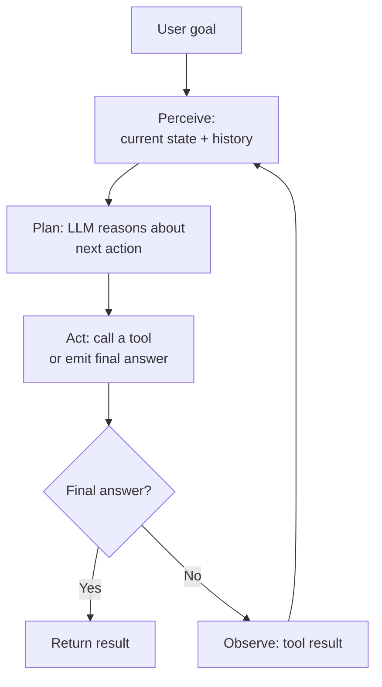

# Agent Fundamentals

## TL;DR
A chain is a fixed sequence of LLM/tool calls you wrote in advance; an agent decides its own next
step at runtime based on what it just observed, in a loop, until it judges the task done. The
differentiators are autonomy (the control flow isn't hardcoded), tool use (it acts on the world, not
just the prompt), and multi-step reasoning (it plans, and revises the plan based on new
information). Most "agent" systems in production are actually a spectrum between rigid chain and
fully autonomous loop — knowing where on that spectrum you actually need to sit is the real design
skill.

## Intuition
A chain is a flowchart with no branches based on runtime content — step 2 always follows step 1
regardless of what step 1 returned, beyond maybe an if/else you wrote yourself. An agent is a
flowchart where the *model* decides which edge to take next, based on what it just observed, and can
keep looping until it decides to stop. The classic mental model is perceive → plan → act → observe →
repeat: the agent perceives the current state (user goal + tool outputs so far), plans the next
action, acts (usually a tool call), observes the result, and folds that observation back into the
next planning step.

## The maths
There's no single formula for "agent," but the control loop is precisely specifiable as a Markov
decision process over an unbounded number of steps: at each timestep $t$, the agent has state
$s_t$ (goal, history of actions and observations so far), selects action $a_t \sim \pi_\theta(a_t \mid s_t)$
where $\pi_\theta$ is the LLM's policy (its next-token distribution, constrained to produce a valid
action — a tool call or a final answer), receives observation $o_t$ from the environment/tool, and
transitions to $s_{t+1} = s_t \oplus (a_t, o_t)$ (the history extended by this step). The loop
terminates when the policy emits a terminal action (a final answer, or an explicit "done" signal)
or a hard step/time budget is hit. This is exactly the ReAct formulation — the "reasoning" is the
model's chain-of-thought inside $\pi_\theta$ before it commits to $a_t$, interleaved with acting
rather than separated into a plan-then-execute phase.

## Diagram


## Code
```python
def run_agent(goal: str, tools: dict, llm, max_steps: int = 8) -> str:
    history = [{"role": "user", "content": goal}]

    for step in range(max_steps):
        # PLAN: model decides next action given full history so far
        response = llm.generate(history, available_tools=list(tools.keys()))

        if response.is_final_answer:
            return response.content  # loop terminates on model's own judgment

        # ACT: execute the tool call the model chose
        tool_name, tool_args = response.tool_call
        try:
            observation = tools[tool_name](**tool_args)
        except Exception as e:
            observation = f"Tool error: {e}"  # fed back, not swallowed — model can retry/adapt

        # OBSERVE: fold the result back into history for the next planning step
        history.append({"role": "assistant", "content": response.raw, "tool_call": response.tool_call})
        history.append({"role": "tool", "name": tool_name, "content": str(observation)})

    return "Max steps reached without a final answer."  # hard budget — never loop unbounded
```

## In practice
- **Use it when:** the task genuinely requires a variable number of steps that depend on
  intermediate results — e.g. "find the relevant clause, check it against two other contracts, and
  summarise the discrepancy" can't be pre-scripted because you don't know in advance how many lookups
  it takes or what they'll turn up.
- **Defaults that work:** always cap the loop with a max-steps or max-time budget (unbounded loops
  are the single most common production incident in agent systems); always feed tool errors back into
  the loop as observations rather than crashing, so the model can adapt; log every (state, action,
  observation) triple for debugging — an agent's non-determinism makes this non-negotiable.
- **Breaks when:** the task is actually fixed-sequence (retrieve, then always summarise, then always
  format) — building that as an "agent" adds latency, cost, and non-determinism for zero benefit over
  a plain chain. Agents also break down on tasks needing long-horizon planning without any
  intermediate feedback signal — the model can't course-correct if there's nothing to observe between
  steps.
- **Cost / latency:** every loop iteration is at least one LLM call plus a tool call; a task that
  chains, say, 40 tokens of context per new size 6-step agent run costs roughly 6x an equivalent
  single LLM call, and the tail latency is unbounded unless you cap steps — this is the first number
  to put in front of a product owner before shipping an agentic feature.

## Interview angle

**Q. What actually makes something an agent rather than a chain? Give me the sharpest distinction
you can.**
Control flow ownership. In a chain, you (the engineer) decide, at write time, what happens after
each step. In an agent, the model decides, at run time, what happens next, based on what it just
observed — the branching logic lives in the model's output, not in your code. Autonomy, tool use,
and multi-step reasoning are properties that typically come along with that shift, but the causal
core is: who decides the next step, and when.

**Follow-up.** Can a system use tools and still not be an agent? → Yes — a RAG pipeline that always
calls retrieval, then always calls generation, is tool use inside a fixed chain. It only becomes
agentic once the model itself decides *whether* to retrieve, *how many times*, or *which* tool to
call next, conditioned on what it's already seen.

**Q. Single-agent vs multi-agent — when do you actually need multiple agents instead of one agent
with more tools?**
Multi-agent earns its complexity when sub-tasks need genuinely different context, tool access, or
persona/prompting that would conflict if merged into one agent's context window — e.g. a "research"
agent that needs a huge retrieved-context budget and a "drafting" agent that needs a small, clean
context to write cleanly, or when different sub-tasks need different, possibly incompatible tool
permission scopes. If the reason for splitting is "the prompt got too long," that's usually better
solved with better context management in a single agent, not a multi-agent architecture — multi-
agent adds coordination overhead (who calls whom, how do failures propagate, shared vs isolated
memory) that's easy to underestimate.

**Follow-up.** What's the failure mode of over-splitting into multiple agents? → Coordination
overhead exceeds the benefit — agents talking past each other, redundant work, and failures that are
much harder to trace because the bug could be in any agent's reasoning or in the handoff between
them.

**Q. How much autonomy should you grant an agent in a professional-services / compliance-sensitive
product?**
Autonomy should be scoped to the blast radius of a mistake, not to what's technically possible. Read-
only tools (search, lookup, summarise) can run fully autonomously in a loop. Any tool with a side
effect that's hard to reverse (sending an email, modifying a document, executing a payment) should
require a human-in-the-loop checkpoint before execution, regardless of how confident the agent's plan
looks — see [[human-in-the-loop-patterns]]. This is a design decision made explicit up front, not
something to discover after an incident.

**Q. Why cap the number of agent loop iterations, and what's a reasonable way to choose the cap?**
Because an agent can get stuck in unproductive loops (retrying a failing tool call with slight
variations, or oscillating between two plans) with no natural termination if the model never emits a
terminal action. Choose the cap empirically from your task distribution — measure how many steps
successful runs actually take on your golden set, and set the cap a bit above the tail, not
arbitrarily high "to be safe," since a high cap just delays the failure and cost rather than
preventing it.

## Traps
- Calling any system with a tool call "agentic" — a fixed pipeline with one conditional retrieval
  step is not an agent; the defining property is runtime control-flow decisions, not tool presence.
- Building a multi-agent system before a single agent with more tools/context has been tried and
  shown to genuinely hit a ceiling — multi-agent is the more complex, harder-to-debug option and
  should be earned, not defaulted to.
- Granting an agent broad autonomy over side-effecting tools "because it tested well" — a demo's
  success rate doesn't bound production tail risk, and side effects (unlike read-only mistakes) are
  often unrecoverable.
- Not capping loop iterations, or capping them but not logging enough to diagnose why a run hit the
  cap — an uncapped or unobservable agent loop is an incident waiting to happen.

## Flashcards
What is the core distinction between a chain and an agent?::Who decides the next step and when — a chain has control flow fixed at write time by the engineer; an agent decides its next action at run time based on what it just observed.
What are the three loop stages in the perceive-plan-act-observe cycle?::Perceive the current state, plan the next action, act (usually a tool call), then observe the result and fold it back into the next perceive step.
Why must an agent loop always have a hard step/time cap?::Because nothing guarantees the model will emit a terminal action — without a cap, unproductive loops become unbounded cost and latency incidents.
When does multi-agent architecture genuinely earn its coordination overhead?::When sub-tasks need meaningfully different context, tool permissions, or prompting that would conflict if merged into a single agent's context — not merely because one agent's prompt got long.
How should autonomy be scoped for an agent's tool access?::By the reversibility and blast radius of a mistake — read-only tools can run autonomously; side-effecting, hard-to-reverse actions should require human-in-the-loop approval.
What is the ReAct framing of an agent loop?::Interleaving reasoning (chain-of-thought) with acting at every step, rather than separating planning and execution into distinct phases.

## Related
[[react-and-reasoning-loops]]
[[tool-calling-and-function-schemas]]
[[multi-agent-systems]]
[[human-in-the-loop-patterns]]
[[agent-guardrails-and-safety]]
