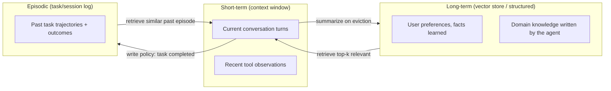

# Agent Memory

## TL;DR

"Memory" for an LLM agent is not one thing — it's short-term (whatever fits in the current context
window), long-term (an external store the agent explicitly writes to and retrieves from, usually a
vector store or structured record), and episodic (a log of past interactions/tasks the agent can
draw on for "what happened last time"). Each has a different failure mode, and the most common
production bug is treating context-window growth as free memory — it isn't, and unbounded growth
degrades both cost and quality.

## Intuition

Short-term memory is your working memory during one conversation — everything you can hold in mind
right now without writing it down. Long-term memory is your notebook — things you deliberately
wrote down because you decided they'd matter later, that you look up when relevant rather than
carrying around all the time. Episodic memory is your diary — a record of specific past events
("last Tuesday's incident, what I tried, what worked") that you consult for precedent, not for
general facts. An agent that only has short-term memory forgets everything the moment the
conversation ends or the context fills up; one with only long-term facts has no sense of "what just
happened in this session."

## The maths

No formal derivation, but the context-window constraint is worth stating precisely because it's
the root cause of most memory bugs. If a model has context window $C$ tokens, and a conversation/
trajectory accumulates tokens at rate $r$ per turn (user input + agent reasoning + tool
observations), then after $t$ turns the accumulated context is:

$$
\text{tokens used} \approx \sum_{i=1}^{t} r_i
$$

Once this approaches $C$, one of three things happens depending on the system: (a) the oldest turns
are silently truncated (naive sliding window — can drop critical early context, like the original
task instructions), (b) the call fails outright, or (c) the system actively summarizes/compresses
older turns into a shorter representation before they're evicted (better, but lossy and adds a
summarization call's cost/latency). None of these are "free" — this is the precise sense in which
context-window growth is a real, bounded resource, not memory in the durable sense.

**Retrieval-based long-term memory** turns "what's relevant right now" into a similarity search
problem: store memory items as embeddings $e_i = f(m_i)$, and at retrieval time fetch the
top-$k$ items by similarity to the current query embedding $e_q$ — this is literally RAG applied to
an agent's own history (see [[rag-overview]]) rather than to an external document corpus.

## Diagram



## Code

```python
from dataclasses import dataclass, field
import time

@dataclass
class MemoryItem:
    content: str
    embedding: list[float]
    kind: str          # "fact" | "episode"
    timestamp: float = field(default_factory=time.time)

class AgentMemory:
    """Illustrates the write/read policy split across memory tiers.
    In production, `store` is a real vector DB (see [[vector-databases]])."""

    def __init__(self, embed_fn, max_context_tokens: int, token_count_fn):
        self.embed_fn = embed_fn
        self.max_context_tokens = max_context_tokens
        self.token_count_fn = token_count_fn
        self.short_term: list[str] = []       # raw turn text, most recent last
        self.long_term_store: list[MemoryItem] = []
        self.episodic_store: list[MemoryItem] = []

    def add_turn(self, text: str, summarizer_fn):
        self.short_term.append(text)
        # Write policy: evict oldest turns once near the context budget,
        # but summarize before discarding rather than truncating silently.
        while self.token_count_fn("\n".join(self.short_term)) > self.max_context_tokens:
            oldest = self.short_term.pop(0)
            summary = summarizer_fn(oldest)
            self.long_term_store.append(
                MemoryItem(content=summary, embedding=self.embed_fn(summary), kind="fact")
            )

    def commit_episode(self, task_description: str, outcome: str):
        # Write policy: only commit to episodic memory on task completion (success or failure),
        # not every turn -- episodic memory is precedent, not a transcript.
        record = f"Task: {task_description}\nOutcome: {outcome}"
        self.episodic_store.append(
            MemoryItem(content=record, embedding=self.embed_fn(record), kind="episode")
        )

    def retrieve(self, query: str, k: int = 3, kind: str = "fact") -> list[str]:
        store = self.long_term_store if kind == "fact" else self.episodic_store
        query_emb = self.embed_fn(query)
        scored = sorted(store, key=lambda m: -cosine_sim(m.embedding, query_emb))
        return [m.content for m in scored[:k]]

def cosine_sim(a, b):
    import math
    dot = sum(x * y for x, y in zip(a, b))
    na, nb = math.sqrt(sum(x * x for x in a)), math.sqrt(sum(y * y for y in b))
    return dot / (na * nb + 1e-9)
```

## In practice

- **Use it when:** an agent needs to persist information beyond a single session (user
  preferences, prior decisions, learned facts) or draw on precedent from similar past tasks
  (episodic recall for troubleshooting or repeated workflows).
- **Defaults that work:** keep short-term memory bounded and explicit about what's in it (don't let
  it silently grow); write to long-term memory selectively and deliberately (a policy — "write when
  X"), not automatically after every turn, or you accumulate noise faster than signal; retrieve
  with a relevance threshold, not a fixed top-$k$ regardless of similarity score, so irrelevant
  memories don't get force-fed into context.
- **Breaks when:** unbounded context growth is mistaken for "the agent remembering more" — in
  reality, cost rises linearly with context length, latency rises (more tokens to process every
  turn, see [[llm-serving-and-throughput]]), and quality can *degrade* because relevant information
  gets diluted among irrelevant accumulated history (the "lost in the middle" effect on long
  contexts); write policies that log everything to long-term memory with no curation, producing a
  long-term store that's mostly noise and hurts retrieval precision.
- **Cost / latency:** short-term memory cost is direct (linear in tokens per call); long-term
  memory adds retrieval latency (an embedding call + vector search) but keeps the *active* context
  small, which is usually the better cost/latency tradeoff for anything that doesn't need to be in
  context every single turn.

**Three memory tiers, compared:**

| Tier | Where it lives | What it's for | Failure mode if mismanaged |
|---|---|---|---|
| Short-term | The live context window | The current task/conversation's active state | Unbounded growth: rising cost, latency, and "lost in the middle" quality loss |
| Long-term | External store (vector DB, structured DB) | Durable facts/preferences that outlive a session | Write-everything noise pollutes retrieval; stale facts never get updated or invalidated |
| Episodic | External store, keyed by task/session | Precedent — "what happened last time this came up" | Treating it as a full transcript log instead of curated outcomes; retrieval returns superficially similar but irrelevant past episodes |

**The practical failure mode of unbounded context growth, in detail:** an agent that never evicts
or summarizes accumulates every tool observation, every intermediate thought, every turn — this
feels safe ("more context can only help") but actually causes three compounding problems: (1) cost
grows linearly or worse per call since you resend the whole history each turn (or pay to re-process
it, depending on caching); (2) latency grows since prefill cost scales with context length; (3)
quality can *drop* because models attend less reliably to information buried in the middle of very
long contexts, so the one fact that matters can get effectively lost among a hundred that don't.
The fix is an explicit memory management policy — summarize-and-evict for short-term, selective
write for long-term — not "give it a bigger context window," which treats the symptom.

## Interview angle

**Q. What's the difference between long-term memory and episodic memory, concretely, for an
agent?**
Long-term memory holds durable facts/preferences retrieved by semantic relevance regardless of
when they were learned ("the user prefers metric units"). Episodic memory holds records of past
tasks/sessions and their outcomes, retrieved by similarity to the *current situation* to draw on
precedent ("last time we hit this exact error, restarting the connector fixed it"). They're both
retrieval-based long-term stores mechanically, but the write policy and retrieval framing differ:
facts vs. situated experiences.

**Follow-up.** Would you ever store them in the same vector index? → You can, tagged by kind, but
retrieval quality is usually better with separate indices or at least a filterable `kind` field,
since a fact query and a "similar past incident" query have different relevance criteria.

**Q. Your agent's context window keeps filling up on long-running tasks. What do you do?**
Don't just extend the context window — implement an explicit eviction policy: summarize older
turns before dropping them, move stable facts to long-term memory, and keep short-term memory to
what's actually needed for the next decision. Measure whether quality is actually degrading from
volume (lost-in-the-middle) versus genuinely needing more context, and size the fix to the actual
diagnosis.

**Q. What's a good write policy for long-term memory, and why does it matter?**
Write selectively and deliberately — e.g., on explicit user statements of preference, on task
completion with a durable learned fact, or on human correction of an agent error — rather than
logging every turn. It matters because an unfiltered long-term store degrades retrieval precision:
more stored noise means more chances for a semantically-similar-but-irrelevant memory to get
retrieved and confuse the current task.

**Q. How would you detect that unbounded context growth is hurting an agent's performance in
production?**
Track accuracy/task success rate as a function of conversation length or number of turns/tool
calls — a downward trend as context grows is the signature of context dilution or lost-in-the-
middle effects, distinct from the token-cost and latency metrics which will show a clean upward
trend regardless.

## Traps

- Treating "give the agent a bigger context window" as a solution to memory problems — it doesn't
  address cost, latency, or the lost-in-the-middle quality risk; it just raises the ceiling before
  hitting the same issue later.
- Logging every turn to long-term memory unfiltered — this looks thorough but actively degrades
  retrieval by diluting signal with noise.
- Conflating "memory" with "context window" in general — interviewers will probe whether you know
  these are architecturally different things with different failure modes.
- No retrieval relevance threshold — always returning top-$k$ regardless of similarity score
  injects irrelevant memories into context on queries that have no good match.

## Flashcards

Name the three memory tiers commonly used in agent systems.::Short-term (context window), long-term (vector store / structured facts), episodic (past task/session outcomes).
What is the practical failure mode of unbounded context growth?::Rising cost and latency (more tokens processed every call) plus potential quality degradation from lost-in-the-middle effects as relevant info gets diluted.
What's the mechanical basis of long-term/episodic memory retrieval?::Embed memory items and the current query, retrieve top-k by similarity — the same mechanism as RAG, applied to an agent's own history.
Why shouldn't an agent write every turn to long-term memory?::Unfiltered writes accumulate noise faster than signal, degrading retrieval precision for genuinely relevant facts later.
What's the difference between long-term memory and episodic memory in purpose?::Long-term memory holds durable facts/preferences; episodic memory holds records of specific past tasks/outcomes used as precedent for the current situation.
Why doesn't "just extend the context window" fix agent memory problems?::It doesn't address the underlying cost/latency scaling or the risk that relevant information gets lost among accumulated, less-relevant context.

## Related

[[react-and-reasoning-loops]], [[agent-fundamentals]], [[rag-overview]], [[vector-databases]], [[context-window-and-positional-encoding]], [[multi-agent-systems]], [[agent-cost-and-latency-optimization]]
