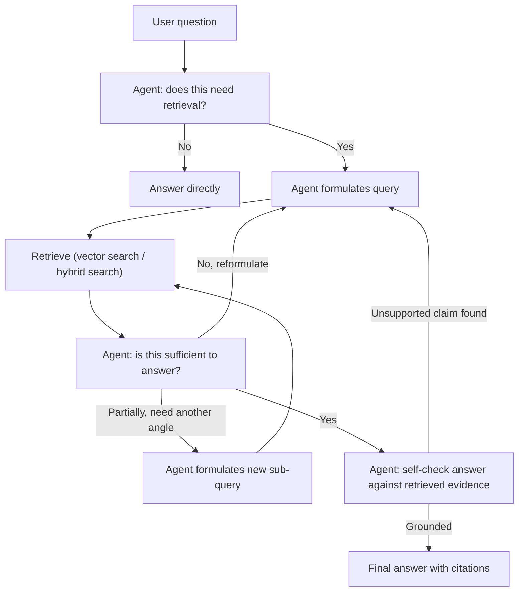

# Agentic RAG

## TL;DR

Classic RAG is a fixed pipeline: retrieve once, stuff context, generate. Agentic RAG makes
retrieval a *tool the agent decides to call*, potentially multiple times, with the query reformulated
between calls and the results critiqued before answering — so retrieval becomes part of a reasoning
loop instead of a preprocessing step. This buys the ability to handle multi-hop questions, recover
from a bad first retrieval, and know when to stop searching — at the cost of more calls, more
latency, and a new failure mode: the agent deciding (wrongly) that it has enough information when
it doesn't.

## Intuition

Fixed-pipeline RAG is like a librarian who hands you one stack of books based on your first question
and then leaves — if that stack doesn't have your answer, or your question turns out to need three
different sections, you're stuck. Agentic RAG is a research assistant who fetches a first batch,
skims it, notices it doesn't fully answer the question (or that the question actually needs
information from a second angle), goes back for more with a refined query, and keeps going — or
tells you honestly that the information isn't available — until the question is actually answered
or the effort is deemed not worth continuing.

## The maths

No new derivation beyond standard retrieval (see [[rag-overview]]) — the shift is architectural,
not mathematical — but it's worth being precise about what changes. In fixed-pipeline RAG, the
generation is conditioned on one fixed retrieval:

$$
p(y \mid x) \approx p_\theta(y \mid x,\, R(x))
$$

where $R(x)$ is a single retrieval call on the original query $x$. In agentic RAG, retrieval is
called adaptively, conditioned on the evolving trajectory, and the model itself decides both the
query and whether to retrieve again:

$$
p(y \mid x) \approx p_\theta\big(y \mid x,\, R(q_1), R(q_2), \dots, R(q_k)\big), \quad
q_{i+1} = g_\theta(x, R(q_1), \dots, R(q_i))
$$

where $q_1, \dots, q_k$ are model-generated (and model-decided-to-issue) queries, and $k$ itself is
chosen by the model rather than fixed in advance. This is exactly retrieval treated as an action
inside a ReAct-style loop (see [[react-and-reasoning-loops]]), not a separate pipeline stage.

## Diagram



## Code

```python
def agentic_rag(question: str, retriever_fn, llm_fn, max_retrievals: int = 4) -> dict:
    """Retrieval is a tool the agent calls as needed, not a fixed first step.
    The agent decides the query, whether to retrieve again, and whether the
    final answer is actually grounded in what was retrieved."""
    trajectory = []
    retrieval_count = 0

    while retrieval_count < max_retrievals:
        decision = llm_fn.decide_next_step(question, trajectory)
        # decision: {"action": "retrieve", "query": "..."} or
        #           {"action": "answer", "answer": "...", "grounded_in": [...]}  or
        #           {"action": "give_up", "reason": "..."}

        if decision["action"] == "retrieve":
            docs = retriever_fn(decision["query"])
            trajectory.append({"query": decision["query"], "docs": docs})
            retrieval_count += 1
            continue

        if decision["action"] == "answer":
            # Self-correction pass: check the answer's claims are actually
            # supported by retrieved evidence before returning it.
            check = llm_fn.verify_grounding(decision["answer"], trajectory)
            if check["grounded"]:
                return {"answer": decision["answer"], "sources": trajectory, "status": "answered"}
            else:
                # Not grounded -> treat as a signal to retrieve more, not to answer anyway.
                trajectory.append({"self_check": check["reason"]})
                continue

        if decision["action"] == "give_up":
            return {"answer": None, "reason": decision["reason"], "status": "insufficient_evidence"}

    return {"answer": None, "reason": "max retrievals exhausted", "status": "insufficient_evidence"}
```

## In practice

- **Use it when:** questions are multi-hop (need information from more than one retrieval to
  answer), the first retrieval attempt is often insufficient or off-target (ambiguous queries,
  broad knowledge bases), or you need the system to reliably say "I don't know" rather than
  answering confidently from a bad retrieval.
- **Defaults that work:** cap the number of retrieval rounds (as with any agent loop, unbounded
  iteration is a cost and reliability risk, see [[react-and-reasoning-loops]]); include an explicit
  grounding self-check before returning an answer — verify each claim traces to a retrieved
  passage, not just that *some* retrieval happened; log every query reformulation for debugging
  and eval (see [[rag-evaluation]]).
- **Breaks when:** the added latency/cost of multiple retrieval rounds isn't justified for simple,
  single-hop questions — running the full agentic loop on "what's our return policy?" is waste;
  the agent's stopping decision is miscalibrated (stops too early on genuinely multi-hop questions,
  or never stops on questions that have no good answer in the corpus, looping through query
  reformulations indefinitely).
- **Cost / latency:** strictly more expensive than fixed-pipeline RAG per query — multiple retrieval
  round trips plus multiple LLM calls for query planning and self-checking. This cost has to be
  weighed against the accuracy gain on the fraction of queries that are actually multi-hop or
  ambiguous; a hybrid system that routes simple queries to fixed-pipeline RAG and complex ones to
  agentic RAG is often the practical answer (see [[small-language-models-and-cost]] on routing).

**Retrieval as a tool vs. a fixed pipeline step, precisely:**

| | Fixed-pipeline RAG | Agentic RAG |
|---|---|---|
| When retrieval happens | Once, always, before generation | Zero, one, or many times, decided by the agent |
| Query used | The original user query (maybe lightly rewritten) | Model-generated, can be reformulated per round |
| Handles multi-hop questions | Poorly — one retrieval rarely covers multiple facts that need combining | Well — each hop is its own retrieval, informed by what prior hops found |
| Can recover from a bad first retrieval | No | Yes — a self-check can trigger reformulation and retry |
| Cost per query | Fixed, low | Variable, higher, scales with question difficulty |

**Iterative retrieval, query planning, self-correction — the three moving parts:**

- **Iterative retrieval:** don't assume one retrieval call is enough; let the agent request another
  round when the current evidence is insufficient, with a hard cap to prevent unbounded search.
- **Query planning:** for a multi-hop question ("what's the revenue impact of the policy change
  announced in the Q3 filing that affected the product line launched in Q1?"), the agent
  decomposes into sub-queries and issues them in a useful order, using earlier results to inform
  later query formulation — this is [[planning-and-task-decomposition]] applied specifically to
  retrieval.
- **Self-correction:** after drafting an answer, check its claims against the retrieved evidence
  before returning it — the RAG-specific instance of the general failure "the model produced a
  fluent answer that isn't actually supported by anything it retrieved" (see
  [[hallucination-and-grounding]]). This check should be independent of the generation step, not
  just "the model said it's grounded" — ideally a structured verification against cited passages.

## Interview angle

**Q. What's the core architectural difference between agentic RAG and standard RAG?**
Standard RAG retrieves once, as a fixed preprocessing step, and generates conditioned on that fixed
context. Agentic RAG treats retrieval as a tool the agent can call zero, one, or many times, with
the query and the decision to retrieve again made by the model based on what it's already seen —
it's retrieval folded into a reasoning loop rather than a pipeline stage before the loop.

**Follow-up.** Does that mean agentic RAG is strictly better? → No — for simple, single-hop
questions it adds cost and latency with no accuracy benefit; it earns its cost specifically on
multi-hop or ambiguous queries where one retrieval round is provably insufficient.

**Q. How do you prevent an agentic RAG system from either stopping too early or never stopping?**
Cap retrieval rounds explicitly (never stopping); require an explicit grounding self-check before
accepting an answer as final, so "I found something" isn't conflated with "I found enough" (stopping
too early); and eval both failure modes separately on a labeled multi-hop question set, since
aggregate accuracy alone won't distinguish them.

**Q. Why is a grounding self-check a separate, necessary step and not implied by "the retrieval
succeeded"?**
Because retrieval succeeding (returning documents) doesn't guarantee the generated answer actually
used them correctly — the model can still produce a claim not supported by any retrieved passage,
especially when context is long or the retrieved documents are only partially relevant. An explicit
check (verify each claim against a cited passage) catches this class of hallucination that a bare
"retrieval happened" signal misses.

**Q. When would you *not* use agentic RAG even though it's more capable?**
When query latency/cost matters more than handling the tail of hard multi-hop questions, or when
your corpus and query distribution are simple enough that fixed-pipeline RAG already achieves your
accuracy bar — added agentic complexity should be justified by a measured accuracy gap on your
actual eval set, not adopted by default.

## Traps

- Describing agentic RAG as "RAG but with an agent" without naming the actual mechanism: retrieval
  becomes a callable, repeatable, query-reformulatable action instead of a single fixed step.
- Treating "the agent retrieved documents" as sufficient evidence the final answer is grounded —
  self-correction/verification against retrieved evidence is a distinct, necessary step.
- Running the full iterative agentic loop on every query regardless of difficulty — wasteful for
  the (usually large) fraction of simple, single-hop queries.
- No cap on retrieval rounds — the retrieval-loop analogue of an unbounded ReAct loop, with the
  same fix (hard step cap plus a "give up" path).

## Flashcards

What is the core difference between fixed-pipeline RAG and agentic RAG?::Fixed-pipeline RAG retrieves once as a preprocessing step; agentic RAG treats retrieval as a tool the agent can call adaptively, multiple times, with model-formulated queries.
Why does agentic RAG handle multi-hop questions better than standard RAG?::Each hop can be its own retrieval round informed by what prior rounds found, rather than trying to answer a multi-fact question from one fixed retrieval.
What's the role of a grounding self-check in agentic RAG?::Verifies the drafted answer's claims are actually supported by retrieved evidence before returning it, catching hallucination that "retrieval succeeded" alone wouldn't.
Why must retrieval rounds be capped in agentic RAG?::Without a cap, a miscalibrated stopping decision can cause unbounded retrieval loops, the same failure mode as an unbounded ReAct action loop.
When is agentic RAG not worth its added cost?::For simple, single-hop queries where one retrieval round already suffices — the extra rounds and self-checks add latency/cost with no accuracy benefit.

## Related

[[rag-overview]], [[advanced-rag-patterns]], [[react-and-reasoning-loops]], [[planning-and-task-decomposition]], [[hallucination-and-grounding]], [[rag-evaluation]], [[query-rewriting-and-expansion]]
