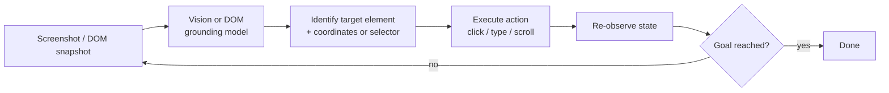

# Computer Use and Browser Agents

## TL;DR
Computer-use agents operate a GUI the way a human would — looking at a screenshot (or
reading the DOM), deciding a click/type/scroll action, observing the result, and
repeating — instead of calling a clean API. It's the most general integration
mechanism there is (anything a human can click, the agent can click), and also the
least reliable, because it inherits every fragility of the UI it's driving.

## Intuition
An API integration is a firm handshake through a well-defined door. A computer-use
agent is climbing through whatever window happens to be open — it works on sites with
no API, but it also breaks the moment someone repaints the wall around the window
(a UI redesign, an A/B-tested layout, a modal that wasn't there yesterday).

## The maths
Not a numerical derivation, but the reliability model is the interview-relevant
"maths": if each of $n$ sequential UI actions (locate element, click, verify state)
succeeds independently with probability $p$, end-to-end task success is:

$$
P(\text{task success}) = p^n
$$

At $p = 0.95$ per action (already a fairly reliable action-grounding rate) and
$n = 15$ actions for a moderately complex multi-page workflow, $P \approx 0.95^{15}
\approx 46\%$. This is the core reason computer-use agents need retry/verification
loops and are currently deployed on shorter, more forgiving tasks rather than long
autonomous workflows — the same compounding-error argument as
[[agent-guardrails-and-safety]], but for silent failures instead of unsafe ones.

## Diagram


## Code
```python
# Simplified computer-use loop, DOM-based variant (more reliable than
# pure-pixel vision for sites that expose accessibility trees / DOM structure).

def browser_agent_step(page, goal, model_call, history):
    dom_snapshot = page.accessibility_tree()  # structured, not raw pixels
    prompt = build_prompt(goal, dom_snapshot, history)
    action = model_call(prompt)  # e.g. {"type": "click", "selector": "#submit"}

    if action["type"] == "click":
        page.click(action["selector"])
    elif action["type"] == "type":
        page.fill(action["selector"], action["text"])
    elif action["type"] == "done":
        return "complete"

    history.append(action)
    return "continue"

# Vision-based variant swaps the DOM snapshot for a screenshot and the model
# returns pixel coordinates instead of a selector — more general (works on
# canvas-rendered UIs, images, legacy apps with no accessible DOM) but less
# precise: a 1080p screenshot downsampled for the model can make small buttons
# genuinely ambiguous to click accurately.
```

## In practice
- **Use it when:** no API exists (legacy internal tools, long-tail SaaS products,
  sites that actively block scraping but allow human-like browsing), or the task
  is inherently visual (verifying a rendered page looks right, testing a UI).
  DOM-based grounding is preferable whenever the target exposes a usable
  accessibility tree; fall back to vision only when it doesn't.
- **Defaults that work:** short, well-scoped tasks (form fill, single checkout flow,
  a fixed few-page workflow) rather than long autonomous sessions; verification
  after every action (re-read the state, don't assume the click landed); a human
  approval gate before any action with financial or irreversible consequences
  (submitting a payment, deleting an account) — see
  [[human-in-the-loop-patterns]].
- **Breaks when:** the target UI changes layout, adds a cookie banner or modal, uses
  infinite scroll or heavy client-side rendering that changes the DOM between
  observation and action, or has anti-automation defenses (CAPTCHAs, bot detection)
  — none of these are agent bugs, they're inherent to driving a UI not built for
  automation.
- **Cost / latency:** every step requires a full model call over a screenshot or DOM
  snapshot (large input), plus real wall-clock time for page loads/renders — this is
  among the slowest and most expensive agent patterns per completed task, which is
  why it's reserved for tasks with no API alternative.

## Interview angle
**Q. When is a computer-use/browser agent actually the right tool, versus when is it
hype?**
Right tool: no API exists and the task is otherwise well-defined and short (submit
this form, extract this data from this dashboard, verify this page renders
correctly). Hype: using it as a general substitute for an API integration that
already exists — an agent clicking through a UI to do what a REST call would do in
one step is slower, more expensive, and far less reliable for no benefit. It's also
oversold for long, autonomous multi-hour workflows today — reliability compounds
downward too fast (see the $p^n$ argument) for that to be production-safe without
heavy supervision.

**Follow-up.** What's a concrete production use case that's genuinely justified? →
Automated QA/regression testing of a web app's own UI (there's no API for "does this
button render in the right place"), or interacting with a legacy internal tool that
has no API and isn't worth building one for a low-frequency task.

**Q. DOM-based versus vision-based grounding — what's the tradeoff?**
DOM-based is more precise (exact selectors, no pixel ambiguity) and cheaper (text,
not image tokens) but requires the target to expose a usable accessibility
tree/DOM — it breaks on canvas-rendered apps, some SPAs, and heavily obfuscated
markup. Vision-based is more general (works on literally anything renderable) but
less precise and more expensive per step (image tokens, and pixel-level element
localization is inherently fuzzier than a selector).

**Follow-up.** How would you build a hybrid that gets the best of both? → Prefer DOM
grounding when the accessibility tree is present and well-formed; fall back to
vision only for elements the DOM doesn't expose cleanly (canvas widgets, images with
no alt text) — most production systems use DOM as primary and vision as a
fallback/verification layer, not the other way round.

## Traps
- Treating computer-use as strictly worse than API integration and therefore
  irrelevant — it's a genuinely different capability (works where no API exists),
  not a lesser substitute for one that does.
- Assuming reliability problems are a prompting issue — a lot of failure comes from
  the environment itself (page not fully loaded, element covered by a modal, a
  redesign since the agent was last tested), which no amount of prompt tuning fixes;
  the fix is better verification and retry logic, not a better prompt.
- Deploying long autonomous browsing sessions without step budgets or checkpoints —
  the compounding-failure math applies just as hard here as anywhere else in agents.
- Skipping human approval for financial/irreversible UI actions because "it's just
  clicking a button" — a misclick that submits a real payment is a real-world
  consequence, not a benign bug.

## Flashcards
Why is per-action reliability the key number for computer-use agents, more so than for API-based agents?::Because task success compounds multiplicatively across many UI actions (p^n), and each action has extra failure modes (page not loaded, element covered, wrong coordinates) that a clean API call doesn't have.
DOM-based vs vision-based grounding — which is generally preferred when available, and why?::DOM-based, because it's more precise (exact selectors) and cheaper (text tokens vs image tokens); vision is the fallback for UIs with no usable accessibility tree.
Name two things that break browser agents that are not prompting problems.::UI layout changes / new modals since the agent was tested, and anti-automation defenses like CAPTCHAs — both are environment issues, not model reasoning issues.
When is computer-use agent the wrong tool even though it would technically work?::When an API already exists for the task — driving a UI to do what one API call could do is slower, costlier, and less reliable for no benefit.
Why do computer-use agents currently work better on short tasks than long autonomous workflows?::Because per-step error compounds multiplicatively, so long workflows accumulate a high chance of silent failure without frequent verification/checkpointing.

## Related
[[agent-fundamentals]]
[[tool-calling-and-function-schemas]]
[[human-in-the-loop-patterns]]
[[multimodal-models]]
[[agent-guardrails-and-safety]]
[[agent-evaluation]]
