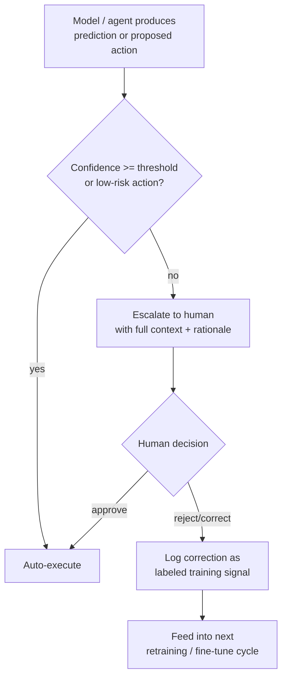

# Human-in-the-Loop Patterns

## TL;DR
Human-in-the-loop (HITL) is the deliberate design of *where* and *when* a system hands
control to a person — not a fallback bolted on when the model fails. Good HITL design
picks gate points by risk (approval before destructive actions), by uncertainty
(escalate low-confidence predictions), and makes the handoff itself graceful — the
human gets the context they need to decide quickly, not a cold "help me" with no
state.

## Intuition
A pilot doesn't fly the whole route on autopilot and only grab the controls when the
plane is already crashing — the handoff points are planned in advance (takeoff,
turbulence, landing), and the autopilot hands over with full instrument context, not
silence. HITL design is choosing those handoff points deliberately, before you're in
the emergency.

## The maths
The design question that has an actual quantitative shape is **confidence-based
escalation**: given a model's calibrated confidence $\hat{p}$ for a prediction, and a
cost of automated error $C_{\text{err}}$ versus a cost of human review $C_{\text{rev}}$,
route to a human whenever the expected cost of auto-acting exceeds the cost of review:

$$
(1 - \hat{p}) \cdot C_{\text{err}} > C_{\text{rev}} \iff \hat{p} < 1 - \frac{C_{\text{rev}}}{C_{\text{err}}}
$$

This gives a principled confidence threshold $\tau = 1 - C_{\text{rev}} / C_{\text{err}}$
instead of an arbitrary cutoff like "escalate anything below 80%." Note this only
works if $\hat{p}$ is actually calibrated (see [[probability-calibration]]) — an
overconfident model makes this threshold meaningless, since $\hat{p}$ no longer tracks
true error probability.

## Diagram


## Code
```python
def route_decision(prediction, confidence, action_risk, review_cost, error_cost):
    """Confidence-based escalation with a risk-aware threshold."""
    threshold = 1 - (review_cost / error_cost)
    if action_risk == "destructive":
        return "escalate"  # always gate destructive actions regardless of confidence
    if confidence < threshold:
        return "escalate"
    return "auto_execute"

# Active-learning framing: every human correction is a labeled example that
# is disproportionately informative, because it came from a case the model
# was uncertain about (near the decision boundary) rather than a random sample.
def log_correction_for_retraining(example, model_prediction, human_label, store):
    store.append({
        "features": example,
        "model_said": model_prediction,
        "human_said": human_label,
        "was_disagreement": model_prediction != human_label,
    })
    # Prioritize disagreement cases when building the next fine-tune/retrain set —
    # this is the practical link between HITL and active learning.
```

## In practice
- **Use it when:** any system where a wrong automated action is costly, irreversible,
  or erodes trust faster than it's earned back — approvals, financial actions,
  medical/legal-adjacent decisions, or anything where the model's confidence is known
  to be unreliable in a subset of the input distribution.
- **Defaults that work:** hard approval gates on destructive/irreversible actions
  regardless of confidence (see [[agent-guardrails-and-safety]]); confidence-based
  escalation for everything else, with the threshold derived from actual review vs.
  error costs, not guessed; always give the human reviewer the model's rationale and
  the relevant context, not just a bare decision to rubber-stamp; feed every human
  correction back as a labeled example, prioritized for future training the way
  active learning prioritizes uncertain examples.
- **Breaks when:** escalation volume exceeds human review capacity — if 40% of cases
  route to a human, you haven't automated anything, you've built a queueing system
  with an ML-flavored front end; this means the threshold and the underlying model
  quality need to move together, not just the threshold.
- **Cost / latency:** human review adds real wall-clock latency (minutes to hours,
  not milliseconds) — HITL gates are unsuitable for hard real-time paths and need an
  explicit SLA/timeout behavior (auto-reject, auto-approve-with-flag, or queue) for
  when no human responds in time.

## Interview angle
**Q. How do you decide the confidence threshold for escalating a prediction to a
human, rather than picking an arbitrary cutoff?**
Derive it from cost, not intuition: threshold $\tau = 1 - C_{\text{review}} /
C_{\text{error}}$, where $C_{\text{error}}$ is the expected cost of an automated
mistake and $C_{\text{review}}$ is the cost of a human review. This only works if the
model's confidence is calibrated — an uncalibrated model's raw softmax score isn't a
true probability, so calibrate first (temperature scaling, isotonic regression) or
the threshold is meaningless.

**Follow-up.** What if you don't have good cost estimates for either side? → Start
with a conservative (low) threshold that over-escalates, measure actual human
overturn rate at that threshold over a few weeks, and tune the threshold down as you
get real cost/error data instead of guessing a final number upfront.

**Q. How does human-in-the-loop connect to active learning?**
Every case a human corrects was, by construction, a case the model was uncertain
about or got wrong — which makes it a high-information training example, the same
selection principle active learning uses to choose which unlabeled points to query.
In production, HITL corrections effectively *are* an active learning loop: instead of
a research pipeline explicitly querying an oracle for uncertain points, uncertain
points surface naturally via escalation, and the human review is the oracle.

**Follow-up.** What's the risk of over-relying on this signal for retraining? →
Selection bias — if you only retrain on escalated (uncertain/wrong) cases, the
retraining set skews toward hard examples and away from the easy majority the model
already handles well, which can hurt calibration and even regress performance on the
common case if not balanced with a general sample.

**Q. Design a graceful handoff for an agent that gets stuck and needs a human.**
The agent should stop *before* taking further action once it detects it can't
proceed confidently (not after burning several more failed steps), summarize what
it has tried and why it's stuck, surface the specific decision point and the
options it's weighing, and preserve full state so the human's input resumes the
task rather than restarting it. A bare "I need help" with no trace is a bad handoff
— it makes the human redo the agent's own diagnostic work.

**Follow-up.** How do you decide when an agent should stop and escalate versus keep
retrying? → Bound retries with a step/attempt budget per sub-task (see
[[agent-cost-and-latency-optimization]]), and escalate immediately — not after
exhausting the budget — if the failure mode looks like it needs new information or
a decision only a human can make (ambiguous requirements, conflicting data, an
action requiring authorization the agent doesn't have).

## Traps
- Adding a human-in-the-loop step reactively, after a failure, rather than designing
  gate points upfront based on risk and confidence — reactive HITL is a patch, not a
  pattern.
- Escalating with no context ("model unsure, please review") — this pushes the
  diagnostic burden back onto the human and defeats the point of automation.
- Picking an arbitrary confidence threshold instead of deriving one from actual
  review and error costs — an unjustified threshold either over-escalates (kills
  throughput) or under-escalates (lets costly errors through).
- Treating every human correction as equally valuable training signal without
  accounting for selection bias — an escalation-only retraining set is not a
  representative sample of the input distribution.

## Flashcards
How do you derive a principled confidence threshold for escalating to a human?::τ = 1 − (review cost / error cost) — escalate whenever a prediction's confidence falls below this, so the threshold reflects actual costs rather than an arbitrary cutoff.
Why does this threshold require calibrated model confidence to be meaningful?::Because an uncalibrated softmax score doesn't track true error probability — the threshold math assumes p̂ is an actual probability, not just a relative ranking.
How does human-in-the-loop connect to active learning?::Escalated cases are, by construction, cases the model is uncertain about or wrong on — the same high-information examples active learning would deliberately query, making HITL correction logs a natural active-learning data source.
What's the biggest risk of retraining only on human-corrected/escalated examples?::Selection bias — the retraining set skews toward hard/uncertain cases and underrepresents the easy majority, which can hurt overall calibration if not balanced with a general sample.
What makes a handoff to a human "graceful" rather than a dead end?::Preserving full task state and surfacing the specific decision point and what's already been tried, so the human resumes the task instead of redoing the agent's diagnostic work from scratch.

## Related
[[agent-guardrails-and-safety]]
[[agent-evaluation]]
[[probability-calibration]]
[[model-monitoring]]
[[agent-cost-and-latency-optimization]]
[[threshold-selection]]
