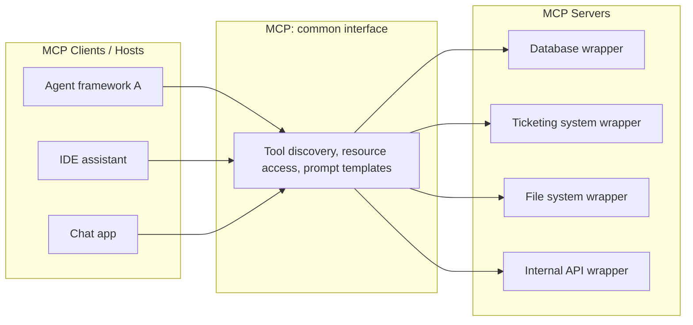

# Model Context Protocol

## TL;DR

MCP (Model Context Protocol) is a standardized client-server protocol that lets an LLM application
discover and use external tools, data resources, and prompts through one common interface, instead
of every agent framework needing a bespoke integration for every data source or API. It matters for
interoperability the same way a USB standard matters for peripherals: build one MCP server for your
system once, and any MCP-compatible agent/client can use it, rather than N frameworks each needing
their own N integrations.

## Intuition

Before a common standard, connecting an agent to your company's internal ticketing system, database,
and file store meant writing custom tool-calling glue code for each agent framework you used —
LangChain-shaped glue, then different glue if you switched frameworks. MCP standardizes the
*interface* between "things that want to use tools" (clients/hosts — an agent, an IDE assistant) and
"things that expose tools/data" (servers — a wrapper around your database, your ticketing API, your
file system), so you write the integration once as an MCP server and it's usable by any compliant
client. It's the same "$M \times N$ integrations become $M + N$" argument that motivates every
successful interoperability standard.

## The maths

Not a numerical concept, but the integration-count argument is precise and worth stating exactly
because it's the whole justification: without a shared protocol, connecting $M$ agent
frameworks/clients to $N$ external systems needs up to $M \times N$ bespoke integrations. With a
common protocol, each system builds one server ($N$ servers total) and each client builds one
protocol implementation ($M$ clients total), for $M + N$ total integration efforts. The gain grows
as either $M$ or $N$ grows — which is exactly the regime a large organization with many internal
tools and multiple agent products is in.

## Diagram



## Code

```python
# Illustrative sketch of an MCP-style server exposing a tool and a resource.
# Real MCP servers use the official SDK; this shows the conceptual shape,
# not a runnable implementation.

class MCPServer:
    def __init__(self, name: str):
        self.name = name
        self.tools = {}
        self.resources = {}

    def tool(self, name: str, description: str, input_schema: dict):
        """Decorator to register a callable as a discoverable tool, with a schema
        the client can introspect before ever calling it -- see
        [[tool-calling-and-function-schemas]] for the schema side of this."""
        def wrapper(fn):
            self.tools[name] = {"fn": fn, "description": description, "schema": input_schema}
            return fn
        return wrapper

    def resource(self, uri: str, description: str):
        """Register a readable resource (e.g. a document, a table) the client can
        list and fetch without it being a 'tool call' -- resources are for context,
        tools are for actions."""
        def wrapper(fn):
            self.resources[uri] = {"fn": fn, "description": description}
            return fn
        return wrapper

    def list_capabilities(self):
        # This is what a client calls first: discovery, before any tool use.
        return {
            "tools": [{"name": n, "description": t["description"], "schema": t["schema"]}
                      for n, t in self.tools.items()],
            "resources": [{"uri": u, "description": r["description"]}
                         for u, r in self.resources.items()],
        }


server = MCPServer("internal-ticketing")

@server.tool(
    name="search_tickets",
    description="Search support tickets by keyword and status",
    input_schema={"type": "object", "properties": {
        "query": {"type": "string"}, "status": {"type": "string", "enum": ["open", "closed"]}
    }, "required": ["query"]},
)
def search_tickets(query: str, status: str = "open"):
    ...  # real implementation queries the ticketing DB

@server.resource(uri="ticketing://schema", description="Ticket table schema")
def get_schema():
    ...
```

## In practice

- **Use it when:** you're building agent capabilities that need to talk to multiple internal or
  external systems, especially across more than one agent framework or product, and want to avoid
  re-writing integration glue for each; you're exposing a company's internal systems (databases,
  ticketing, internal APIs) to be usable by any future agent, not just the one you're building
  today.
- **Defaults that work:** one MCP server per logical system (a database, a ticketing platform), not
  one giant server exposing everything, so servers stay independently deployable and permissioned;
  scope each server's tools to least privilege for what an agent should be allowed to do against
  that system (see [[agent-guardrails-and-safety]]); treat resources (context/data to read) and
  tools (actions to take) as distinct capability types, since they carry different risk profiles.
- **Breaks when:** treated as a substitute for good tool-schema design — MCP standardizes
  *discovery and transport*, it doesn't make a badly-specified tool well-specified (see
  [[tool-calling-and-function-schemas]] for what makes a schema good); used to expose
  high-privilege actions (delete, send, pay) without an independent authorization layer, since the
  protocol itself doesn't grant safety, only interoperability.
- **Cost / latency:** an MCP server adds a network hop (client to server) versus an in-process tool
  call, plus a discovery round-trip the first time a client connects — negligible for most agent
  workloads but worth knowing if you're chasing tight latency budgets on every tool call (see
  [[llm-serving-and-throughput]]).

**Why it matters for interoperability, precisely:** the standard fixes three things across every
implementation — (1) how a client discovers what tools/resources/prompts a server offers, (2) the
schema shape a tool's inputs and outputs must follow, and (3) the transport/session mechanics for
calling a tool and getting a result. Fixing these means an agent built on one framework can consume
a server built by an entirely different team, in a different language, for a different original
client, without either side needing to know about the other in advance — the same value proposition
as REST/OpenAPI for web APIs, applied specifically to agent-tool interaction.

## Interview angle

**Q. What problem does MCP actually solve, and what doesn't it solve?**
It solves the interoperability problem — a standard interface for tool/resource discovery and
invocation so agent clients and tool servers can be built independently and still work together,
turning an $M \times N$ integration problem into $M + N$. It does not solve tool *safety* (a
badly-scoped or over-privileged tool is just as dangerous exposed via MCP as via any other
mechanism) or tool *design quality* (a vague tool description confuses a model regardless of the
transport protocol).

**Follow-up.** So why bother if it doesn't add safety? → Safety and interoperability are separate
concerns addressed by separate layers — MCP standardizes the plumbing so you can focus your safety
engineering on authorization, scoping, and validation, applied consistently across every server,
instead of re-solving both the plumbing and the safety problem for each new integration.

**Q. How would you decide the boundary between two MCP servers — one big server vs. several small
ones?**
Split along system and permission boundaries: each server should correspond to one logical system
with one coherent permission/authorization surface. A single server spanning unrelated systems with
different risk profiles (e.g., read-only analytics plus send-email) makes least-privilege scoping
harder and couples unrelated systems' deployment/versioning together.

**Q. Where does MCP sit relative to function/tool calling as a concept?**
Function/tool calling (see [[tool-calling-and-function-schemas]]) is the model-side capability —
the model emits a structured call matching a schema. MCP is the transport/discovery layer that
delivers those schemas to the client and routes the resulting call to the right external system in
a standardized way. You need both: a well-designed schema, delivered over a standardized protocol.

**Q. What's a concrete risk of adopting MCP without additional safeguards?**
Exposing a high-privilege action (e.g., a tool that can delete records or send external
communications) through an MCP server without an independent authorization/confirmation layer —
the protocol makes such a tool easy to discover and call from any compliant client, which is exactly
why access control and human-in-the-loop gating (see [[human-in-the-loop-patterns]]) need to live
outside the protocol as an explicit design decision, not be assumed away by "it's just a standard
interface."

## Traps

- Describing MCP as making tool calls "safe" — it standardizes discovery and transport, not
  authorization or safety; conflating the two is a common and telling mistake.
- Assuming MCP replaces the need for careful tool-schema design — a bad schema is still a bad
  schema regardless of the protocol carrying it.
- Building one monolithic MCP server for everything — loses the least-privilege and independent-
  deployability benefits that motivate splitting by system boundary in the first place.
- Treating MCP adoption as free — it adds a network hop and a discovery round trip that should be
  accounted for in latency-sensitive designs.

## Flashcards

What does MCP standardize?::A common client-server interface for discovering and invoking external tools, resources, and prompts, independent of the specific agent framework or backend system.
Why does a common protocol reduce integration effort at scale?::It turns an M×N problem (every client integrating with every system) into an M+N problem (each side implements the protocol once).
Does MCP make tool use safe by itself?::No — it standardizes discovery/transport; authorization, scoping, and validation of what a tool is allowed to do remain a separate, necessary design layer.
What's the difference between a "tool" and a "resource" in this kind of protocol?::Tools represent actions a client can invoke (with inputs/outputs); resources represent readable context/data the client can fetch without it being an action.
What's a sound way to decide MCP server boundaries?::Split along system and permission boundaries — one server per logical system with a coherent authorization surface, not one server spanning unrelated systems and risk profiles.

## Related

[[tool-calling-and-function-schemas]], [[agent-fundamentals]], [[agent-guardrails-and-safety]], [[agent-frameworks-landscape]], [[human-in-the-loop-patterns]], [[multi-agent-systems]]
