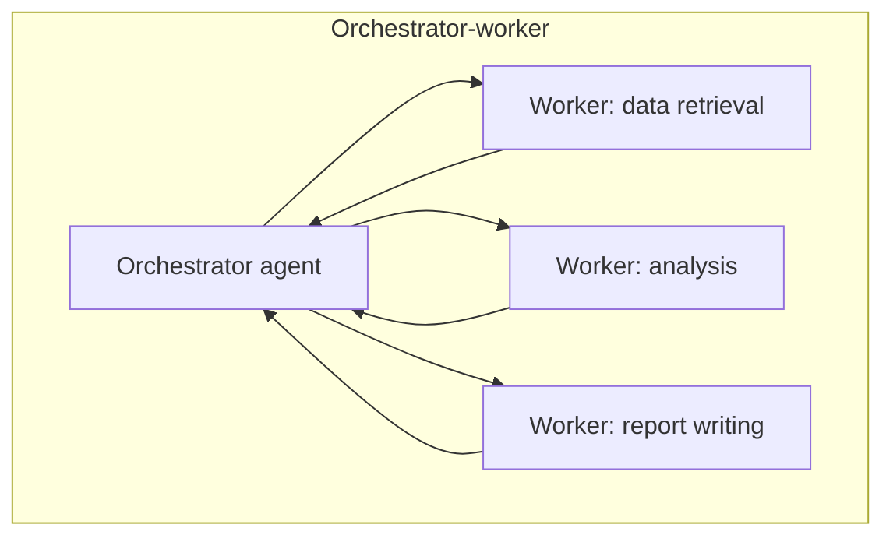
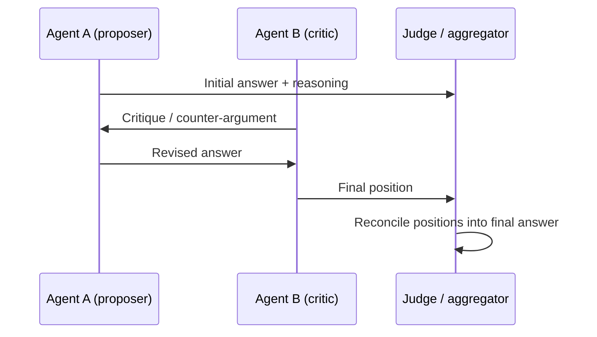

# Multi-Agent Systems

## TL;DR

A multi-agent system splits a task across multiple LLM-driven agents — each with a narrower role,
prompt, or toolset than one agent trying to do everything — coordinated through patterns like
orchestrator-worker, debate, or hierarchy. It beats a single strong agent when the task genuinely
decomposes into specialized sub-roles or benefits from independent perspectives that get
reconciled, but it adds real coordination overhead and a new failure mode: errors compounding or
cascading across agents instead of staying contained in one.

## Intuition

One generalist consultant trying to do legal review, financial modeling, and technical
architecture in a single meeting will do all three adequately. A team of three specialists, each
deep in their lane, coordinated by a project lead who synthesizes their input, will usually do all
three better — but only if the coordination itself works: if the lead misroutes questions or the
specialists don't communicate assumptions clearly, the team can produce a worse, more confused
outcome than the generalist would have alone. Multi-agent systems make the same bet: specialization
helps only if coordination overhead doesn't eat the gains.

## The maths

No single formal model governs this, but a useful framing is failure-cascade probability. If a
single agent has task success probability $p$, and a multi-agent pipeline has $n$ agents each with
success probability $p_i$ where a failure by any agent (with no correction mechanism) fails the
whole pipeline:

$$
P(\text{pipeline success}) = \prod_{i=1}^{n} p_i
$$

This is strictly worse than one strong agent when each $p_i \le p$ — which is exactly why naive
"just add more agents" pipelines often underperform a single well-prompted strong agent: you've
multiplied together several imperfect probabilities instead of relying on one carefully engineered
one. Multi-agent systems only win when either (a) specialization raises each $p_i$ well above what
a single generalist agent would achieve on that sub-task (specialization gain outweighs the
multiplication penalty), or (b) the architecture includes verification/correction between agents
(a critic, a debate round, a supervisor that checks outputs) that breaks the naive product model by
catching and fixing errors before they propagate — turning the system from a strict AND-chain into
something closer to an error-correcting pipeline.

## Diagram





## Code

```python
from dataclasses import dataclass

@dataclass
class AgentResult:
    role: str
    output: str
    confidence: float | None = None

def orchestrator_worker(task: str, orchestrator_fn, workers: dict[str, callable]) -> str:
    """Orchestrator decomposes the task and routes sub-tasks to specialized workers,
    then synthesizes their outputs. Each worker only sees its own sub-task, not the
    full context -- this is the specialization gain, and also the coordination risk
    (a worker missing context another worker had)."""
    subtasks = orchestrator_fn.decompose(task)  # -> list[(worker_name, subtask_text)]
    results = []
    for worker_name, subtask in subtasks:
        if worker_name not in workers:
            results.append(AgentResult(worker_name, f"Error: no worker registered for '{worker_name}'"))
            continue
        output = workers[worker_name](subtask)
        results.append(AgentResult(worker_name, output))
    return orchestrator_fn.synthesize(task, results)


def debate_round(question: str, agent_a_fn, agent_b_fn, judge_fn, rounds: int = 2) -> str:
    """Two agents argue, a third (or one of them) judges. Useful when a single agent's
    self-consistency check isn't enough because the failure mode is a shared blind spot,
    not just sampling variance -- debate only helps if the two agents have genuinely
    different perspectives/prompts/context, not just different random seeds."""
    position_a = agent_a_fn(question, history=[])
    position_b = agent_b_fn(question, history=[])
    history = [position_a, position_b]

    for _ in range(rounds - 1):
        position_a = agent_a_fn(question, history=history)
        position_b = agent_b_fn(question, history=history)
        history += [position_a, position_b]

    return judge_fn(question, history)
```

## In practice

- **Use it when:** sub-tasks genuinely require different context, tools, or specialized prompting
  that would bloat and confuse a single agent's instructions (e.g., one agent that writes SQL,
  another that reviews it for cost/performance, another that explains results to a business
  stakeholder); when independent perspectives materially improve robustness (debate/ensemble-style
  verification on high-stakes outputs); when parallelizing genuinely independent sub-tasks for
  latency (workers running concurrently).
- **Defaults that work:** a clear orchestrator/supervisor that owns task decomposition and final
  synthesis, so failures are localized and debuggable (see [[planning-and-task-decomposition]]);
  narrow, well-scoped tools and prompts per worker agent (least-privilege applies to agent roles
  too, not just tool access); a verification or critique step between agents, not just pure
  hand-off, so errors are caught rather than silently propagated; hard timeouts/step caps per agent
  to bound the worst case.
- **Breaks when:** the task doesn't actually decompose along the agent boundaries chosen — cutting
  it wrong creates coordination overhead without specialization benefit; agents lack shared context
  and duplicate or contradict work; there's no error-correction mechanism, so one agent's mistake
  propagates downstream and compounds (a "game of telephone" failure); the orchestration layer
  itself becomes a bottleneck or single point of failure.
- **Cost / latency:** more agents means more LLM calls — cost and latency multiply, only offset
  when specialization lets you use smaller/cheaper models per worker (see
  [[small-language-models-and-cost]]) or when workers run in parallel rather than sequentially.

**When multi-agent beats a single strong agent, and when it doesn't:**

| Multi-agent wins when | Single strong agent wins when |
|---|---|
| Sub-tasks need genuinely different context/tools that would bloat one prompt | The task is a single coherent reasoning chain that doesn't decompose cleanly |
| Independent verification/debate catches errors a single pass would miss | Coordination overhead (hand-off, context sync) exceeds any specialization gain |
| Sub-tasks parallelize for latency | Sequential dependency between "workers" negates any parallelism benefit |
| Different roles need different safety/tool scopes (least privilege) | Simpler to debug and eval as one system, which matters at low task volume |

**Coordination overhead and failure cascades, concretely:** every hand-off between agents is a
lossy compression step — the receiving agent only knows what the sending agent's output
communicated, not everything the sending agent "knew" while producing it. Ambiguity or omission in
that hand-off is where multi-agent systems most often fail, and it's a different failure mode from
a single agent's reasoning error: it's a *communication* error, hard to catch by just re-checking
either agent's individual output in isolation. Cascades happen when a wrong or incomplete output
from an early agent is treated as ground truth by downstream agents with no independent
verification — this is the multi-agent analogue of error propagation in a pipeline, and the fix is
the same: verification gates and the ability for downstream agents to push back or request
clarification, not silent forward-only flow.

## Interview angle

**Q. When does a multi-agent system actually outperform a single strong agent?**
When the task decomposes into sub-roles that genuinely benefit from different context, tools, or
specialized prompting, and/or when independent verification (debate, critique) catches errors a
single reasoning pass would miss. It does not automatically win just by adding agents — the naive
model of stacking agents (each with imperfect success probability) can perform *worse* than one
well-engineered agent unless specialization gains or error-correction mechanisms outweigh the
multiplicative failure risk.

**Follow-up.** How would you decide, for a specific task, whether to build multi-agent or invest in
a single better-prompted agent? → Benchmark both against the same eval set; if a single agent with
good prompting/tools already clears the bar, multi-agent adds cost and coordination risk for no
measurable gain — build it only when the single-agent ceiling is empirically insufficient.

**Q. What's the difference between orchestrator-worker and debate architectures, and when do you
pick each?**
Orchestrator-worker decomposes a task into independent (or dependency-ordered) sub-tasks routed to
specialized workers, then synthesizes — good when the task cleanly splits by function. Debate has
multiple agents produce and critique competing answers to the *same* question, reconciled by a
judge — good for improving robustness/verification on a single hard question where independent
perspectives reduce shared blind spots, not for dividing labor.

**Q. How do errors cascade in a multi-agent pipeline, and how do you prevent it?**
An early agent's wrong or incomplete output is treated as ground truth by downstream agents with no
independent check, so the error compounds rather than staying contained. Prevent it with
verification/critique steps between agents (not pure forward hand-off), the ability for a
downstream agent to flag insufficient/ambiguous input and request clarification, and logging
per-agent inputs/outputs so a cascade can be traced to its origin.

**Q. What's the practical cost tradeoff of going multi-agent?**
Cost and latency scale with the number of agent calls, typically multiplicatively for sequential
architectures. It's justified when specialization lets sub-agents use smaller/cheaper models than a
single generalist agent would need, or when true parallelism (independent workers running
concurrently) offsets the added call count with reduced wall-clock latency.

## Traps

- Assuming more agents is automatically more robust — the naive multiplicative failure model shows
  it can be strictly worse without specialization gains or error-correction between agents.
- Using "debate" between two instances of the same model with the same prompt and just different
  sampling seeds and calling it independent verification — real debate needs genuinely different
  context, roles, or information access to catch shared blind spots.
- No verification step between agents — pure sequential hand-off is the architecture most prone to
  silent error cascades.
- Ignoring the cost multiplication when pitching a multi-agent design — every additional agent call
  is real latency and real spend that needs to be justified against a single-agent baseline.

## Flashcards

Why can adding more agents make a pipeline worse, not better?::Naively, pipeline success is the product of each agent's individual success probability, which is lower than any single term unless specialization or error-correction offsets the multiplication.
What two things make multi-agent systems actually outperform a single strong agent?::Genuine task specialization (sub-tasks need different context/tools) and/or a verification-correction mechanism between agents that catches errors before they propagate.
What's the difference between orchestrator-worker and debate patterns?::Orchestrator-worker divides labor across specialized workers for different sub-tasks; debate has multiple agents produce and critique competing answers to the same question for robustness.
What's the primary failure mode specific to multi-agent systems?::Error cascades — a wrong or incomplete output from one agent is treated as ground truth downstream with no independent check, compounding the mistake.
Why does debate only help if the agents are genuinely different, not just resampled?::Debate is meant to surface independent perspectives that catch shared blind spots; two identically-prompted instances share the same blind spots and add cost without that benefit.

## Related

[[agent-fundamentals]], [[planning-and-task-decomposition]], [[react-and-reasoning-loops]], [[agent-guardrails-and-safety]], [[agent-evaluation]], [[human-in-the-loop-patterns]], [[agent-cost-and-latency-optimization]]
