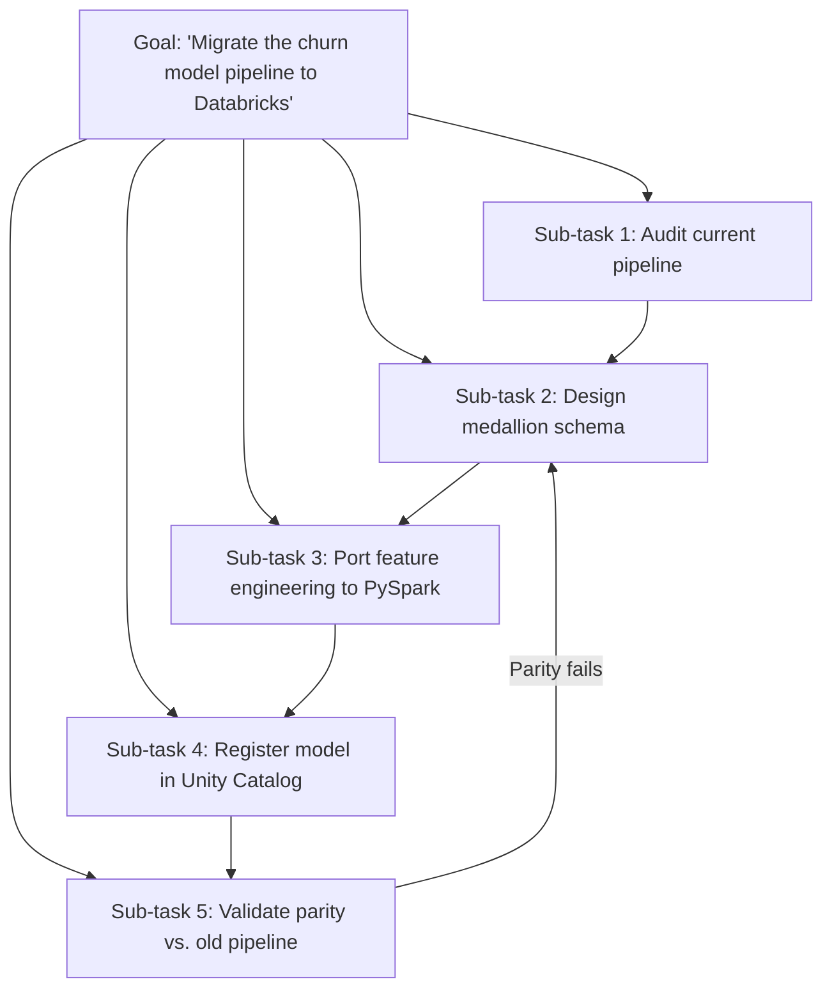

# Planning and Task Decomposition

## TL;DR

Complex tasks fail when handed to an agent as one giant instruction; they succeed more often when
broken into smaller, verifiable sub-tasks with clear dependencies. Task decomposition is the "how
to break it up" question; plan-and-execute vs. ReAct is the "how tightly to interleave planning
with acting" question — a spectrum from plan-everything-then-execute to plan-one-step-at-a-time.
Real-world agents need replanning: the initial plan is a hypothesis, and failures during execution
are signal to revise it, not just retry it.

## Intuition

A junior engineer given "build the feature" with no breakdown either freezes or produces something
that misses half the requirements. A good tech lead breaks it into "design the schema, write the
ingestion job, add the validation step, wire up monitoring" — each piece small enough to reason
about, verify, and redo independently if it goes wrong. Planning and decomposition give an agent
the same structure: turn one hard, underspecified goal into a sequence (or DAG) of smaller,
checkable goals.

## The maths

There's no single formal objective here, but it's useful to frame decomposition as a search /
compute-allocation problem. If a task has effective difficulty $D$ and an agent's single-shot
success probability at difficulty $d$ is $p(d)$ (decreasing in $d$), then decomposing into $k$
sub-tasks each of difficulty $d_i$ where the sub-tasks compose to solve the original task changes
overall success probability to (assuming independence, an approximation):

$$
P(\text{success}) \approx \prod_{i=1}^{k} p(d_i)
$$

This looks like decomposition *hurts* (product of probabilities is smaller than any one term) —
and that's true if each sub-task is roughly as hard as the whole. The benefit of decomposition is
that a well-chosen split makes each $d_i \ll D$, so $p(d_i)$ is close to 1 for each piece even
though $p(D)$ for the whole task would be low; plus you gain the ability to *verify and retry each
$p(d_i)$ independently* rather than only being able to retry the entire compound task on failure —
which is the real reason decomposition helps in practice, not the naive independence-probability
argument.

## Diagram



## Code

```python
from dataclasses import dataclass, field

@dataclass
class Task:
    id: str
    description: str
    depends_on: list[str] = field(default_factory=list)
    status: str = "pending"   # pending | in_progress | done | failed
    result: str | None = None

class PlanAndExecute:
    """Plan-and-execute: generate the full plan upfront, then execute step by step,
    replanning only the remaining tasks when a step fails."""

    def __init__(self, planner_fn, executor_fn):
        self.planner_fn = planner_fn      # (goal) -> list[Task]
        self.executor_fn = executor_fn    # (task, context) -> (success, result)

    def run(self, goal: str, max_replans: int = 3):
        plan = self.planner_fn(goal)
        replans = 0
        context = {}

        while True:
            runnable = [t for t in plan
                        if t.status == "pending"
                        and all(context.get(dep) == "done" for dep in t.depends_on)]
            if not runnable:
                if all(t.status == "done" for t in plan):
                    return "success", context
                break  # nothing runnable and not all done -> stuck, needs replan or fail

            task = runnable[0]
            success, result = self.executor_fn(task, context)
            task.result = result
            task.status = "done" if success else "failed"
            context[task.id] = task.status

            if not success:
                if replans >= max_replans:
                    return "failed", context
                remaining_goal = f"Original goal: {goal}. Failed at: {task.description} ({result}). Replan remaining work."
                plan = [t for t in plan if t.status == "done"] + self.planner_fn(remaining_goal)
                replans += 1

        return "stuck", context
```

## In practice

- **Use it when:** the task is multi-step, has real sub-goal dependencies, or is too large to fit
  in a single agent turn's context/tool-call budget — data pipeline migrations, multi-file code
  changes, research tasks requiring multiple sources.
- **Defaults that work:** decompose along natural verification boundaries (each sub-task should
  have a checkable definition of done); make dependencies explicit (a DAG, not just a list) so
  independent sub-tasks can run in parallel; keep the planner and executor as separate calls/roles
  even if the same underlying model does both, since it's a useful architectural boundary for
  debugging and swapping in a stronger planner model.
- **Breaks when:** the decomposition itself is wrong (sub-tasks don't actually compose to the goal,
  or a hidden dependency is missed) — no amount of good execution recovers from a bad plan;
  over-decomposition into too many tiny steps multiplies orchestration overhead and LLM call count
  for no accuracy gain.
- **Cost / latency:** plan-and-execute pays an upfront planning cost/latency, then executes with
  fewer total re-reasoning steps than a step-by-step (ReAct-style) approach on tasks whose structure
  is knowable in advance; ReAct pays no upfront planning cost but re-reasons every step, so it does
  better on tasks whose structure genuinely can't be known until you start acting.

**Plan-and-execute vs. ReAct, precisely:**

| | Plan-and-execute | ReAct (see [[react-and-reasoning-loops]]) |
|---|---|---|
| When the plan is made | Upfront, in full, before acting | Incrementally, one step at a time |
| Good for | Tasks with knowable structure, long-horizon, parallelizable sub-tasks | Tasks where each step's outcome is needed to decide the next |
| Weakness | A wrong upfront plan wastes execution on the wrong sub-goals | Can lack global coherence; may loop or lose sight of the overall goal |
| Typical cost shape | One planning call, then $k$ mostly-independent execution calls | $k$ full reason-act-observe cycles, no separate planning phase |

Most production agent systems are actually hybrid: plan-and-execute at the top level (break the
goal into sub-tasks with dependencies) and ReAct *within* each sub-task (react to tool observations
while executing that one piece).

**Replanning on failure**, concretely: when a sub-task fails, the naive response is "retry the same
sub-task." The better response is to treat the failure as new information and regenerate the plan
for the *remaining* work, because a failure often reveals that an assumption behind later steps was
wrong too (e.g., "the source table doesn't have the column we assumed" invalidates every downstream
step that used that column, not just the one that hit the error). Cap replanning attempts — an
agent that replans indefinitely on a task it fundamentally cannot do is the planning-loop analogue
of ReAct's infinite action loop, and needs the same kind of hard stop plus escalation to a human.

## Interview angle

**Q. When would you use plan-and-execute instead of a pure ReAct loop?**
When the task has structure you can reason about upfront — known sub-goals with dependencies, some
of which can run in parallel — and where re-planning from scratch every single step would be wasted
compute. ReAct is better when each step's outcome genuinely changes what the next step should be in
ways you can't anticipate before acting (exploratory search, debugging an unfamiliar system).

**Follow-up.** Would you ever combine them? → Yes — plan-and-execute at the top level to decompose
the goal into sub-tasks with dependencies, ReAct within each sub-task to handle the step-by-step
uncertainty of actually executing it.

**Q. A sub-task in your agent's plan fails. What's the wrong way to handle it, and what's the
right way?**
Wrong: blindly retry the identical sub-task (if the failure was due to a bad assumption, retrying
identically fails identically). Right: feed the failure back into a replanning step that
reconsiders the *remaining* plan, since a failure often invalidates assumptions behind later
sub-tasks too, not just the one that failed — and cap replanning attempts with an escalation path.

**Q. How do you decide the right granularity for decomposition?**
Decompose along verification boundaries — each sub-task should have a clear, checkable "done"
condition. Too coarse and you can't verify or recover from partial failure; too fine and
orchestration/LLM-call overhead dominates with no accuracy benefit. In practice this is tuned
empirically against an eval set of representative tasks.

**Q. Your agent's plan looks reasonable but the task still fails end to end. How do you debug
that?**
Check whether the decomposition missed a dependency (a sub-task assumed something true that a later
step needed re-verified) or whether each sub-task's "done" check was too weak (it reported success
without actually satisfying what downstream steps needed) — log per-sub-task inputs/outputs/status
so you can localize whether the fault is in the plan structure or in a specific step's execution/
verification.

## Traps

- Treating decomposition as strictly better because "smaller steps are easier" without noting the
  actual mechanism (verifiability and independent retry), and without noting that a wrong
  decomposition is unrecoverable no matter how well each piece executes.
- Retrying a failed sub-task identically instead of replanning — a common bug in early agent
  systems that treats execution failure as noise rather than as information about the plan.
- Presenting plan-and-execute and ReAct as mutually exclusive when most real systems combine them
  hierarchically.
- No cap on replanning attempts, leading to the planning equivalent of an infinite action loop.

## Flashcards

What's the difference between plan-and-execute and ReAct?::Plan-and-execute generates the full plan upfront then executes it; ReAct plans and acts one step at a time, reacting to each observation.
Why does decomposition help even though the naive independent-probability argument suggests it shouldn't?::A good split makes each sub-task much easier than the whole (near-certain success per piece) and lets you verify and retry each piece independently rather than only the whole compound task.
What should happen when a sub-task fails, instead of blind retry?::Replan the remaining work, since the failure may invalidate assumptions behind later steps, not just the failed one — with a cap on replanning attempts.
What's a common hybrid architecture combining both patterns?::Plan-and-execute at the top level to decompose the goal into dependent sub-tasks, with ReAct used within each sub-task's execution.
What makes a decomposition "well-chosen"?::Sub-tasks split along clear, independently verifiable boundaries with explicit dependencies, so failures can be localized and retried without redoing everything.

## Related

[[react-and-reasoning-loops]], [[agent-fundamentals]], [[multi-agent-systems]], [[agent-memory]], [[agent-evaluation]], [[human-in-the-loop-patterns]]
