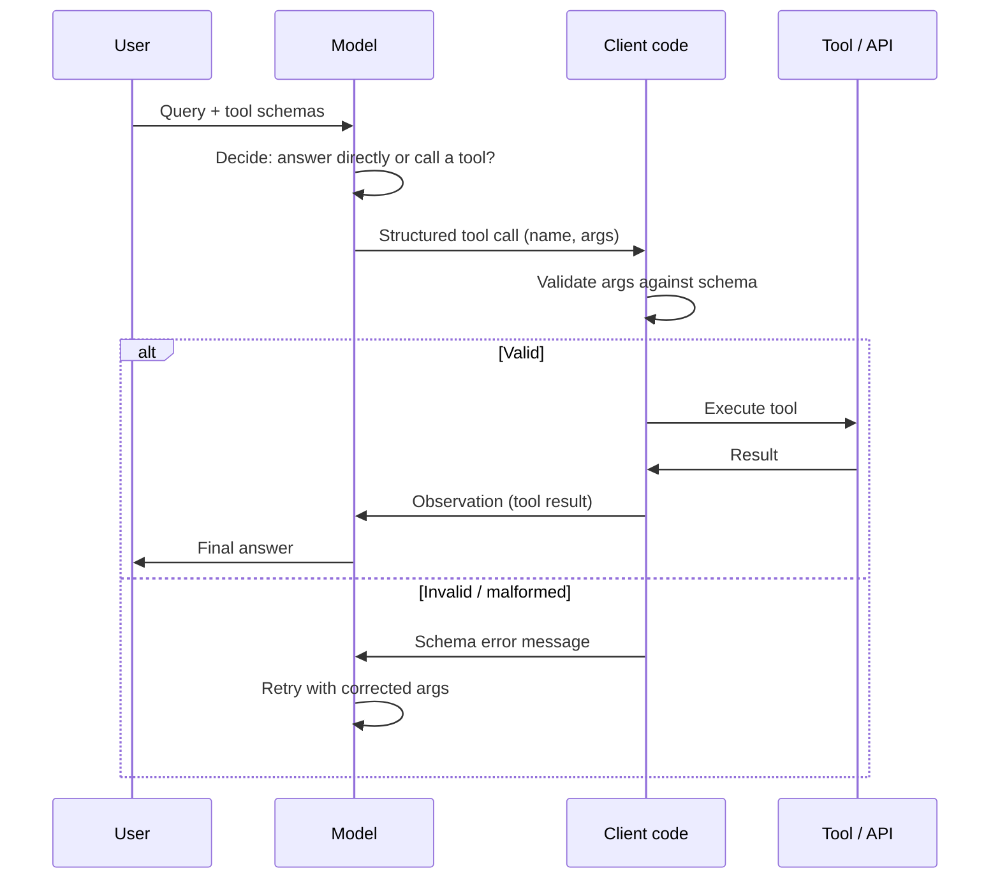

# Tool Calling and Function Schemas

## TL;DR
Tool calling is how an LLM turns text generation into action: you describe available tools as
structured schemas (name, description, JSON-schema-typed parameters), the model outputs a
structured call matching one of those schemas instead of free text, your code executes it, and the
result goes back into context. The schema is the entire interface contract — get the descriptions
and types wrong and the model either never calls the right tool or calls it with malformed
arguments, and both failures need explicit handling, not hope.

## Intuition
Before function calling, getting an LLM to "do something" meant asking it to output text and then
regex/parsing that text to figure out intent — fragile, and impossible to type-check. Function
calling flips this: you give the model a menu of typed actions up front (like an API spec), the
model is trained/constrained to pick an item off that menu and fill in its parameters in a
structured format, and you get something you can validate before executing — closer to calling a
typed function than parsing a paragraph.

## The maths
No probabilistic derivation is standard here, but the mechanism is worth stating precisely because
it's asked directly: the model is given, alongside the conversation, a list of tool specifications
$T = \{t_1, \ldots, t_n\}$ each with a JSON Schema $\sigma_i$ describing its parameters. At
generation time the model's output distribution is over two spaces jointly — free text, or a
structured call $(\text{name}, \text{args})$ where $\text{args}$ is constrained (via schema-guided or
grammar-constrained decoding in the serving stack, or via finetuning to reliably emit valid JSON) to
satisfy $\sigma_i$ for the chosen $t_i$. The decision of *whether* to call a tool at all, and *which*
one, is not a separate classifier — it's the same next-token generation process the model always
runs, just biased by training/instruction toward emitting a tool-call token sequence when the
context implies an action rather than a direct answer would satisfy the user's request better.

## Diagram


## Code
```python
# JSON schema tool definition — this is the entire contract the model sees
tools = [
    {
        "type": "function",
        "function": {
            "name": "search_contracts",
            "description": (
                "Search the contract corpus for clauses matching a query. "
                "Use this when the user asks about specific contract terms, "
                "not for general legal questions."
            ),
            "parameters": {
                "type": "object",
                "properties": {
                    "query": {"type": "string", "description": "Search query, e.g. 'termination notice period'"},
                    "document_type": {
                        "type": "string",
                        "enum": ["MSA", "SOW", "amendment", "NDA"],
                        "description": "Restrict search to this document type, if known",
                    },
                    "top_k": {"type": "integer", "default": 5, "minimum": 1, "maximum": 20},
                },
                "required": ["query"],
            },
        },
    }
]

def call_model_with_tools(messages, tools, llm, max_retries: int = 2):
    for attempt in range(max_retries + 1):
        response = llm.chat(messages=messages, tools=tools, tool_choice="auto")

        if response.tool_calls is None:
            return response.content  # model chose to answer directly

        results = []
        for call in response.tool_calls:
            try:
                args = json.loads(call.arguments)          # malformed JSON -> caught here
                validate(args, schema=find_schema(call.name, tools))  # schema violation -> caught here
                result = execute_tool(call.name, args)
                results.append({"tool_call_id": call.id, "content": str(result)})
            except (json.JSONDecodeError, ValidationError) as e:
                # feed the error back rather than crashing — model can self-correct on retry
                results.append({"tool_call_id": call.id, "content": f"Invalid arguments: {e}. Please retry."})

        messages.append({"role": "assistant", "tool_calls": response.tool_calls})
        for r in results:
            messages.append({"role": "tool", "tool_call_id": r["tool_call_id"], "content": r["content"]})

        if not any("Invalid arguments" in r["content"] for r in results):
            return call_model_with_tools(messages, tools, llm, max_retries=0)  # proceed to final answer

    return "Tool calling failed after retries."
```

## In practice
- **Use it when:** the model needs to fetch information it doesn't have (retrieval, live data, a
  calculation it's unreliable at) or take an action outside pure text generation — this is nearly any
  production LLM application beyond simple Q&A over a fixed prompt.
- **Defaults that work:** write tool descriptions the way you'd write a docstring for a junior
  engineer who's never seen the codebase — say what the tool does, when to use it, and crucially when
  *not* to (disambiguating between similar tools is where most tool-selection errors happen); keep
  parameter schemas minimal and use `enum` wherever the valid values are a closed set, since it
  constrains the model's output space and reduces malformed calls; always validate arguments against
  the schema before execution, never trust the model's JSON blindly.
- **Breaks when:** you have many similar tools with overlapping descriptions — the model picks the
  wrong one or hedges by calling several; or when a tool's required parameters can't actually be
  inferred from the conversation (the model then guesses or hallucinates a plausible-looking value
  rather than asking for clarification, unless you've explicitly designed for that).
- **Cost / latency:** each tool call round-trip is at least one extra model generation plus the
  tool's own execution latency; parallel tool calls (see below) amortise the model-side latency
  across multiple actions but not the tool execution time if the tools themselves are serial or
  share a bottlenecked backend.

## Interview angle

**Q. How does the model actually "decide" to call a tool versus answering directly — is there a
separate classification step?**
No — it's the same generation process. The model is trained (via instruction tuning / RLHF on
tool-use examples, and API-level fine-tuning by providers) to recognise, from the conversation and
the tool schemas in context, when a direct answer would be worse than an answer grounded in a tool
result, and to emit the appropriate structured token sequence instead of free text at that point.
There's no separate router unless you build one yourself (e.g. a cheaper upstream classifier to
decide tool categories before invoking the full model) — the base mechanism is unified next-token
generation constrained toward valid tool-call syntax.

**Follow-up.** So what makes tool selection go wrong? → Ambiguous or overlapping tool descriptions,
insufficient context to distinguish which tool applies, or a prompt that doesn't clearly signal that
a tool call is warranted (e.g. the user's question sounds like general knowledge but actually needs a
live lookup) — these are prompt/schema-design problems, not model architecture problems, and are
fixed the same way you'd fix an ambiguous API: sharpen the docs.

**Q. What's the standard failure handling pattern when a tool call has malformed arguments or the
tool itself errors out?**
Never crash the loop — validate the model's arguments against the JSON schema before execution;
on a schema violation, feed the validation error back to the model as an observation ("invalid
arguments: missing required field 'query'") and let it retry, since this is usually enough for the
model to self-correct. On a genuine tool execution error (the API is down, a lookup returns nothing),
feed that back too, distinctly from a schema error, so the model can decide whether to retry, try a
different tool, or surface the failure to the user rather than fabricating a plausible-sounding
result to fill the gap.

**Follow-up.** How many retries before giving up, and what do you do then? → Cap retries (2-3 is
typical) to bound latency and cost; on exhaustion, return an explicit "I couldn't complete this
lookup" rather than letting the model hallucinate an answer to avoid an empty result — a confident
wrong answer is worse than an honest failure.

**Q. What are parallel tool calls and when do they help?**
Some model APIs let the model emit multiple tool calls in a single turn when they're independent of
each other (e.g. "check clause 4 in Contract A" and "check clause 4 in Contract B" don't depend on
each other's results) — the client executes them concurrently and returns all results together,
saving the round-trip latency of doing them sequentially turn-by-turn. They help whenever a task
needs multiple independent lookups; they don't help (and can actively hurt) when calls are
sequentially dependent — the second call needs the first's result as input, so parallelising would
just mean the model has to guess at arguments for the second call before it has the information it
needs.

**Follow-up.** How do you decide whether to allow parallel calls for a given tool? → If a tool's
outputs never feed into another tool's inputs within the same step, it's a candidate for
parallelisation; if there's a dependency chain, force sequential calls (either by holding back the
dependent tool's schema until the first result is in context, or via prompting that discourages
premature parallel calls).

## Traps
- Writing terse, generic tool descriptions ("searches documents") — this is the single most common
  cause of wrong-tool-selection errors; specificity about when to use and when *not* to use a tool is
  what actually disambiguates it from similar tools.
- Trusting model-generated arguments without schema validation before execution — malformed or
  out-of-range arguments reaching a real system (a database query, a file write) is a correctness and
  security risk, not just a quality nuisance.
- Retrying indefinitely on malformed tool calls without a cap — this silently burns latency and cost
  and can mask a systematic schema problem that needs a design fix, not more retries.
- Assuming parallel tool calls are always faster — for dependent calls, forcing parallelism causes
  the model to guess at arguments it doesn't yet have the information to fill correctly.

## Flashcards
What is the core contract a tool schema establishes with the model?::Name, natural-language description of what it does and when to use it, and a JSON Schema for its parameters — it's the entire interface the model reasons from to decide whether and how to call the tool.
Is tool-call decision-making a separate classifier from text generation?::No — it's the same next-token generation process, trained/constrained to emit a structured tool call instead of free text when context implies an action is needed.
What should you do when a tool call has arguments that fail schema validation?::Feed the validation error back to the model as an observation and let it retry, rather than crashing or silently discarding the call.
When are parallel tool calls appropriate?::When multiple tool calls are independent of each other's results within the same step; sequential dependencies should not be parallelised since later calls need earlier results as input.
What's the most common cause of wrong tool selection?::Vague or overlapping tool descriptions that don't clearly disambiguate when to use one tool versus a similar one.
Why validate tool arguments before execution rather than trusting the model's output?::Malformed or out-of-range arguments reaching a real system is a correctness and security risk, not merely a quality issue.

## Related
[[agent-fundamentals]]
[[structured-output-and-function-calling]]
[[react-and-reasoning-loops]]
[[model-context-protocol]]
[[agent-guardrails-and-safety]]
