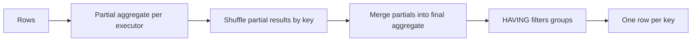

# Aggregations and Grouping

## TL;DR
`GROUP BY` collapses rows into one row per distinct key combination; aggregates summarise each group
and silently ignore NULLs (except `COUNT(*)`). The two techniques that separate a competent answer
from a good one are **conditional aggregation** (`SUM(CASE WHEN … THEN 1 ELSE 0 END)`, which replaces
half the subqueries people write) and knowing `GROUPING SETS` / `ROLLUP` for multi-level totals in one
pass.

## Intuition
Grouping is sorting the deck into piles by suit, then writing one summary card per pile. Everything
that is not the pile label must be summarised — you cannot report "the card" for a pile of five cards,
which is exactly why non-aggregated, non-grouped columns are rejected.

## The maths

`GROUP BY` on key set $K$ partitions relation $R$ into disjoint blocks
$R = \bigsqcup_{v \in \text{dom}(K)} R_v$, and emits one row per non-empty block. So the output
cardinality is the number of distinct key tuples present:

$$
\lvert \gamma_K(R) \rvert = \lvert \{ \pi_K(r) : r \in R \} \rvert
$$

An aggregate $g$ is a function from a multiset to a scalar. The ones that matter are **decomposable**:

$$
\text{SUM}(A \cup B) = \text{SUM}(A) + \text{SUM}(B), \qquad
\text{COUNT}(A \cup B) = \text{COUNT}(A) + \text{COUNT}(B)
$$

Decomposability is why `SUM`, `COUNT`, `MIN`, `MAX` can be computed with a **partial aggregate on each
executor followed by a merge** — cheap in Spark, only a small shuffle of partial results.
`AVG` is decomposable if you carry $(\text{sum}, \text{count})$ rather than the mean, which is exactly
what engines do internally:

$$
\text{AVG}(A \cup B) = \frac{\text{SUM}(A) + \text{SUM}(B)}{\text{COUNT}(A) + \text{COUNT}(B)}
$$

`COUNT(DISTINCT x)` and exact median are **not** decomposable — they need every value, hence a full
shuffle by the distinct key. That is the entire reason `COUNT(DISTINCT)` is the expensive aggregate,
and why approximate versions (`approx_count_distinct`, HyperLogLog) exist: they carry a fixed-size
sketch that *is* mergeable.

**`GROUPING SETS`.** `ROLLUP(a, b)` is shorthand for the grouping sets
$\{(a,b), (a), ()\}$ — $n+1$ levels. `CUBE(a, b)` is the power set
$\{(a,b), (a), (b), ()\}$ — $2^n$ levels. Both are computed in a single pass over the input.

## Diagram



## Code

```sql
-- Conditional aggregation: several metrics from one pass. Learn this pattern.
SELECT
    country,
    COUNT(*)                                                    AS orders,
    COUNT(DISTINCT customer_id)                                 AS customers,
    SUM(amount)                                                 AS gross,
    SUM(CASE WHEN status = 'refunded' THEN amount ELSE 0 END)   AS refunded,
    SUM(CASE WHEN status = 'refunded' THEN 1 ELSE 0 END)        AS refund_count,
    AVG(CASE WHEN status = 'completed' THEN amount END)         AS avg_completed,
    -- ratio as a rate: NULLIF guards against divide-by-zero
    SUM(CASE WHEN status = 'refunded' THEN 1 ELSE 0 END) * 1.0
        / NULLIF(COUNT(*), 0)                                   AS refund_rate
FROM orders
GROUP BY country;
-- Note AVG(CASE WHEN ... THEN amount END) with no ELSE: non-matching rows become NULL
-- and AVG skips them, so this is the average over completed orders only. Adding
-- `ELSE 0` would be a different (and usually wrong) metric.
```

```sql
-- FILTER clause: the same thing, cleaner. Postgres supports it; Spark SQL supports
-- FILTER on aggregate functions too. Use CASE WHEN if you need maximum portability.
SELECT
    country,
    COUNT(*)                                  AS orders,
    COUNT(*) FILTER (WHERE status = 'refunded') AS refund_count,
    SUM(amount) FILTER (WHERE status = 'completed') AS completed_gross
FROM orders
GROUP BY country;
```

```sql
-- Multi-level totals in one pass: subtotal per country, grand total, no UNION ALL.
SELECT
    COALESCE(country, 'ALL')  AS country,
    COALESCE(channel, 'ALL')  AS channel,
    SUM(amount)               AS gross,
    GROUPING(country)         AS is_country_total   -- 1 when this row is a rollup level
FROM orders
GROUP BY ROLLUP (country, channel)
ORDER BY country, channel;

-- Explicit control over which levels you want:
SELECT country, channel, SUM(amount) AS gross
FROM orders
GROUP BY GROUPING SETS ((country, channel), (country), ());
```

```sql
-- HAVING vs WHERE: push every non-aggregate predicate into WHERE.
SELECT customer_id, SUM(amount) AS lifetime_value
FROM orders
WHERE order_date >= DATE '2026-01-01'    -- cheap: filters rows before aggregating
GROUP BY customer_id
HAVING SUM(amount) > 50000               -- only expressible after aggregation
   AND COUNT(*) >= 3;
```

```sql
-- Groups with zero rows do not appear. To get a zero-filled series, scaffold then LEFT JOIN.
WITH months AS (
    SELECT DATE '2026-01-01' AS m UNION ALL SELECT DATE '2026-02-01'
    UNION ALL SELECT DATE '2026-03-01'
),
scaffold AS (
    SELECT c.customer_id, m.m
    FROM customers c
    CROSS JOIN months m
)
SELECT s.customer_id, s.m, COALESCE(SUM(o.amount), 0) AS gross
FROM scaffold s
LEFT JOIN orders o
       ON o.customer_id = s.customer_id
      AND DATE_TRUNC('month', o.order_date) = s.m
GROUP BY s.customer_id, s.m;
```

```python
# PySpark: same conditional-aggregation pattern, which is how it shows up on Databricks.
from pyspark.sql import functions as F

(orders.groupBy("country")
       .agg(F.count("*").alias("orders"),
            F.countDistinct("customer_id").alias("customers"),
            F.sum(F.when(F.col("status") == "refunded", F.col("amount"))
                   .otherwise(0)).alias("refunded"),
            F.avg(F.when(F.col("status") == "completed",
                         F.col("amount"))).alias("avg_completed")))
```

## In practice
- **Use it when:** any "per X, compute Y" question. The tell for conditional aggregation is a question
  with two or more metrics over different row subsets of the same table — never write two subqueries
  and join them.
- **Defaults that work:** multiply by `1.0` (or cast) before dividing, so integer division does not
  truncate on Postgres; wrap every denominator in `NULLIF(x, 0)`; use `COUNT(DISTINCT)` only when you
  actually need exactness.
- **Breaks when:** the input has already been fanned out by a join — then `SUM` and `COUNT(*)` are both
  inflated while `COUNT(DISTINCT)` stays correct, which is a confusing partial-correctness that hides
  the bug. Aggregate before joining. See [[joins-deep-dive]].
- **Cost / latency:** `SUM`/`COUNT`/`MIN`/`MAX` are cheap because partial aggregation happens before the
  shuffle. `COUNT(DISTINCT)` on a high-cardinality column is the expensive one; on Databricks,
  `approx_count_distinct` (HyperLogLog, roughly 2% relative error at default precision) is often the
  right trade for a dashboard, never for billing. Multiple `COUNT(DISTINCT)` on different columns in
  one query force separate expansions and are a common source of slow queries.
- **Dialect differences that bite:**
  - `GROUP BY` with a `SELECT` alias: Postgres allows the alias in `GROUP BY` (an extension); Spark SQL
    also allows it. But neither allows an alias in `WHERE`. Safest habit: repeat the expression.
  - `STRING_AGG(x, ',' ORDER BY y)` in Postgres vs `array_join(collect_list(x), ',')` or
    `concat_ws(',', collect_list(x))` in Spark SQL. There is no portable spelling — name the engine.
  - `PERCENTILE_CONT(0.5) WITHIN GROUP (ORDER BY x)` exists in Postgres; Spark SQL has
    `percentile(x, 0.5)` and `percentile_approx(x, 0.5)`. See [[sql-analytics-patterns]] for the
    engine-agnostic median.
  - `ANY_VALUE(x)` (pick an arbitrary value from the group) exists in Spark SQL and newer Postgres; use
    `MIN(x)` as the portable stand-in when the column is constant within the group.

## Interview angle

**Q. Compute, per country, total orders and the refund rate, in one query.**
Conditional aggregation:
`SUM(CASE WHEN status='refunded' THEN 1 ELSE 0 END) * 1.0 / NULLIF(COUNT(*),0)`. One pass, no
self-join. The `* 1.0` prevents integer division on Postgres and the `NULLIF` prevents a
divide-by-zero for a country with no orders.

**Follow-up.** *What if a country has orders but the join upstream duplicated rows?* → Both numerator
and denominator inflate by the same factor only if the fan-out is uniform, which it usually is not — so
the rate is wrong too. Verify cardinality before aggregating.

**Q. Why does `COUNT(DISTINCT user_id)` make a Spark job slow when `COUNT(*)` is instant?**
`COUNT(*)` is decomposable: each executor counts its partition and the driver sums a handful of
numbers. `COUNT(DISTINCT)` needs global knowledge of which values it has already seen, so the engine
must shuffle by the distinct column itself. With high cardinality that is a full data movement. If an
approximate answer is acceptable, `approx_count_distinct` uses a mergeable HyperLogLog sketch and stays
cheap.

**Q. `AVG(CASE WHEN x THEN amount END)` vs `AVG(CASE WHEN x THEN amount ELSE 0 END)` — difference?**
The first averages only the matching rows, because non-matching rows become NULL and `AVG` skips NULLs.
The second averages over *all* rows, treating non-matching as zero. Two genuinely different metrics;
choosing the wrong one is a silent, plausible-looking error.

**Q. How do you get a subtotal per region and a grand total in one query?**
`GROUP BY ROLLUP (region, city)`. It emits (region, city), (region), and () levels in one pass, and
`GROUPING(city)` tells you which rows are subtotals so you can label them. The alternative — three
queries joined with `UNION ALL` — scans the table three times.

**Q. Why do groups with zero rows not appear in the output?**
`GROUP BY` can only emit keys that exist in the data; there is no row to group. To get zero-filled
output you must construct the complete key space (a calendar table or a `CROSS JOIN` scaffold) and left
join the facts onto it, coalescing to zero.

**Follow-up.** *Where does this bite in practice?* → Any time-series feature for a model: a customer
with no transactions in March must contribute a 0, not a missing row, or the model sees a different
window length per customer. That is a [[data-leakage]]-adjacent bug in
[[time-series-features-and-validation]].

## Traps
- **"`HAVING` is just `WHERE` for grouped queries."** `HAVING` is evaluated after aggregation and can see
  aggregates; non-aggregate predicates belong in `WHERE`, where they reduce the rows entering the
  aggregation. Putting a date filter in `HAVING` is correct but wasteful, and on some plans much slower.
- **"`COUNT(*)` and `COUNT(column)` are the same."** Only when the column has no NULLs. This mistake
  turns a data-quality problem into a wrong number.
- **"`SUM` of an empty group is 0."** `SUM` over zero rows returns NULL, not 0. Wrap in `COALESCE` when
  the downstream consumer expects a number.
- **"`GROUP BY` sorts the output."** No guarantee on any modern engine, and definitely not in Spark. Add
  `ORDER BY`.
- **"`SELECT col, AGG(x) … GROUP BY other_col` should work if `col` is functionally determined."**
  Postgres allows it only when you group by the table's primary key; Spark rejects it outright. Add the
  column to `GROUP BY` or wrap it in `MIN`/`ANY_VALUE`.
- **"More `COUNT(DISTINCT)` columns is free."** Each one typically forces its own expansion of the
  input; four of them in one query can be four times the shuffle.
- **"`ROLLUP` NULLs mean missing data."** The NULLs in a `ROLLUP` result mark aggregation levels, not
  absent values. Distinguish them with the `GROUPING()` function, not with `IS NULL` — otherwise a real
  NULL in the data is indistinguishable from a subtotal row.

## Flashcards
Which aggregates are decomposable and why does it matter?::SUM, COUNT, MIN, MAX (and AVG as sum+count) — they allow partial aggregation before the shuffle, making them cheap in Spark.
Why is COUNT(DISTINCT) expensive?::It is not decomposable — the engine must shuffle by the distinct column to know what it has already seen.
SUM over zero rows returns what?::NULL, not 0 — wrap in COALESCE if a number is required.
AVG(CASE WHEN c THEN x END) vs AVG(CASE WHEN c THEN x ELSE 0 END)?::The first averages only matching rows (NULLs skipped); the second averages all rows treating non-matching as 0.
What does ROLLUP(a, b) produce?::Grouping sets (a,b), (a) and () — n+1 levels in a single pass; CUBE gives all 2^n subsets.
How do you distinguish a ROLLUP subtotal NULL from a real NULL?::Use the GROUPING(col) function, which returns 1 for aggregation-level rows.
How do you produce zero-filled groups for keys with no rows?::Build the full key space with a calendar/CROSS JOIN scaffold, LEFT JOIN the facts, COALESCE to 0.
Guard against integer division and divide-by-zero in a rate?::Multiply the numerator by 1.0 (or cast) and wrap the denominator in NULLIF(x, 0).

## Related
- [[sql-fundamentals]]
- [[joins-deep-dive]]
- [[window-functions]]
- [[subqueries-and-ctes]]
- [[sql-analytics-patterns]]
- [[sql-query-optimization]]
- [[pyspark-essentials]]
- [[moc-sql]]
